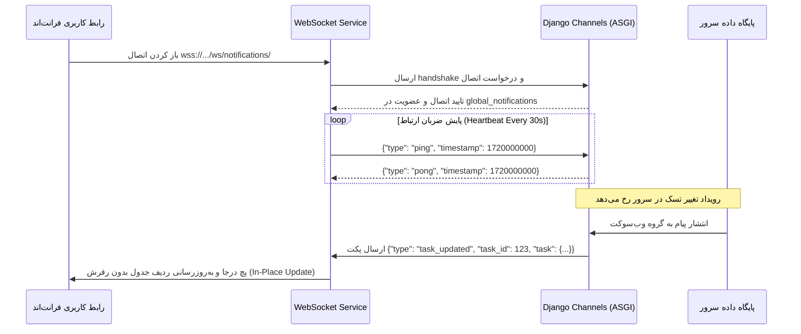
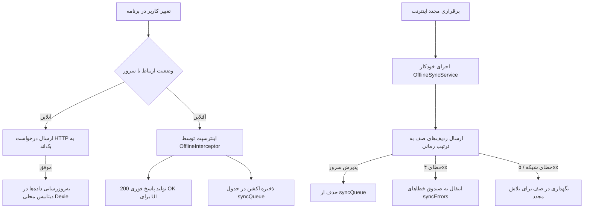
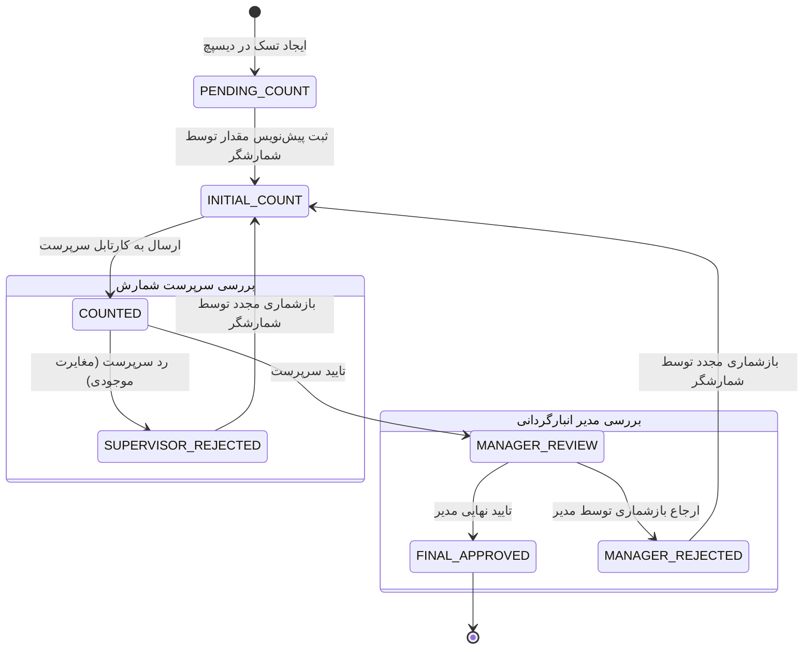
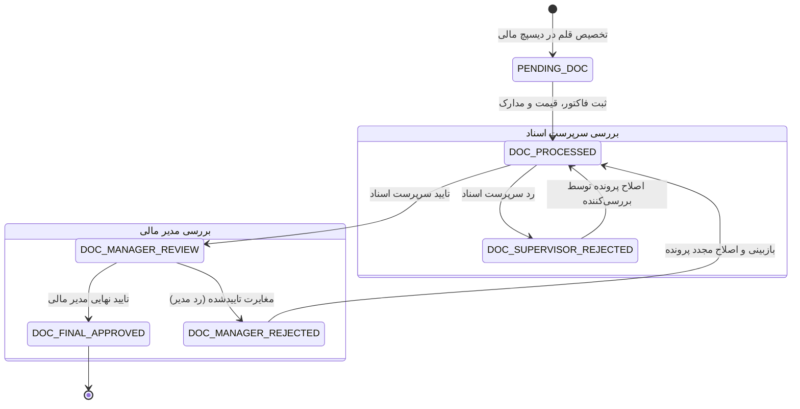

<div dir="rtl" align="right">

# نقشه جامع معماری، قوانین، مسیرها و فرآیندهای پروژه انبارداری (`PROJECT_ARCHITECTURE_MAP`)

> **وضعیت سند:** دارایی دانشی مرجع و دائمی (`Permanent Knowledge Asset`)  
> **مخاطب اصلی:** هوش مصنوعی توسعه‌دهنده (جهت جلوگیری از اسکن مکرر دایرکتوری‌ها) و تیم فنی پروژه  
> **نسخه:** ۲.۰ (جامع، بدون حذف نرم، پوشش کامل مسیرها و قوانین)

---

## 📑 فهرست عناوین و فصول سند
1. [منشور قوانین و استانداردهای مهندسی پروژه (Core Engineering Rules)](#۱-منشور-قوانین-و-استانداردهای-مهندسی-پروژه)
2. [معماری کلان سیستم و پشته فناوری (High-Level Architecture & Stack)](#۲-معماری-کلان-سیستم-و-پشته-فناوری)
3. [اطلس کامل تمامی مسیرها و اندپوینت‌ها (Complete Routes & Endpoints)](#۳-اطلس-کامل-تمامی-مسیرها-و-اندپوینت‌ها)
4. [کالبدشکافی عمیق لایه بک‌اند (`warehouse-backend`)](#۴-کالبدشکافی-عمیق-لایه-بک‌اند)
5. [کالبدشکافی عمیق لایه فرانت‌اند (`warehouse-front`)](#۵-کالبدشکافی-عمیق-لایه-فرانت‌اند)
6. [معماری وب‌سوکت و رویدادهای زنده بلادرنگ (Real-Time WebSocket Engine)](#۶-معماری-وب‌سوکت-و-رویدادهای-زنده-بلادرنگ)
7. [معماری محلی-محور و همگام‌سازی آفلاین (Local-First & Offline SWR Engine)](#۷-معماری-محلی-محور-و-همگام‌سازی-آفلاین)
8. [سلسله‌مراتب و منطق انبارگردانی فیزیکی (Physical Counting 4-Tier Logic)](#۸-سلسله‌مراتب-و-منطق-انبارگردانی-فیزیکی)
9. [سلسله‌مراتب و منطق کارتابل مالی و مدارک (Financial & Customs 4-Tier Logic)](#۹-سلسله‌مراتب-و-منطق-کارتابل-مالی-و-مدارک)
10. [موتور گزارش‌ساز پویا و سیستم چاپ لیبل (Reports & Label Designer)](#۱۰-موتور-گزارش‌ساز-پویا-و-سیستم-چاپ-لیبل)
11. [ماتریس کامل نگاشت فایل‌ها و مسئولیت‌ها (File Responsibility Matrix)](#۱۱-ماتریس-کامل-نگاشت-فایل‌ها-و-مسئولیت‌ها)

---

## ۱. منشور قوانین و استانداردهای مهندسی پروژه

تمامی دستورات، توسعه‌ها و تغییرات کد در این مخزن باید بی‌قیدوشرط از ۸ اصل بنیادین زیر پیروی کنند:

| ردیف | نام قانون | الزامات فنی و ضوابط اجرایی |
| :---: | :--- | :--- |
| **۱** | **فرآیند ذخیره دوگانه (DUAL-SAVE Workflow)** | هرگونه طرح اجرایی (`implementation_plan`)، لیست وظایف (`task`) و گزارش عملکرد (`walkthrough`) باید علاوه بر پوشه سیستمی، در پوشه `Documents/[Topic]/` پروژه نیز ذخیره شده و مستر لاگ‌های اصلی در ریشه `Documents/` آپدیت شوند. |
| **۲** | **ممنوعیت اجرای خودکار (No Auto-Approval)** | پیام‌های سیستمی اعلان تأیید خودکار اکیداً نادیده گرفته می‌شوند. هوش مصنوعی باید تا دریافت پیام دستی و صریح کاربر (مانند «تایید» یا «شروع») منتظر بماند. |
| **۳** | **مرز برنامه‌ریزی هوشمند (Smart Planning)** | برای کارهای چندفایلی، ساختاری و معماری، تولید طرح اجرایی الزامی است؛ برای اصلاحات تک‌خطی یا رفع خطاهای تایپی، اقدام سریع و مستقیم انجام می‌شود. |
| **۴** | **فرمت‌بندی راست‌به‌چپ (RTL Persian)** | کلیه مستندات، هشدارها و جداول باید درون تگ `<div dir="rtl" align="right">` قرار گیرند و اصطلاحات انگلیسی در انتهای جملات درون پرانتز درج شوند. |
| **۵** | **امنیت کد و گیت (Git & Code Safety)** | استفاده از `git reset --hard`، `git restore` یا هر دستوری که تغییرات را پاک کند ممنوع است. ویرایش فایل‌ها باید با تطبیق دقیق خطوط (`replace_file_content`) انجام پذیرد. |
| **۶** | **قانون علامت سوال (Investigatory Override)** | در صورت وجود علامت «؟» یا «?» در پیام کاربر، فرض بر پرسش توضیحی و تحلیلی است؛ در این حالت هیچ کدی تغییر نکرده و سندی تولید نمی‌شود. |
| **۷** | **مایگریشن‌های دیتابیس (DB Migrations)** | دستکاری یا حذف مایگریشن‌های پیشین اعمال‌شده ممنوع است؛ تغییرات مدل‌ها منحصراً از طریق مایگریشن‌های جدید روبه‌جلو (`makemigrations`) ثبت می‌شوند. |
| **۸** | **اجرای فازبندی‌شده و خرد (Phased Execution)** | تغییرات بزرگ به فازهای مستقل خرد شده و تا صحت عملکرد فاز جاری با تست و بررسی ترمینال تایید نشود، ورود به فاز بعدی ممنوع است. |

---

## ۲. معماری کلان سیستم و پشته فناوری

```mermaid
graph TD
    subgraph ClientLayer["لایه کلاینت (Client Layer)"]
        Browser[مرورگر وب / موبایل PWA]
        DexieDB[(Dexie IndexedDB v4 - 8 Tables)]
        SW[Angular Service Worker / PWA Offline Cache]
    end

    subgraph TransportLayer["لایه انتقال (Transport Layer)"]
        REST[REST APIs / JSON over HTTPS]
        WSS[WebSocket /ws/notifications/ over WSS]
    end

    subgraph BackendLayer["لایه سرور (Backend Layer - Django)"]
        Daphne[Daphne ASGI Server]
        DRF[Django REST Framework]
        Channels[Django Channels & Channel Layer]
        ReportsEngine[موتور گزارش‌ساز چندجدوله]
        LabelEngine[موتور PDF و Bidi فارسی ReportLab]
    end

    subgraph DataLayer["لایه داده (Data Layer)"]
        DB[(PostgreSQL / SQLite with GIN Indexes)]
        MediaStorage[ذخیره‌سازی فایل‌ها / آواتار / قالب لیبل / خروجی اکسل]
    end

    Browser <--> DexieDB
    Browser <--> SW
    Browser -->|HTTPS REST| DRF
    Browser <-->|WSS Real-Time| Daphne
    Daphne <--> Channels
    Channels <--> DRF
    DRF --> DB
    DRF --> ReportsEngine
    DRF --> LabelEngine
    DRF --> MediaStorage
```



### پشته فنی اصلی (Tech Stack):
* **بک‌اند:** Python 3.10+, Django 4.2+, Django REST Framework (DRF), Django Channels (ASGI), Daphne, openpyxl, reportlab, python-bidi, arabic-reshaper.
* **فرانت‌اند:** Angular 17/18 (Standalone Components, Signals, RxJS, HttpClient), Tailwind CSS, Dexie.js (IndexedDB wrapper), Angular Service Worker (@angular/pwa).
* **پایگاه داده:** PostgreSQL / SQLite (دارای ایندکس‌های سه‌حرفی `gin_trgm_ops` در مدل `Item`).
* **احراز هویت:** JWT (SimpleJWT) با توکن‌های Access و Refresh، ذخیره‌سازی نشست و سیستم مجوزهای ماژولار مبتنی بر نقش (RBAC).

---

## ۳. اطلس کامل تمامی مسیرها و اندپوینت‌ها

### الف) جدول تمامی روت‌های فرانت‌اند (`app.routes.ts`)

| ردیف | مسیر (URL Path) | کامپوننت | گاردها و تنظیمات | شرح عملکرد و نقش صفحه |
| :---: | :--- | :--- | :--- | :--- |
| **۱** | `/login` | `Login` | عمومی | صفحه ورود، دریافت توکن و تعیین انبار پیش‌فرض |
| **۲** | `/verify-card/:code` | `VerifyCard` | عمومی | استعلام اصالت کارت شناسایی پرسنل با اسکن بارکد |
| **۳** | `/change-password` | `ChangePassword` | `[AuthGuard]` | تغییر کلمه عبور اجباری یا اختیاری کاربر |
| **۴** | `/dashboard` | `Dashboard` | `[AuthGuard, AuthGuardChild]` | داشبورد مدیریتی، نمودارهای پیشرفت و وضعیت کلان |
| **۵** | `/projects` | `Projects` | `[AuthGuard, AuthGuardChild]` | مدیریت انبارها و پروژه‌ها |
| **۶** | `/dispatch` | `Dispatch` | `canDeactivate: [importLeaveGuard]`, `reuse: true` | تخصیص اقلام به کاربران، ایجاد تسک‌های شمارش/اسناد |
| **۷** | `/docs` | `Docs` | `canDeactivate: [importLeaveGuard]` | مدیریت کالاها، جدول جامع اقلام، ورود و ویرایش اکسل |
| **۸** | `/users` | `Users` | `[AuthGuard, AuthGuardChild]` | مدیریت کاربران، پرسنل، نقش‌ها و ماتریس دسترسی |
| **۹** | `/settings` | `Settings` | `[AuthGuard, AuthGuardChild]` | تنظیمات سیستم، فیلدهای پویا و پشتیبان‌گیری دیتابیس |
| **۱۰** | `/wh-settings` | `WhSettings` | `[AuthGuard, AuthGuardChild]` | تنظیمات اختصاصی انبار فعال و طراحی قالب‌های لیبل |
| **۱۱** | `/audit` | `Audit` | `[AuthGuard, AuthGuardChild]` | رهگیری تغییرات، ثبت لاگ عملیات و تاریخچه کالاها |
| **۱۲** | `/feeding` | `Feeding` | `[AuthGuard, AuthGuardChild]` | مدیریت و تولید فایل‌های تغذیه سیستمی MT |
| **۱۳** | `/counter` | `CounterDashboard` | `data: { reuse: true }` | میزکار شمارشگر، ثبت مقادیر، حالت آفلاین و اسکن |
| **۱۴** | `/supervisor` | `SupervisorDashboard` | `data: { reuse: true }` | کارتابل سرپرست شمارش، تایید یا رد مقادیر ارسالی |
| **۱۵** | `/manager-review` | `ManagerReview` | `data: { reuse: true }` | کارتابل مدیر انبارگردانی، تایید نهایی یا ارجاع بازشماری |
| **۱۶** | `/count-tracking` | `CountTracking` | `data: { reuse: true }` | مانیتورینگ زنده پیشرفت و آمارهای لحظه‌ای شمارش |
| **۱۷** | `/reports` | `Reports` | `[AuthGuard, AuthGuardChild]` | موتور گزارش‌ساز پویا، فیلترها و صدور خروجی |
| **۱۸** | `/customs` | `Customs` | `[AuthGuard, AuthGuardChild]` | کارتابل مالی، گمرکی، ثبت اسناد، قیمت و فاکتورها |
| **۱۹** | `/placeholders` | `Placeholders` | `[AuthGuard, AuthGuardChild]` | صفحات نگهدارنده ماژول‌های در دست توسعه |

---

### ب) ساختار تمامی اندپوینت‌های بک‌اند (`warehouse-backend`)

```
/admin/                           -> پنل مدیریت اصلی جنگو
/api/auth/login/                  -> احراز هویت و صدور توکن JWT (CustomTokenObtainPairView)
/api/auth/refresh/                -> تازه‌سازی توکن اکسس (TokenRefreshView)
/api/auth/users/                  -> مدیریت کاربران، تغییر پسورد، آپلود آواتار (UserViewSet)
/api/auth/roles/                  -> مدیریت نقش‌های سازمانی و سلسله‌مراتب (CustomRoleViewSet)
/api/auth/permissions/            -> استعلام لیست پرمیشن‌های سیستمی (PermissionViewSet)
/api/auth/table-views/            -> ذخیره و بازیابی وضعیت ستون‌های جدول (UserTableViewStateViewSet)

/api/warehouses/                  -> لیست و مدیریت انبارها (WarehouseViewSet)
/api/warehouses/<id>/settings/    -> خواندن و ویرایش تنظیمات اختصاصی انبار (SettingsViewSet)
/api/warehouses/label-templates/  -> طراحی بوم، ذخیره و پرینت PDF قالب‌های لیبل (LabelTemplateViewSet)

/api/inventory/items/             -> مدیریت اقلام کالا، ایمپورت اکسل، ویرایش گروهی (ItemViewSet)
/api/inventory/count-tasks/       -> تسک‌های شمارش: ثبت، پیش‌نویس، تایید سرپرست/مدیر، بازشماری (CountTaskViewSet)
/api/inventory/doc-tasks/         -> تسک‌های اسناد مالی: ثبت فاکتور، تاییدات و بررسی مغایرت (DocTaskViewSet)
/api/inventory/dynamic-fields/    -> مدیریت تعاریف فیلدهای پویای کالا (ItemFieldDefinitionViewSet)
/api/inventory/sync/pull/         -> دریافت دلتای داده‌ها برای کار آفلاین کلاینت (SyncPullView)

/api/reports/entities/            -> لیست موجودیت‌های قابل گزارش‌گیری (EntitiesView)
/api/reports/entities/<k>/fields/ -> فیلدهای قابل انتخاب هر موجودیت (EntityFieldsView)
/api/reports/run/                 -> اجرای گزارش داینامیک در فرمت JSON (RunReportView)
/api/reports/export/              -> ثبت درخواست صدور فایل اکسل یا PDF (ExportReportView)
/api/reports/exports/             -> مشاهده لیست کارهای خروجی و پیشرفت (ExportJobListView)
/api/reports/templates/           -> الگوهای ذخیره‌شده گزارش (ReportTemplateViewSet)

/api/settings/global/             -> تنظیمات سراسری سیستم (SettingsViewSet)
/api/public/config/               -> تنظیمات عمومی و اطلاعات پایه بدون نیاز به لاگین (PublicConfigViewSet)
/api/backup/create/               -> تولید فایل بکاپ دیتابیس (BackupCreateView)
/api/backup/restore/              -> بازیابی دیتابیس از فایل بکاپ (BackupRestoreView)
/ws/notifications/                -> کانال وب‌سوکت رویدادهای زنده (NotificationConsumer)
```

---

## ۴. کالبدشکافی عمیق لایه بک‌اند (`warehouse-backend`)

### تفکیک ۶ اپلیکیشن اصلی:

#### ۱. اپلیکیشن `accounts`:
* **مدل `CustomUser`:** کاربر سفارشی با فیلدهای کد ملی (`national_code`)، شماره تلفن (`phone_number`)، حوزه عملیاتی (`operational_zone`)، سرپرست مستقیم (`supervisor`)، شرکت متبوع (`company`)، آواتار (`avatar`)، گروه خونی، تماس اضطراری، انبارهای منتسب (`assigned_warehouses`) و ترجیحات رابط کاربری (`ui_preferences`).
* **مدل `CustomRole`:** توسعه مدل `Group` جنگو با عنوان فارسی (`title`)، رنگ سازمانی (`color`) و نقش والد (`parent`) برای ایجاد چارت درختی.
* **مدل `UserTableViewState`:** ذخیره وضعیت، عرض، نمایش/مخفی بودن و ترتیب ستون‌های جداول برای هر کاربر.

#### ۲. اپلیکیشن `inventory`:
* **مدل `Item`:** قلب تپنده موجودی کالا؛ شامل کد یکتا (`fa_unic_code`)، پکینگ لیست (`pl`)، سفارش خرید (`po`)، پکیج (`pk_number`)، تگ کالا (`tag`)، سایز، شرح، واحد، موجودی فیزیکی (`inventory`)، موجودی مجاز (`bal4miv`)، لوکیشن (`new_location`)، فیلدهای پویای JSON (`dynamic_data`) و ایندکس‌های سریع `GinIndex(fields=['description'], opclasses=['gin_trgm_ops'])`.
* **مدل `CountTask`:** تسک‌های شمارش با فیلدهای شمارشگر (`counter`)، سرپرست (`supervisor`)، مدیر اختصاصی (`assigned_manager`)، وضعیت (`status`)، مقدار شمرده شده (`counted_balance`)، یادداشت‌ها و فلگ `skip_supervisor`.
* **مدل `CountTaskHistory`:** ثبت تاریخچه تغییر وضعیت‌ها، مقادیر و یادداشت‌های اقدام‌کننده.
* **مدل `DocTask`:** تسک‌های مدارک و مالی با فیلدهای نوع فاکتور، تاریخ، شماره RTI، صفحه، ردیف، ارزش کل، قیمت واحد و مهر/امضا.
* **مدل `ItemFieldDefinition`:** تعاریف فیلدهای پویای انبار با انواع داده (متن، عدد، بولی، تاریخ).

#### ۳. اپلیکیشن `warehouses`:
* **مدل `Warehouse`:** نام انبار، کد یکتا، نام پروژه، نوع، لوکیشن، مدیر انبار، ظرفیت و رنگ سازمانی.
* **مدل `SystemSetting`:** سیستم تنظیمات سلسله‌مراتبی؛ در صورت خالی بودن کلید خارجی `warehouse` تنظیمات سراسری است و در صورت پر بودن، تنظیمات اختصاصی همان انبار اعمال می‌شود.
* **مدل `LabelTemplate`:** ابعاد لیبل (`width_mm`, `height_mm`)، فیلد منبع QR Code، المان‌های بوم (`elements` به صورت JSON) و تنظیمات چیدمان در صفحه کاغذ (`grid_rows`, `grid_cols`).

#### ۴. اپلیکیشن `notifications`:
* **کانسیومر `NotificationConsumer`:** مدیریت اتصالات وب‌سوکت، پکت‌های پینگ/پونگ Heartbeat و ارسال اعلان‌های آنی به گروه `global_notifications`.

#### ۵. اپلیکیشن `reports`:
* **موتور `engine.py` و رجیستری `registry.py`:** موتور تولید کوئری‌های داینامیک SQL/ORM، جوین هوشمند بین جداول `Item`, `CountTask`, `DocTask`, `Warehouse`, `CustomUser` و خروجی اکسل/PDF.

#### ۶. پکیج پیکربندی `config`:
* تنظیمات `settings.py`, روت‌های ریشه `urls.py`, تنظیمات سرورهای `asgi.py` و `wsgi.py`.

---

## ۵. کالبدشکافی عمیق لایه فرانت‌اند (`warehouse-front`)

### الف) ساختار هسته (`src/app/core/`):
* **`auth/`:** سرویس `AuthService`، گاردهای `AuthGuard` و `RoleGuard`، اینترسپتور `AuthInterceptor` (تزریق توکن Bearer).
* **`stores/`:** استور سیگنال `AuthStore` جهت نگهداری وضعیت کاربر جاری، دسترسی‌ها و انبار انتخاب‌شده (`warehouseContext`).
* **`services/`:**
  * `OfflineSyncService`: هماهنگ‌کننده صف تراکنش‌ها و همگام‌سازی پس‌زمینه.
  * `SyncPullService`: سرویس دریافت دلتای داده‌ها با کرسر از سرور.
  * `offlineDb`: دیتابیس محلی Dexie شامل ۸ جدول مجزا.
  * `NetworkStatusService`: پایش وضعیت اتصال اینترنت مرورگر.
* **`api/` (۱۷ سرویس API تخصصی):**
  `count-task-api.service.ts`, `doc-task-api.service.ts`, `item-api.service.ts`, `report-api.service.ts`, `dynamic-field-api.service.ts`, `label-api.service.ts`, `user-api.service.ts`, `role-api.service.ts`, `tag-api.service.ts`, `table-view-api.service.ts`, `audit-api.service.ts`, `config-api.service.ts`, `dashboard-api.service.ts`, `feeding-api.service.ts`, `project-api.service.ts`, `api.service.ts`.

### ب) کاتالوگ کامپوننت‌های ۲۴ گانه (`src/app/components/`):
1. **کارتابل‌ها:** `CounterDashboard`, `SupervisorDashboard`, `ManagerReview`, `Customs`, `CountTracking`, `Feeding`, `Dispatch`.
2. **مدیریت و سیستم:** `Dashboard`, `Projects`, `Docs`, `Users`, `Settings`, `WhSettings`, `Audit`, `Reports`, `IdCards`, `VerifyCard`, `ChangePassword`, `Login`, `Placeholders`.
3. **طراحی و ابزارها:** `LabelDesigner`, `Field`, `DynamicFields`.

### ج) کامپوننت‌های اشتراکی (`src/app/shared/components/`):
* `DataTable`: جدول پیشرفته داده‌ها با قابلیت سورت، فیلتر، صفحه‌بندی و حفظ وضعیت ستون‌ها.
* `BarcodeScanner`: اسکنر دوربین بارکد و QR Code با پردازش بهینه فریم‌ها.
* `DeepSyncModal`: پنجره پاپ‌آپ همگام‌سازی کامل داده‌ها برای کار آفلاین.
* `ExcelImportModal`: پنجره ورود فایل‌های اکسل و نگاشت ستون‌ها.
* `AvatarCropperModal`: ابزار برش و تنظیم تصویر پرسنلی.
* `WarehouseSelector`: سلکتور تغییر سریع انبار فعال در هدر برنامه.

---

## ۶. معماری وب‌سوکت و رویدادهای زنده بلادرنگ



### قوانین اساسی عملکرد وب‌سوکت:
1. **عدم رفرش کل صفحه:** با دریافت رویداد، فقط رکورد مربوطه در آرایه محلی ویرایش می‌شود.
2. **فیلتر انبار:** کلاینت ابتدا بررسی می‌کند که آیا `warehouse_id` رویداد با انبار فعال کاربر همخوانی دارد یا خیر.
3. **پایداری در شرایط نوسان شبکه:** در صورت قطع ارتباط، مکانیزم اتصال مجدد خودکار (`Auto-Reconnect with Exponential Backoff`) فعال می‌شود.

---

## ۷. معماری محلی-محور و همگام‌سازی آفلاین



### ساختار دیتابیس محلی (`Dexie IndexedDB v4`):
* `syncQueue`: جدول صف عملیات متغیر با ایندکس‌های `id, status, createdAt, userId, entitySyncId`.
* `apiCache`: جدول کش پاسخ‌های خواندنی با ایندکس‌های `url, expiresAt`.
* `syncErrors`: صندوق خطاهای سرور برای بررسی کاربر با ایندکس‌های `id, failedAt, dismissed, userId`.
* `countTasks`: تسک‌های شمارش آفلاین با ایندکس‌های `sync_id, id, warehouse_id, status, updated_at`.
* `items`: کالاهای انبار با ایندکس‌های `sync_id, id, warehouse_id, fa_unic_code, updated_at`.
* `dynamicFields`: فیلدهای داینامیک با ایندکس‌های `sync_id, id, warehouse_id, updated_at`.
* `syncCursors`: آخرین نشانگر زمانی سرور با ایندکس مرکب `key, userId, warehouseId`.
* `docTasks`: تسک‌های مالی و گمرکی با ایندکس‌های `sync_id, id, warehouse_id, status, updated_at`.

### قوانین حیاتی SWR:
* **حفظ پیش‌نویس‌های محلی:** در هنگام بازخوانی از سرور، رکوردهای دارای پرچم `_offlinePending` هرگز با داده‌های سرور بازنویسی نمی‌شوند.
* **دلتای تغییرات:** در متد `SyncPull`، صرفاً رکوردهای تغییریافته بعد از `lastServerTime` دانلود می‌شوند.

---

## ۸. سلسله‌مراتب و منطق انبارگردانی فیزیکی



### قوانین عملیاتی شمارش فیزیکی:
1. **اولویت قطعی بازشماری (`recount_first`):** ردیف‌های با وضعیت `SUPERVISOR_REJECTED` و `MANAGER_REJECTED` چه در سورت صعودی و چه در سورت نزولی همواره در بالاترین ردیف‌های کارتابل شمارشگر قرار می‌گیرند.
2. **ارسال گروهی امن (`bulk_submit`):** در صورتی که کاربر دکمه «ارسال همه» را بدون تیک زدن موارد بزند، صرفاً رکوردهای در وضعیت `INITIAL_COUNT` ارسال می‌شوند و رکوردهای ردشده دست‌نخورده ارسال نمی‌گردند.
3. **شمارش کور (`Blind Counting`):** موجودی سیستمی کالا (`inventory`, `bal4miv`) در خروجی API برای نقش شمارشگر حذف (`None`) می‌شود تا از درج مقادیر صوری جلوگیری شود.
4. **تراکنش اتمیک استخر کالاها:** دریافت اقلام از استخر کالاها در متد `claim_tasks` تحت بلاک `transaction.atomic()` اجرا می‌شود تا دو کاربر همزمان یک کالا را انتخاب نکنند.

---

## ۹. سلسله‌مراتب و منطق کارتابل مالی و مدارک



### فیلدهای تخصصی کارتابل مالی و گمرک:
* **نوع فاکتور (`invoice_type`):** رسمی/مالیاتی (`formal`)، خریدهای داخلی (`domestic`)، خریدهای خارجی (`foreign`)، امانی (`consignment`).
* **ارز و مبالغ:** ارز (`IRR`, `USD`, `EUR`, `OTHER`)، قیمت واحد (`price_amount`)، ارزش کل (`total_value`)، قیمت کالای مشابه (`similar_unit_price`).
* **شماره‌ها و مستندات:** شماره RTI فاکتور (`inv_rti_number`)، شماره RTI اضافه‌شده (`added_rti_no`)، صفحه فاکتور (`invoice_page`)، ردیف در صفحه (`page_row`)، تأمین‌کننده (`doc_supplier`)، مسیر پوشه اسناد (`folder_address`)، وضعیت مهر (`stamp`) و امضا (`signature`).

---

## ۱۰. موتور گزارش‌ساز پویا و سیستم چاپ لیبل

### الف) موتور گزارش‌ساز پویا (`reports/engine.py`):
* **جوین خودکار چندجدوله:** قابلیت اتصال داینامیک جداول `Item`, `CountTask`, `DocTask`, `Warehouse`, `CustomUser`.
* **انواع فیلترها:** شرط‌های متنی (`icontains`, `exact`)، عددی (`gt`, `lt`, `between`)، تاریخ شمسی/میلادی و فیلترهای پویا روی فیلدهای JSON.
* **صف خروجی پس‌زمینه:** تولید فایل‌های حجیم اکسل (`openpyxl`) و PDF به صورت ناهمگام جهت جلوگیری از قفل شدن سرور.

### ب) سیستم طراحی و چاپ لیبل (`warehouses/label_pdf_generator.py`):
* **طراحی بوم انعطاف‌پذیر:** تعریف مختصات X/Y، اندازه فونت، وزن قلم و تراز برای المان‌های بارکد، QR Code، فیلدهای کالا و تاریخ چاپ.
* **موتور Bidi و خط فارسی:** پشتیبانی کامل از چینش راست‌به‌چپ فارسی در فایل‌های خروجی PDF با ترکیب `arabic_reshaper` و `bidi.algorithm`.

---

## ۱۱. ماتریس کامل نگاشت فایل‌ها و مسئولیت‌ها

| ردیف | مسیر فایل در پروژه | لایه | مسئولیت کلیدی و شرح وظیفه عملیاتی |
| :---: | :--- | :---: | :--- |
| **۱** | [`inventory/models.py`](file:///e:/warehouse%20project/warehouse-backend/inventory/models.py) | Backend | تعاریف مدل‌های `Item`, `CountTask`, `DocTask`, `ItemFieldDefinition` |
| **۲** | [`inventory/views.py`](file:///e:/warehouse%20project/warehouse-backend/inventory/views.py) | Backend | منطق تجاری تسک‌ها (`bulk_submit`, `claim_tasks`, `revert_status`, `export`) |
| **۳** | [`inventory/sync_views.py`](file:///e:/warehouse%20project/warehouse-backend/inventory/sync_views.py) | Backend | سرویس دریافت دلتای آفلاین با کرسر Base64 (`SyncPullView`) |
| **۴** | [`notifications/consumers.py`](file:///e:/warehouse%20project/warehouse-backend/notifications/consumers.py) | Backend | کانسیومر وب‌سوکت، مدیریت Heartbeat پینگ/پونگ و انتشار پیام‌ها |
| **۵** | [`reports/engine.py`](file:///e:/warehouse%20project/warehouse-backend/reports/engine.py) | Backend | موتور کوئری‌ساز چندجدوله، اجرای گزارشات پویا و اکسپورت داده |
| **۶** | [`warehouses/label_pdf_generator.py`](file:///e:/warehouse%20project/warehouse-backend/warehouses/label_pdf_generator.py) | Backend | موتور تولید فایل PDF چیدمان لیبل با سازگاری فونت فارسی Bidi |
| **۷** | [`core/services/offline-sync.service.ts`](file:///e:/warehouse%20project/warehouse-front/src/app/core/services/offline-sync.service.ts) | Frontend | مدیریت صف آفلاین، همگام‌سازی خودکار و پایش خطاها |
| **۸** | [`core/services/offline-db.ts`](file:///e:/warehouse%20project/warehouse-front/src/app/core/services/offline-db.ts) | Frontend | شمای پایگاه داده محلی Dexie v4 شامل ۸ جدول کلیدی |
| **۹** | [`core/interceptors/offline.interceptor.ts`](file:///e:/warehouse%20project/warehouse-front/src/app/core/interceptors/offline.interceptor.ts) | Frontend | رهگیری درخواست‌های متغیر و تولید پاسخ شبیه‌سازی‌شده 200 OK |
| **۱۰** | [`counter-dashboard.ts`](file:///e:/warehouse%20project/warehouse-front/src/app/components/counter/counter-dashboard/counter-dashboard.ts) | Frontend | میزکار شمارشگر، ثبت مقادیر، سورت بازشماری و همگام‌سازی زنده |
| **۱۱** | [`supervisor-dashboard.ts`](file:///e:/warehouse%20project/warehouse-front/src/app/components/supervisor/supervisor-dashboard/supervisor-dashboard.ts) | Frontend | کارتابل سرپرست شمارش، تایید/رد مقادیر و مدیریت مغایرت‌ها |
| **۱۲** | [`manager-review.ts`](file:///e:/warehouse%20project/warehouse-front/src/app/components/manager-review/manager-review.ts) | Frontend | کارتابل مدیر انبارگردانی، تایید نهایی و ارجاع اقلام به بازشماری |
| **۱۳** | [`customs.ts`](file:///e:/warehouse%20project/warehouse-front/src/app/components/customs/customs.ts) | Frontend | کارتابل مالی، گمرکی، اسناد فاکتور و قیمت‌گذاری کالاها |

</div>
