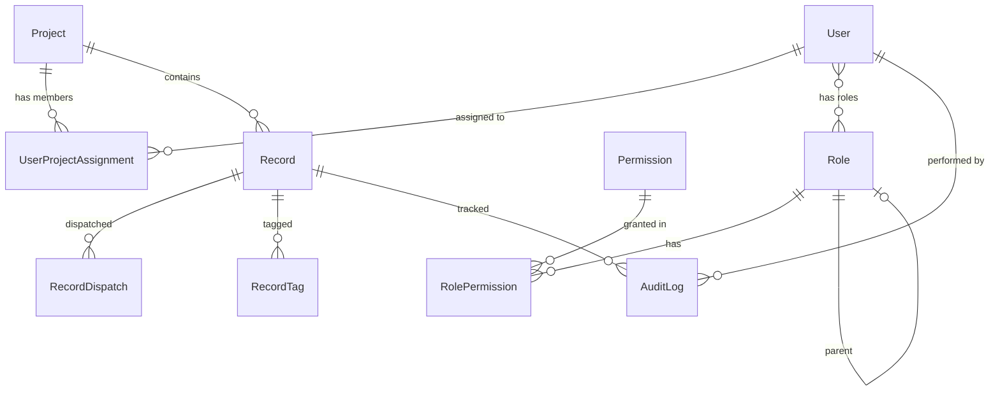
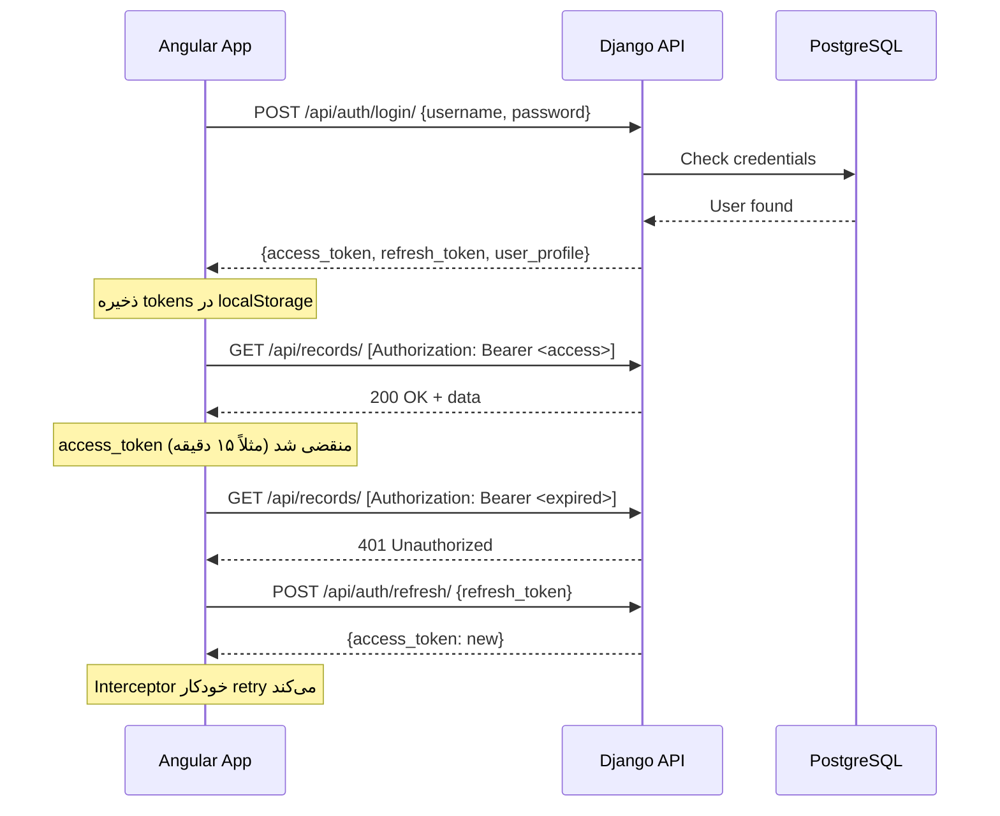

# 🏗️ طراحی معماری جامع — `warehouse-app` + Django + PostgreSQL

## تصمیمات معماری کلان

بر اساس بررسی پروژه و نیازهای شما، این تصمیمات پیشنهاد می‌شود:

| تصمیم | انتخاب | دلیل |
|--------|--------|-------|
| **API Framework** | **Django REST Framework (DRF)** | اکوسیستم بزرگ‌تر، مستندات بهتر، پشتیبانی از Serializer/ViewSet/Permission |
| **Authentication** | **JWT** (`djangorestframework-simplejwt`) | مناسب SPA، stateless، آماده برای اپ موبایل آینده |
| **Deployment** | **جداگانه** — Angular روی Nginx، Django روی Gunicorn | مقیاس‌پذیری بهتر، CI/CD مستقل، توسعه موازی |
| **Real-time** | فعلاً **Polling** → آینده Django Channels | اولویت فعلی نیست |

---

## 🗃️ بخش ۱: طراحی مدل‌های Django (PostgreSQL)

### نمودار ER — روابط اصلی



### مدل‌های پیشنهادی

```python
# ──────────── accounts/models.py ────────────

class Permission(models.Model):
    """دسترسی‌های سیستمی"""
    code = models.CharField(max_length=50, unique=True)        # مثل 'perm_rec_import'
    title = models.CharField(max_length=200)                    # 'تزریق و آپلود فایل پایه'
    group = models.CharField(max_length=10)                     # 'SYS', 'WH', 'REC', 'USR'

class Role(models.Model):
    """نقش‌های سازمانی (سلسله‌مراتبی)"""
    title = models.CharField(max_length=200)
    parent = models.ForeignKey('self', null=True, blank=True, on_delete=models.SET_NULL)
    color = models.CharField(max_length=7, default='#6366f1')
    permissions = models.ManyToManyField(Permission, blank=True)

class User(AbstractUser):
    """کاربر سیستم — توسعه‌یافته از AbstractUser"""
    national_code = models.CharField(max_length=10, unique=True)
    phone = models.CharField(max_length=15, blank=True)
    address = models.TextField(blank=True)
    avatar_letter = models.CharField(max_length=1, blank=True)
    roles = models.ManyToManyField(Role, related_name='users')
    projects = models.ManyToManyField('warehouse.Project', through='UserProjectAssignment')
    company = models.CharField(max_length=100, default='NIOC')
    is_active = models.BooleanField(default=True)
    expiry_date = models.DateField(null=True, blank=True)


# ──────────── warehouse/models.py ────────────

class Project(models.Model):
    """انبار / پروژه"""
    code = models.CharField(max_length=20, unique=True)         # 'PRJ-01'
    name = models.CharField(max_length=300)
    manager_name = models.CharField(max_length=200)
    location = models.CharField(max_length=300)
    total_records = models.PositiveIntegerField(default=0)
    completed_records = models.PositiveIntegerField(default=0)
    status = models.CharField(max_length=20, choices=[
        ('active', 'جاری'), ('configured', 'تنظیم شده'),
        ('frozen', 'فریز شده'), ('deleted', 'حذف شده')
    ])
    color = models.CharField(max_length=7, default='#4f46e5')
    created_at = models.DateTimeField(auto_now_add=True)

class UserProjectAssignment(models.Model):
    """تخصیص کاربر به پروژه — جدول واسط"""
    user = models.ForeignKey(User, on_delete=models.CASCADE)
    project = models.ForeignKey(Project, on_delete=models.CASCADE)
    assigned_at = models.DateTimeField(auto_now_add=True)
    class Meta:
        unique_together = ('user', 'project')

class Tag(models.Model):
    """تگ‌ها — نرمالایز شده بجای رشته جدا شده با ویرگول"""
    name = models.CharField(max_length=100, unique=True)
    project = models.ForeignKey(Project, null=True, on_delete=models.CASCADE)

class Record(models.Model):
    """رکورد کالای انبار"""
    code = models.CharField(max_length=20, unique=True)          # 'REC-1001'
    mesc = models.CharField(max_length=50)
    part_no = models.CharField(max_length=100)
    description = models.TextField()
    category = models.CharField(max_length=100)
    location = models.CharField(max_length=200)
    quantity = models.PositiveIntegerField(default=0)
    unit = models.CharField(max_length=50)
    condition = models.CharField(max_length=20, choices=[
        ('new', 'نو'), ('used', 'مستعمل'), ('refurbished', 'بازسازی شده')
    ])
    remarks = models.TextField(blank=True)
    project = models.ForeignKey(Project, on_delete=models.CASCADE, related_name='records')
    tags = models.ManyToManyField(Tag, blank=True)

    # وضعیت گردش کار
    status = models.CharField(max_length=30, choices=[
        ('defined', 'تعریف شده'), ('counting', 'در حال شمارش'),
        ('completed', 'تکمیل شده'), ('feeding', 'در جریان تغذیه'),
        ('archived', 'آرشیو نهایی')
    ])
    
    # فاز لیبل
    label_status = models.CharField(max_length=20, default='pending', choices=[
        ('pending', 'چاپ نشده'), ('printed', 'چاپ شده'), ('reprint', 'چاپ مجدد')
    ])
    
    # فاز میدانی
    field_assignee = models.ForeignKey(User, null=True, blank=True, 
                                        on_delete=models.SET_NULL, related_name='field_records')
    field_status = models.CharField(max_length=20, default='waiting', choices=[
        ('waiting', 'در انتظار'), ('counting', 'در کارتابل'),
        ('recount', 'مغایرت'), ('done', 'تایید میدانی')
    ])
    
    # فاز اسناد
    doc_assignee = models.ForeignKey(User, null=True, blank=True, 
                                      on_delete=models.SET_NULL, related_name='doc_records')
    doc_status = models.CharField(max_length=20, default='waiting', choices=[
        ('waiting', 'در انتظار'), ('processing', 'در دست بررسی'), ('done', 'تکمیل اسناد')
    ])
    
    # فاز تغذیه MT
    mt26_status = models.CharField(max_length=20, default='ready', choices=[
        ('ready', 'آماده'), ('exported', 'صادر شده'), ('completed', 'تکمیل')
    ])
    mt49_status = models.CharField(max_length=20, default='ready', choices=[
        ('ready', 'آماده'), ('exported', 'صادر شده'), ('completed', 'تکمیل')
    ])

    created_at = models.DateTimeField(auto_now_add=True)
    updated_at = models.DateTimeField(auto_now=True)


# ──────────── audit/models.py ────────────

class AuditLog(models.Model):
    """ثبت تمامی تغییرات سیستم"""
    user = models.ForeignKey(User, on_delete=models.SET_NULL, null=True)
    action = models.CharField(max_length=50)                     # 'create', 'update', 'delete', 'dispatch'
    model_name = models.CharField(max_length=50)                 # 'Record', 'User', 'Project'
    object_id = models.CharField(max_length=50)
    changes = models.JSONField(default=dict)                     # {"field": {"old": x, "new": y}}
    ip_address = models.GenericIPAddressField(null=True)
    timestamp = models.DateTimeField(auto_now_add=True)


# ──────────── documents/models.py ────────────

class ImportLog(models.Model):
    """لاگ آپلود فایل‌های Excel"""
    user = models.ForeignKey(User, on_delete=models.SET_NULL, null=True)
    project = models.ForeignKey(Project, on_delete=models.CASCADE)
    file = models.FileField(upload_to='imports/')
    original_filename = models.CharField(max_length=500)
    records_created = models.PositiveIntegerField(default=0)
    records_updated = models.PositiveIntegerField(default=0)
    errors = models.JSONField(default=list)
    status = models.CharField(max_length=20, choices=[
        ('processing', 'در حال پردازش'), ('done', 'تکمیل'), ('failed', 'خطا')
    ])
    created_at = models.DateTimeField(auto_now_add=True)
```

---

## 🌐 بخش ۲: ساختار API Endpoints

```
📡 API Structure (DRF ViewSets + Routers)
──────────────────────────────────────────

AUTH
  POST   /api/auth/login/              → JWT access + refresh tokens
  POST   /api/auth/refresh/            → Refresh token
  POST   /api/auth/logout/             → Blacklist token
  GET    /api/auth/me/                 → پروفایل کاربر لاگین شده

PROJECTS (انبارها)
  GET    /api/projects/                → لیست انبارها (فیلتر: status)
  POST   /api/projects/                → ایجاد انبار جدید
  GET    /api/projects/{id}/           → جزئیات انبار
  PATCH  /api/projects/{id}/           → ویرایش
  DELETE /api/projects/{id}/           → حذف نرم

  GET    /api/projects/{id}/stats/     → آمار پیشرفت (برای Dashboard)
  GET    /api/projects/{id}/export/    → خروجی Excel/CSV

RECORDS (رکوردهای کالا)
  GET    /api/records/                 → لیست + فیلتر + مرتب‌سازی + صفحه‌بندی
  POST   /api/records/                 → ایجاد
  GET    /api/records/{id}/            → جزئیات
  PATCH  /api/records/{id}/            → ویرایش

  POST   /api/records/bulk-import/     → آپلود Excel → ایجاد رکوردها
  POST   /api/records/bulk-tag/        → تگ‌گذاری دسته‌ای
  POST   /api/records/bulk-dispatch/   → تخصیص دسته‌ای به تیم
  POST   /api/records/bulk-label/      → دستور چاپ لیبل دسته‌ای
  POST   /api/records/bulk-recount/    → دستور بازشماری

USERS
  GET    /api/users/                   → لیست (فیلتر: role, project, active)
  POST   /api/users/                   → ایجاد
  PATCH  /api/users/{id}/              → ویرایش
  POST   /api/users/{id}/suspend/      → تعلیق/فعال‌سازی
  POST   /api/users/{id}/reset-password/

ROLES
  GET    /api/roles/                   → لیست سلسله‌مراتبی
  POST   /api/roles/
  PATCH  /api/roles/{id}/
  DELETE /api/roles/{id}/

TAGS
  GET    /api/tags/                    → لیست (فیلتر: project)
  POST   /api/tags/

AUDIT
  GET    /api/audit/                   → لیست لاگ‌ها (فیلتر: user, model, date range)

DASHBOARD
  GET    /api/dashboard/summary/       → KPI‌ها + آمار تجمیعی
  GET    /api/dashboard/weekly/        → چارت هفتگی
  GET    /api/dashboard/progress/      → درصد پیشرفت انبارها

MT FEEDING
  POST   /api/feeding/export-mt26/     → صدور فایل MT26
  POST   /api/feeding/export-mt49/     → صدور فایل MT49
  POST   /api/feeding/confirm-mt26/    → ثبت بازخورد MT26
  POST   /api/feeding/confirm-mt49/    → ثبت بازخورد MT49

REPORTS
  GET    /api/reports/records/excel/    → خروجی Excel رکوردها
  GET    /api/reports/records/pdf/     → خروجی PDF
```

---

## 🅰️ بخش ۳: معماری بازنگری‌شده فرانت‌اند Angular

### ساختار پوشه‌ای پیشنهادی

```
src/app/
│
├── core/                              ← زیرساخت (یکبار لود، singleton)
│   ├── auth/
│   │   ├── auth.service.ts            ← login/logout/refreshToken
│   │   ├── auth.guard.ts
│   │   ├── role.guard.ts              ← RoleGuard('admin', 'management')
│   │   └── auth.interceptor.ts        ← attach JWT header + handle 401
│   ├── api/
│   │   ├── api.service.ts             ← BaseURL + HTTP wrapper
│   │   ├── project-api.service.ts     ← CRUD projects
│   │   ├── record-api.service.ts      ← CRUD records + bulk ops
│   │   ├── user-api.service.ts
│   │   ├── role-api.service.ts
│   │   ├── dashboard-api.service.ts
│   │   ├── audit-api.service.ts
│   │   └── feeding-api.service.ts
│   ├── models/                        ← TypeScript interfaces
│   │   ├── user.model.ts
│   │   ├── project.model.ts
│   │   ├── record.model.ts
│   │   ├── role.model.ts
│   │   ├── tag.model.ts
│   │   ├── audit-log.model.ts
│   │   └── api-response.model.ts      ← Paginated<T>, ApiError, etc.
│   ├── stores/                        ← Angular Signal Stores
│   │   ├── auth.store.ts
│   │   ├── project.store.ts
│   │   ├── record.store.ts
│   │   └── ui.store.ts                ← sidebar state, active warehouse, etc.
│   └── error/
│       └── error.interceptor.ts       ← global error handling + toast
│
├── shared/                            ← کامپوننت‌های مشترک (reusable)
│   ├── components/
│   │   ├── data-table/                ← جدول عمومی با sort/filter/pagination
│   │   ├── modal/                     ← Overlay + animation
│   │   ├── confirm-dialog/
│   │   ├── toast/                     ← بجای DOM manipulation فعلی
│   │   ├── status-badge/              ← badge رنگی وضعیت
│   │   ├── search-input/
│   │   ├── file-upload/               ← drag & drop + progress
│   │   ├── warehouse-selector/        ← انتخاب انبار فعال
│   │   └── loading-skeleton/          ← skeleton loader
│   ├── pipes/
│   │   ├── persian-date.pipe.ts       ← تاریخ شمسی
│   │   ├── status-label.pipe.ts       ← ترجمه enum به فارسی
│   │   └── truncate.pipe.ts
│   └── directives/
│       ├── click-outside.directive.ts
│       └── permission.directive.ts    ← *appHasPermission="'perm_rec_import'"
│
├── features/                          ← صفحات (lazy loaded)
│   ├── auth/
│   │   └── login/
│   ├── dashboard/
│   ├── inventory/                     ← رکوردها و شمارش
│   │   ├── dispatch/
│   │   ├── field/
│   │   └── label-designer/
│   ├── documents/
│   │   ├── docs/                      ← آپلود Excel / Base Data
│   │   └── feeding/                   ← تغذیه MT
│   ├── personnel/
│   │   ├── users/
│   │   │   ├── user-list/
│   │   │   ├── user-form-modal/
│   │   │   ├── role-form-modal/
│   │   │   └── org-chart/
│   │   └── id-cards/
│   └── admin/
│       ├── settings/
│       ├── projects/
│       └── audit/
│
└── layout/
    ├── layout.component.ts
    ├── sidebar/
    │   └── sidebar.component.ts       ← استخراج از layout فعلی
    └── header/
        └── header.component.ts
```

---

### الگوی سرویس‌لایه — آماده اتصال به API

> [!IMPORTANT]
> طراحی به گونه‌ای است که **فعلاً با دیتای mock** کار کند، اما با **یک سوئیچ** به API واقعی وصل شود.

```typescript
// core/api/api.service.ts — سرویس پایه HTTP
@Injectable({ providedIn: 'root' })
export class ApiService {
  private baseUrl = environment.apiUrl;  // 'http://localhost:8000/api'

  constructor(private http: HttpClient) {}

  get<T>(endpoint: string, params?: any): Observable<T> {
    return this.http.get<T>(`${this.baseUrl}/${endpoint}/`, { params });
  }

  post<T>(endpoint: string, body: any): Observable<T> {
    return this.http.post<T>(`${this.baseUrl}/${endpoint}/`, body);
  }

  patch<T>(endpoint: string, body: any): Observable<T> {
    return this.http.patch<T>(`${this.baseUrl}/${endpoint}/`, body);
  }

  delete(endpoint: string): Observable<void> {
    return this.http.delete<void>(`${this.baseUrl}/${endpoint}/`);
  }
}
```

```typescript
// core/api/record-api.service.ts — مثال سرویس Domain
@Injectable({ providedIn: 'root' })
export class RecordApiService {
  constructor(private api: ApiService) {}

  getRecords(filters: RecordFilters): Observable<Paginated<Record>> {
    return this.api.get('records', filters);
  }

  bulkDispatch(recordIds: string[], assigneeId: string, type: 'field' | 'doc') {
    return this.api.post('records/bulk-dispatch', { record_ids: recordIds, assignee_id: assigneeId, type });
  }

  bulkTag(recordIds: string[], tagIds: string[]) {
    return this.api.post('records/bulk-tag', { record_ids: recordIds, tag_ids: tagIds });
  }

  importExcel(file: File, projectId: string) {
    const formData = new FormData();
    formData.append('file', file);
    formData.append('project_id', projectId);
    return this.api.post('records/bulk-import', formData);
  }
}
```

```typescript
// core/models/api-response.model.ts — تایپ‌های عمومی API
export interface Paginated<T> {
  count: number;
  next: string | null;
  previous: string | null;
  results: T[];
}

export interface ApiError {
  detail: string;
  code?: string;
  field_errors?: Record<string, string[]>;
}
```

---

## 🔐 بخش ۴: جریان احراز هویت JWT



---

## 🐍 بخش ۵: ساختار پوشه‌ای Django

```
backend/
├── manage.py
├── config/                            ← تنظیمات پروژه
│   ├── settings/
│   │   ├── base.py                    ← تنظیمات مشترک
│   │   ├── development.py             ← DEBUG=True, CORS آزاد
│   │   └── production.py              ← Security headers, SSL
│   ├── urls.py
│   └── wsgi.py
│
├── apps/
│   ├── accounts/                      ← User, Role, Permission
│   │   ├── models.py
│   │   ├── serializers.py
│   │   ├── views.py                   ← UserViewSet, RoleViewSet
│   │   ├── permissions.py             ← Custom DRF permissions
│   │   └── urls.py
│   │
│   ├── warehouse/                     ← Project, Record, Tag
│   │   ├── models.py
│   │   ├── serializers.py
│   │   ├── views.py
│   │   ├── filters.py                 ← django-filter FilterSets
│   │   ├── services/
│   │   │   ├── dispatch_service.py    ← منطق تخصیص
│   │   │   ├── import_service.py      ← پردازش Excel → Records
│   │   │   ├── label_service.py       ← تولید QR
│   │   │   └── export_service.py      ← خروجی Excel/PDF
│   │   └── urls.py
│   │
│   ├── audit/                         ← AuditLog
│   │   ├── models.py
│   │   ├── serializers.py
│   │   ├── views.py
│   │   ├── middleware.py              ← auto-log changes
│   │   └── urls.py
│   │
│   ├── documents/                     ← ImportLog, فایل‌ها
│   │   ├── models.py
│   │   ├── views.py
│   │   └── urls.py
│   │
│   └── dashboard/                     ← آمار و KPI
│       ├── views.py                   ← Aggregation queries
│       └── urls.py
│
├── requirements/
│   ├── base.txt
│   ├── development.txt
│   └── production.txt
│
└── docker-compose.yml                 ← PostgreSQL + Django + Nginx
```

---

## 📋 بخش ۶: نقشه اجرایی — ۵ فاز

### فاز ۱ — زیرساخت فرانت‌اند (هفته ۱)
> [!NOTE]
> بدون نیاز به بک‌اند — آماده‌سازی فرانت برای آینده

- [ ] تعریف `models/` — تمام TypeScript interfaces
- [ ] ساخت `ApiService` + environment config
- [ ] ساخت `AuthInterceptor` + `ErrorInterceptor`
- [ ] ساخت `AuthService` جدید (فعلاً با mock، آماده JWT)
- [ ] ساخت `AuthStore` با Angular Signals
- [ ] رفع TailwindCSS v3/v4 conflict
- [ ] اضافه کردن فونت Vazirmatn از CDN
- [ ] اضافه کردن `provideHttpClient()` به `app.config.ts`

### فاز ۲ — کامپوننت‌های مشترک (هفته ۲)
- [ ] ساخت `DataTableComponent` عمومی
- [ ] ساخت `ModalComponent` عمومی
- [ ] ساخت `ToastComponent` (جایگزین DOM manipulation)
- [ ] ساخت `StatusBadgeComponent`
- [ ] ساخت `FileUploadComponent`
- [ ] ساخت `WarehouseSelectorComponent`
- [ ] ساخت `PersianDatePipe` و `StatusLabelPipe`
- [ ] ساخت `PermissionDirective`

### فاز ۳ — بازسازی صفحات (هفته ۳-۴)
- [ ] بازسازی ساختار پوشه‌ها به `features/`
- [ ] Lazy Loading تمام مسیرها
- [ ] شکستن `users` به sub-components
- [ ] اتصال `dashboard` به computed signals
- [ ] استخراج `sidebar` و `header` از `layout`
- [ ] جایگزینی دیتای هاردکد با API service calls

### فاز ۴ — بک‌اند Django (هفته ۵-۷)
- [ ] Setup پروژه Django + PostgreSQL
- [ ] پیاده‌سازی مدل‌ها + migrations
- [ ] پیاده‌سازی JWT auth
- [ ] پیاده‌سازی ViewSets + Serializers
- [ ] Excel import service (openpyxl)
- [ ] Excel/PDF export service
- [ ] QR code generation
- [ ] Audit middleware
- [ ] CORS configuration

### فاز ۵ — اتصال و یکپارچه‌سازی (هفته ۸)
- [ ] سوئیچ فرانت از mock به API واقعی
- [ ] تست End-to-End
- [ ] Dockerize (Django + PostgreSQL + Nginx)
- [ ] مدیریت خطا و edge cases

---

> [!IMPORTANT]
> **آیا با این طراحی موافقید؟** اگر تایید کنید، از **فاز ۱** شروع می‌کنیم:
> 1. تعریف TypeScript interfaces (مدل‌ها)
> 2. ساخت لایه سرویس API
> 3. رفع مشکلات فوری (TailwindCSS، فونت)
