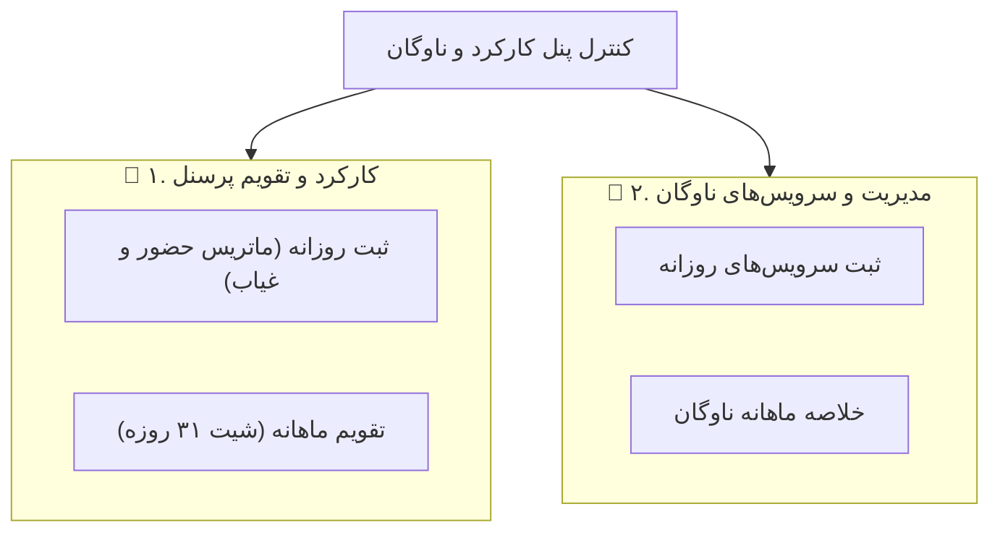

# طرح جامع ارتقای ارگونومی کارکرد، تفکیک ناوگان و پرسنل، انتخابگر ماه و احیای بارگذاری اکسل

## ۱. اهداف و شرح نیازمندی‌ها

1. **اصلاح جهت روز قبل و بعد در تقویم فارسی (RTL):**
   - فلش راست (`>`) ⬅️ روز قبل (`goToPrevDay`)
   - فلش چپ (`<`) ⬅️ روز بعد (`goToNextDay`)
2. **مختصرسازی عناوین دکمه‌های عملیاتی:**
   - کوتاه‌سازی و ارگونومیک کردن متن دکمه‌ها (`حاضر`, `غایب`, `مرخصی`, `ماموریت`, `جمعه`, `نیمه‌وقت`, `کپی دیروز`, `ساعت/اضافه`, `تعطیل رسمی`, `پیست اکسل`, `بارگذاری اکسل`, `دانلود اکسل`, `پاکسازی`).
3. **تفکیک دوگانه سطح اول بین کارکرد پرسنل و ناوگان:**
   - در بالاترین سطح صفحه، دو تب برجسته و بزرگ قرار می‌گیرد:
     - **👥 کارکرد و تقویم پرسنل** (شامل حالت‌های `ثبت روزانه` و `تقویم ماهانه`)
     - **🚛 مدیریت و سرویس‌های ناوگان** (شامل ثبت سرویس‌های روزانه و خلاصه ناوگان)
4. **تغییر سریع ماه با کلیک روی نام ماه (Month Popover):**
   - کلیک روی بج ماه، منوی ۱۲ ماه شمسی (فروردین تا اسفند) را باز کرده و با یک کلیک ماه را بدون نیاز به تایپ عوض می‌کند.
5. **فیلتر فشرده انبار:**
   - تبدیل سلکتور عریض انبار به یک دکمه دراپ‌داون مدرن و فشرده با عنوان `🏢 همه پرسنل ▾` یا `🏢 [نام انبار] ▾`.
6. **احیا و فعال‌سازی مجدد دکمه و مودال بارگذاری فایل اکسل:**
   - افزودن دکمه «📥 بارگذاری اکسل» و اتصال آن به اینپوت فایل و مودال پیش‌نمایش اکسل کارکرد پرسنل.

---

## ۲. ساختار تب‌های سطح اول و دوم

---

## ۳. تغییرات فایل‌ها

### فرانت‌اند:
- **`src/app/components/personnel/warehouse-attendance/warehouse-attendance.html`:**
  - تفکیک هدر به تب‌های سطح اول پرسنل/ناوگان.
  - اصلاح جهت ناوبری روزها (راست=دیروز، چپ=فردا).
  - تبدیل دراپ‌داون انبار به دکمه فشرده.
  - افزودن منوی پاپ‌اوور ۱۲ ماهه با کلیک روی نام ماه.
  - افزودن دکمه و اینپوت بارگذاری فایل اکسل + کوتاه کردن نام دکمه‌های نوار ابزار.
- **`src/app/components/personnel/warehouse-attendance/warehouse-attendance.ts`:**
  - متغیر `mainSectionTab: 'personnel' | 'fleet'`.
  - متدهای `isMonthPickerOpen`, `selectMonth(monthIndex: number)`, `triggerExcelImport()`, `onExcelFileSelected()`.
  - منطق اصلاح‌شده RTL برای جابجایی روزها.

---

## ۴. برنامه راستی‌آزمایی و ۶ ایجنت نگهبان
- بیلد کامل با `ng build` (کد خروجی 0).
- بررسی کارکرد پاپ‌اوور ماه‌ها و انتخابگر انبار فشرده.
- تضمین حفظ ۱۰۰٪ کلیه فرمول‌ها و محاسبات حقوق توسط ایجنت‌های نگهبان.

