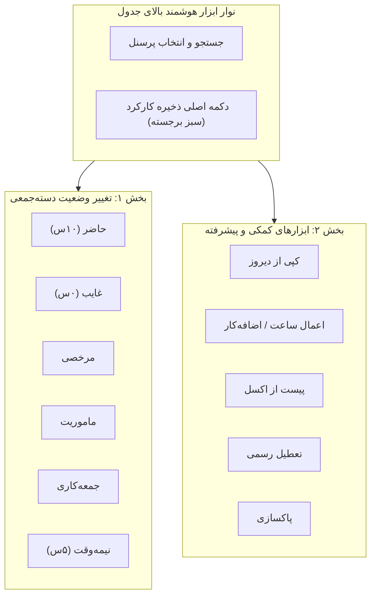

# طرح جامع بازطراحی نوار عملیات گروهی، بهبود دکمه ذخیره و اصلاح UI/UX جدول کارکرد (Attendance UI & Bulk Actions Refactor)

## ۱. اهداف و نیازمندی‌های بازطراحی

بر اساس بررسی تصویر و بازخوردهای ارگونومی:
1. **حذف کامل دکمه «ثبت‌نشده‌ها ⬅️ حاضر»:** هم دکمه بصری و هم تابع `fillUnsetAsPresent` به طور کامل حذف می‌شوند.
2. **پشتیبانی از تمام وضعیت‌های دسته‌جمعی:**
   - حاضر همه (۱۰ ساعت)
   - غایب همه (۰ ساعت)
   - مرخصی همه
   - ماموریت همه
   - جمعه‌کاری همه
   - نیمه‌وقت (۵ ساعت)
   - اعمال هوشمند بر روی ردیف‌های انتخاب‌شده (در صورت تیک خوردن چک‌باکس‌ها) یا کل لیست (در صورت عدم انتخاب).
3. **اصلاح محل و ساختار دکمه «ذخیره کارکرد روزانه»:**
   - انتقال دکمه اصلی ذخیره به نوار کنترل بالای جدول (همیشه در دسترس، سبز برجسته با آیکون و شمارنده تغییرات ذخیره‌نشده).
   - بازطراحی نوار شناور پایین صفحه به یک نوار شیشه‌ای باریک (Glassmorphic Bar)، کاملاً منطبق با عرض صفحه و بدون تداخل با سایدبار یا پوشاندن ردیف‌های جدول.
4. **اصلاحات ارگونومی و ظاهری جدول:**
   - اصلاح ورودی‌های عددی «ساعت موثر» و «اضافه‌کار» جهت نمایش تمیز، خوانا و فونت یکنواخت فارسی/لاتین.
   - اصلاح ظاهر و عرض ستون «تگ انبار».
   - کنتراست بهتر دکمه‌های وضعیت (حاضر / غایب / مرخصی) در حالت‌های فعال و غیرفعال.

---

## ۲. ساختار نوار ابزار جدید عملیات گروهی

---

## ۳. تغییرات فایل‌ها

### فرانت‌اند:
- **`src/app/components/personnel/warehouse-attendance/warehouse-attendance.html`:**
  - افزودن دکمه ذخیره در نوار بالای جدول.
  - حذف دکمه «ثبت‌نشده‌ها ⬅️ حاضر».
  - افزودن دکمه‌های گروهی غایب، مرخصی، ماموریت، جمعه‌کاری و نیمه‌وقت.
  - اصلاح استایل و جایگاه نوار شناور پایین صفحه (`bottom-bar`).
  - بهبود استایل فیلدهای ساعت موثر، اضافه‌کار و تگ انبار.
- **`src/app/components/personnel/warehouse-attendance/warehouse-attendance.ts`:**
  - حذف متد `fillUnsetAsPresent()`.
  - پیاده‌سازی متد جامع `setBulkAttendanceStatus(status: string)` با محاسبه دقیق ساعات موثر و اضافه‌کار برای سطرهای انتخاب‌شده/همه.
- **`src/app/components/personnel/warehouse-attendance/warehouse-attendance.css`:**
  - اصلاح انیمیشن‌ها و پوزیشن فوتر شناور.

---

## ۴. برنامه راستی‌آزمایی و ۶ ایجنت نگهبان
- **Sentry 1:** عدم تاثیر منفی روی موتور ۵۸ ستونی و فرمول‌ها.
- **Sentry 2:** اعتبارسنجی ثبت صحیح وضعیت‌های دسته‌جمعی جدید در دیتابیس.
- **Sentry 3:** بررسی دسترسی‌ها و هدرهای منوی اصلی.
- **Sentry 4:** بیلد بدون خطا با `ng build`.
- **Sentry 5:** تست بصری و واکنش‌گرایی در نمایشگرهای مختلف.
- **Sentry 6:** بازرسی خط به خط کدها و تایید عدم رگرسیون.

