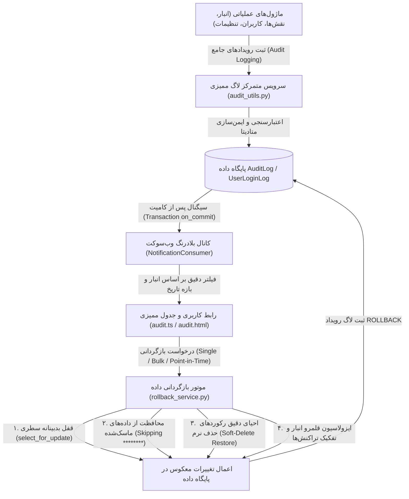

# 🛡️ طرح جامع و ۶ فازی اصلاح، تقویت و رفع کامل باگ‌های منطقی، امنیتی و ممیزی تب «رهگیری تغییرات» (Audit Trail & Security Logs)

این طرح بر اساس کاوش عمیق، تحلیل‌های تطبیقی و ارزیابی موشکافانه کدهای بک‌اند و فرانت‌اند تدوین شده است تا کلیه باگ‌های موتور بازگردانی (Rollback)، حفره‌های امنیتی دور زدن انبار، خطاهای کوئری دیتابیس، نقاط کور ممیزی در ماژول‌های انبارداری و نقش‌ها، و ناهماهنگی‌های وب‌سوکت و اکسل را به صورت ریشه‌ای و استاندارد برطرف نماید.

---

## ۱. معماری و جریان فرآیند تغییرات (Architecture & Data Flow)

---

## ۲. جدول ماتریس جامع فازهای اجرایی طرح (Phased Roadmap)

| فاز | عنوان فاز | محدوده تغییرات | هدف اصلی و دستاورد فنی |
| :---: | :--- | :--- | :--- |
| **فاز ۱** | **اصلاح باگ‌های حیاتی موتور بازگردانی داده** | `rollback_service.py` | • جلوگیری از بازنویسی مقادیر ستاره‌دار (`********`) روی کد ملی و فیلدهای حساس • افزودن قفل سطری `select_for_update` • تفکیک تراکنش و رفع تضاد در بازگردانی نقطه‌ای در زمان (`Point-in-Time`) |
| **فاز ۲** | **رفع باگ‌های کوئری، امنیت دسترسی (RBAC) و چندانبارگی** | `accounts/views.py`, `accounts/urls.py` | • اصلاح خطای دیتابیس در فیلتر با `warehouse=ALL` • بستن نشت امنیتی قلمرو انبار در `bulk_revert` • یکنواخت‌سازی نام ماژول `system` • پیاده‌سازی اندپوینت پاکسازی تاریخچه ورود (`UserLoginLog Purge`) |
| **فاز ۳** | **پوشش نقاط کور ممیزی در ماژول انبارداری و کالاها** | `inventory/views.py`, `warehouses/views.py` | • ثبت رویداد لاگ در ویرایش گروهی کالاها (`bulk_update`) • ثبت لاگ در تخصیص کالا (`bulk_assign`) • ثبت لاگ در پاکسازی انبار (`clear_warehouse_data`) و حذف گروهی از اکسل • ثبت لاگ در ایمپورت اکسل (`import_excel`) و بازگردانی آن |
| **فاز ۴** | **پوشش نقاط کور ممیزی در کاربران، نقش‌ها و تنظیمات** | `accounts/views.py`, `warehouses/views.py` | • ثبت لاگ در ایجاد، ویرایش و حذف نقش‌ها و دسترسی‌های حساس (`CustomRoleViewSet`) • ثبت لاگ در تغییر و ریست رمز عبور (`change_password` و `admin_reset_password`) • ثبت لاگ در تعاریف فیلدهای پویا (`ItemFieldDefinition`) و تنظیمات سیستم |
| **فاز ۵** | **بهینه‌سازی فرانت‌اند، وب‌سوکت و خروجی اکسل** | `audit.ts`, `audit.html`, `audit-api.service.ts` | • اصلاح متد `isFilterMatch` جهت اعمال فیلتر تاریخ روی پیام‌های زنده وب‌سوکت • پیاده‌سازی مدال پاکسازی تاریخچه ورود کاربران در تب دوم • جلوگیری از سرریز سلول‌های اکسل و مدیریت سقف ۱۰K رکورد |
| **فاز ۶** | **آزمون‌های یکپارچگی، نگهبان و بیلد نهایی** | تست‌های E2E، `npm run build` | • تست سناریوهای بازگردانی، ایزولاسیون انبار و ممیزی گروهی • راستی‌آزمایی خروجی بیلد با Exit Code 0 |

---

## ۳. جزئیات فنی و تفکیک تغییرات فایل‌ها (Detailed File Changes)

### 🔹 فاز ۱: اصلاح باگ‌های حیاتی موتور بازگردانی داده (Rollback Engine)

#### [MODIFY] [rollback_service.py](file:///e:/warehouse%20project/warehouse-backend/accounts/rollback_service.py)
* **محافظت از فیلدهای حساس و مقادیر ماسک‌شده:**
  * در متد `revert_log_entry` و `get_revert_preview`، اگر مقدار فیلدی در `before_state` حاوی رشته ماسک‌شده (نظیر `'********'`) باشد یا نام فیلد در `SENSITIVE_KEYS` قرار داشته باشد و مقدار پنهان شده باشد، از بازنویسی آن روی رکورد جلوگیری شده و مقدار واقعی فعلی دست‌نخورده باقی می‌ماند.
* **قفل بدبینانه سطری (`select_for_update`):**
  * اجرای کوئری واکشی مدل هدف درون بلوک `with transaction.atomic():` همراه با `select_for_update()` برای جلوگیری از همزمانی (Race Condition).
* **اصلاح تراکنش بازگردانی نقطه‌ای در زمان (`Point-in-Time`):**
  * اصلاح تابع `execute_point_in_time_rollback` با استفاده از `savepoint` یا رول‌بک قطعی در صورت شکست تا از Commit شدن وضعیت‌های ناقص جلوگیری شود.
* **یکنواخت‌سازی ثبت لاگ بازگردانی:**
  * اصلاح مقدار `module='system'` در ثبت لاگ کلان سیستم به جای `'SYSTEM'`.

---

### 🔹 فاز ۲: رفع باگ‌های کوئری، امنیت دسترسی (RBAC) و چندانبارگی

#### [MODIFY] [accounts/views.py](file:///e:/warehouse%20project/warehouse-backend/accounts/views.py)
* **اصلاح فیلتر `warehouse=ALL`:**
  * در `AuditLogViewSet.get_queryset`، بررسی `if warehouse_id and str(warehouse_id).upper() != 'ALL':` تا ارسال مقدار `'ALL'` منجر به خطای دیتابیس نشود.
* **ایزولاسیون قلمرو انبار در بازگردانی گروهی (`bulk_revert`):**
  * در اکشن `bulk_revert`، فیلتر کردن لاگ‌ها با انطباق بر `self.get_queryset()` جهت اطمینان از اینکه کاربران غیر سوپریوزر نتوانند لاگ‌های انبارهای غیرمجاز را بازگردانی کنند.
* **یکنواخت‌سازی رشته ماژول سیستمی:**
  * تغییر `module='SYSTEM'` به `module='system'` در اکشن `purge`.
* **افزودن اکشن پاکسازی لاگ‌های ورود (`purge` در `UserLoginLogViewSet`):**
  * پیاده‌سازی متد `purge` با قابلیت `dry_run`، فیلتر تاریخ، نام کاربری و وضعیت ورود با مجوز دسترسی سوپریوزر / `perm_sys_purge_logs`.

---

### 🔹 فاز ۳: پوشش نقاط کور ممیزی در ماژول انبارداری و کالاها

#### [MODIFY] [inventory/views.py](file:///e:/warehouse%20project/warehouse-backend/inventory/views.py)
* **ثبت لاگ در ویرایش گروهی کالاها (`bulk_update`):**
  * فراخوانی `log_audit_event` با `module='docs', action='BULK_UPDATE'` و ثبت تعداد و شناسه‌های رکوردهای ویرایش‌شده.
* **ثبت لاگ در تخصیص و ارجاع گروهی (`bulk_assign`):**
  * فراخوانی `log_audit_event` با `module='dispatch', action='UPDATE'` شامل مشخصات انبار، شمارشگران، سرپرستان و مدیران تخصیص‌یافته.
* **ثبت لاگ در پاکسازی داده‌های انبار (`clear_warehouse_data`):**
  * ثبت لاگ ممیزی سراسری با `module='docs', action='DELETE', severity='critical'` در کنار لاگ داخلی ImportLog.
* **ثبت لاگ در حذف گروهی از اکسل (`delete_from_excel`):**
  * ثبت لاگ ممیزی با `module='docs', action='DELETE', severity='critical'`.
* **ثبت لاگ در ایمپورت اکسل کالاها (`import_excel` و `revert_import`):**
  * ثبت لاگ خلاصه ممیزی `action='IMPORT'` و `action='ROLLBACK'` پس از اتمام موفق پردازش اکسل.

---

### 🔹 فاز ۴: پوشش نقاط کور ممیزی در کاربران، نقش‌ها و تنظیمات

#### [MODIFY] [accounts/views.py](file:///e:/warehouse%20project/warehouse-backend/accounts/views.py)
* **ثبت لاگ ممیزی در ایجاد، ویرایش و حذف نقش‌ها (`CustomRoleViewSet`):**
  * ثبت لاگ با `module='users', target_model='CustomRole'` همراه با تفاضل دسترسی‌های اعطاشده/حذف‌شده.
* **ثبت لاگ ممیزی در تغییر و بازنشانی رمز عبور (`change_password` و `admin_reset_password`):**
  * ثبت لاگ امنیتی با `module='users', action='UPDATE', severity='warning'`.
* **ثبت لاگ ممیزی در ایمپورت اکسل کاربران و نقش‌ها:**
  * ثبت لاگ `action='IMPORT'` برای عملیات بارگذاری دسته‌ای کاربران.

#### [MODIFY] [warehouses/views.py](file:///e:/warehouse%20project/warehouse-backend/warehouses/views.py)
* **ثبت لاگ ممیزی در تغییر تنظیمات سیستم و انبار (`SettingsViewSet`):**
  * ثبت رویداد `module='settings', action='UPDATE', severity='warning'` هنگام ذخیره تغییرات پیکربندی.

---

### 🔹 فاز ۵: بهینه‌سازی فرانت‌اند، وب‌سوکت و خروجی اکسل

#### [MODIFY] [audit.ts](file:///e:/warehouse%20project/warehouse-front/src/app/components/audit/audit.ts)
* **اعمال فیلتر تاریخ روی پیام‌های زنده وب‌سوکت:**
  * به‌روزرسانی متد `isFilterMatch` جهت بررسی `fromDate` و `toDate` روی تاریخ لاگ جدید (`log.created_at`).
* **مدیریت پاکسازی لاگ‌های ورود:**
  * افزودن متدهای باز و بسته کردن مدال پاکسازی لاگین‌ها (`openLoginPurgeModal`, `executeLoginPurge`).
* **بهینه‌سازی نمایش خلاصه تفاضل در اکسل:**
  * محدودسازی طول متن تفاضل در خروجی اکسل جهت جلوگیری از سرریز سلول‌ها.

#### [MODIFY] [audit.html](file:///e:/warehouse%20project/warehouse-front/src/app/components/audit/audit.html)
* **دکمه و مدال پاکسازی در تب تاریخچه ورود:**
  * افزودن دکمه پاکسازی لاگ‌ها به نوار ابزار تب تاریخچه ورود کاربران برای کاربران دارای مجوز.

#### [MODIFY] [audit-api.service.ts](file:///e:/warehouse%20project/warehouse-front/src/app/core/api/audit-api.service.ts)
* **متدهای ارتباطی پاکسازی لاگین:**
  * افزودن متد `purgeLoginLogs(req)` و `getLoginPurgePreview(req)`.

---

## ۴. برنامه راستی‌آزمایی و اعتبارسنجی (Verification Plan)

### تست‌های خودکار و بک‌اند
1. **تست Revert داده‌های ماسک‌شده:** اجرای سناریوی بازگردانی رکوردی با کد ملی و بررسی عدم تبدیل آن به `********`.
2. **تست کوئری `warehouse=ALL`:** ارسال درخواست به اندپوینت لاگ‌ها با پارامتر `warehouse=ALL` و تایید دریافت کد پاسخ ۲۰۰ (بدون خطا).
3. **تست ایزولاسیون انبار در `bulk_revert`:** تلاش برای بازگردانی لاگ انبار دیگر با کاربر انبار محدود و تایید دریافت خطای ۴۰۳ یا عدم دسترسی.
4. **تست ثبت لاگ در عملیات گروهی:** اجرای ویرایش گروهی، تخصیص کالا و تغییر نقش و بررسی ایجاد رکوردهای متناظر در جدول `AuditLog`.

### تست‌های فرانت‌اند و بیلد
1. **تست وب‌سوکت با فیلتر تاریخ:** اعمال فیلتر تاریخ گذشته و ارسال لاگ جدید، تایید عدم درج ناخواسته در جدول.
2. **تست بیلد فرانت‌اند:** اجرای دستور `npm run build` و تایید خروجی Exit Code 0 بدون خطای تایپ‌اسکریپت.

