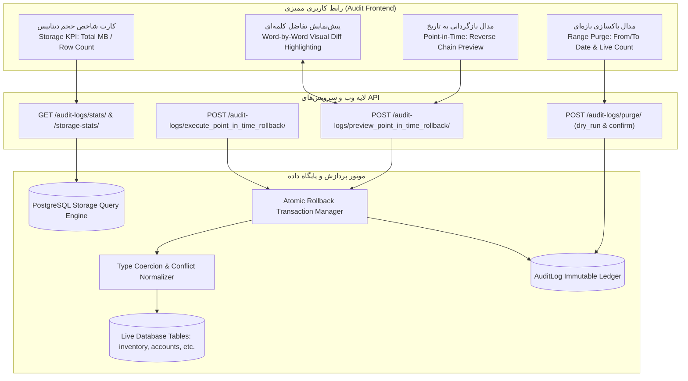

# طرح جامع و ارتقایافته کارتابل ممیزی، محاسبه حجم دیتابیس، پاکسازی بازه‌ای، بازگردانی به تاریخ مشخص و پیش‌نمایش کلمه‌ای تفاوت‌ها
## (Enhanced Comprehensive Audit Architecture, Database Sizing, Range Purge, Point-in-Time Rollback Engine & Word-Level Visual Diff)

این طرح فنی ارتقایافته، ساختار کارتابل ممیزی و رهگیری سیستم (`Audit Trail`) را به یک بستر فوق‌پیشرفته نظارتی، مدیریت فضای ذخیره‌سازی، پاکسازی زمان‌بندی‌شده و احیاگر هوشمند فاجعه (Disaster Recovery & Point-in-Time Rollback) تبدیل می‌کند. این طرح دارای فازبندی دقیق و گیت‌های اعتبارسنجی مستقل ناظر در انتهای هر فاز است.

---

### ۱. ماتریس تفصیلی ایرادات و باگ‌های فنی شناسایی‌شده در کد

| ردیف | فایل و شماره خطوط کد | شرح دقیق نقص فنی | پیامد در کارکرد سامانه | راهکار فنی و مهندسی |
| :--- | :--- | :--- | :--- | :--- |
| **۱** | [`accounts/views.py:L962-971`](file:///e:/warehouse%20project/warehouse-backend/accounts/views.py#L962-L971) | **عدم پشتیبانی از بازه زمانی در پاکسازی لاگ‌ها:** اکشن `purge` صرفاً پارامتر عددی `days` را گرفته و فیلتر `created_at__lt=cutoff` می‌گذارد. | عدم امکان پاکسازی لاگ‌های یک بازه تاریخی دلخواه (از تاریخ تا تاریخ) یا فیلتر انبار و ماژول. | پذیرش پارامترهای `from_date`, `to_date`, `warehouse_id`, `module` و ارائه پیش‌نمایش تعداد رکوردها قبل از حذف (`dry_run=True`). |
| **۲** | [`audit.ts:L66-69`](file:///e:/warehouse%20project/warehouse-front/src/app/components/audit/audit.ts#L66-L69) & [`audit.html`](file:///e:/warehouse%20project/warehouse-front/src/app/components/audit/audit.html) | **فقدان کامل رابط کاربری حذف لاگ‌ها در فرانت:** متغیر `canPurgeLogs` در TS محاسبه شده اما هیچ دکمه، مدال یا فرمی در HTML نیست و در `AuditApiService` متد `purge` وجود ندارد. | کاربر حتی با داشتن مجوز حساس `perm_sys_purge_logs` امکان پاکسازی اطلاعات از پنل کاربری را ندارد. | ایجاد پنجره مودال اختصاصی پاکسازی لاگ‌ها با انتخاب بازه، شمارش زنده رکوردهای منطبق، تاییدیه ۲ مرحله‌ای امنیتی و اتصال به API. |
| **۳** | [`accounts/views.py:L870-896`](file:///e:/warehouse%20project/warehouse-backend/accounts/views.py#L870-L896) | **عدم محاسبه حجم فیزیکی دیسک دیتابیس در آمار:** متد `stats` صرفاً شمارش ردیف‌ها (`Count('id')`) را برمی‌گرداند و حجم جداول PostgreSQL و میانگین بایت‌ها را محاسبه نمی‌کند. | کاربر هیچ اطلاعی از میزان فضای مصرف‌شده توسط ممیزی و لاگین‌ها بر حسب مگابایت/کیلوبایت ندارد. | محاسبه حجم جداول `accounts_auditlog` و `accounts_userloginlog` با توابع سیستمی دیتابیس (`pg_total_relation_size`) و نمایش در کارت‌های شاخص KPI. |
| **۴** | [`rollback_service.py:L153-158`](file:///e:/warehouse%20project/warehouse-backend/accounts/rollback_service.py#L153-L158) | **تشخیص تداخل کاذب ناشی از عدم تبدیل استاندارد نوع داده:** مقایسه رشته‌ای مستقیم `str(current) != str(expected)` برای تاریخ‌ها، اعداد اعشاری `Decimal` و بولین‌ها منجر به `has_conflict=True` کاذب می‌شود. | نمایش بی‌مورد هشدار قرمز و زرد تداخل به کاربر در حالی که داده‌ها تغییری نکرده‌اند. | پیاده‌سازی متد `normalize_for_comparison` جهت مقایسه تمیز و استاندارد مقادیر دیتابیس با وضعیت لاگ. |
| **۵** | [`rollback_service.py:L279, L335`](file:///e:/warehouse%20project/warehouse-backend/accounts/rollback_service.py#L279) | **کستینگ ناقص مقادیر فیلدها در زمان بازگردانی:** تخصیص رشته‌های JSON به فیلدهای مدل بدون بررسی نوع فیلد (مانند DateField, DateTimeField, ForeignKeys). | بروز خطای اعتبارسنجی جنگو یا ذخیره ناصحیح مقادیر رابطه‌ای هنگام بازگردانی رکوردهای پیچیده. | کستینگ و تبدیل خودکار مقادیر رشته‌ای به اشیای سازگار با نوع فیلد بر اساس متادیتای مدل (`_meta.get_field`). |
| **۶** | [`rollback_service.py:L283, 336, 364`](file:///e:/warehouse%20project/warehouse-backend/accounts/rollback_service.py#L283) | **تولید لاگ‌های تکراری و متناقض هنگام بازگردانی:** اجرای `save` یا `delete` در جریان Revert، سیگنال ذخیره عادی را فعال کرده و لاگ مضاعف می‌سازد. | برای یک بازگردانی ساده، دو لاگ در تاریخچه ثبت می‌شود (یک UPDATE و یک ROLLBACK). | انتقال کانتکست بازگردانی برای تمایز رویداد و جلوگیری از ثبت لاگ‌های موازی ناخواسته. |
| **۷** | [`accounts/views.py`](file:///e:/warehouse%20project/warehouse-backend/accounts/views.py) & [`rollback_service.py`](file:///e:/warehouse%20project/warehouse-backend/accounts/rollback_service.py) | **فقدان مکانیزم بازگردانی به یک تاریخ مشخص (Point-in-Time Rollback):** در حال حاضر فقط امکان بازگردانی تک‌لاگ یا آرایه دستی شناسه‌ها وجود دارد. | عدم توانایی مدیر برای بازگرداندن سیستم به وضعیت قبل از یک واقعه تاریخی خاص (مثلاً ساعت ۱۰ صبح دیروز). | طراحی اکشن و سرویس `rollback_to_timestamp` جهت معکوس‌سازی زنجیره‌ای و اتمیک تغییرات از تاریخ مدنظر. |
| **۸** | [`audit.html:L696-720`](file:///e:/warehouse%20project/warehouse-front/src/app/components/audit/audit.html#L696-L720) | **ضعف بصری در پیش‌نمایش بازگردانی و عدم فوکوس روی واژگان:** مقادیر صرفاً در دو ستون جدول به شکل متنی تیره و یکنواخت نمایش داده می‌شوند. | کاربر در اسناد و متون طولانی متوجه کلمات دقیق حذف‌شده یا تغییریافته نمی‌شود. | طراحی مجدد با الگوهای بصری مدرن، برجسته‌سازی کلمه به کلمه (Word-Level Diff) با برچسب‌های رنگی و خط‌خوردگی. |

---

### ۲. معماری جامع و جریان داده (Data Flow & Architecture)

---

### ۳. فازبندی تفصیلی و گیت‌های اعتبارسنجی مستقل ناظر (Phased Implementation & Validation Gates)

#### فاز ۱: اصلاح باگ‌های هسته بازگردانی داده و تشخیص تداخل در بک‌اند (Rollback Core Bug Fixes)
- [ ] پیاده‌سازی متد `normalize_for_comparison` در `rollback_service.py` جهت استانداردسازی مقایسه انواع داده (Decimal, DateTime, Date, Boolean) و حذف تداخل‌های کاذب.
- [ ] پیاده‌سازی تابع تبدیل و کستینگ ایمن فیلدها (`coerce_field_value`) در `rollback_service.py` بر اساس نوع فیلد مدل در جنگو (`_meta.get_field`).
- [ ] جلوگیری از صدور لاگ‌های تکراری و موازی در هنگام اجرای عملیات `save` یا `delete` در بازگردانی داده.
- [ ] **گیت اعتبارسنجی مستقل فاز ۱ توسط ایجنت ناظر (Gate 1 Verification):**
  - اجرای تست‌های واحد برای مقایسه Decimal و DateTime و اطمینان از خروجی `has_conflict=False` هنگام برابری داده‌ها.
  - تست بازگردانی یک رکورد با فیلد تاریخ و کلید خارجی بدون خطای نوع داده.

---

#### فاز ۲: زیرساخت محاسبه حجم فیزیکی دیتابیس و پاکسازی پیشرفته بازه‌ای لاگ‌ها (Storage Sizing & Range Purge Backend)
- [ ] ارتقای متد `stats` در `AuditLogViewSet` و `UserLoginLogViewSet` جهت استعلام حجم واقعی جداول (`pg_total_relation_size`) و سایز لاگ‌ها به بایت، کیلوبایت و مگابایت با مکانیزم Fallback ایمن.
- [ ] بازطراحی اکشن `purge` در `AuditLogViewSet` با پشتیبانی از بازه تاریخی `from_date` و `to_date`، فیلتر انبار و ماژول، و حالت `dry_run` پیش‌نمایش تعداد رکوردها.
- [ ] ثبت خودکار لاگ ممیزی `critical` برای هر عملیات پاکسازی با ثبت تعداد رکوردهای حذف‌شده و نام کاربر مجری.
- [ ] **گیت اعتبارسنجی مستقل فاز ۲ توسط ایجنت ناظر (Gate 2 Verification):**
  - استعلام اکشن `stats` و بررسی وجود مقادیر `storage_bytes`, `storage_formatted`, `avg_row_size_kb`.
  - اجرای اکشن `purge` با `dry_run=true` و بررسی عدم حذف داده، سپس اجرای قطعی با عبارت تاییدیه و بررسی لاگ ممیزی صادره.

---

#### فاز ۳: موتور بازگردانی هوشمند به تاریخ مشخص در بک‌اند (Point-in-Time Rollback Engine Backend)
- [ ] طراحی و پیاده‌سازی متد `preview_point_in_time_rollback` در `rollback_service.py` جهت شبیه‌سازی و استخراج تفاوت‌های تجمیعی کلیه لاگ‌ها از تاریخ هدف تا زمان حال به تفکیک انبار و ماژول.
- [ ] طراحی و پیاده‌سازی متد `execute_point_in_time_rollback` در `rollback_service.py` با اجرای معکوس‌سازی زنجیره‌ای در تراکنش اتمیک دیتابیس (`transaction.atomic()`).
- [ ] ایجاد اکشن‌های API مربوط به Point-in-Time Rollback در `AuditLogViewSet` با گارد پرمیشن حساس (`perm_rollback_data` یا `perm_rollback_bulk`).
- [ ] **گیت اعتبارسنجی مستقل فاز ۳ توسط ایجنت ناظر (Gate 3 Verification):**
  - اجرای اسکریپت آزمون بازگردانی به یک ساعت قبل و بررسی سلامت وضعیت رکوردهای اصلاح‌شده در دیتابیس.
  - تست Rollback در صورت بروز خطای ساختگی و اطمینان از بازگشت کامل تراکنش بدون اعمال ناقص تغییرات.

---

#### فاز ۴: یکپارچه‌سازی مدل‌ها و متدهای API در فرانت‌اند (Frontend Models & API Integration)
- [ ] به‌روزرسانی مدل‌های `audit-log.model.ts` با ساختارهای داده حجم دیتابیس (`AuditStorageStats`)، درخواست‌های پاکسازی (`PurgeRequest`, `PurgePreviewResponse`) و بازگردانی نقطه‌ای (`PointInTimeRollbackPreview`, `PointInTimeRollbackRequest`).
- [ ] پیاده‌سازی متدهای API در `audit-api.service.ts` (`purgeLogs`, `getPurgePreview`, `previewPointInTimeRollback`, `executePointInTimeRollback`).
- [ ] **گیت اعتبارسنجی مستقل فاز ۴ توسط ایجنت ناظر (Gate 4 Verification):**
  - اعتبارسنجی تایپ‌های TypeScript و اطمینان از عدم وجود هرگونه خطای Type Mismatch.

---

#### فاز ۵: پیاده‌سازی رابط کاربری مدرن، کارت شاخص حجم، مدال‌های پاکسازی و پیش‌نمایش کلمه‌ای (Frontend UI & Visual Word Diff)
- [ ] پیاده‌سازی تابع محاسبه تفاضل کلمه به کلمه (`computeWordDiff`) در `audit.ts` جهت هایلایت واژگان حذف‌شده/جدید.
- [ ] اضافه کردن کارت شاخص KPI حجم داده‌های ممیزی به مگابایت/کیلوبایت در بالای صفحه `audit.html`.
- [ ] پیاده‌سازی مدال پیشرفته پاکسازی لاگ‌ها با انتخاب بازه زمانی، پیش‌نمایش تعداد رکوردها و تاییدیه امنیتی ۲ مرحله‌ای.
- [ ] پیاده‌سازی مدال جامع بازگردانی به تاریخ مشخص (Point-in-Time Rollback) با تقویم، پیش‌نمایش تغییرات و تایید تراکنش.
- [ ] بازطراحی کامل بخش بصری پیش‌نمایش بازگردانی (Revert Preview Modal) با تمرکز و کنتراست بالای چشمی روی کلمات تغییریافته (`line-through bg-rose-100 text-rose-800 font-bold px-1 rounded` و `bg-emerald-100 text-emerald-900 font-black px-1 rounded`).
- [ ] **گیت اعتبارسنجی مستقل فاز ۵ توسط ایجنت ناظر (Gate 5 Verification):**
  - بازبینی بصری کلیه پنجره‌های مودال، بررسی عملکرد Responsive و عدم شکستگی استایل‌ها.

---

#### فاز ۶: آزمون جامع یکپارچگی End-to-End، تست‌های اتوماسیون و بیلد نهایی (End-to-End Test, Verification & DUAL-SAVE)
- [ ] اجرای اسکریپت آزمون جامع سناریوهای بازگردانی و پاکسازی بازه‌ای.
- [ ] اجرای بیلد نهایی فرانت‌اند (`npm run build`) و اطمینان از سلامت کامل تایپ‌ها و صفر بودن خطاهای کامپایل.
- [ ] به‌روزرسانی مستندات `walkthrough_audit.md`، `task_audit.md` و `Master_Log.md`.
- [ ] **گیت نهایی پروژه (Final Gate Verification):**
  - تایید عملکرد سراسری بدون هیچ‌گونه باگ یا خطای کنسول و سرور.

---

### ۴. جزئیات فایل‌های مشمول تغییر (Files to Modify)

#### الف. لایه بک‌اند (Backend)
- [MODIFY] [`warehouse-backend/accounts/rollback_service.py`](file:///e:/warehouse%20project/warehouse-backend/accounts/rollback_service.py)
- [MODIFY] [`warehouse-backend/accounts/views.py`](file:///e:/warehouse%20project/warehouse-backend/accounts/views.py)
- [MODIFY] [`warehouse-backend/accounts/audit_utils.py`](file:///e:/warehouse%20project/warehouse-backend/accounts/audit_utils.py)

#### ب. لایه فرانت‌اند (Frontend)
- [MODIFY] [`warehouse-front/src/app/core/models/audit-log.model.ts`](file:///e:/warehouse%20project/warehouse-front/src/app/core/models/audit-log.model.ts)
- [MODIFY] [`warehouse-front/src/app/core/api/audit-api.service.ts`](file:///e:/warehouse%20project/warehouse-front/src/app/core/api/audit-api.service.ts)
- [MODIFY] [`warehouse-front/src/app/components/audit/audit.ts`](file:///e:/warehouse%20project/warehouse-front/src/app/components/audit/audit.ts)
- [MODIFY] [`warehouse-front/src/app/components/audit/audit.html`](file:///e:/warehouse%20project/warehouse-front/src/app/components/audit/audit.html)
- [MODIFY] [`warehouse-front/src/app/components/audit/audit.css`](file:///e:/warehouse%20project/warehouse-front/src/app/components/audit/audit.css)

