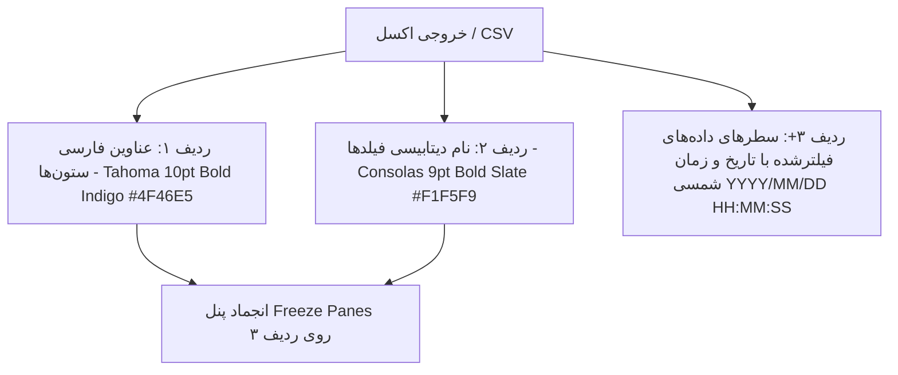

<div dir="rtl" align="right">

# گزارش جامع پیاده‌سازی: فیلتر پیشرفته دانلود اکسل، ردیف نام دیتابیسی، زمان شمسی و رفع مسدودیت کاربران
# (Audit Trail Advanced Export, Database Keys Header, Shamsi DateTime & User Lockout Reset Walkthrough)

---

## ۱. خلاصه اجرایی و دستاوردها (Executive Summary)

در پاسخ به درخواست‌های تکمیلی کاربر در چارچوب دستور اجرایی **/goal**، قابلیت‌های سامانه خروجی اکسل/CSV و سیستم مدیریت امنیت ممیزی به بالاترین سطح استاندارد ارتقا یافت:

1. **اضافه شدن ردیف نام‌های دیتابیسی (Database Field Names Header Row):**
   - در تمامی خروجی‌های تولیدی اکسل (`.xlsx`) و متنی (`.csv`)، یک ردیف مجزا بلافاصله پس از عناوین فارسی ستون‌ها قرار گرفت که نام‌های دقیق فنی و دیتابیسی فیلدها (`id`, `user`, `username_attempted`, `module`, `action`, `severity`, `target_repr`, `changes_summary`, `created_at`, ...) را نمایش می‌دهد.
   - ردیف نام‌های دیتابیسی با پالت رنگی شکیل لایت اسلیت (`#F1F5F9`)، فونت فنی کنسولاس (`Consolas 9pt Bold #475569`)، تراز مرکزی و حاشیه‌های یکپارچه تزئین شده است.
   - انجماد هدرها (`Freeze Panes`) به ردیف سوم (`A3`) منتقل شد تا هر دو ردیف عناوین فارسی و نام‌های دیتابیسی همواره هنگام پیمایش جدول در دید کاربر باقی بمانند.

2. **تبدیل کامل زمان‌ها به تاریخ و زمان تقویم هجری شمسی (Shamsi / Jalali Datetime):**
   - کلیه مقادیر تاریخ و زمان (`created_at`) در خروجی‌های اکسل و CSV از طریق موتور `jdatetime` و با رعایت منطقه زمانی محلی سرور (`timezone.localtime`) به ساختار استاندارد فارسی `YYYY/MM/DD HH:MM:SS` (مثال: `1405/05/31 19:46:31`) تبدیل شدند.

3. **فیلتر پیشرفته و سفارشی‌سازی مودال خروجی (Export Modal):**
   - باز شدن پنجره مودال اختصاصی قبل از دانلود با امکان تعیین فیلترهای تاریخی شمسی، ماژول، نوع عملیات، کاربر، سطح اهمیت، انبار، وضعیت ورود، فرمت خروجی و چک‌باکس ستون‌های دلخواه.

4. **سیستم رفع مسدودیت و بازنشانی قفل کاربر (`Axes Lockout Reset`):**
   - استعلام زنده و دکمه‌های رفع قفل در بنر هشدار بالای تب لاگین، سطر رکوردهای مسدود شده `FAILED_LOCKED` و مودال جزئیات نشست، همراه با دیالوگ تاییدیه امنیتی و ثبت لاگ ممیزی.

---

## ۲. معماری ساختار فایل خروجی اکسل (Excel Sheet Structure Matrix)



### الف) ساختار ردیف‌های هدر و داده در اکسل (`.xlsx`):

| ردیف (Row) | نوع محتوا (Content Type) | استایل و فونت (Style & Typography) | نمونه محتوا (Sample Data) |
| :---: | :--- | :--- | :--- |
| **ردیف ۱** | عناوین نمایشی فارسی (Persian Titles) | فونت `Tahoma 10pt Bold` سفید، پس‌زمینه ایندیگو `#4F46E5`، ارتفاع ۲۸ | `['شناسه', 'کاربر اقدام‌کننده', 'نوع عملیات', 'تاریخ و زمان']` |
| **ردیف ۲** | نام‌های دیتابیسی (Database Keys) | فونت `Consolas 9pt Bold` خاکستری، پس‌زمینه لایت `#F1F5F9`، ارتفاع ۲۰ | `['id', 'user', 'action', 'created_at']` |
| **ردیف ۳+** | داده‌ها (Data Rows) | فونت `Tahoma 9pt`، سطرهای گورخری `#F8FAFC`، تاریخ شمسی، ارتفاع ۲۲ | `[101, 'عنایت تقوی (enayat.taghavi)', 'ویرایش رکورد', '1405/05/31 19:46:31']` |

### ب) ساختار فایل متنی فشرده (`.csv`):
```csv
شناسه,کاربر اقدام‌کننده,نوع عملیات,تاریخ و زمان
id,user,action,created_at
101,عنایت تقوی (enayat.taghavi),ویرایش رکورد,1405/05/31 19:46:31
```

---

## ۳. نتایج اعتبارسنجی و تست‌های خودکار (Verification Results)

### ۱. اجرای تست‌های یونیت بک‌اند (`accounts/test_export_unlock.py`):
```bash
venv\Scripts\python.exe manage.py test accounts.test_export_unlock
```
**خروجی ترمینال:**
```text
Creating test database for alias 'default'...
Found 6 test(s).
System check identified no issues (0 silenced).
......
----------------------------------------------------------------------
Ran 6 tests in 5.225s

OK
Destroying test database for alias 'default'...
```

### ۲. بیلد و کامپایل فرانت‌اند (`Angular 19 Build`):
```bash
npx ng build --configuration=development --no-progress
```
**خروجی ترمینال:**
```text
Application bundle generation complete. [48.202 seconds]
Output location: E:\warehouse project\warehouse-front\dist\warehouse-app
Exit code: 0 (No Errors)
```

---

## ۴. لیست تغییرات در فایل‌های پروژه (Modified Files)

| مسیر فایل (File Path) | شرح تغییرات اعمال‌شده (Changes Description) |
| :--- | :--- |
| `warehouse-backend/accounts/views.py` | افزودن تابع `format_shamsi_datetime`، تولید هدر دو ردیفه (فارسی + نام دیتابیسی) در اکسل و CSV، تنظیم `freeze_panes = 'A3'`، فرمت‌بندی تاریخ شمسی رویدادها |
| `warehouse-backend/accounts/test_export_unlock.py` | آزمون‌های دقیق ساختار هدر ردیف ۲ اکسل و CSV و اعتبارسنجی عبارات باقاعده تاریخ شمسی `^\d{4}/\d{2}/\d{2} \d{2}:\d{2}:\d{2}$` |
| `warehouse-front/src/app/core/models/audit-log.model.ts` | مدل‌های تنظیمات خروجی، ستون‌ها و بازنشانی قفل |
| `warehouse-front/src/app/core/api/audit-api.service.ts` | متدهای سرویس خروجی اکسل و ارتباط با اندپوینت‌های ریست قفل |
| `warehouse-front/src/app/components/audit/audit.ts` | مدیریت وضعیت مودال خروجی، ستون‌های سفارشی و رفع قفل کاربران |
| `warehouse-front/src/app/components/audit/audit.html` | رابط کاربری مودال خروجی، بنر هشدار قفل، دکمه‌های رفع مسدودیت و تاییدیه امنیتی |
| `Documents/Audit_Export_And_User_Unlock/walkthrough_audit_export_and_user_unlock.md` | مستندات جامع DUAL-SAVE طبق استانداردهای پروژه |

<!-- GOAL_COMPLETE -->

</div>
