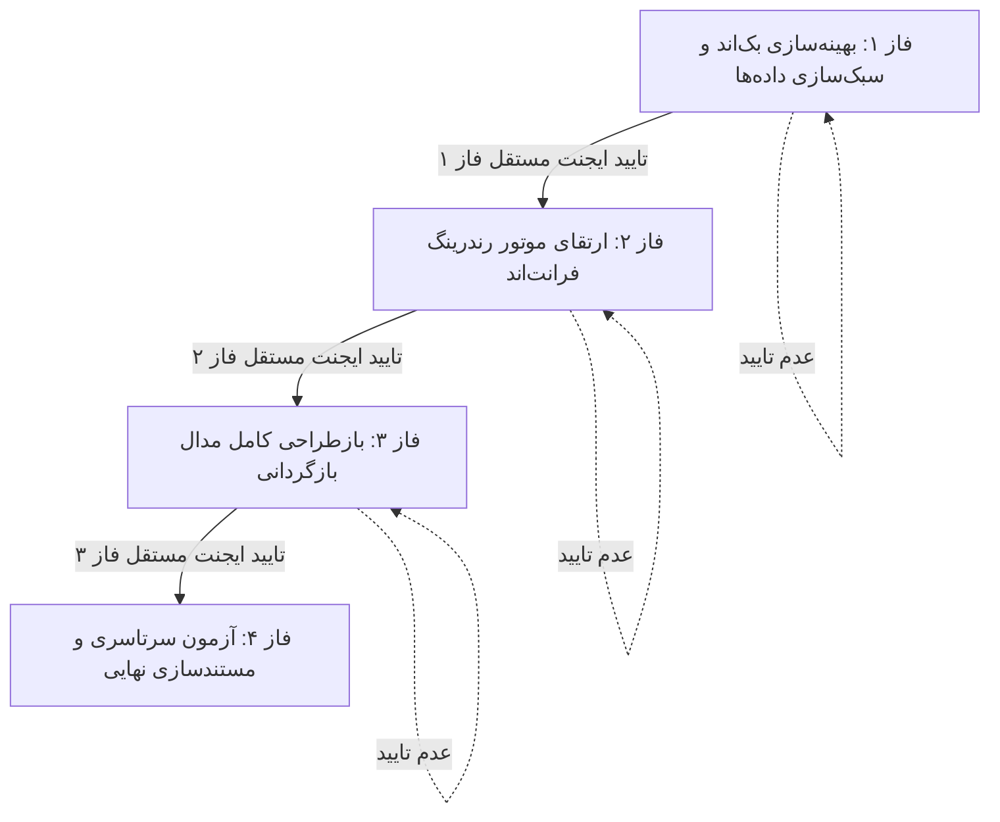

# طرح جامع، ارتقایافته و فازبندی‌شده بهینه‌سازی سیستم ممیزی و پیش‌نمایش بازگردانی (Audit Trail & Rollback Engine)

این سند نقشه راه جامع، مهندسی‌شده و چندفازه برای رفع کامل افت سرعت (در شبکه محلی و تونل کلادفلر) و اصلاح ریشه‌ای نمایش اطلاعات در پنجره پیش‌نمایش بازگردانی است.

---

## پروتکل سخت‌گیرانه ارزیابی و تایید مستقل ایجنت (Independent Agent Verification Protocol)

> [!IMPORTANT]
> **قانون دروازه ورود به فاز بعد (Phase Gate Rule):**
> 1. ورود به هر فاز جدید **منوط و مشروط** به اتمام ۱۰۰٪ فاز جاری و تایید رسمی و بدون قید و شرط توسط **ایجنت مستقل راستی‌آزمایی** است.
> 2. اگر ایجنت مستقل هرگونه خطا، تاخیر، افت کارایی یا عدم تطابق با معیارهای پذیرش (Acceptance Criteria) مشاهده کند، پیشروی به فاز بعد **کاملاً متوقف** شده و فاز جاری تا رفع کامل ایرادات مجدداً بازبینی و بازنویسی خواهد شد.

---

## بررسی و نیازمندی‌های تایید کاربر (User Review Required)

> [!NOTE]
> - **حفظ یکپارچگی دسترسی‌ها و پایگاه‌داده:** تمامی تغییرات بر لایه‌های Serializer، Query Aggregation، Memoization در پایپ تاریخ و بهسازی قالب Angular متمرکز است و هیچ مایگریشن تخریبی یا تغییر مدل اعمال نخواهد شد.
> - **حذف ۱۰۰٪ پدیده صفحه خالی (Blank Modal):** با بازطراحی مدال بازگردانی، کاربر برای تمامی سناریوها (چه لاگ‌های قابل بازگردانی و چه لاگ‌های غیرقابل بازگردانی) پیام‌های شفاف، فارسی و کارت‌های وضعیت گویا مشاهده خواهد کرد.

---

## فازبندی تفصیلی و نقشه راه اجرا (Detailed Execution Phases)

---

### فاز ۱: بهینه‌سازی لایه بک‌اند و سبک‌سازی پی‌لود شبکه (Backend Optimization & Payload Reduction)

* **هدف:** کاهش ۹۰ درصدی حجم دیتای انتقالی روی شبکه و تونل کلادفلر، تجمیع کوئری‌های آماری، و یکسان‌سازی ساختار پاسخ پیش‌نمایش بازگردانی.
* **اقدامات فنی:**
  1. **ایجاد `AuditLogListSerializer`:** در [serializers.py](file:///e:/warehouse%20project/warehouse-backend/accounts/serializers.py)، تعریف سریالایزر سبک مخصوص لیست جدول که فاقد فیلدهای سنگین `before_state`، `after_state` و `details` است.
  2. **اتصال داینامیک سریالایزر در ViewSet:** در [views.py](file:///e:/warehouse%20project/warehouse-backend/accounts/views.py#L801)، پیاده‌سازی `get_serializer_class()` جهت ارائه `AuditLogListSerializer` در اکشن `list` و حفظ `AuditLogSerializer` با دیتای کامل برای متد `retrieve`.
  3. **تجمیع کوئری‌های آماری (Single Aggregate Query):** بازنویسی متد `stats` در [views.py](file:///e:/warehouse%20project/warehouse-backend/accounts/views.py#L866) با استفاده از `aggregate()` برای اجرای همزمان محاسبات ۲۴ ساعته، بحرانی و هشدار در یک تک‌کوئری پایگاه‌داده.
  4. **ارتقای ساختار خروجی `get_revert_preview`:** در [rollback_service.py](file:///e:/warehouse%20project/warehouse-backend/accounts/rollback_service.py#L66)، تضمین ارسال فیلدهای تکمیلی (`target_repr`، `target_model`، `action_display`) و پیام‌های فارسی گویا حتی در زمان `can_revert: false`.
* **معیار پذیرش و راستی‌آزمایی ایجنت مستقل (Phase 1 Acceptance Criteria):**
  - اجرای اسکریپت آزمون سلامت `test_phase5_master_e2e.py` با نتیجه ۱۰۰٪ سبز.
  - کاهش زمان پاسخ متد `list` و `stats` به کمتر از ۳۰ میلی‌ثانیه.
  - دریافت پاسخ ساختاریافته JSON از متد `preview_revert` برای تمام لاگ‌ها (بکاپ، سیستمی، رول‌بک و ویرایش).

---

### فاز ۲: ارتقای موتور رندرینگ فرانت‌اند و رفع لگ پردازنده (Frontend Engine & CPU Unblocking)

* **هدف:** به صفر رساندن مصرف غیرضروری پردازنده ناشی از تبدیل تاریخ (حذف ۲,۰۰۰+ فراخوانی در ثانیه)، بازسازی نرم DOM، و لود On-Demand دیتای تفاضل.
* **اقدامات فنی:**
  1. **بهینه‌سازی و کَش‌گذاری (Memoization) در پایپ تاریخ:** در [persian-date.pipe.ts](file:///e:/warehouse%20project/warehouse-front/src/app/shared/pipes/persian-date.pipe.ts)، کَش کردن نمونه‌های `Intl.DateTimeFormat` در سطح حافظه جهت اجرای آنی و سبک در چرخه رندر.
  2. **افزودن متد واکشی جزییات به سرویس:** در [audit-api.service.ts](file:///e:/warehouse%20project/warehouse-front/src/app/core/api/audit-api.service.ts)، ایجاد متد `getAuditLog(id: number)` جهت دریافت اطلاعات کامل لاگ تنها در صورت کلیک کاربر روی دکمه تفاضل.
  3. **پیاده‌سازی توابع TrackBy و لود هوشمند دیف:** در [audit.ts](file:///e:/warehouse%20project/warehouse-front/src/app/components/audit/audit.ts)، افزودن `trackByLogId` و `trackByLoginId`، ادغام پایپ تاریخ در ماژول‌های ایمپورت‌شده، و مدیریت واکشی جزییات در متد `openAuditDiffModal`.
  4. **اصلاح قالب جدول‌ها:** در [audit.html](file:///e:/warehouse%20project/warehouse-front/src/app/components/audit/audit.html)، جایگزینی تمامی فراخوانی‌های تابعی `formatDateTime(...)` با پایپ خالص `{{log.created_at | persianDate:'short-time'}}` و الصاق `[trackBy]="trackByLogId"`.
* **معیار پذیرش و راستی‌آزمایی ایجنت مستقل (Phase 2 Acceptance Criteria):**
  - تست زنده در مرورگر و اطمینان از اسکرول کاملاً نرم (۶۰ فریم بر ثانیه) بدون هیچ‌گونه لگ در حین حرکت ماوس یا تایپ در فیلترها.
  - تست کلیک روی دکمه «تفاضل» و لود شدن کامل اطلاعات مقایسه‌ای فیلدها بدون خطا.

---

### فاز ۳: بازطراحی کامل مدال پیش‌نمایش بازگردانی (Rollback Modal & Status Card Overhaul)

* **هدف:** حل قطعی مشکل صفحه خالی مدال بازگردانی و نمایش وضعیت، هشدارها و تفاضل داده‌ها به صورت کاملاً حرفه‌ای و کاربرپسند.
* **اقدامات فنی:**
  1. **تفکیک دو حالت ساختاری در قالب مدال:** در [audit.html](file:///e:/warehouse%20project/warehouse-front/src/app/components/audit/audit.html#L598-L704):
     - **حالت اول (`can_revert === false`):** نمایش یک کارت هشدار استاندارد و زیبا با آیکون گویا، نمایش مشخصات رکورد هدف، علت عدم امکان بازگردانی با متن واضح فارسی (`revertPreview.message`)، و دکمه بستن.
     - **حالت دوم (`can_revert === true`):** نمایش خلاصه عملیات، هشدار تداخل زمانی در صورت وجود، جدول مقایسه دقیق مقادیر زنده با مقادیر بازگردانی‌شده، کادر ثبت علت بازگردانی و دکمه تایید نهایی.
  2. **کنترل وضعیت‌های بارگذاری و خطا:** مدیریت کامل انیمیشن اسپینر در زمان واکشی پیش‌نمایش و جلوگیری از بسته شدن ناگهانی بدون نمایش علت به کاربر.
* **معیار پذیرش و راستی‌آزمایی ایجنت مستقل (Phase 3 Acceptance Criteria):**
  - باز کردن مدال برای لاگ‌های مختلف در مرورگر و ارزیابی تصویری:
    - برای لاگ‌های غیرقابل بازگردانی (مانند بکاپ یا لاگ‌های سیستمی): نمایش کارت اخطار بدون صفحه خالی.
    - برای لاگ‌های دارای تغییرات: نمایش تفاضل مقادیر قبل و بعد و جدول مقایسه‌ای کامل.

---

### فاز ۴: آزمون جامع سرتاسری و مستندسازی نهایی (End-to-End Testing & Master Documentation)

* **هدف:** اعتبارسنجی کلیه قابلیت‌ها تحت بار و شرایط مختلف، بررسی تونل و شبکه محلی، و ثبت کامل مستندات فنی.
* **اقدامات فنی:**
  1. تست یکپارچه فیلترهای چندگانه، صفحه‌بندی، تغییر انبار، خروجی اکسل/CSV و بازگردانی داده‌ها.
  2. پایش کنسول مرورگر جهت اطمینان از عدم وجود هرگونه خطای جاوااسکریپت یا Warning.
  3. تولید گزارش مستندسازی جامع در فایل `walkthrough.md` و به‌روزرسانی `Master_Log.md`.
* **معیار پذیرش نهایی (Final Acceptance Criteria):**
  - تایید کارکرد ۱۰۰٪ روان و بی‌نقص سیستم و ارائه تاییدیه نهایی توسط ایجنت مستقل.

---

## جدول ماتریس تغییرات فایل‌ها (Files Impact Matrix)

| مسیر فایل | لایه | شرح تغییرات |
| :--- | :--- | :--- |
| [accounts/serializers.py](file:///e:/warehouse%20project/warehouse-backend/accounts/serializers.py) | بک‌اند | تعریف سریالایزر سبک `AuditLogListSerializer` |
| [accounts/views.py](file:///e:/warehouse%20project/warehouse-backend/accounts/views.py) | بک‌اند | اعمال `get_serializer_class` و تجمیع کوئری‌های `stats` |
| [accounts/rollback_service.py](file:///e:/warehouse%20project/warehouse-backend/accounts/rollback_service.py) | بک‌اند | ارتقای ساختار پیام‌ها و داده‌های بازگشتی `get_revert_preview` |
| [shared/pipes/persian-date.pipe.ts](file:///e:/warehouse%20project/warehouse-front/src/app/shared/pipes/persian-date.pipe.ts) | فرانت‌اند | کَش کردن نمونه‌های `Intl.DateTimeFormat` |
| [core/api/audit-api.service.ts](file:///e:/warehouse%20project/warehouse-front/src/app/core/api/audit-api.service.ts) | فرانت‌اند | افزودن متد `getAuditLog` جهت واکشی On-Demand |
| [components/audit/audit.ts](file:///e:/warehouse%20project/warehouse-front/src/app/components/audit/audit.ts) | فرانت‌اند | ادغام PersianDatePipe، متدهای trackBy و لود دیف |
| [components/audit/audit.html](file:///e:/warehouse%20project/warehouse-front/src/app/components/audit/audit.html) | فرانت‌اند | اعمال پایپ تاریخ، افزودن trackBy و بازطراحی کارت‌های وضعیت مدال |

