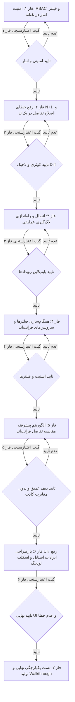

# طرح اجرایی جامع و ارتقایافته اصلاح و نوسازی بخش رهگیری تغییرات (Audit Trail & Login History)

## پروتکل سخت‌گیرانه انتقال بین فازها (Strict Phase Transition & Verification Gate)

> [!IMPORTANT]
> **قانون عبور از فاز (Verification Gate Protocol):**
> ورود به هر فاز جدید مشروط به گذراندن کامل و موفقیت‌آمیز آزمون‌ها و اعتبارسنجی‌های فاز قبلی است.
> در صورت بروز هرگونه مغایرت، خطای کامپایل، خطای تایپ یا باگ منطقی، فرآیند فوراً متوقف شده و اصلاحات تا دستیابی به تایید ۱۰۰٪ ادامه خواهد یافت.

---

## بررسی و تصمیم‌گیری‌های کلان (Architecture & Review Decisions)

> [!NOTE]
> **۱. تفکیک سطح دسترسی لاگین در برابر لاگ‌های ممیزی انبار:**
> لاگ‌های ورود کاربران (`UserLoginLog`) حاوی داده‌های امنیتی سرتاسری (IP، علل ناموفق، نام‌های کاربری تلاش‌شده) هستند و مشاهده آن‌ها منحصراً نیازمند پرمیشن کلان `perm_sys_logs` یا نقش مدیر ارشد (`is_superuser`) خواهد بود. در مقابل، لاگ‌های ممیزی تغییرات انبار (`AuditLog`) بر اساس دسترسی انبار کاربر و مجوز `view_wh_audit` فیلتر و ارائه می‌شوند.
>
> **۲. جلوگیری کامل از N+1 Query:**
> با پیش‌بارگذاری گروه‌ها و نقش‌های کاربران (`prefetch_related('user__groups__customrole')`) در کوئری‌ست بک‌اند، تعداد درخواست‌های دیتابیس در هر صفحه از بیش از ۱۰۰ کوئری به حداکثر ۲ کوئری کاهش می‌یابد.

---

## فازبندی تفصیلی و وظایف فنی (Detailed Phases & Specifications)

---

### 🔹 فاز ۱: امنیت، کنترل دسترسی (RBAC) و فیلتر انبار در بک‌اند
* **هدف:** مسدودسازی دسترسی غیرمجاز و جلوگیری از نشت اطلاعات ممیزی بین انبارها.
* **فایل‌های هدف:**
  * `warehouse-backend/accounts/views.py`
* **اقدامات اجرایی:**
  1. در `UserLoginLogViewSet`: بررسی دسترسی `perm_sys_logs` یا `is_superuser` در متد `get_permissions` یا `get_queryset`.
  2. در `AuditLogViewSet`: بررسی دسترسی `perm_sys_logs` یا `view_wh_audit`.
  3. اعمال فیلتر انبار در `AuditLogViewSet.get_queryset`:
     - اگر کاربر ادمین ارشد باشد یا مجوز کلان داشته باشد، امکان مشاهده همه انبارها و فیلتر بر اساس پارامتر `warehouse` را دارد.
     - اگر کاربر دسترسی محدود به انبار دارد، کوئری‌ست تنها به انبارهای تخصیص‌یافته به کاربر محدود می‌شود.
  4. همگام‌سازی متدهای `stats` و `export_csv` جهت تبعیت کامل از فیلترهای امنیتی و انباری.
* **🔍 گیت اعتبارسنجی فاز ۱ (Verification Gate 1):**
  * ارسال درخواست با توکن کاربر عادی بدون مجوز به `/api/auth/audit-logs/` و `/api/auth/login-logs/` و اطمینان از بازگشت کد `403 Forbidden`.
  * ارسال درخواست با کاربر سرپرست انبار A و اطمینان از عدم حضور رکوردهای انبار B در خروجی.

---

### 🔹 فاز ۲: رفع خطای N+1 Query و اصلاح تابع تفاضل بک‌اند
* **هدف:** افزایش کارایی دیتابیس تا ۱۰ برابر و اصلاح منطق شناسایی مقادیر تهی در تفاضل.
* **فایل‌های هدف:**
  * `warehouse-backend/accounts/views.py`
  * `warehouse-backend/accounts/audit_utils.py`
* **اقدامات اجرایی:**
  1. اضافه کردن `.prefetch_related('user__groups__customrole')` به کوئری‌ست `AuditLogViewSet`.
  2. اصلاح تابع `calculate_model_diff` در `audit_utils.py`:
     - بررسی وجود کلید با مقدار `None` به جای تکیه بر `dict.get()` ساده که باعث نادیده گرفتن فیلدهای جدید `None` می‌شد.
     - تشخیص صریح کلیدهای حذف‌شده (موجود در وضعیت قبل، غایب در بعد) و کلیدهای اضافه‌شده (غایب در قبل، موجود در بعد).
     - تقویت تابع `sanitize_sensitive_data` برای ماسک‌سازی توکن‌ها، رمزهای عبور، و اطلاعات حساس.
* **🔍 گیت اعتبارسنجی فاز ۲ (Verification Gate 2):**
  * اندازه‌گیری تعداد کوئری‌های SQL با Django Connection Handler در لود ۱۰۰ رکورد لاگ و تایید رسیدن به حداکثر ۲ کوئری.
  * اجرای تست منطقی روی `calculate_model_diff` با ورودی‌های شامل مقادیر `None`، کلیدهای جدید و رکوردهای تودرتو و بررسی خروجی.

---

### 🔹 فاز ۳: اتصال و راه‌اندازی لاگ‌گیری رویدادهای عملیاتی در سامانه
* **هدف:** عملیاتی‌سازی ثبت تغییرات واقعی کالاها، انبارها، فایل پایه و تصمیمات مدیریتی.
* **فایل‌های هدف:**
  * `warehouse-backend/inventory/views.py`
  * `warehouse-backend/warehouses/views.py`
  * `warehouse-backend/accounts/views.py`
* **اقدامات اجرایی:**
  1. فراخوانی `log_audit_event` هنگام تغییر مشخصات یا فریز/فعال‌سازی انبار در `warehouses/views.py`.
  2. فراخوانی `log_audit_event` در اکشن‌های ایمپورت اکسل (`IMPORT`)، لغو ایمپورت و حذف گروهی رکوردها (`DELETE`/`ROLLBACK`) در `inventory/views.py`.
  3. ثبت لاگ ممیزی در تغییر نقش‌ها و پرسنل سیستم در `accounts/views.py`.
* **🔍 گیت اعتبارسنجی فاز ۳ (Verification Gate 3):**
  * اجرای یک تغییر تستی در اطلاعات انبار و بررسی ثبت بلادرنگ رکورد در جدول `AuditLog` با وضعیت قبل و بعد صحیح.

---

### 🔹 فاز ۴: همگام‌سازی فیلترها و سرویس‌های فرانت‌اند
* **هدف:** یکپارچه‌سازی رابط فیلترها، ارسال انبار جاری، و رفع خطاهای ریست و پارامترهای ارسالی.
* **فایل‌های هدف:**
  * `warehouse-front/src/app/components/audit/audit.ts`
  * `warehouse-front/src/app/components/audit/audit.html`
  * `warehouse-front/src/app/core/api/audit-api.service.ts`
* **اقدامات اجرایی:**
  1. تزریق `AuthStore` و افزودن `warehouse: this.authStore.selectedWarehouseId() || undefined` به فیلترهای درخواست در `loadAuditLogs` و `downloadCsv`.
  2. اضافه کردن منوی کشویی انتخاب نوع عملیات (`selectedAction`) در `audit.html` با کلیه اکشن‌های معتبر (ایجاد، ویرایش، حذف، تایید، رد، بازشماری، ایمپورت و...).
  3. اضافه کردن گزینه `system` (رویدادهای سیستمی) به دراپ‌داون ماژول‌ها در تمپلیت.
  4. ریست جامع و کامل تمامی متغیرهای فیلتر (`searchTerm`, `selectedModule`, `selectedSeverity`, `selectedAction`, `selectedLoginStatus`, `fromDate`, `toDate`) در متد `setTab`.
  5. پاکسازی مقادیر `undefined` و رشته‌های خالی در توابع `exportAuditCsv` و `exportLoginCsv` در `audit-api.service.ts`.
* **🔍 گیت اعتبارسنجی فاز ۴ (Verification Gate 4):**
  * بررسی رابط کاربری و عملکرد تک‌تک فیلترها (ماژول، نوع عملیات، اهمیت، انبار و بازه تاریخی).
  * تست دانلود فایل CSV و تایید سلامت URL درخواست بدون پارامترهای نامعتبر.

---

### 🔹 فاز ۵: الگوریتم پیشرفته مقایسه تفاضل در فرانت‌اند (Visual Diff Engine)
* **هدف:** جلوگیری قطعی از مغایرت‌های کاذب و مقایسه دقیق اشیاء، آرایه‌ها و ساختارهای JSON.
* **فایل‌های هدف:**
  * `warehouse-front/src/app/components/audit/audit.ts`
* **اقدامات اجرایی:**
  1. پیاده‌سازی تابع مقایسه عمیق (Deep Value Comparison) برای جایگزینی با `valB === valA`.
  2. فرمت‌بندی استاندارد مقادیر بولی (`بله/خیر`)، مقادیر عددی، دیکشنری‌ها و آرایه‌ها در جدول تفاضل.
  3. دسته‌بندی و اولویت‌بندی مرتب‌سازی: نمایش فیلدهای حذف‌شده و تغییریافته در صدر جدول و فیلدهای بدون تغییر در انتها.
* **🔍 گیت اعتبارسنجی فاز ۵ (Verification Gate 5):**
  * باز کردن مدال تفاضل برای رکوردی با فیلدهای دیکشنری دست‌نخورده و تایید عدم نمایش بج `changed` روی فیلدهای برابر.

---

### 🔹 فاز ۶: بازطراحی UI، رفع ایرادات استایل، تاریخ فارسی و اسکلت لودینگ
* **هدف:** مدرن‌سازی UI، رفع کلاس نامعتبر Tailwind، حل تداخل نمایش تاریخ/ساعت فارسی و اضافه کردن Skeleton Loader.
* **فایل‌های هدف:**
  * `warehouse-front/src/app/components/audit/audit.html`
  * `warehouse-front/src/app/components/audit/audit.ts`
  * `warehouse-front/src/app/components/audit/audit.css`
* **اقدامات اجرایی:**
  1. اصلاح کلاس نامعتبر `py-0.2` به `py-0.5` و `text-[10px]` در بج‌های وضعیت مدال.
  2. اصلاح چیدمان ستون تاریخ و زمان و جلوگیری از معکوس شدن چینش ارقام فارسی در کانتینرهای LTR.
  3. طراحی و پیاده‌سازی اسکلت لودینگ متحرک (Skeleton Loading Table) برای نمایش شیک هنگام دریافت داده‌ها.
  4. ایجاد کامپوننت وضعیت خطای درون‌جدولی (Error State) همراه با آیکون و دکمه «تلاش مجدد (Retry)».
  5. شفاف‌سازی عناوین و برچسب‌های زمانی کارت‌های KPI ممیزی و ورود کاربران.
* **🔍 گیت اعتبارسنجی فاز ۶ (Verification Gate 6):**
  * بررسی وضعیت بارگذاری (Skeleton)، بررسی وضعیت خطای شبکه، بررسی ظاهر فونت‌ها، بج‌ها و مدال در ابعاد دسکتاپ و تبلت.

---

### 🔹 فاز ۷: راستی‌آزمایی یکپارچه، تست نهایی و مستندسازی (Verification & Walkthrough)
* **هدف:** اطمینان از سلامت ۱۰۰٪ کل ماژول، ساخت بیلد بدون خطا و ثبت مستندات نهایی.
* **اقدامات اجرایی:**
  1. اجرای بیلد فرانت‌اند با `ng build` یا کامپایل تایپ‌اسکریپت و اطمینان از عدم وجود هرگونه اخطار و خطای تایپ.
  2. اجرای بررسی ساختار جنگو با `python manage.py check`.
  3. تهیه و ثبت سند نهایی `walkthrough.md` و نسخه پوشه مستندات پروژه طبق استاندارد DUAL-SAVE.

