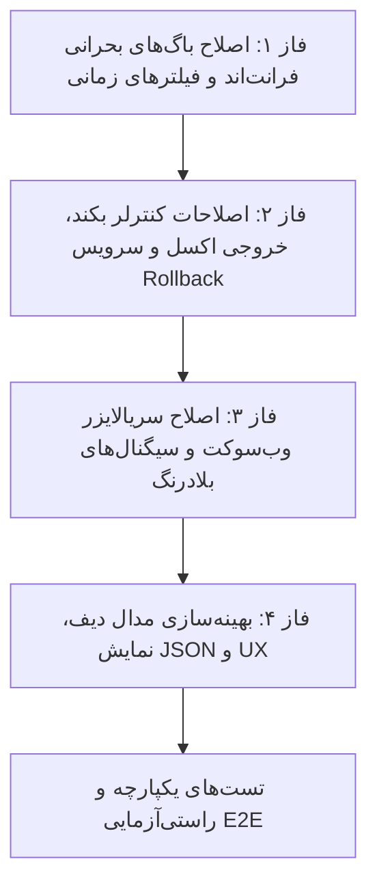

<div dir="rtl" align="right">

# طرح جامع فازبندی‌شده اصلاح و پایدارسازی تب رهگیری تغییرات و لاگ‌های امنیتی (Audit Trail & Security Logs Remediation Plan)

این طرح بر اساس کاوش مستقل و ارزیابی عمیق سورس‌کد بکند و فرانت‌اند تدوین شده است تا کلیه باگ‌های عملکردی، عدم انطباق فیلترها و آمار، ضعف‌های امنیتی در تراکنش‌های بازگردانی و خطاهای وب‌سوکت را در قالب ۴ فاز تفکیک‌شده، گام‌به‌گام و قابل راستی‌آزمایی برطرف سازد.

---

## ۱. راهنمای بررسی کاربر (User Review Required)

> [!IMPORTANT]
> **قانون عدم اجرای خودکار (Auto-Approval Override):** 
> هیچ‌یک از کدهای این طرح بدون دستور مستقیم و صریح شما (تایپ عبارت «تایید» یا «شروع») اجرا نخواهد شد. لطفاً سرفصل‌های فازها و فایل‌های هدف را بررسی فرمایید.

> [!NOTE]
> **حفظ تفکیک دسترسی‌ها (RBAC Guard):**
> لاگ‌های سیستمی (`warehouse_id = NULL`) همچنان فقط برای مدیران ارشد و دارندگان مجوز سراسری سیستم (`perm_sys_logs`) قابل مشاهده خواهند ماند تا اصول امنیت چندمستأجری خدشه‌دار نشود.

---

## ۲. ساختار فازبندی اجرایی (Phased Implementation Architecture)



---

## ۳. جدول تفصیلی اقدامات به تفکیک فازها (Detailed Phase Breakdown)

### فاز ۱: اصلاح باگ‌های بحرانی فرانت‌اند، فیلترهای تاریخ و کارت‌های KPI
| اولویت | شرح اقدام | فایل هدف | وضعیت |
| :--- | :--- | :--- | :---: |
| **P0** | **اصلاح متد `formatIsoDate`:** بازنویسی لاجیک تشخیص رشته‌های ISO و جلوگیری از ایجاد `Invalid Date` در تمام فیلترهای تقویم، بازه‌های سریع (24h/7d) و تایپ دستی. | [`audit.ts`](file:///E:/warehouse%20project/warehouse-front/src/app/components/audit/audit.ts) | ⏳ در انتظار تایید |
| **P0** | **همگام‌سازی کلیدهای آماری KPI:** اصلاح مدل `AuditStats` و تمپلیت `audit.html` جهت تطابق با کلیدهای بازگشتی بکند (`logs_24h`، `critical_24h`، `warnings_24h`). | [`audit-log.model.ts`](file:///E:/warehouse%20project/warehouse-front/src/app/core/models/audit-log.model.ts) و [`audit.html`](file:///E:/warehouse%20project/warehouse-front/src/app/components/audit/audit.html) | ⏳ در انتظار تایید |
| **P1** | **اصلاح فیلتر وضعیت ورود در کارت‌های KPI:** اصلاح مقادیر فراخوانی `filterByLoginStatus` به مقادیر معتبر حروف بزرگ (`SUCCESS`, `FAILED_CREDENTIALS` و تجمیع `FAILED`). | [`audit.html`](file:///E:/warehouse%20project/warehouse-front/src/app/components/audit/audit.html) و [`audit.ts`](file:///E:/warehouse%20project/warehouse-front/src/app/components/audit/audit.ts) | ⏳ در انتظار تایید |

---

### فاز ۲: اصلاحات کنترلر بکند، خروجی اکسل، آمار و موتور بازگردانی (Rollback Service)
| اولویت | شرح اقدام | فایل هدف | وضعیت |
| :--- | :--- | :--- | :---: |
| **P0** | **اعمال ستون‌های انتخابی در اکسل ممیزی:** خواندن آرایه `columns` در `AuditLogViewSet.export_excel` و تطبیق کلیدهای فرانت‌اند با بکند (`user_display`، `warehouse_name` و غیره). | [`views.py`](file:///E:/warehouse%20project/warehouse-backend/accounts/views.py) | ⏳ در انتظار تایید |
| **P1** | **محاسبه آمار هشدارها در بکند:** افزودن فیلتر `severity='warning'` در متد `AuditLogViewSet.stats` برای پر شدن کارت هشدارهای ۲۴ ساعت. | [`views.py`](file:///E:/warehouse%20project/warehouse-backend/accounts/views.py) | ⏳ در انتظار تایید |
| **P1** | **پوشش خطای سراسری در `revert_log_entry`:** افزودن بلوک `try...except` فراگیر دور تراکنش اتمیک برای بازگرداندن پیام‌های خطای تمیز و قابل فهم به جای خطای 500. | [`rollback_service.py`](file:///E:/warehouse%20project/warehouse-backend/accounts/rollback_service.py) | ⏳ در انتظار تایید |
| **P2** | **بهینه‌سازی پاکسازی لاگ‌ها (Batch Chunking):** اصلاح اکشن `purge` برای حذف تکه‌تکه در بچ‌های ۵۰۰۰تایی بر اساس شناسه جهت جلوگیری از قفل دیتابیس. | [`views.py`](file:///E:/warehouse%20project/warehouse-backend/accounts/views.py) | ⏳ در انتظار تایید |

---

### فاز ۳: اصلاح سریالایزرهای سیگنال وب‌سوکت و همگام‌سازی بلادرنگ (WebSockets)
| اولویت | شرح اقدام | فایل هدف | وضعیت |
| :--- | :--- | :--- | :---: |
| **P1** | **اصلاح سریالایزر لاگ ورود بلادرنگ:** افزودن فیلدهای `device_model`، `status_display` و تنظیم صحیح `user_display` در تابع `serialize_login_log_data`. | [`signals.py`](file:///E:/warehouse%20project/warehouse-backend/accounts/signals.py) | ⏳ در انتظار تایید |
| **P2** | **شرطی‌سازی افزایش آمار وب‌سوکت با انبار جاری:** بررسی `log.warehouse === currentWarehouseId` در متد `incrementAuditStats` قبل از افزایش شمارنده‌ها. | [`audit.ts`](file:///E:/warehouse%20project/warehouse-front/src/app/components/audit/audit.ts) | ⏳ در انتظار تایید |

---

### فاز ۴: بهینه‌سازی مدال تفاضل، نمایش JSON و تجربه کاربری (UI/UX)
| اولویت | شرح اقدام | فایل هدف | وضعیت |
| :--- | :--- | :--- | :---: |
| **P2** | **برچسب‌های فارسی در مدال دیف:** نگاشت کلیدهای فیزیکی به عناوین فارسی کاربرپسند در جدول مقایسه تغییرات قبل و بعد. | [`audit.ts`](file:///E:/warehouse%20project/warehouse-front/src/app/components/audit/audit.ts) و [`audit.html`](file:///E:/warehouse%20project/warehouse-front/src/app/components/audit/audit.html) | ⏳ در انتظار تایید |
| **P2** | **فرمت‌بندی ساختاریافته اشیاء JSON در Word Diff:** استفاده از `JSON.stringify` با تورفتگی مناسب به جای تولید رشته ناقص `[object Object]`. | [`audit.ts`](file:///E:/warehouse%20project/warehouse-front/src/app/components/audit/audit.ts) | ⏳ در انتظار تایید |

---

## ۴. برنامه راستی‌آزمایی و تست (Verification Plan)

### تست‌های خودکار بکند (Automated Backend Tests)
```bash
# اجرای تست‌های واحد برای لاگ‌های ممیزی، خروجی اکسل سفارشی و رول‌بک
python manage.py test accounts.tests accounts.test_export_unlock
```

### تست‌های دستی و سناریوهای اعتبارسنجی (Manual Validation)
1. **تست فیلترهای تاریخی:** انتخاب تاریخ از تقویم شمسی، ورود دستی ۸ رقمی (`14050531`) و کلیک روی دکمه‌های «۲۴ ساعت» و «۷ روز» و اطمینان از ارسال پارامترهای `from_date` و `to_date` به بکند.
2. **تست کارت‌های KPI:** اطمینان از نمایش اعداد صحیح در تمامی کارت‌های بالای صفحه (تغییرات ۲۴ساعت، رویدادهای بحرانی و هشدارها).
3. **تست خروجی اکسل با ستون‌های سفارشی:** انتخاب چند ستون خاص در مدال خروجی اکسل و تایید عدم وجود ستون‌های انتخاب‌نشده در فایل دانلود شده.
4. **تست ورود زنده وب‌سوکت:** لاگین از یک مرورگر دیگر و مشاهده پر شدن خودکار و صحیح ستون‌های دستگاه و وضعیت در تب تاریخچه ورود.

</div>
