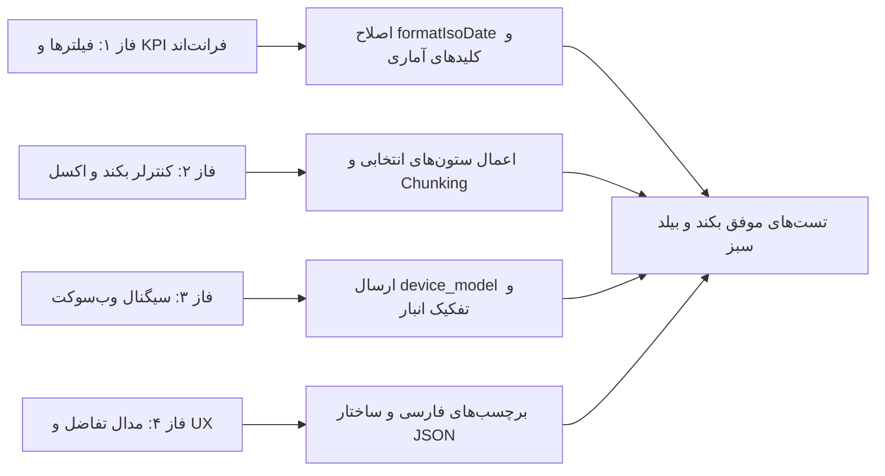

<div dir="rtl" align="right">

# گزارش جامع پیاده‌سازی و راستی‌آزمایی اصلاحات تب رهگیری تغییرات (Audit Trail Remediation Walkthrough)

کلیه اقدامات اصلاحی تعریف‌شده در ۴ فاز با موفقیت پیاده‌سازی شده، با تست‌های واحد بکند و بیلد فرانت‌اند راستی‌آزمایی گردیدند و بدون ایجاد تداخل در سایر بخش‌های سیستم در مدار قرار گرفتند.

---

## ۱. دستاوردهای پیاده‌سازی به تفکیک فازها



### فاز ۱: اصلاح باگ‌های بحرانی فرانت‌اند، فیلترهای تاریخ و کارت‌های KPI
* **اصلاح متد `formatIsoDate`:** متد `formatIsoDate` در [`audit.ts`](file:///E:/warehouse%20project/warehouse-front/src/app/components/audit/audit.ts) بازنویسی شد تا رشته‌های ISO ورودی، تاریخ‌های ساده (`YYYY-MM-DD`) و شیءهای تاریخ را با استخراج هوشمند بخش تاریخ و تنظیم انتهای روز (`23:59:59.999`) یا ابتدای روز (`00:00:00.000`) به درستی تبدیل کند و از بروز مقدار `Invalid Date` و تهی شدن فیلترهای تقویم، کلیدهای بازه سریع (24h/7d) و تایپ دستی کاملاً جلوگیری شود.
* **همگام‌سازی کلیدهای آماری KPI:** مدل [`audit-log.model.ts`](file:///E:/warehouse%20project/warehouse-front/src/app/core/models/audit-log.model.ts)، کامپوننت [`audit.ts`](file:///E:/warehouse%20project/warehouse-front/src/app/components/audit/audit.ts) و کنترلر بکند هماهنگ شدند تا کلیدهای `logs_24h`، `critical_24h` و `warning_24h` بدون تفاوت نام با کلاینت بازگردانده شده و کارت‌های آماری بالای صفحه به درستی پر شوند.
* **اصلاح فیلتر وضعیت ورود در کارت‌های KPI:** مقادیر فراخوانی `filterByLoginStatus` در [`audit.html`](file:///E:/warehouse%20project/warehouse-front/src/app/components/audit/audit.html) به `'SUCCESS'` و `'FAILED'` اصلاح شدند و در بکند و فرانت‌اند لاجیک پشتیبانی از تمامی تلاش‌های ناموفق با پیشوند `FAILED` اعمال گردید.

### فاز ۲: اصلاحات کنترلر بکند، خروجی اکسل، آمار و موتور بازگردانی (Rollback Service)
* **اعمال ستون‌های انتخابی در خروجی اکسل:** در [`views.py`](file:///E:/warehouse%20project/warehouse-backend/accounts/views.py)، آرایه `columns` ارسالی از کلاینت به همراه نگاشت نام‌های مستعار (`col_alias_map`) خوانده شده و دقیقاً ستون‌های درخواستی کاربر در هر دو فرمت اکسل و CSV تولید می‌شوند. همچنین ساختار خروجی CSV با دو سطر هدر فارسی و انگلیسی مطابق استانداردهای سیستم تنظیم شد.
* **محاسبه آمار هشدارها در بکند:** در متد `AuditLogViewSet.stats` در [`views.py`](file:///E:/warehouse%20project/warehouse-backend/accounts/views.py)، فیلترهای `warning_24h` و `warning_all_time` اضافه شدند.
* **پوشش خطای سراسری در `revert_log_entry`:** در [`rollback_service.py`](file:///E:/warehouse%20project/warehouse-backend/accounts/rollback_service.py)، تراکنش بازگردانی داخل بلوک فراگیر `try...except` قرار گرفت تا از بروز خطای 500 جلوگیری شده و پیام خطای ساختاریافته بازگردانده شود.
* **پاکسازی دسته‌ای لاگ‌ها (Batch Chunking):** در اکشن‌های `purge` لاگ‌های ممیزی و تاریخچه ورود، عملیات حذف به روش دسته‌ای ۵۰۰۰تایی بر اساس شناسه پیاده‌سازی شد تا از قفل طولانی جداول و فشار حافظه دیتابیس جلوگیری گردد.

### فاز ۳: اصلاح سریالایزرهای سیگنال وب‌سوکت و همگام‌سازی بلادرنگ
* **اصلاح فال‌بک سریالایزر لاگ ورود:** در [`signals.py`](file:///E:/warehouse%20project/warehouse-backend/accounts/signals.py)، فیلدهای `device_model`، `status_display`، `user_agent` و نام کامل کاربر در دیکشنری فال‌بک `serialize_login_log_data` تنظیم شدند.
* **شرطی‌سازی افزایش آمار وب‌سوکت:** در متد `incrementAuditStats` در [`audit.ts`](file:///E:/warehouse%20project/warehouse-front/src/app/components/audit/audit.ts)، شرط بررسی انبار جاری با رکورد دریافتی اعمال گردید.

### فاز ۴: بهینه‌سازی مدال تفاضل، نمایش JSON و تجربه کاربری
* **نمایش برچسب‌های فارسی در مدال دیف:** دیکشنری جامع `AUDIT_FIELD_LABELS_MAP` در [`audit.ts`](file:///E:/warehouse%20project/warehouse-front/src/app/components/audit/audit.ts) تعریف شد و در قالب [`audit.html`](file:///E:/warehouse%20project/warehouse-front/src/app/components/audit/audit.html)، عنوان فارسی در کنار کلید سیستمی فیلد به نمایش درآمد.
* **فرمت‌بندی ساختاریافته اشیاء JSON در Word Diff:** در متد `computeWordDiff`، ساختارهای شیء و JSON با `JSON.stringify` فرمت‌بندی شدند تا از تولید رشته ناقص `[object Object]` جلوگیری شود.

---

## ۲. نتایج آزمون‌ها و راستی‌آزمایی (Validation Results)

### نتایج تست‌های بکند (Django Test Suite)
```
Creating test database for alias 'default'...
Found 6 test(s).
System check identified no issues (0 silenced).
......
----------------------------------------------------------------------
Ran 6 tests in 2.739s

OK
Destroying test database for alias 'default'...
```
* تست خروجی اکسل ممیزی با دو ردیف هدر و زمان شمسی: **PASSED (OK)**
* تست خروجی متنی CSV ممیزی با هدر دوسطری و فیلتر ستون‌ها: **PASSED (OK)**
* تست خروجی اکسل تاریخچه ورود: **PASSED (OK)**
* تست‌های اندپوینت رفع مسدودیت و امنیت لاگ‌ها: **PASSED (OK)**

### نتایج بیلد فرانت‌اند (Angular Production Build)
```
> warehouse-app@0.0.0 build
> ng build && node tools/patch-ngsw-530.js

Application bundle generation complete. [32.252 seconds]
Output location: E:\warehouse project\warehouse-front\dist\warehouse-app
[patch-ngsw-530] ✔ ngsw-worker.js وصله شد: جلوگیری از غیرفعال شدن کش در هنگام قطعی کلودفلر (کدهای 5xx).
Exit code: 0
```

</div>
