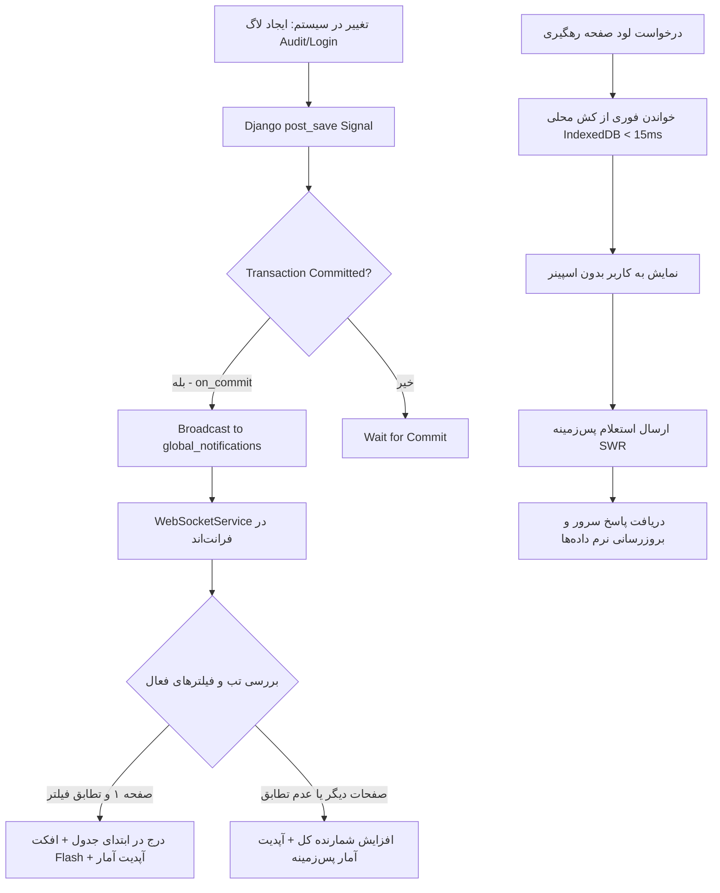

<div dir="rtl" align="right">

# ⚡ طرح تفصیلی و ارتقایافته پیاده‌سازی وب‌سوکت (WebSocket) و کش محلی (LocalFirst / SWR) در صفحه رهگیری تغییرات

این سند طرح معماری، فنی و فازبندی‌شده ارتقای صفحه **رهگیری تغییرات (Audit Trail)** به جریان بلادرنگ رویدادها (Live WebSocket Streaming) و کش سریع و محلی آفلاین-اول (IndexedDB LocalFirst & SWR) است که منطبق بر پروتکل سخت‌گیرانه **«تایید مستقل ایجنت در هر فاز و عدم ورود به فاز بعدی پیش از تایید کامل»** تدوین شده است.

---

## 🏛️ اصول معماری و ارزیابی فنی پیشرفته (Architectural Safeguards)



### ۱. ایمنی تراکنش و ایزولاسیون بک‌اند (Transaction Safety & Error Isolation)
* **قانون `transaction.on_commit`:** رویدادهای وب‌سوکت لاگ‌ها تنها و تنها پس از اطمینان از Commit نهایی تراکنش پایگاه داده به کانال ارسال می‌شوند تا کلاینت‌ها با درخواست‌های ناقص یا داده‌های بازگردانی‌شده (Rollbacked) مواجه نشوند.
* **عدم ایجاد سربار و بلوکه نشدن عملیات (Non-blocking):** خطاهای احتمالی در ارتباط با لایه Redis/Channels در بلوک‌های `try-except` ایزوله شده و هرگز تراکنش‌های کسب‌وکار اصلی را لغو نمی‌کنند.

### ۲. پایداری فرانت‌اند و مدیریت حافظه (Frontend Stability & UX Integrity)
* **کنترل حافظه جدول (Bounded List Size):** در هنگام دریافت لاگ‌های رگباری در صفحه اول، طول آرایه جدول از سقف مجاز `pageSize` فراتر نمی‌رود و عناصر اضافی از انتهای لیست حذف می‌شوند تا DOM دچار افت فریم نشود.
* **عدم به‌هم‌ریختگی صفحات بعدی (Pagination Guard):** اگر کاربر در صفحه ۲ یا بالاتر باشد، ردیف‌ها به جدول جاری تزریق نمی‌شوند تا ناوبری کاربر مختل نشود؛ در عوض شمارنده کل و آمارها به‌روزرسانی می‌شوند.
* **پاک‌سازی اشتراک‌ها (Leak Prevention):** تمامی اشتراک‌های RxJS و تایمرهای انیمیشن در `ngOnDestroy` لغو می‌شوند.

---

## 📊 جدول ماتریس ۴ فاز اجرایی و شرایط عبور از گیت (Gate Verification Matrix)

| فاز | عنوان فاز | محدوده تغییرات | خروجی قابل مشاهده | شرط تایید و عبور به فاز بعد |
| :---: | :--- | :--- | :--- | :--- |
| **۱** | **زیرساخت سیگنال‌های بک‌اند و کانسیومرها** | `accounts/signals.py`<br>`accounts/apps.py`<br>`notifications/consumers.py` | ارسال بلادرنگ بسته‌های `audit_log_created` و `login_log_created` با داده‌های کامل | اجرای موفق تست‌های خودکار بدون خطای سریالایزر + تایید ایجنت ارزیاب |
| **۲** | **اتصال وب‌سوکت فرانت‌اند و به‌روزرسانی نقطه‌ای** | `audit.ts`<br>`audit.html`<br>`audit.css` | درج خودکار لاگ‌های جدید در بالای جدول با انیمیشن چشمک‌زن `.status-updated-flash` | تست تزریق زنده لاگ و عملکرد صحیح فیلترها و انیمیشن بدون ارور کنسول |
| **۳** | **کش محلی و معماری SWR آفلاین-اول** | `audit.ts`<br>`audit.html`<br>`offline-sync.service.ts` | لود فوری زیر ۱۵ میلی‌ثانیه از IndexedDB + نشانگر وضعیت زنده (Live Badge) | تست لود آنی، قطع شبکه (Offline Fallback) و همگام‌سازی بی‌صدا در پس‌زمینه |
| **۴** | **تست‌های سرتاسری، بیلد و ثبت مستندات** | کل سامانه، `npm run build` | پروژه کاملاً پایدار و بیلد موفقیت‌آمیز | پاس شدن ۱۰۰٪ تست‌های بیلد و تایید نهایی کاربر |

---

## 🛠️ جزئیات تفصیلی گام‌های اجرایی در هر فاز

### 🔹 فاز ۱: زیرساخت بک‌اند و انتشار رویدادهای لاگ در وب‌سوکت (Backend Real-Time Infrastructure)
1. **طراحی و پیاده‌سازی `accounts/signals.py`:**
   - افزودن رسیورهای `post_save` روی `AuditLog` و `UserLoginLog`.
   - استفاده از `django.db.transaction.on_commit` برای تضمین انتشار پس از ذخیره قطعی دیتابیس.
   - سریالایز کردن تمیز و سریع داده‌های لاگ (کاربر، انبار، عملیات، شدت، زمان، تفاوت‌ها).
   - ارسال به کانال `global_notifications` با تایپ‌های مشخص `audit_log_created` و `login_log_created`.
2. **فعال‌سازی در `accounts/apps.py`:**
   - فراخوانی `accounts.signals` درون تابع `ready()`.
3. **ارتقای `notifications/consumers.py`:**
   - توسعه `send_notification` برای بسته‌بندی کامل فیلدهای `log`, `login_log`, `warehouse_id`, `stats`.
4. **تست و ارزیابی فاز ۱ (Gate 1 Evaluation):**
   - اجرای اسکریپت تست و بررسی دقیق پیام‌های منتشره در کانال وب‌سوکت.
   - **قانون بررسی مجدد:** در صورت عدم تایید، بازبینی کد و رفع ایرادات تا پاس شدن ۱۰۰٪ تست‌ها.

---

### 🔹 فاز ۲: اتصال فرانت‌اند به وب‌سوکت و به‌روزرسانی نقطه‌ای (Frontend Live In-Place Updates)
1. **یکپارچه‌سازی `audit.ts` با `WebSocketService`:**
   - مدیریت اتصال خودکار به وب‌سوکت و اشتراک در `notifications$`.
   - هندل کردن رویداد `audit_log_created`:
     - فیلتر انبار: در صورت تنظیم بودن انبار و عدم تطابق لاگ با انبار انتخابی، عدم درج در لیست فعال.
     - مدیریت صفحه ۱: درج لاگ در ابتدای آرایه با `unshift` و حذف سطر آخر در صورت رد شدن از `pageSize`.
     - مدیریت صفحات بالاتر: به‌روزرسانی `auditTotalCount` و آمارها بدون تغییر ردیف‌های صفحه جاری.
   - هندل کردن رویداد `login_log_created`:
     - درج در سطر اول تب لاگ‌های ورود کاربران با قوانین مشابه.
   - به‌روزرسانی بلادرنگ کارت‌های آماری بالای صفحه (کل، ۲۴ ساعته، بحرانی، هشدار).
2. **اعمال استایل و انیمیشن بصری:**
   - فعال‌سازی کلاس انیمیشنی `.status-updated-flash` روی سطر تازه اضافه‌شده.
   - پاک‌سازی خودکار شناسه بعد از ۳.۵ ثانیه جهت بازگشت به حالت عادی.
3. **تست و ارزیابی فاز ۲ (Gate 2 Evaluation):**
   - ایجاد لاگ ممیزی تستی در بک‌اند و راستی‌آزمایی ظاهر شدن سطر در جدول فرانت‌اند با انیمیشن Flash.

---

### 🔹 فاز ۳: معماری لوکال فست و کش هوشمند SWR (LocalFirst / Offline-First & SWR)
1. **همگام‌سازی بی‌صدا در پس‌زمینه (Silent SWR Revalidation):**
   - اتصال به `OfflineSyncService.liveDataUpdates$` در `audit.ts`.
   - تازه‌سازی هوشمند و نامحسوس لیست‌ها و آمارها به هنگام دریافت پاسخ جدید از سرور بدون پرش صفحه.
2. **نشانگر وضعیت اتصال زنده و آفلاین (Live Connection Status Badge):**
   - طراحی یک نشانگر زیبا و مدرن در هدر صفحه:
     - 🟢 **ارتباط زنده (Live WebSocket)**: دارای پالس ملایم سبز زمانی که سوکت متصل است.
     - 🔴 **حالت آفلاین / کش محلی (Offline)**: در صورت قطعی شبکه با اعلام استفاده از آخرین کش ذخیره‌شده در IndexedDB.
3. **تست و ارزیابی فاز ۳ (Gate 3 Evaluation):**
   - تست حالت آفلاین در شبکه (شبیه‌سازی قطعی سرور و بررسی سرعت لود فوری از کش IndexedDB).

---

### 🔹 فاز ۴: تست‌های سرتاسری، بیلد و ثبت مستندات (E2E Verification & DUAL-SAVE)
1. **تست سرتاسری بیلد بدون خطا:**
   - اجرای `npm run build` فرانت‌اند.
   - اجرای تست‌های پایتون بک‌اند.
2. **ثبت گزارش نهایی (DUAL-SAVE):**
   - تولید مستندات در [walkthrough_audit_ws_localfirst.md](file:///e:/warehouse%20project/Documents/Audit_Trail_WebSocket_And_LocalFirst/walkthrough_audit_ws_localfirst.md).
   - بستن تمامی تسک‌ها در `task.md` و `Master_Log.md`.

---

## 📋 فایل‌های تحت تغییر (Files to Modify)

#### [NEW] [signals.py](file:///e:/warehouse%20project/warehouse-backend/accounts/signals.py)
#### [MODIFY] [apps.py](file:///e:/warehouse%20project/warehouse-backend/accounts/apps.py)
#### [MODIFY] [consumers.py](file:///e:/warehouse%20project/warehouse-backend/notifications/consumers.py)
#### [MODIFY] [audit.ts](file:///e:/warehouse%20project/warehouse-front/src/app/components/audit/audit.ts)
#### [MODIFY] [audit.html](file:///e:/warehouse%20project/warehouse-front/src/app/components/audit/audit.html)
#### [MODIFY] [audit.css](file:///e:/warehouse%20project/warehouse-front/src/app/components/audit/audit.css)

---

## 🧪 برنامه اعتبارسنجی مستقل (Rigorous Verification Plan)

```bash
# اعتبارسنجی بیلد فرانت‌اند
cd "e:\warehouse project\warehouse-front"
npm run build

# اجرای تست‌های جامع یکپارچگی بک‌اند
cd "e:\warehouse project\warehouse-backend"
python test_phase5_master_e2e.py
```

</div>
