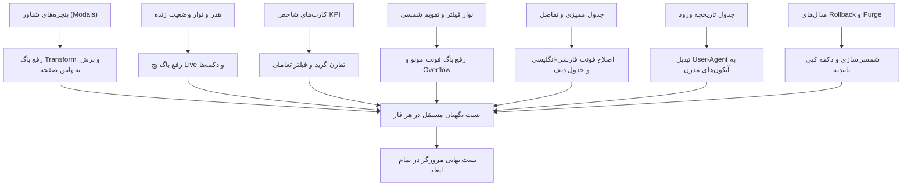

# طرح جامع و چندفازی بازطراحی و رفع کامل ایرادات ظاهری تب «رهگیری تغییرات» (Audit Trail & Security Logs)

این طرح بر اساس کاوش عمیق رابط کاربری و بررسی تک‌تک ایرادات ظاهری، به هم ریختگی‌های ریسپانسیو، باگ‌های پنجره‌های شناور (Modals) و مشکلات تایپوگرافی تدوین شده و به ۸ فاز مستقل، همراه با ارزیابی ایجنت نگهبان در پایان هر فاز تقسیم‌بندی گردیده است.

---

## ۱. مرور نیازمندی‌ها و معماری تغییرات

---

## ۲. تفکیک فازهای اجرایی طرح

| فاز | عنوان فاز | محدوده تغییرات | معیار تایید ایجنت نگهبان |
| :--- | :--- | :--- | :--- |
| **فاز ۱** | **رفع باگ ساختاری کانتینر و موقعیت پنجره‌های شناور** | `audit.html`, `audit.css` | باز شدن هر ۴ مدال دقیقاً در مرکز دید مانیتور بدون اسکرول صفحه به پایین |
| **فاز ۲** | **بازطراحی هدر، نشانگر Live WebSocket و انتخابگر انبار** | `audit.html`, `audit.ts` | عدم شکستگی بج زنده در عرض‌های کمتر از ۱۲۸۰px و چیدمان متوازن دکمه‌ها |
| **فاز ۳** | **بازطراحی کارت‌های آماری، تقارن گرید و قابلیت تعاملی** | `audit.html`, `audit.ts` | عدم تنهایی کارت پنجم در تبلت و فیلتر شدن آنی جدول با کلیک روی کارت‌ها |
| **فاز ۴** | **اصلاح نوار فیلترها، تقویم شمسی و حل باگ فونت مونو** | `audit.html`, `audit.css` | رفع حروف جداافتاده در اینپوت تاریخ و عدم سرریز پاپ‌آپ در موبایل |
| **فاز ۵** | **بهینه‌سازی جدول ممیزی و تفکیک متون فارسی و کدها** | `audit.html`, `audit.css` | نمایش روان متون فارسی و مونو بودن اختصاصی کدهای سیستمی |
| **فاز ۶** | **بازطراحی جدول ورود و تبدیل User-Agent به آیکون‌های مدرن** | `audit.html`, `audit.ts` | نمایش آیکون و نام تمیز مرورگر/سیستم‌عامل به جای متن خام WebKit |
| **فاز ۷** | **ارتقای مدال‌های تفاضل داده، بازگردانی و پاکسازی لاگ‌ها** | `audit.html`, `audit.ts` | تقویم شمسی در مدال‌ها، تراز گرید دیف و دکمه کپی متن تاییدیه |
| **فاز ۸** | **تست جامع مرورگر و تدوین گزارش نهایی نگهبان** | تست E2E با مرورگر | پاس شدن ۱۰۰٪ سناریوهای بصری در ابعاد دسکتاپ، تبلت و موبایل |

---

## ۳. جزئیات دقیق تغییرات در هر فاز

### فاز ۱: رفع باگ ساختاری کانتینر و موقعیت پنجره‌های شناور (Modals Viewport Fix)
* **مشکل:** به دلیل وجود `transform` در کلاس والد `.fade-in`، پوزیشن `fixed` مدال‌ها نسبت به ارتفاع کل سند (۳۰۰۰px) محاسبه شده و مدال‌ها در پایین صفحه خارج از دید کاربر رندر می‌شدند.
* **اقدام:**
  1. ایزوله‌سازی انیمیشن `.fade-in` فقط روی محتوای اصلی و انتقال مدال‌ها به خارج از کانتینر ترنسفورم‌دار / اصلاح استایل در `audit.css`.
  2. اضافه کردن هوشمند کلاس قفل اسکرول بدنه (`overflow-hidden`) هنگام باز بودن مدال‌ها جهت جلوگیری از اسکرول دوگانه.

### فاز ۲: بازطراحی هدر، نشانگر وضعیت زنده و دکمه‌های اکشن
* **مشکل:** شکستگی بج `زنده (Live WebSocket)` در دو خط، تداخل کلاس `-mr-3`، و فشردگی دکمه‌های هدر.
* **اقدام:**
  1. افزودن `whitespace-nowrap` و بازآرایی ساختار دایره سبز پالس‌زن با انیمیشن روان و بدون تداخل مارجین منفی.
  2. دسته‌بندی دکمه‌ها بر اساس اولویت بصری (Primary: اکسل، Purple: بازگردانی، Danger: پاکسازی) با گپ استاندارد و ریسپانسیو.
  3. حذف کادر استاتیک خاکستری در تب لاگین و نمایش هوشمند وضعیت سراسری در زیرعنوان هدر.

### فاز ۳: بازطراحی کارت‌های آماری، تقارن گرید و قابلیت تعاملی (Interactive KPI Cards)
* **مشکل:** تنها ماندن کارت پنجم در سطر سوم تبلت، نمایش نامناسب واحد حجم داده‌ها (`KB 368.0`) و غیرتعاملی بودن کارت‌ها.
* **اقدام:**
  1. تنظیم گرید تبلت با `sm:grid-cols-2 lg:grid-cols-5` و پوشش متقارن ستون‌ها.
  2. اصلاح تایپوگرافی حجم به صورت `۳۶۸.۰ کیلوبایت (KB)` یا نمایش هماهنگ با بقیه کارت‌ها.
  3. افزودن رویداد کلیک روی کارت‌ها جهت فیلتر سریع جدول (مثلاً کلیک روی کارت Critical فیلتر `selectedSeverity = 'critical'` را فعال کند و وضعیت انتخاب‌شده روی کارت هایلایت شود).

### فاز ۴: اصلاح نوار فیلترها، تقویم شمسی و حل باگ تایپوگرافی
* **مشکل:** حروف کشیده و مقطع در تقویم (`ا ن ت خ ا ب  ت ا ر ی خ`) به دلیل `font-mono`، بیرون‌زدگی پاپ‌آپ تقویم در موبایل و عدم تقارن ۱۲ ستونی در تب لاگین.
* **اقدام:**
  1. حذف کلاس `font-mono` از اینپوت متنی تقویم و استفاده از فونت استاندارد Vazirmatn برای پلیس‌هولدر و اعمال فونت مونو صرفاً هنگام درج ارقام تاریخ.
  2. اصلاح استایل‌های `::ng-deep .datepicker-outer-container` در `audit.css` با محدودیت `max-w-[calc(100vw-32px)]` برای موبایل.
  3. تنظیم توزیع ستون‌ها در تب لاگین به صورت `lg:col-span-4` (سرچ) + `lg:col-span-4` (وضعیت) + `lg:col-span-4` (تقویم) تا مجموع ۱۲ ستون کامل و متقارن پر شود.

### فاز ۵: بهینه‌سازی جدول ممیزی و تفکیک متون فارسی و کدها
* **مشکل:** حروف جداافتاده در ستون شرح رویداد به دلیل اعمال `font-mono` روی کل متن فارسی، ریز بودن بج‌های وضعیت (`text-[9px]`) و شلوغی ستون عملیات.
* **اقدام:**
  1. ساختاردهی مجدد به نمایش `target_repr`: متون فارسی با فونت استاندارد و فقط کد شناسه (مانند `MHA-FA-26224`) درون یک کپسول کد با `font-mono` نمایش داده شود.
  2. افزایش اندازه فونت بج‌های وضعیت به `text-[10px]` با پدینگ استاندارد `px-2.5 py-1`.
  3. زیباتر کردن دکمه‌های «تفاضل» و «بازگردانی» در ستون اکشن با استایل مینیمال و آیکون‌های واضح.

### فاز ۶: بازطراحی جدول ورود و تبدیل User-Agent به آیکون‌های مدرن
* **مشکل:** نمایش رشته خام و ناخوانای مرورگر (`...ebKit/537.36...`) در ستون مشخصات دستگاه.
* **اقدام:**
  1. افزودن متد پارسر سریع `parseUserAgent(ua: string)` در `audit.ts` جهت تشخیص مرورگرها (کروم، فایرفاکس، سافاری، اج) و سیستم‌عامل‌ها (ویندوز، اندروید، iOS، لینوکس، مک).
  2. نمایش دستگاه در قالب بج شکیل همراه با آیکون SVG سیستم‌عامل و نام تمیز مرورگر.
  3. کپسوله‌سازی خطاهای ورود در بج‌های هشدار رنگی همراه با آیکون مرتبط.

### فاز ۷: ارتقای مدال‌های تفاضل داده، بازگردانی و پاکسازی لاگ‌ها
* **مشکل:** تقویم میلادی مرورگر در مدال‌های Purge و Point-in-Time، عرض نامتعادل ستون‌ها در جدول دیف و عدم وجود دکمه کپی تاییدیه.
* **اقدام:**
  1. جایگزینی اینپوت‌های تاریخ میلادی در مدال‌ها با تقویم استاندارد شمسی سامانه.
  2. تنظیم عرض متوازن ستون‌های جدول دیف (`w-1/3` برای فیلد، قبل و بعد) و هایلایت بصری مناسب برای فیلدهای تغییریافته.
  3. اصلاح جهت فلش در توالی زمانی Point-in-Time به صورت خوانا.
  4. افزودن دکمه «کپی سریع» و دکمه «درج خودکار متن تایید» برای عبارت `PURGE_AUDIT_LOGS_CONFIRM` در مدال پاکسازی.

### فاز ۸: تست جامع E2E با مرورگر و تدوین گزارش عملکرد ایجنت نگهبان
* **اقدام:** اجرای بررسی عمیق مرورگر در ابعاد دسکتاپ (۱۹۲۰px)، تبلت (۱۰۲۴px و ۷۶۸px) و موبایل (۳۷۵px)، باز کردن تک‌تک مدال‌ها و تب‌ها و تهیه گزارش جامع از عملکرد ایجنت نگهبان.

---

## ۴. برنامه راستی‌آزمایی و ارزیابی (Verification Plan)

### ارزیابی ایجنت نگهبان مستقل در هر فاز
> [!IMPORTANT]
> در پایان هر فاز، فایل‌ها کامپایل شده و تغییرات همان فاز به صورت مستقل توسط ایجنت نگهبان بررسی می‌شود. در صورت مشاهده هرگونه رگرسیون، خطا یا عدم تحقق مشخصات، فاز مربوطه تکرار خواهد شد.

### تست‌های دستی و مرورگر
1. باز کردن صفحه `http://localhost:4200/audit`.
2. بررسی موقعیت باز شدن هر ۴ مدال در بالای صفحه بدون اسکرول.
3. بررسی نمایش صحیح فونت فارسی در تقویم و جدول ممیزی.
4. تست تعاملی بودن کارت‌های KPI با کلیک روی آنها.
5. بررسی تجزیه رشته User-Agent به آیکون‌های مدرن در تب تاریخچه ورود.
6. بررسی ریسپانسیو در رزولوشن‌های مختلف.

