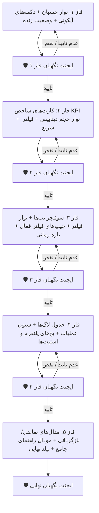

# 📋 طرح جامع فازبندی‌شده: مدرن‌سازی ظاهری تب رهگیری تغییرات (Audit Log) و انطباق با استاندارد گزارش‌ساز

این طرح با هدف ارتقای تجربه کاربری (UX) و همسان‌سازی کامل ساختار بصری، دکمه‌های اکشن، هدر چسبان، کارت‌های شاخص، فیلترها و مدال‌های تب **رهگیری تغییرات (Audit Trail & Login History)** با زبان طراحی مدرن پیاده‌سازی‌شده در **گزارش‌ساز پویا** تدوین شده است.

---

## 🎯 اهداف کلیدی طرح

1. **نوار ابزار چسبان شیشه‌ای (Sticky Action Bar):** پین شدن نوار هدر در بالای صفحه با افکت بلور (`sticky top-0 z-30 bg-white/95 backdrop-blur-md`) به همراه دکمه‌های اکشن مربعی استاندارد.
2. **استانداردسازی دکمه‌های مربعی اکشن (Square Icon Buttons):** تبدیل دکمه‌های متنی نامتقارن به دکمه‌های آیکونی مربعی با پالت رنگی هماهنگ سازمانی (`btn-icon-square` در رنگ‌های نیلی، زمردی، بنفش، رزی و ارغوانی) با انیمیشن چرخش و تولتیپ کامل.
3. **کارت‌های شاخص عملکرد و حجم داده‌ها (KPI & Storage):** بهبود تایپوگرافی مونو، نوار باریک گرادیانی حجم دیتابیس و نمایش رینگ هایلایت فعال هنگام کلیک برای فیلتر سریع.
4. **سوئیچر تب‌ها و نوار فیلترهای پیشرفته:** سوئیچ فشرده کپسولی (Segmented Control)، منوهای کشویی سفارشی، چیپ‌های فیلتر فعال (Active Filter Chips) با قابلیت حذف تکی، و دکمه‌های فیلتر سریع بازه زمانی.
5. **ارتقای جدول لاگ‌ها و نمایش وضعیت‌ها:** هدر نیمه‌چسبان، دکمه‌های آیکونیک عملیات تفاضل و بازگردانی، بج‌های گرافیکی سیستم‌عامل/مرورگر در تاریخچه ورود و استیت‌های اسکلتون مدرن.
6. **نوسازی مدال‌های تفاضل، بازگردانی و ایجاد مودال راهنمای جامع ممیزی:** سربرگ‌های گرادیانی، خط‌کشی تفکیک‌شده Before/After در مقایسه کلمه به کلمه، و پنجره اختصاصی راهنمای جامع رهگیری و امنیت.
7. **استقرار ایجنت نگهبان مستقل (Guard Agent) در پایان هر فاز:** ارزیابی مستقل تغییرات هر فاز توسط ایجنت در مرورگر و تکرار فاز در صورت عدم تایید.

---

## 🗺️ ساختار فازهای ۵ گانه و گیت‌های ایجنت نگهبان

---

## 📝 شرح تفصیلی فازهای اجرایی

### 🔹 فاز ۱: نوار چسبان شیشه‌ای (Sticky Header)، دکمه‌های آیکونی و وضعیت زنده
* تبدیل هدر اصلی به `sticky top-0 z-30 bg-white/95 backdrop-blur-md border-b border-slate-200/80 -mx-4 -mt-4 px-4 py-3 shadow-xs`.
* افزودن دکمه‌های آیکونی مربعی استاندارد:
  - **بروزرسانی بلادرنگ:** `btn-icon-square btn-icon-indigo`
  - **خروجی فایل اکسل:** `btn-icon-square btn-icon-emerald`
  - **بازگردانی به تاریخ مشخص (PIT Rollback):** `btn-icon-square btn-icon-purple`
  - **پاکسازی دوره‌ای لاگ‌ها (Purge):** `btn-icon-square btn-icon-rose`
  - **راهنمای جامع رهگیری تغییرات:** `btn-icon-square btn-icon-purple`
* زیباسازی کپسول پالس زنده وب‌سوکت (`Live WebSocket`)، انتخابگر انبار و نشانگر شبکه آفلاین.
* 🛡️ **ایجنت نگهبان فاز ۱:** بازرسی مرورگر، اسکرول صفحه جهت اطمینان از ثبات نوار چسبان، بررسی کلیک‌پذیری و لودینگ دکمه‌ها و عدم تداخل بصری.

---

### 🔹 فاز ۲: بازطراحی کارت‌های شاخص عملکرد و نوار پیشرفت حجم پایگاه داده (KPI & Storage Cards)
* هماهنگ‌سازی فاصله‌ها، حاشیه‌ها و فونت مونو ارقام (`font-mono text-xl font-black`).
* برجسته‌سازی تعاملی کارت‌ها با رینگ رنگی فعال (`ring-2 ring-indigo-500` / `ring-rose-500` / `ring-amber-500` / `ring-emerald-500`) هنگام کلیک برای فیلتر سریع سطرها.
* بازطراحی نوار پیشرفت اشغال دیتابیس توسط لاگ‌های ممیزی و نشست‌ها با افکت گرادیان بنفش مدرن.
* 🛡️ **ایجنت نگهبان فاز ۲:** بررسی هماهنگی کارت‌ها در تب‌های ممیزی و ورود، تست کلیک و فیلتر سریع بر اساس سطح اهمیت یا وضعیت ورود.

---

### 🔹 فاز ۳: نوسازی نوار فیلترها، سوئیچر تب‌ها و چیپ‌های فیلتر فعال
* طراحی مدرن سوئیچر تب‌های ممیزی داده و لاگین به صورت Segmented Control شیک همراه با بج تعداد کل رکوردها.
* استانداردسازی فیلدهای ورودی جستجو و منوهای کشویی با کلاس `custom-select` و ارتفاع فشرده.
* پیاده‌سازی **نوار چیپ‌های فیلتر فعال (Active Filter Chips)** زیر فیلترها با قابلیت نمایش تمام فیلترهای فعال و دکمه حذف تکی هر فیلتر.
* بهبود باکس تقویم شمسی به همراه دکمه‌های میانبر بازه زمانی سریع (امروز، ۲۴ ساعت اخیر، ۷ روز اخیر، ۳۰ روز اخیر) و دکمه پاکسازی یکپارچه.
* 🛡️ **ایجنت نگهبان فاز ۳:** تست سوئیچ بین تب‌ها، فیلتر ترکیبی، عملکرد چیپ‌ها در حذف فیلتر و واکنش‌گرایی در نمایشگرهای مختلف.

---

### 🔹 فاز ۴: بهینه‌سازی جدول لاگ‌ها، ستون عملیات و بج‌های پلتفرم و سیستم‌عامل
* ارتقای هدر جدول به حالت چسبان و خاکستری روشن با خطوط مرزی دقیق.
* استفاده از تایپوگرافی مونو برای تاریخ/ساعت، آی‌پی، و شناسه‌های هدف.
* بازطراحی ستون عملیات در جدول ممیزی با دکمه‌های آیکونیک شیک و فشرده برای «تفاضل» و «بازگردانی».
* طراحی بج‌های اختصاصی برای مرورگر (Chrome, Firefox, Safari, Edge) و سیستم‌عامل (Windows, Android, iOS, Linux) در تب ورود.
* نوسازی استیت‌های اسکلتون بارگذاری (Skeleton Loading)، حالت خطا با دکمه بازتلاش، و حالت جدول خالی (Empty State).
* 🛡️ **ایجنت نگهبان فاز ۴:** بررسی جدول در هر دو تب، عملکرد دکمه‌های سطرها، خوانایی فونت‌ها و ظاهر استیت‌ها در مرورگر.

---

### 🔹 فاز ۵: نوسازی مدال‌های تفاضل و بازگردانی + مودال راهنمای جامع رهگیری + بیلد نهایی
* ارتقای هدر تمام مدال‌ها (Diff Viewer، Revert Preview، Purge Modal و PIT Rollback Modal) به استایل گرادیانی با دکمه بستن دایره‌ای مدرن و افکت محو شیشه‌ای.
* بهبود جدول مقایسه کلمه به کلمه (Word Diff Grid) با پس‌زمینه‌های قرمز و سبز تمایزیافته و فونت مونو برای نمایش تغییرات داده‌ها.
* طراحی و افزودن پنجره اختصاصی «راهنمای جامع مرکز رهگیری و امنیت» شامل آموزش انواع سطوح اهمیت، نحوه بازگردانی داده‌ها (Rollback)، سناریوهای تداخل و امنیت نشست‌ها.
* اجرای `npm run build` فرانت‌اند و بررسی صفر بودن هرگونه خطای کامپایل یا هشدار لایوت.
* 🛡️ **ایجنت نگهبان نهایی:** تست فراگیر سناریوها در مرورگر، باز و بسته شدن تمامی مدال‌ها، تایید کارکرد بدون نقص و ارائه گزارش جامع نگهبان.

---

## 📁 پرونده‌های تحت تغییر

1. [audit.html](file:///e:/warehouse%20project/warehouse-front/src/app/components/audit/audit.html) (نوار چسبان، دکمه‌های مربعی اکشن، کارت‌ها، چیپ‌های فیلتر، جدول‌ها، مدال‌ها و مودال راهنما)
2. [audit.ts](file:///e:/warehouse%20project/warehouse-front/src/app/components/audit/audit.ts) (کنترل فیلترهای سریع، چیپ‌های فیلتر، متدهای بازه زمانی سریع و مدیریت مودال راهنما)
3. [audit.css](file:///e:/warehouse%20project/warehouse-front/src/app/components/audit/audit.css) (استایل‌های تکمیلی هدر، چیپ‌ها، ترنزیشن‌ها و دیف ویوور)

---

## 🛡️ پروتکل ایجنت نگهبان (Guardian Agent Protocol)

در پایان هر فاز:
1. یک ایجنت بررسی‌کننده مستقل با ابزار `browser_subagent` یا بازرسی کد فراخوانی می‌شود.
2. ایجنت وظیفه دارد صحت عملکرد را بررسی کرده و تایید کند که هیچ عملکرد قبلی دچار رگرسیون (Regression) یا تغییر ناخواسته نشده است.
3. در صورت **تایید**: گام بعدی فاز بعدی آغاز می‌شود.
4. در صورت **رد یا بروز خطا**: تغییرات آن فاز بررسی، اصلاح و مجدداً توسط نگهبان اعتبارسنجی خواهد شد.
5. در انتهای کار، گزارشی جامع از عملکرد ایجنت‌های نگهبان به کاربر ارائه خواهد شد.

---

## 🔍 برنامه اعتبارسنجی (Verification Plan)

### تست‌های خودکار و سیستمی
- اجرای دستور `npm run build` در پوشه `warehouse-front` برای تضمین عدم وجود خطای تایپ‌اسکریپت و کامپایل قالب‌های HTML.

### تست‌های مرورگر و بصری (با استفاده از ابزار مرورگر)
- بررسی عملکرد نوار چسبان هدر در حالت اسکرول روی صفحه `http://localhost:4200/audit`.
- تست کلیک روی تک‌تک دکمه‌های اکشن، فیلترهای سریع، چیپ‌های فیلتر فعال، و سوئیچ تب‌ها.
- تست باز شدن مدال‌های تفاضل داده، پیش‌نمایش بازگردانی و مدال راهنمای جامع.

