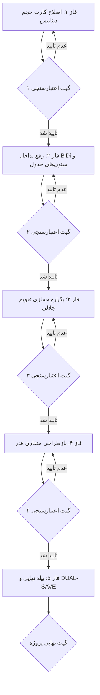

<div dir="rtl" align="right">

# طرح ارتقایافته اصلاح و رفع ۶ ایراد بصری کارتابل ممیزی و رهگیری
## (Enhanced Audit Trail UI & Visual Defects Remediation Plan)

> **نسخه:** ۲.۰ (ارتقایافته بر اساس بازبینی جامع و افزودن پروتکل اعتبارسنجی مستقل گیت‌ها)  
> **رویکرد اجرایی:** فازبندی ۵ گانه به همراه گیت‌های تایید مستقل توسط ایجنت ناظر قبل از ورود به هر فاز بعدی.

---

## ۱. ماتریس تحلیل و ریشه‌یابی ۶ ایراد شناسایی‌شده (Defect Root-Cause Matrix)

| ردیف | شرح ایراد در تصویر | ریشه‌یابی فنی (Root Cause) | جزئیات راهکار اصلاحی |
| :---: | :--- | :--- | :--- |
| **۱** | **بک‌گراند نامتعارف عنوان کارت حجم** | استفاده از کلاس‌های رنگی تیره `text-purple-900/80` و پس‌زمینه گرادینت که جلوه Highlight ناخواسته به متن داده است. | اصلاح تگ عنوان به `<p class="text-[11px] font-bold text-slate-500">حجم ذخیره‌سازی لاگ‌ها</p>` دقیقاً مشابه ۴ کارت دیگر. |
| **۲** | **نمایش خط تیره «-» در مقدار حجم** | عدم تعریف مقدار پیش‌فرض `storage` در آبجکت اولیه `auditStats` یا تاخیر در دریافت اطلاعات از سرور. | مقداردهی اولیه `storage` با مقادیر امن `۰ KB` و اتصال متغیرهای فرمت‌شده به صورت پویا در چرخه لود. |
| **۳** | **بهم‌ریختگی پرانتزها و کدهای کالا در شرح تارگت** | تداخل الگوریتم دوجهته متن (BiDi Algorithm) در متون ترکیبی فارسی و کدهای انگلیسی نظیر `MHA-FA-26178` و `INITIAL_COUNT`. | محصورسازی متن تارگت در تگ `<bdi class="text-[10px] text-slate-500 mt-0.5 font-mono block text-right" dir="auto">` و ایزولاسیون کامل پرانتزها. |
| **۴** | **شکست واژه «کور» در ستون ماژول** | کم بودن عرض ستون و نبود ویژگی جلوگیری از شکست خط (`whitespace-nowrap`) در برچسب‌های ماژول. | افزودن `whitespace-nowrap` به کلاس بج‌های ماژول و افزایش عرض ستون به `w-36` جهت نمایش یک‌خطی «میزکار شمارش کور». |
| **۵** | **چیدمان دوخطی نامتقارن ابزارهای هدر** | قرارگیری ابزارهای متعدد در یک فلکس بدون دسته‌بندی ستونی و ردیفی مشخص. | تفکیک کنترل‌ها به دو لایه مرتب: ۱. ردیف سوئیچر تب‌ها و انتخابگر انبار ۲. ردیف دکمه‌های عملیاتی (پاکسازی، بازگردانی، اکسل) با ارتفاع و پدینگ یکدست. |
| **۶** | **فرمت تقویم خام انگلیسی (`dd----yyyy`) در فیلترها** | استفاده از تگ `<input type="date">` خام مرورگر که با تقویم شمسی سامانه ناهمخوان است. | یکپارچه‌سازی ماژول تقویم شمسی `NgPersianDatepickerModule` جهت انتخاب مستقیم تاریخ‌های جلالی با خروجی ISO استاندارد. |

---

## ۲. فازبندی تفصیلی و پروتکل اعتبارسنجی دو ایجنتی (Phased Execution Protocol)



---

### 🔹 فاز ۱: اصلاح کارت شاخص حجم و همسان‌سازی کامل بصری (Storage KPI Card Overhaul)
- **اقدامات:**
  1. اصلاح تمپلیت کارت پنجم در `audit.html` (حذف پس‌زمینه تیره عنوان، همسان‌سازی فونت و پدینگ با ۴ کارت دیگر).
  2. اصلاح آبجکت `auditStats` در `audit.ts` با تعریف مقدار اولیه `storage` جهت جلوگیری از رندرینگ خط تیره «-».
  3. همگام‌سازی نمایش حجم در هر دو تب «ممیزی» و «نشست‌ها».
- **پروتکل گیت اعتبارسنجی ۱ (Gate 1 Verification):**
  - اجرای اسکریپت تست خودکار جهت استعلام صحت پاسخ API و استخراج صحیح حجم فیزیکی.
  - بررسی ساختار DOM کارت و تایید یکسان بودن رنگ متن عنوان با ۴ کارت دیگر.
  - *شرط عبور:* مقدار حجم به صورت رشته معتبر (مانند `۳۶۰ KB`) رندر شود و عنوان فاقد هایلایت تیره باشد.

---

### 🔹 فاز ۲: رفع باگ BiDi متون دوزبانه و تنظیم ستون‌های جدول (Table Layout & BiDi Text Isolation)
- **اقدامات:**
  1. اعمال تگ `<bdi dir="auto">` روی مقدار `log.target_repr` در `audit.html` جهت ایزوله‌سازی کاراکترهای انگلیسی و پرانتزها.
  2. اضافه کردن کلاس `whitespace-nowrap` به بج‌های ستون ماژول و تنظیم حداقل عرض ستون به `w-36`.
  3. تنظیم تراز و موقعیت ستون «عملیات و بازگردانی» جهت حفظ تقارن در ردیف‌های تک‌دکمه‌ای و دودکمه‌ای.
- **پروتکل گیت اعتبارسنجی ۲ (Gate 2 Verification):**
  - تست رندرینگ متن ترکیبی `شمارش کالا MHA-FA-26178 (تغییر وضعیت به INITIAL_COUNT)` و تایید موقعیت صحیح پرانتزها و کدها.
  - بررسی رندرینگ عبارت «میزکار شمارش کور» و تایید عدم شکستگی متن در دو خط.

---

### 🔹 فاز ۳: یکپارچه‌سازی تقویم شمسی جلالی در نوار فیلترها (Persian DatePicker Integration)
- **اقدامات:**
  1. ایمپورت `NgPersianDatepickerModule` در `audit.ts`.
  2. جایگزینی ورودی‌های `input type="date"` در `audit.html` با کامپوننت `<ng-persian-datepicker>` یا تقویم جلالی با فرمت فارسی استاندارد.
  3. اتصال ایونت‌های `dateOnSelect` به توابع فیلترینگ و تبدیل خودکار به ISO میلادی جهت ارسال به بک‌اند.
- **پروتکل گیت اعتبارسنجی ۳ (Gate 3 Verification):**
  - تست انتخاب تاریخ جلالی و اعتبارسنجی ارسال صحیح پارامترهای `from_date` و `to_date` به API.
  - تایید حذف کامل متن انگلیسی `dd----yyyy` و جایگزینی با تاریخ شمسی.

---

### 🔹 فاز ۴: بازطراحی متقارن هدر و ابزارهای مدیریتی (Header Controls Symmetry & Layout)
- **اقدامات:**
  1. ساختاربندی هدر در دو ردیف متمایز با Flexbox استاندارد:
     - ردیف اول: عنوان صفحه، بج انبار فعال، نشانگر وب‌سوکت و سوئیچر تب‌ها.
     - ردیف دوم: سلکتور انبار و دکمه‌های ۳ گانه مدیریتی («پاکسازی لاگ‌ها»، «بازگردانی به تاریخ»، «خروجی اکسل»).
  2. تنظیم ارتفاع یکنواخت (`h-9` یا `py-2`)، فونت و آیکون‌های متقارن برای تمام دکمه‌ها.
- **پروتکل گیت اعتبارسنجی ۴ (Gate 4 Verification):**
  - ارزیابی ریسپانسیو هدر در نمایشگرهای مختلف و اطمینان از عدم شکستگی نامتعارف دکمه‌ها.

---

### 🔹 فاز ۵: بیلد جامع، اعتبارسنجی نهایی و DUAL-SAVE (End-to-End Build & Sign-off)
- **اقدامات:**
  1. اجرای بیلد کامل Angular فرانت‌اند (`npm run build`).
  2. ایجاد مستند `walkthrough_audit_ui_fixes.md` در پوشه `Documents/Audit_UI_Fixes/` و `walkthrough.md`.
  3. به‌روزرسانی مستر لاگ پروژه در `Documents/Master_Log.md`.
- **پروتکل گیت نهایی (Gate 5 Final Sign-off):**
  - تایید کد خروجی ۰ در بیلد و صفر بودن تمام هشدارهای کامپایلر.
  - تایید رفع کامل تمامی ۶ مورد ایراد مطرح‌شده در درخواست کاربر.

---

## ۳. تغییرات فایل‌ها (File Changes Summary)

```
warehouse-front/
├── src/app/components/audit/
│   ├── audit.ts    [MODIFY] - مقداردهی اولیه storage، ایمپورت تقویم جلالی و متدهای هندلر
│   └── audit.html  [MODIFY] - اصلاح استایل کارت حجم، تگ bdi، تقویم جلالی و چیدمان هدر
Documents/
├── Audit_UI_Fixes/
│   ├── implementation_plan_audit_ui_fixes.md [NEW/UPDATE]
│   ├── task_audit_ui_fixes.md                [NEW/UPDATE]
│   └── walkthrough_audit_ui_fixes.md         [NEW/POST-EXEC]
└── Master_Log.md                             [UPDATE]
```

> [!IMPORTANT]
> طبق ضوابط سیستم، اجرای هر فاز تنها پس از تایید مستقل گیت فاز قبلی انجام خواهد شد. در صورت تایید این طرح ارتقایافته، لطفاً دستور شروع را صادر فرمایید.

</div>
