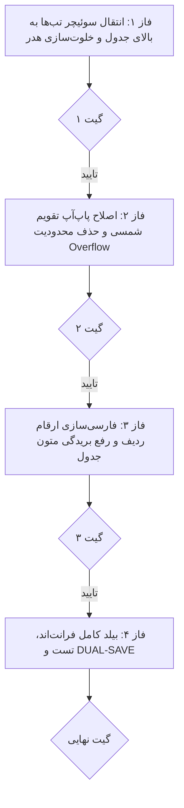

# طرح اجرایی ارتقای چیدمان و رفع ایرادات جدید کارتابل ممیزی (v3.0)
## (Audit Trail Enhanced Layout & DatePicker Pop-up Fix)

بر اساس بازخورد مصاحبه و بررسی دقیق آخرین تصویر:

---

## ۱. تحلیل و تصمیمات نهایی (Design Decisions)

| ردیف | ایراد / تغییر درخواستی | تصمیم و راهکار اجرایی |
| :---: | :--- | :--- |
| **۱** | **چیدمان دکمه‌ها و هدر (مورد ۴ کاربر)** | **سوئیچر تب‌ها («تغییرات داده‌ها» و «تاریخچه ورود») به بالای جدول منتقل می‌شود**، و ۳ دکمه مدیریتی («پاکسازی لاگ‌ها»، «بازگردانی به تاریخ»، «خروجی اکسل») به همراه انتخابگر انبار در هدر بالا باقی می‌مانند. |
| **۲** | **فشردگی و کات شدن پاپ‌آپ تقویم شمسی** | حذف `overflow-hidden` از کانتینر فیلتر تاریخ و اعمال کلاس‌های `z-50` و استایل استاندارد بر روی دراپ‌داون تقویم جلالی تا به صورت شناور و کامل با فونت فارسی باز شود. |
| **۳** | **ارقام انگلیسی در ستون ردیف جدول** | تبدیل شماره ردیف‌های انگلیسی (`1, 2, 3, 4`) به ارقام فارسی با استفاده از لوله `number` یا تبدیل رشته‌ای فارسی. |
| **۴** | **بریدگی متن در ستون شرح رویداد** | تنظیم پدینگ عمودی ردیف‌های جدول و افزایش کنتراست متن‌های تکمیلی (`text-slate-600 font-medium`) جهت خوانایی کامل تمامی خطوط و جزئیات ردیف ۴. |
| **۵** | **اتصال پایدار کارت حجم دیتابیس** | اطمینان از بارگذاری مقدار واقعی حجم در لحظه تغییر انبار و مقداردهی مستقیم به صورت فرمت‌شده (`۳۶۰ KB`). |

---

## ۲. فازبندی اجرایی و گیت‌های اعتبارسنجی (Phased Decomposition)

---

### فاز ۱: انتقال سوئیچر تب‌ها به بالای جدول و بازطراحی هدر
- انتقال کانتینر دکمه‌های دو تبه به بالای کارت فیلترها/جدول.
- چیدمان مرتب دکمه‌های «پاکسازی لاگ‌ها»، «بازگردانی به تاریخ»، «خروجی اکسل» و انتخابگر انبار در سمت چپ هدر.

### فاز ۲: اصلاح پاپ‌آپ تقویم شمسی
- حذف محدودیت `overflow-hidden` از کادر انتخابگر تاریخ.
- تنظیم موقعیت‌دهی دراپ‌داون تقویم به صورت شناور (`relative z-30`).

### فاز ۳: ارقام فارسی ردیف و بهبود کنتراست متون جدول
- اصلاح فرمول شماره ردیف با `| number` جهت رندر ارقام فارسی (`۱، ۲، ۳، ۴`).
- تنظیم استایل و عدم بریدگی متن‌های تارگت و نقش‌ها در جدول.

### فاز ۴: بیلد فرانت‌اند و DUAL-SAVE
- اجرای `npm run build` و دریافت کد ۰.
- ثبت مستندات در `Documents/Audit_UI_Fixes_V2/` و مستر لاگ.

---

> [!IMPORTANT]
> طبق قوانین حاکم بر پروژه، هیچ تغییری تا زمان ارسال دستور صریح تایید (مانند «تایید» یا «شروع») انجام نخواهد شد.

