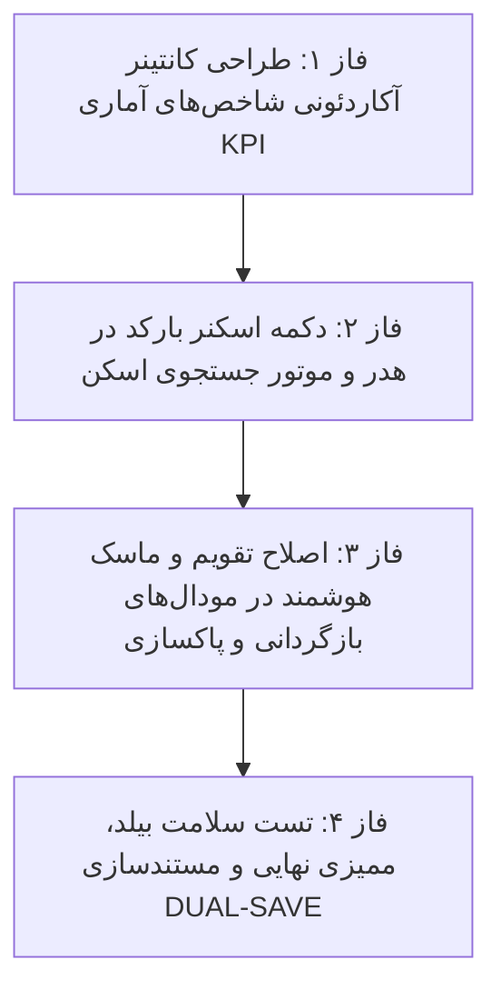

# 📋 طرح پیشنهادی: هدر آکاردئونی آمار، اسکنر بارکد در هدر، و اصلاح تقویم شمسی در بازگردانی (Audit Accordion & Scanner Plan)

این طرح بر اساس مصاحبه و نیازمندی‌های مطرح‌شده، با هدف یکپارچه‌سازی دکمه جمع‌شدن آمار روی خود باکس شاخص‌ها (ساختار آکاردئونی)، تعبیه دکمه اسکنر بارکد در هدر بالای صفحه با فیلتر خودکار جستجو، و تصحیح ورود تاریخ شمسی در مودال‌های بازگردانی به نقطه زمانی (Point-in-Time Rollback) و پاکسازی دوره‌ای لاگ‌ها تدوین شده است.

---

## 📌 اهداف اصلی طرح (Core Objectives)

1. **طراحی کانتینر آکاردئونی شاخص‌های آماری (KPI Accordion Container):**
   - تعبیه یک هدر باریک و شیک در بالای ۵ باکس آماری شامل تیتر «شاخص‌های آماری و حجم داده‌ها»، بج تعداد خلاصه، و آیکون فلش تاشو (Chevron).
   - امکان جمع شدن و باز شدن ۵ کارت با انیکاس روان با کلیک روی هدر یا آیکون فلش.
   - حذف دکمه قبلی از درون نوار فیلتر و تمرکز کنترل کاملاً روی خود کانتینر آمار.

2. **تعبیه دکمه اسکنر بارکد در هدر چسبان و فیلتر آنی (Header Barcode Scanner):**
   - افزودن دکمه آیکونی مربعی اسکنر (`btn-icon-square btn-icon-indigo`) در هدر چسبان بالای صفحه کنار سایر ابزارها.
   - فعال‌سازی شنونده اسکنرهای سخت‌فزاری/بارکدخوان تفنگی در پس‌زمینه (`app-barcode-scanner`).
   - قابلیت باز کردن اسکنر دوربینی هنگام کلیک روی دکمه اسکنر.
   - پس از اسکن موفق، کد اسکن‌شده بلافاصله در کادر جستجو (`searchTerm`) قرار گرفته، در URL همگام شده و جدول لاگ‌ها به صورت بلادرنگ فیلتر می‌شود.

3. **ارتقای تقویم و ماسک هوشمند تاریخ در مودال بازگردانی و پاکسازی:**
   - تجهیز مودال «بازگردانی زنجیره‌ای تغییرات به تاریخ مشخص (Point-in-Time Rollback)» به ماسک هوشمند ۸ رقمی (`14050531` ➔ `1405/05/31`) و انتخابگر تقویم شمسی هماهنگ.
   - تجهیز فیلدهای بازه تاریخی مودال «پاکسازی لاگ‌های قدیمی (Purge Modal)» به ماسک ورودی هوشمند و تبدیل دقیق شمسی به میلادی.

4. **ارزیابی در پایان هر فاز با ایجنت نگهبان اختصاصی:** اعتبارسنجی مستقل صحت کد، عدم شکست استایل و بیلد سریع فرانت‌اند.

---

## 🗂️ فازبندی اجرایی طرح (Phased Roadmap)

---

## 🔹 جزئیات فازهای چهارگانه

### 🔹 فاز ۱: ساختار آکاردئونی ۵ باکس آمار (KPI Accordion Grid)
- ساخت کانتینر دربرگیرنده کارت‌های آمار در تب‌های `audit` و `login` با هدر اختصاصی:
  - تیتر: `شاخص‌های آماری و وضعیت حجم پایگاه‌داده`
  - بج اطلاعاتی خلاصه (نمایش مجموع کل رویدادها حتی در حالت بسته بودن آمار)
  - آیکون تاشو `svg chevron` با چرخش نرم ۱۸۰ درجه
- حذف دکمه متفرقه قبلی از نوار فیلترها.
- **🛡️ ایجنت نگهبان فاز ۱:** ممیزی عملکرد باز/بسته شدن آکاردئون، حفظ واکنش‌گرایی در موبایل و دسکتاپ.

---

### 🔹 فاز ۲: دکمه اسکنر بارکد در هدر بالای صفحه و اتصال به جستجو
- افزودن دکمه آیکونی مربعی اسکنر با آیکون بارکد به نوار اکشن هدر بالای صفحه (`audit.html`).
- ایمپورت `BarcodeScannerComponent` در `audit.ts`.
- پیاده‌سازی متد `onBarcodeScanned(code: string)` و `openScannerModal()`:
  - پالایش و نرمال‌سازی کد بارکد اسکن‌شده.
  - درج در `this.searchTerm` و همگام‌سازی با URL.
  - نمایش پیام Toast موفقیت‌آمیز و اعمال فیلتر فوری لاگ‌ها.
- **🛡️ ایجنت نگهبان فاز ۲:** تست عملکرد دکمه اسکنر، دریافت بارکد، ثبت در فیلد جستجو و فیلتر صحیح جدول.

---

### 🔹 فاز ۳: ارتقای تقویم و ماسک هوشمند در مودال‌های بازگردانی و پاکسازی
- **مودال Point-in-Time Rollback:**
  - ارتقای فیلد `pitTargetDate` به همراه ماسک هوشمند تایپ ۸ رقمی (`14050531` ➔ `1405/05/31`) و تقویم شمسی.
  - اعتبارسنجی تاریخ و ترکیب با فیلد ساعت (`pitTargetTime`) جهت ارسال تاریخ دقیق ISO به سرور.
- **مودال Purge Logs:**
  - ارتقای فیلدهای `purgeFromDate` و `purgeToDate` با ماسک هوشمند و تقویم شمسی یکپارچه.
- **🛡️ ایجنت نگهبان فاز ۳:** اعتبارسنجی فرمت ورودی دستی، صحت تبدیل به تاریخ میلادی و عدم خطا در پیش‌نمایش بازگردانی.

---

### 🔹 فاز ۴: بیلد نهایی پروژه، اعتبارسنجی و مستندسازی DUAL-SAVE
- اجرای `npm run build` در فرانت‌اند و اطمینان از خروج با کد ۰ بدون خطا.
- به‌روزرسانی لاگ مستر پروژه در `Documents/Master_Log.md`.
- تولید گزارش کامل واک‌ترو در `Documents/Audit_UX_Refinements/walkthrough_audit_accordion_scanner_rollback.md`.
- **🛡️ ایجنت نگهبان فاز ۴:** بررسی نهایی تمامی قابلیت‌ها و گزارش عملکرد.

---

## 📁 پرونده‌های تحت تاثیر (Modified Files)
- `warehouse-front/src/app/components/audit/audit.html` (طراحی آکاردئون آمار، دکمه اسکنر هدر، اصلاح تقویم مودال‌ها)
- `warehouse-front/src/app/components/audit/audit.ts` (مدیریت اسکنر، هندلینگ تاریخ در مودال‌ها، مدیریت آکاردئون)
- `Documents/Audit_UX_Refinements/` (اسناد DUAL-SAVE)
- `Documents/Master_Log.md` (لاگ مستر پروژه)

---

## ⚠️ نیازمند تایید کاربر (User Review Required)
> [!IMPORTANT]
> با توجه به قانون اجباری عدم اجرای خودکار، خواهشمند است در صورت تایید این طرح، عبارت **«تایید»** یا **«شروع»** را ارسال فرمایید تا پیاده‌سازی گام‌به‌گام آغاز گردد.

