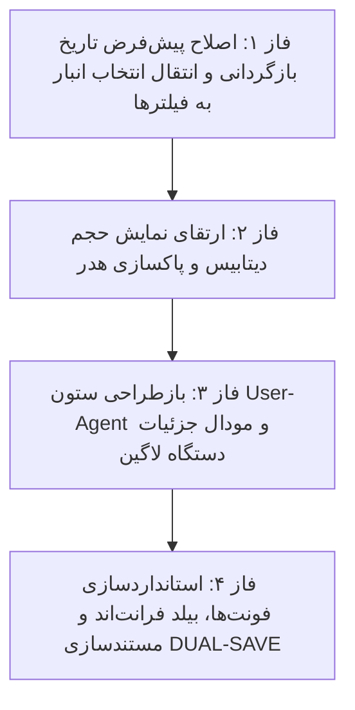

# 📋 طرح پیشنهادی: اصلاح تاریخ بازگردانی، انتقال انتخاب انبار، جزئیات نشست لاگین و بهینه‌سازی حجم دیتابیس (Audit Refinements v2 Plan)

این طرح بر اساس نیازمندی‌ها و مصاحبه صورت‌گرفته، با هدف رفع اشکال تاریخ پیش‌فرض در بازگردانی، انتقال انتخابگر انبار به کنار کادر جستجو، حذف نشانگرهای مازاد هدر، نمایش واضح و کامل حجم پایگاه‌داده، ایجاد مودال اختصاصی مشخصات دستگاه/نشست لاگین و استانداردسازی تایپوگرافی تدوین شده است.

---

## 📌 اهداف اصلی طرح (Key Objectives)

1. **اصلاح ریشه‌ای پیش‌فرض تاریخ در مودال بازگردانی (Fix Default Rollback Date):**
   - جایگزینی الگوریتم فرمت‌دهی اولیه تاریخ به فرمت استاندارد عددی شمسی `YYYY/MM/DD` (مثلاً `1405/05/31`) با استفاده از مبدل ریاضی دقیق، تا مشکل نمایش `1283/08/20` در کامپوننت تقویم به طور کامل رفع شود.

2. **پاکسازی کامل هدر چسبان و حذف «لاگین‌های سراسری سامانه»:**
   - حذف کامل کادر متنی «لاگین‌های سراسری سامانه» از هدر بالای صفحه در تب ورود.
   - پاکسازی کامل هدر و اختصاص آن فقط به عنوان ماژول و دکمه‌های اکشن سریع.

3. **انتقال انتخابگر انبار به ردیف فیلترها کنار کادر جستجو:**
   - جابجایی کامپوننت `<app-warehouse-selector>` از هدر چسبان بالا به ابتدای ردیف فیلترها در کنار کادر جستجوی متنی (`searchTerm`).
   - تنظیم گرید منعطف برای واکنش‌گرایی در موبایل، تبلت و دسکتاپ.

4. **نمایش شفاف و گویای حجم پایگاه‌داده و لاگ‌ها (Clear Database Volume KPI):**
   - بازطراحی کارت پنجم شاخص عملکرد: نمایش صریح حجم لاگ‌های ممیزی (`audit_formatted`)، حجم کل دیتابیس (`db_total_formatted`)، درصد اشغال و نوار تفکیک‌شده به همراه زیرعنوان‌های خوانا.

5. **طراحی مودال جامع مشخصات دستگاه و نشست لاگین (Device & Session Details Modal):**
   - تفکیک و نمایش شیک بج‌های سیستم‌عامل، مرورگر و نوع دیوایس در ستون مشخصات جدول لاگین.
   - ایجاد مودال اختصاصی با کلیک روی ردیف یا آیکون جزئیات، شامل: تفکیک سیستم‌عامل/مرورگر، آدرس IP، زمان دقیق شمسی/میلادی، متن کامل و خام User-Agent به همراه دکمه کپی فوری (Copy to Clipboard)، وضعیت ورود و علت خطا.

6. **یکپارچه‌سازی و استانداردسازی فونت‌ها و تایپوگرافی (Font Harmony):**
   - هماهنگ‌سازی فونت‌ها، وزن‌ها و اندازه‌های قلم در تمام بخش‌های جدول ممیزی، کارت‌ها، بج‌ها و پاپ‌آپ‌ها با استانداردهای پروژه.

---

## 🗂️ فازبندی اجرایی طرح (Phased Roadmap)

---

## 🔹 جزئیات فازهای چهارگانه

### 🔹 فاز ۱: اصلاح تاریخ پیش‌فرض بازگردانی و جابجایی انتخابگر انبار
- پیاده‌سازی متد `formatDateToShamsiString(date: Date)` با الگوریتم دقیق ریاضی.
- تنظیم مقدار اولیه `pitTargetDateControl` در متد `openPointInTimeModal()` به تاریخ استاندارد شمسی روز قبل (`YYYY/MM/DD`).
- جابجایی `<app-warehouse-selector>` از هدر بالا به درون گرید فیلترها در کنار فیلد جستجو (`searchTerm`).
- **🛡️ ایجنت نگهبان فاز ۱:** بررسی رفع باگ تاریخ `1283` در مودال بازگردانی و صحت قرارگیری انتخابگر انبار در نوار فیلتر.

---

### 🔹 فاز ۲: ارتقای نمایش حجم دیتابیس و پاکسازی هدر بالای صفحه
- حذف کامل بج متنی «لاگین‌های سراسری سامانه» از هدر بالای صفحه.
- ارتقای کارت پنجم KPI با نمایش دوگانه:
  - حجم لاگ‌های بخش انتخابی (مثلاً `24.2 MB`)
  - حجم کل پایگاه‌داده (`120.5 MB`)
  - نمایش درصد دقیق و نوار پیشرفت باکلاس.
- **🛡️ ایجنت نگهبان فاز ۲:** بررسی زیبایی و وضوح کارت حجم پایگاه‌داده و خلوت شدن کامل هدر بالا.

---

### 🔹 فاز ۳: ستون User-Agent و مودال مشخصات دستگاه و نشست لاگین
- نمایش بج‌های تفکیک‌شده در ردیف‌های جدول لاگین: سیستم‌عامل با آیکون، مرورگر با نسخه، نشانگر نوع دستگاه.
- ایجاد مودال پاپ‌آپ `isLoginDetailsModalOpen`:
  - نمایش تفکیکی و ساختاریافته مشخصات کلاینت.
  - نمایش متن کامل خام User-Agent در یک باکس مونو با دکمه کپی.
  - نمایش IP، کاربر، زمان ورود و توضیحات امنیتی.
- **🛡️ ایجنت نگهبان فاز ۳:** تست باز شدن مودال جزئیات لاگین، صحت اطلاعات و عملکرد دکمه کپی.

---

### 🔹 فاز ۴: استانداردسازی تایپوگرافی، بیلد پروژه و مستندسازی
- هماهنگ‌سازی فونت‌ها و وزن‌های قلم در تمام المان‌های جدید.
- اجرای `npm run build` فرانت‌اند و اخذ کد خروج ۰ بدون خطا.
- ثبت اسناد در `Documents/Audit_UX_Refinements/` و به‌روزرسانی `Documents/Master_Log.md`.
- **🛡️ ایجنت نگهبان نهایی:** ممیزی کلیه بخش‌ها و ارائه گزارش نهایی.

---

## 📁 پرونده‌های تحت تاثیر (Modified Files)
- `warehouse-front/src/app/components/audit/audit.html`
- `warehouse-front/src/app/components/audit/audit.ts`
- `warehouse-front/src/app/components/audit/audit.css`
- `Documents/Audit_UX_Refinements/`
- `Documents/Master_Log.md`

---

## ⚠️ نیازمند تایید کاربر (User Review Required)
> [!IMPORTANT]
> با توجه به قوانین پروژه، لطفاً در صورت تایید این برنامه، عبارت **«تایید»** یا **«شروع»** را ارسال نمایید تا پیاده‌سازی آغاز شود.

