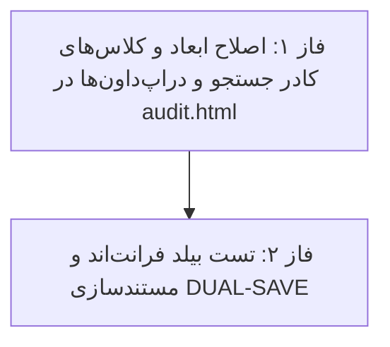

# 📋 طرح پیشنهادی: متناسب‌سازی و تعادل ابعاد کادر جستجو نسبت به سایر فیلترها (Search Box Balanced Width Plan)

این طرح بر اساس بازخورد کاربر مبنی بر کشیدگی و اشغال فضای بیش از حد کادر جستجو و مصاحبه صورت‌گرفته، با هدف محدودسازی عرض کادر جستجو و ایجاد تناسب هندسی دقیق میان کلیه ۶ المان فیلتر تدوین شده است.

---

## 📌 اهداف اصلی طرح (Key Objectives)

1. **متعادل‌سازی و کنترل ابعاد کادر جستجو (Control Search Width):**
   - حذف خاصیت کشسانی بیش از حد (`flex-1` بدون محدودیت) و تنظیم عرض متناسب (`w-full sm:w-[200px] lg:w-[230px] max-w-[240px] shrink-0`) در تب ممیزی.
   - جلوگیری از تسلط بصری کادر جستجو بر سایر دراپ‌داون‌ها در نمایشگرهای عریض.

2. **توزیع یکدست و متوازن فضای افقی میان کلیه فیلترها:**
   - **انتخابگر انبار:** `160px`
   - **کادر جستجو:** `230px`
   - **فیلتر ماژول:** `145px`
   - **فیلتر نوع عملیات:** `145px`
   - **فیلتر سطح اهمیت:** `135px`
   - **انتخابگر بازه تاریخی (از/تا):** `255px`

3. **بهینه‌سازی تب تاریخچه ورود (Login Tab Balance):**
   - کادر جستجو (`280px`)، فیلتر وضعیت ورود (`200px`) و بازه تاریخ (`255px`).

---

## 🗂️ فازبندی اجرایی طرح (Phased Roadmap)

---

## 🔹 فازهای اجرایی

### 🔹 فاز ۱: اعمال ابعاد متناسب در کادر جستجو و فیلترها
- جایگزینی کلاس `flex-1` در کادر جستجو با کلاس‌های متوازن `w-full sm:w-[200px] lg:w-[230px] shrink-0`.
- بهینه‌سازی عرض دراپ‌داون‌های ماژول، عملیات و اهمیت برای خوانایی بهتر متن‌ها.
- **🛡️ ایجنت نگهبان فاز ۱:** بررسی هماهنگی و تناسب هندسی کادر جستجو با سایر فیلترها.

### 🔹 فاز ۲: بیلد پروژه فرانت‌اند و مستندسازی
- اجرای دستور `npm run build` و اخذ کد خروج ۰.
- ثبت اسناد در `Documents/Audit_UX_Refinements/` و به‌روزرسانی `Documents/Master_Log.md`.
- **🛡️ ایجنت نگهبان نهایی:** ممیزی نهایی و ارائه گزارش عملکرد.

---

## 📁 پرونده‌های تحت تاثیر (Modified Files)
- `warehouse-front/src/app/components/audit/audit.html`
- `Documents/Audit_UX_Refinements/`
- `Documents/Master_Log.md`

---

## ⚠️ نیازمند تایید کاربر (User Review Required)
> [!IMPORTANT]
> با توجه به قوانین پروژه، لطفاً در صورت تایید این برنامه، عبارت **«تایید»** یا **«شروع»** را ارسال فرمایید تا اجرا آغاز شود.

