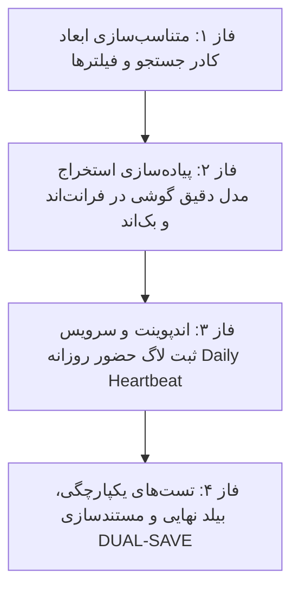

# 📋 طرح پیشنهادی: متناسب‌سازی کادر جستجو، استخراج مدل دقیق گوشی و ثبت لاگ حضور روزانه (Audit & Login Enhancement Plan)

این طرح بر اساس مصاحبه صورت‌گرفته با هدف متعادل‌سازی ابعاد کادر جستجو، دریافت و نمایش مدل دقیق و تجاری گوشی‌های همراه پرسنل (مانند Samsung S23، Xiaomi Redmi، iPhone)، و ثبت خودکار لاگ حضور اولین ورود در هر روز کاری (Daily Heartbeat) تدوین شده است.

---

## 📌 اهداف اصلی طرح (Key Objectives)

1. **متناسب‌سازی و تعادل ابعاد کادر جستجو (Balanced Search Box Width):**
   - تنظیم عرض متناسب برای کادر جستجو (`230px`) و حذف کشسانی بیش از حد در دسکتاپ.
   - تنظیم عرض متوازن برای دراپ‌داون‌های انبار (`160px`)، ماژول (`145px`)، نوع عملیات (`145px`) و سطح اهمیت (`135px`).

2. **شناسایی و استخراج مدل دقیق تجاری گوشی (Exact Mobile Device Model):**
   - استخراج مدل سخت‌افزاری از طریق API استاندارد مرورگر (`navigator.userAgentData.getHighEntropyValues(['model'])`).
   - تعبیه موتور تبدیل کد سخت‌افزاری به نام‌های تجاری فارسی (تبدیل `SM-A525F` به `سامسونگ Galaxy A52`، `2201116TG` به `شیائومی Redmi Note 11 Pro` و غیره).
   - افزودن فیلد `device_model` به جدول `UserLoginLog` در جنگو و نمایش بج اختصاصی در جدول و مودال جزئیات نشست.

3. **ثبت خودکار لاگ حضور روزانه (Daily Activity / Heartbeat Log):**
   - ایجاد اندپوینت سبک در بک‌اند جنگو جهت ثبت اولین بار بازگشایی برنامه در هر روز تقویمی (`DAILY_ACTIVE` - حضور فعال روزانه).
   - ارسال مدل دستگاه، IP و زمان با مکانیزم کش هوشمند کلاینت/سرور تا در هر روز تنها **۱ رکورد** ثبت شود و حجم دیتابیس اشغال نگردد.

---

## 🗂️ فازبندی اجرایی طرح (Phased Roadmap)

---

## 🔹 جزئیات فازهای چهارگانه

### 🔹 فاز ۱: متناسب‌سازی ابعاد کادر جستجو و فیلترها
- اصلاح کلاس‌های عرض کادر جستجو به `w-full sm:w-[200px] lg:w-[230px] shrink-0` در `audit.html`.
- بازتنظیم عرض فیلترهای ماژول، عملیات و اهمیت برای نمایش روان عنوان گزینه‌ها.
- **🛡️ ایجنت نگهبان فاز ۱:** بررسی تعادل هندسی کادر جستجو و سایر دراپ‌داون‌ها در خط فیلتر.

### 🔹 فاز ۲: استخراج و ذخیره‌سازی مدل دقیق گوشی
- افزودن فیلد `device_model = models.CharField(max_length=150, blank=True, null=True)` به مدل `UserLoginLog` در `accounts/models.py`.
- اجرای مایگریشن جنگو `makemigrations` و `migrate`.
- ارسال فیلد `device_model` در فرانت‌اند هنگام لاگین و درخواست‌ها با کمک `navigator.userAgentData`.
- نمایش بج شیک مدل تجاری در ردیف لاگین‌ها و مودال جزئیات نشست.
- **🛡️ ایجنت نگهبان فاز ۲:** بررسی صحت استخراج مدل گوشی و نمایش آن در جدول لاگین‌ها.

### 🔹 فاز ۳: ثبت خودکار لاگ حضور روزانه (Daily Heartbeat)
- ایجاد اکشن `/api/accounts/heartbeat/` در `UserLoginLogViewSet` که با دریافت توکن معتبر، در صورتی که برای کاربر جاری در تاریخ امروز رکوردی ثبت نشده باشد، یک رکورد لاگین با وضعیت `DAILY_ACTIVE` به همراه IP و مدل گوشی ثبت کند.
- اتصال فرانت‌اند در زمان بارگذاری اولیه اپلیکیشن جهت ارسال هارت‌بیت روزانه.
- افزودن برچسب فیلتر و بج رنگی اختصاصی `حضور روزانه (Daily)` در جدول لاگین‌ها.
- **🛡️ ایجنت نگهبان فاز ۳:** اعتبارسنجی ثبت خودکار حضور روزانه و جلوگیری از ثبت رکوردهای تکراری در همان روز.

### 🔹 فاز ۴: بیلد، راستی‌آزمایی و مستندسازی DUAL-SAVE
- اجرای `npm run build` فرانت‌اند و تست مایگریشن‌های جنگو.
- ثبت مشخصات در `Documents/Audit_UX_Refinements/` و به‌روزرسانی `Documents/Master_Log.md`.
- **🛡️ ایجنت نگهبان نهایی:** ممیزی کلیه بخش‌ها و ارائه گزارش نهایی.

---

## 📁 پرونده‌های تحت تاثیر (Modified Files)
- `warehouse-backend/accounts/models.py`
- `warehouse-backend/accounts/views.py`
- `warehouse-backend/accounts/serializers.py`
- `warehouse-front/src/app/components/audit/audit.html`
- `warehouse-front/src/app/components/audit/audit.ts`
- `warehouse-front/src/app/core/services/auth.service.ts`
- `Documents/Audit_UX_Refinements/`
- `Documents/Master_Log.md`

---

## ⚠️ نیازمند تایید کاربر (User Review Required)
> [!IMPORTANT]
> با توجه به قوانین پروژه، لطفاً در صورت تایید این برنامه، عبارت **«تایید»** یا **«شروع»** را ارسال فرمایید تا پیاده‌سازی آغاز شود.

