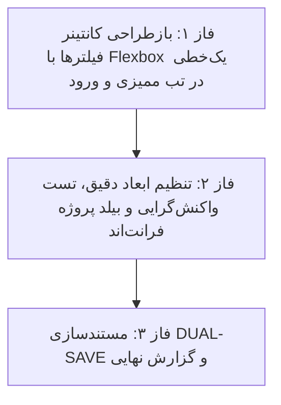

# 📋 طرح پیشنهادی: یکپارچه‌سازی و انتقال کلیه فیلترهای ممیزی به یک خط واحد (Single-Line Filter Bar Plan)

این طرح بر اساس درخواست کاربر و مصاحبه صورت‌گرفته، با هدف ادغام کامل تمامی فیلترهای بخش ممیزی (انتخاب انبار، کادر جستجو، فیلتر ماژول، نوع عملیات، سطح اهمیت و بازه تاریخ دوگانه) در **یک ردیف واحد و منظم دسکتاپ** همراه با حفظ کامل واکنش‌گرایی در موبایل و تبلت تدوین شده است.

---

## 📌 اهداف اصلی طرح (Key Objectives)

1. **انتقال کلیه فیلترها به یک خط واحد در دسکتاپ (Single Row on Desktop):**
   - جایگزینی ساختار دو ردیفه قبلی با ساختار فلکس‌باکس شناور منعطف (`flex flex-wrap lg:flex-nowrap gap-2 items-center`).
   - تنظیم عرض متناسب برای هر المان:
     - انتخابگر انبار (`w-full sm:w-[145px] lg:w-[155px] shrink-0`)
     - کادر جستجوی متنی (`flex-1 min-w-[150px]`)
     - فیلتر ماژول (`w-full sm:w-[125px] lg:w-[130px] shrink-0`)
     - فیلتر نوع عملیات (`w-full sm:w-[125px] lg:w-[130px] shrink-0`)
     - فیلتر سطح اهمیت (`w-full sm:w-[120px] lg:w-[125px] shrink-0`)
     - کادر بازه تاریخی شمسی (`w-full sm:w-[245px] lg:w-[255px] shrink-0`)

2. **بهینه‌سازی تب تاریخچه ورود (Login Tab Single Row):**
   - کادر جستجو (`flex-1 min-w-[200px]`)
   - فیلتر وضعیت ورود (`w-full sm:w-[180px] shrink-0`)
   - کادر بازه تاریخی شمسی (`w-full sm:w-[255px] shrink-0`)

3. **واکنش‌گرایی کامل و پایداری تقویم شمسی:**
   - حفظ عملکرد کامل تایپ مستقیم ۸ رقمی و تقویم پاپ‌آپ بدون تداخل با سایر المان‌ها.
   - چیدمان زیر هم و تمیز در صفحات موبایل و تبلت.

---

## 🗂️ فازبندی اجرایی طرح (Phased Roadmap)

---

## 🔹 فازهای اجرایی

### 🔹 فاز ۱: بازطراحی کانتینر فیلترها به ساختار تک‌خطی
- اصلاح ساختار `audit.html` از `grid-cols-12` به `flex flex-wrap lg:flex-nowrap gap-2 items-center`.
- تنظیم عرض دقیق و بهینه المان‌های ۶ گانه.
- **🛡️ ایجنت نگهبان فاز ۱:** اعتبارسنجی قرارگیری تمامی ۶ فیلتر در یک خط واحد در دسکتاپ.

### 🔹 فاز ۲: بیلد پروژه فرانت‌اند و ممیزی نهایی
- اجرای دستور `npm run build` فرانت‌اند و اخذ کد خروج ۰.
- ثبت اسناد در `Documents/Audit_UX_Refinements/` و به‌روزرسانی `Documents/Master_Log.md`.
- **🛡️ ایجنت نگهبان نهایی:** راستی‌آزمایی بیلد و گزارش نهایی.

---

## 📁 پرونده‌های تحت تاثیر (Modified Files)
- `warehouse-front/src/app/components/audit/audit.html`
- `warehouse-front/src/app/components/audit/audit.css`
- `Documents/Audit_UX_Refinements/`
- `Documents/Master_Log.md`

---

## ⚠️ نیازمند تایید کاربر (User Review Required)
> [!IMPORTANT]
> با توجه به قوانین پروژه، لطفاً در صورت تایید این برنامه، عبارت **«تایید»** یا **«شروع»** را ارسال فرمایید تا اجرا آغاز شود.

