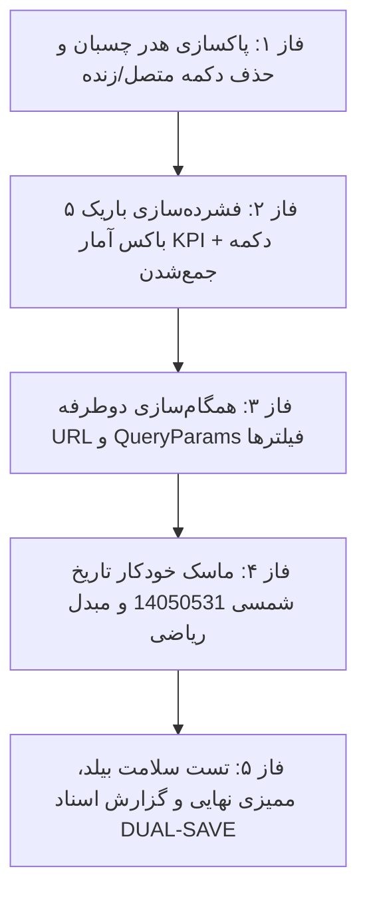

# 📋 طرح پیشنهادی: بهینه‌سازی‌های تجربه کاربری و تعاملی تب رهگیری تغییرات (Audit UX & Clean-up Plan)

این طرح بر اساس ارزیابی انتقادی و نیازمندی‌های مطرح‌شده توسط کاربر، به منظور رفع شلوغی‌های بصری هدر، فشرده‌سازی حداکثری کارت‌های شاخص (KPI)، همگام‌سازی کامل دوطرفه آدرس صفحه (URL Query Params) با فیلترها و پیاده‌سازی سیستم هوشمند ورود تاریخ شمسی (تبدیل خودکار ورودی ۸ رقمی `14050531` به `1405/05/31`) تدوین شده است.

---

## 📌 اهداف اصلی طرح (Core Objectives)

1. **پاکسازی کامل هدر (Header De-clutter):** حذف نشانگرهای متنی حجیم «زنده/متصل» و بج وضعیت آفلاین از هدر چسبان و آزادسازی کامل فضای افقی برای عنوان، انتخابگر انبار و دکمه‌های اکشن اصلی.
2. **فشرده‌سازی ۵ باکس شاخص آماری (Ultra-Slim KPI Cards):** کاهش ارتفاع باکس‌ها به نصف، فشرده‌سازی پدینگ به `p-2.5`، بهینه‌سازی فونت‌ها و افزودن قابلیت تا شدن/باز شدن نوار آمار (Collapsible Strip).
3. **اتصال و همگام‌سازی کامل URL و QueryParams:** ذخیره و بازیابی بلادرنگ وضعیت تمام فیلترها (`tab`, `module`, `action`, `severity`, `status`, `q`, `from`, `to`, `page`, `pageSize`) در URL مرورگر با قابلیت بوکمارک، رفرش و دکمه‌های Back/Forward.
4. **ماسک هوشمند و مبدل خودکار تاریخ شمسی:** تایپ آسان تاریخ شمسی به صورت ۸ رقم چسبیده (`14050531`) و فرمت‌بندی خودکار آن به `1405/05/31`، به همراه تبدیل ریاضی استاندارد به تاریخ میلادی جهت فیلتر فوری داده‌ها.
5. **ارزیابی در پایان هر فاز با ایجنت نگهبان اختصاصی:** اعتبارسنجی مستقل تغییرات هر فاز توسط ایجنت نگهبان و بیلد استاتیک سریع فرانت‌اند.

---

## 🗂️ فازبندی اجرایی طرح (Phased Roadmap)

---

## 🔹 جزئیات فازهای پنج‌گانه

### 🔹 فاز ۱: پاکسازی هدر چسبان و حذف دکمه‌های اضافی متصل/زنده
- حذف نشانگر حجیم متن و پالس وب‌سوکت (`isWsConnected`) از هدر.
- حذف تگ `<app-offline-pending-badge mode="header" />` از کنار دکمه راهنما در هدر تب ممیزی.
- مرتب‌سازی نوار چسبان برای اختصاص حداکثر فضا به تیتر صفحه، وضعیت انبار انتخابی و دکمه‌های آیکونی مربعی.
- **🛡️ ایجنت نگهبان فاز ۱:** ممیزی تمیزی هدر، عدم شکست چیدمان در رزولوشن‌های موبایل و دسکتاپ و سلامت دکمه‌های اکشن.

---

### 🔹 فاز ۲: فشرده‌سازی باریک ۵ باکس آمار (Slim KPI Strip) + دکمه جمع‌شدگی
- بازطراحی چیدمان ۵ کارت شاخص در هر دو تب Audit و Login با استایل نواری باریک (ارتفاع تقریبی ۴۵ پیکسل به جای ۹۰ پیکسل).
- انتقال مقادیر به صورت فشرده در کنار عنوان کارت (`flex items-center justify-between`) با فونت مونو برجسته.
- باریک‌سازی نوار پیشرفت حجم دیتابیس بدون اشغال فضای اضافی.
- تعبیه یک دکمه ظریف در بالای نوار فیلترها جهت جمع کردن / باز کردن نوار آمار (`isKpiCollapsed`) برای کاربران متقاضی جدول تمام‌صفحه.
- حفظ رینگ تعاملی فیلتر سریع برای رویدادهای بحرانی، هشدار و ورودهای ناموفق.
- **🛡️ ایجنت نگهبان فاز ۲:** بررسی ابعاد بصری، عدم اشغال فضای بیهوده از Viewport، عملکرد دکمه Toggle و حفظ فیلتر با کلیک روی کارت‌ها.

---

### 🔹 فاز ۳: همگام‌سازی کامل دوطرفه URL و QueryParams
- خواندن پارامترهای آدرس مرورگر در `ngOnInit`:
  - `tab` (audit | login)
  - `module`, `action`, `severity`, `status`
  - `q` (عبارت جستجو)
  - `from`, `to` (تاریخ‌های شمسی/میلادی)
  - `page`, `page_size`
- پیاده‌سازی متد `syncQueryParams()` برای ثبت تغییرات فیلترها در URL بدون رفرش صفحه با `replaceUrl: true`.
- پشتیبانی کامل از رفرش صفحه بدون از دست رفتن فیلترها و امکان اشتراک‌گذاری مستقیم لینک فیلترشده با سایر همکاران.
- **🛡️ ایجنت نگهبان فاز ۳:** تست چرخه رفت و برگشت URL، ذخیره و بازیابی فیلترهای ترکیبی و پاکسازی QueryParams در زمان ریست فیلترها.

---

### 🔹 فاز ۴: ماسک هوشمند تاریخ شمسی (`14050531` ➔ `1405/05/31`) و تبدیل دقیق
- ایجاد الگوریتم سبک و پرسرعت تبدیل ریاضی شمسی (Jalali) به میلادی (Gregorian ISO) بدون وابستگی به پکیج‌های حجیم خارجی.
- افزودن ماسک خودکار هنگام تایپ کاربر در فیلدهای تاریخ (ورودی دستی):
  - تایپ `14050531` خودکار به صورت `1405/05/31` درج می‌شود.
  - تایپ `1405/5/2` خودکار به صورت `1405/05/02` استاندارد می‌شود.
  - پشتیبانی از Backspace، ارقام فارسی (`۱۲۳۴۵۶۷۸۹۰`) و انگلیسی (`1234567890`).
  - اعتبارسنجی خودکار ماه (۱ تا ۱۲) و روز (۱ تا ۳۱).
- اتصال آنی تاریخ معتبر به موتور فیلتر لاگ‌ها و به‌روزرسانی تقویم پاپ‌آپ شمسی.
- **🛡️ ایجنت نگهبان فاز ۴:** تست سناریوهای مختلف ورود تاریخ دستی، تبدیل صحیح به میلادی، فیلتر جدول و سازگاری با تقویم پاپ‌آپ.

---

### 🔹 فاز ۵: بیلد نهایی پروژه، اعتبارسنجی و مستندسازی DUAL-SAVE
- اجرای `npm run build` در فرانت‌اند و اطمینان از خروج با کد ۰ بدون خطای تایپ یا قالب.
- به‌روزرسانی لاگ مستر پروژه در `Documents/Master_Log.md`.
- تولید گزارش کامل واک‌ترو در `Documents/Audit_UX_Refinements/walkthrough_audit_ux_refinements.md`.
- **🛡️ ایجنت نگهبان فاز ۵:** بررسی سلامت نهایی بیلد پروژه و تطابق کامل با خواسته‌های کاربر.

---

## 📁 پرونده‌های تحت تاثیر (Modified Files)
- `warehouse-front/src/app/components/audit/audit.html` (پاکسازی هدر، فشرده‌سازی کارت‌های KPI، ارتقای فیلدهای تاریخ شمسی)
- `warehouse-front/src/app/components/audit/audit.ts` (مدیریت QueryParams، ماسک ورودی تاریخ شمسی، مبدل شمسی به میلادی، مدیریت تا شدن کارت‌ها)
- `warehouse-front/src/app/components/audit/audit.css` (استایل‌های فشرده‌سازی KPI و فیلدهای تاریخ)
- `Documents/Audit_UX_Refinements/` (اسناد DUAL-SAVE)
- `Documents/Master_Log.md` (لاگ مستر تغییرات)

---

## ⚠️ نیازمند تایید کاربر (User Review Required)
> [!IMPORTANT]
> با توجه به قانون اجباری عدم اجرای خودکار، خواهشمند است در صورت تایید این طرح فازبندی‌شده، عبارت **«تایید»** یا **«شروع»** را اعلام فرمایید تا بلافاصله پیاده‌سازی گام‌به‌گام آغاز گردد.

