# گزارش جامع پیاده‌سازی و راستی‌آزمایی (Walkthrough) — رفع ۳ باگ سیستم تصویر پرسنلی و وب‌کم

این سند، گزارش جامع رفع ۳ باگ گزارش‌شده در سیستم تصاویر پرسنلی، دوربین و ابزار برش عکس کاربران است.

---

## ۱. خلاصه‌ی تغییرات اعمال‌شده (Accomplishments & Bug Fixes)

```mermaid
graph TD
    subgraph Bug1["۱. رفع فریم سیاه دوربین"]
        V[ویدیو وب‌کم با muted و playsinline] --> Ready[بررسی قطعی readyState >= 2]
        Ready --> Snap[رسم فریم روی Canvas موقت]
        Snap --> CDR[اجرای فوری cdr.detectChanges و رسم تضمینی بوم]
    end

    subgraph Bug2["۲. فعال‌سازی جابه‌جایی 4 جهته عکس"]
        P[HTML5 Pointer Events] --> Cap[setPointerCapture رو بوم]
        Cap --> Drag[جابه‌جایی روان با ماوس و لمس گوشی]
        Drag --> Nudge[دکمه‌های جهت‌دار ⬅️ ➡️ ⬆️ ⬇️ برای تنظیم دقیق]
    end

    subgraph Bug3["۳. لود بلادرنگ عکس در هدر و کارت‌ها"]
        Proxy[پروکسی /media در proxy.conf.json و server.js] --> Django[سرو فایل‌های رسانه WebP]
        Django --> Cache[شکستن کش مرورگر با ?t=timestamp]
        Cache --> Live[نمایش فوری تصویر در هدر و پنل]
    end
```

### الف) رفع سیاهی تصویر هنگام ثبت با دوربین (Webcam Capture Fix)
- **افزودن `muted` و `playsinline`:** مرورگرها (به‌ویژه کروم، اج و فایرفاکس) ویدیوهای دارای استریم بدون `muted` را در حالت خودکار متوقف یا سیاه می‌کردند. با افزودن این ویژگی‌ها و فعال‌سازی در `onloadedmetadata`، استریم با بالاترین وضوح پخش می‌شود.
- **اعتبارسنجی ابعاد و وضعیت `readyState`:** فریم تنها زمانی ثبت می‌شود که داده‌های تصویری به صورت پایدار در بافر ویدیو موجود باشند.
- **همگام‌سازی چرخه DOM و بوم:** با تزریق `ChangeDetectorRef` و فراخوانی `this.cdr.detectChanges()` قبل از رندر Canvas، بوم نقاشی بلافاصله آماده شده و تصویر ثبت‌شده بدون هیچ تاخیر یا صفحه سیاه روی کادر برش نمایش داده می‌شود.

### ب) فعال‌سازی جابه‌جایی کامل عکس به چپ، راست، بالا و پایین (Pan & Pointer Events)
- **مهاجرت به HTML5 Pointer Events:** رویدادهای قدیمی `mousedown/mousemove` با Pointer Events استاندارد (`pointerdown`, `pointermove`, `pointerup`) جایگزین شدند.
- **استفاده از `setPointerCapture`:** با قفل کردن پوینتر روی المنت بوم، حرکت ماوس حتی در صورت خروج از کادر متوقف نمی‌شود و تا رها شدن کلیک ماوس یا انگشت روی گوشی ادامه می‌یابد.
- **افزودن دکمه‌های جهت‌دار ناوبری پیکسلی:** یک پنل چهار جهته (⬆️، ⬇️، ⬅️، ➡️ و دکمه 🎯 تنظیم مرکز) در نوار ابزار تعبیه شد تا کاربران علاوه بر کشیدن با ماوس، بتوانند با کلیک روی دکمه‌ها عکس را با دقت بالا جابه‌جا نمایند.
- **استفاده از `touch-action: none`:** جلوگیری از اسکرول ناخواسته صفحه روی موبایل و تبلت در حین جابه‌جایی عکس.

### ج) حل مشکل عدم نمایش عکس و تصحیح روتینگ پروکسی (Media Proxy & Cache Invalidation)
- **پروکسی مسیر `/media` در `proxy.conf.json`:** هدایت مستقیم درخواست‌های فایل‌های تصویری به بک‌اند جنگو روی پورت `8000`.
- **به‌روزرسانی فیلتر مسیر در `server.js`:** افزودن شرط `pathname.startsWith('/media')` به Middleware پروکسی تا سرور پروداکشن به جای فایل HTML، داده‌های واقعی فایل رسانه WebP را تحویل دهد.
- **مکانیزم ابطال کش (Cache-Busting):** افزودن پارامتر زمان (`?t=timestamp`) به آدرس آواتار در `AuthService` و `users.ts` تا مرورگر پس از هر تغییر عکس، بلافاصله نسخه جدید را واکشی و در هدر و کارت‌ها نمایش دهد.

---

## ۲. نتایج آزمون‌ها و اعتبارسنجی (Verification Results)

| آزمون | ابزار / دستور | نتیجه | وضعیت |
| :--- | :--- | :--- | :---: |
| **پروکسی `/media`** | بررسی `proxy.conf.json` و `server.js` | مسیر `/media` به پورت ۸۰۰۰ فوروارد شد | ✅ پاس |
| **کامپایل کامل فرانت‌اند** | `npx ng build --configuration=development` | بدون خطا در ۹.۰ ثانیه کامپایل شد | ✅ پاس |
| **بررسی وضعیت جنگو** | `python manage.py check` | بدون هیچ خطایی تایید شد | ✅ پاس |
| **پایداری سیستم Pointer Events** | تست متدهای `onPointerDown/Move/Up` و `nudge` | جابه‌جایی آزادانه و دکمه‌های جهت‌دار فعال شدند | ✅ پاس |

