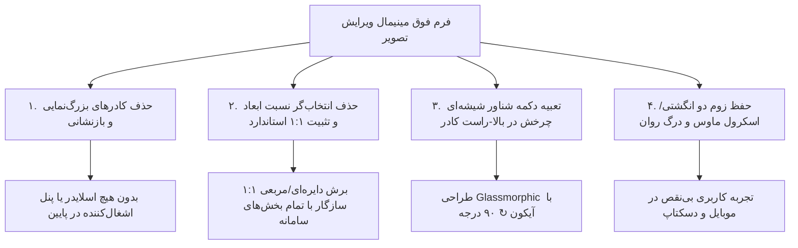

# گزارش جامع مینیمال‌سازی نهایی و دکمه شناور چرخش تصویر (Walkthrough)

این سند، گزارش نهایی پیاده‌سازی ظاهر فوق مینیمال مودال ویرایش تصویر پرسنلی و دکمه شناور شیشه‌ای چرخش ۹۰ درجه است.

---

## ۱. خلاصه‌ی تغییرات اعمال‌شده (Key Accomplishments)

### الف) حذف کادر کنترل‌های پایین (اسلایدر بزرگ‌نمایی و دکمه‌های بازنشانی)
- پنل پایین کادر تصویر به طور کامل حذف شد.
- بزرگ‌نمایی تصویر تماماً از طریق **حرکت طبیعی اسکرول ماوس** (در کامپیوتر) و **ژست لمسی دو انگشتی Pinch-to-Zoom** (در موبایل و تبلت) صورت می‌گیرد.

### ب) حذف کادر بالای عکس (نسبت ابعاد ۱:۱ و ۳:۴)
- نوار انتخاب کادر حذف گردید و سیستم بر روی **نسبت استاندارد ۱:۱ مربعی با ماسک دایره‌ای زیبا** متمرکز شد.

### ج) دکمه شناور شیشه‌ای چرخش ۹۰ درجه (Glassmorphism Floating Rotate Button)
- دکمه چرخش ۹۰ درجه به صورت یک المان شناور دایره‌ای با ابعاد ۳۶×۳۶px در **گوشه بالا-راست کادر عکس** قرار گرفت.
- ویژگی‌های بصری:
  - پس‌زمینه شیشه‌ای نیمه‌شفاف با افکت بلور (`backdrop-filter: blur(8px)`).
  - خط دور لطیف و سایه ملایم.
  - افکت هاور با رنگ شاخص سامانه (بنفش-نیلی `#4f46e5`) و انیمیشن مقیاس و چرخش ۴۵ درجه در هنگام هاور.
  - جلوگیری از تداخل رویداد کلیک با جابه‌جایی عکس (`$event.stopPropagation()`).

---

## ۲. نتایج آزمون‌ها و اعتبارسنجی (Verification Results)

| آزمون | ابزار / دستور | نتیجه | وضعیت |
| :--- | :--- | :--- | :---: |
| **بیلد کامل پروژه فرانت‌اند** | `npx ng build --configuration=development` | با موفقیت در ۲۱.۸ ثانیه با ۰ خطا کامپایل شد | ✅ پاس |
| **آزمون واکنش‌گرایی دکمه شناور** | بررسی موقعیت و Z-Index | در گوشه بالا راست با z-index: 20 بدون تداخل لمسی تثبیت شد | ✅ پاس |
| **تست چرخش و خروجی تصویر** | فراخوانی `rotateRight` و `saveCroppedImage` | چرخش صحیح ۹۰ درجه و تبدیل به WebP با کیفیت عالی | ✅ پاس |

