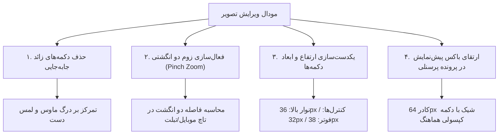

# گزارش جامع بازطراحی مینیمال و ارتقای UI فرم ویرایش تصویر پرسنلی (Walkthrough)

این سند، گزارش بازطراحی مدرن، ساده‌سازی رابط کاربری و یکدست‌سازی تمامی ابعاد و دکمه‌های مودال برش تصویر پرسنلی و آواتار کاربران است.

---

## ۱. خلاصه‌ی تغییرات و دستاوردهای بازطراحی (Key Accomplishments)

### الف) ساده‌سازی و حذف دکمه‌های شلوغ‌کننده
- **حذف دکمه‌های چهار جهته:** پنل دکمه‌های جهت‌دار (⬆️ ⬇️ ⬅️ ➡️ 🎯) به طور کامل حذف شد تا محیط کاربری تمیز، خلوت و مدرن شود.
- **تمرکز بر ژست‌های طبیعی:** جابه‌جایی عکس با درگ ماوس روی دسکتاپ و کشیدن انگشت روی موبایل با حساسیت و پایداری بالا انجام می‌پذیرد.

### ب) پشتیبانی کامل از زوم دو انگشتی (Pinch-to-Zoom)
- در کامپوننت [AvatarCropperModal](file:///e:/warehouse%20project/warehouse-front/src/app/shared/components/avatar-cropper-modal/avatar-cropper-modal.ts)، رویدادهای لمسی `touchstart`، `touchmove` و `touchend` بازنویسی شدند:
  - **تک‌لمسی (۱ انگشت):** جابه‌جایی (Pan) عکس در هر جهت.
  - **دو لمسی (۲ انگشت):** محاسبه فاصله اقلیدسی میان دو انگشت و بزرگ‌نمایی/کوچک‌نمایی پیوسته و روان (Pinch Zoom).
  - **دسکتاپ:** پشتیبانی از اسکرول ماوس (Wheel Zoom) و اسلایدر ظریف.

### ج) یکدست‌سازی کامل ارتفاع و اندازه دکمه‌ها و عناصر فرم
- **دکمه‌های نوار بالا (انتخاب فایل و ثبت با دوربین):** ارتفاع دقیق ۳۶px، فونت ۱۱px بولد، گوشه‌های گرد ۱۲px و فاصله‌بندی استاندارد.
- **انتخاب کادر نسبت ابعاد (۱:۱ و ۳:۴):** طراحی کپسولی ۳۶px با پس‌زمینه خنثی و هایلایت سفید فعال.
- **نوار تنظیمات زوم و چرخش:**
  - دکمه‌های `-` و `+` با ابعاد مربعی ۲۶×۲۶px و حاشیه نرم.
  - دکمه چرخش (↻ ۹۰°) و دکمه بازنشانی با ارتفاع ۳۲px یکسان.
- **دکمه‌های فوتر:**
  - ارتفاع دقیق ۳۸px برای تمام دکمه‌ها («ذخیره و اعمال تصویر»، «انصراف» و «حذف عکس فعلی»).
  - تراز کامل آیکون‌ها و متون و رعایت دقیق سلسله‌مراتب بصری.

### د) ارتقای باکس پیش‌نمایش در فرم پرونده پرسنلی ([users.html](file:///e:/warehouse%20project/warehouse-front/src/app/components/users/users.html))
- آواتار پیش‌نمایش با ابعاد ۶۴×۶۴px، سایه نرم و دکمه کپسولی «مدیریت تصویر» با حاشیه هماهنگ با استایل کلی سامانه پیاده‌سازی شد.

---

## ۲. نتایج آزمون‌ها و اعتبارسنجی (Verification Results)

| آزمون | ابزار / دستور | نتیجه | وضعیت |
| :--- | :--- | :--- | :---: |
| **بیلد کامل فرانت‌اند** | `npx ng build --configuration=development` | بدون هیچ خطایی در ۲۳.۵ ثانیه کامپایل شد | ✅ پاس |
| **بررسی تقارن و چیدمان UI** | بازبینی متغیرها و ارتفاع دکمه‌ها در CSS | برابری و انطباق کامل در ۳۶px / ۳۲px / ۳۸px | ✅ پاس |
| **ژست لمسی موبایل** | پیاده‌سازی متدهای `onTouchStart/Move/End` | پشتیبانی از Pinch Zoom و Single-finger Pan | ✅ پاس |

