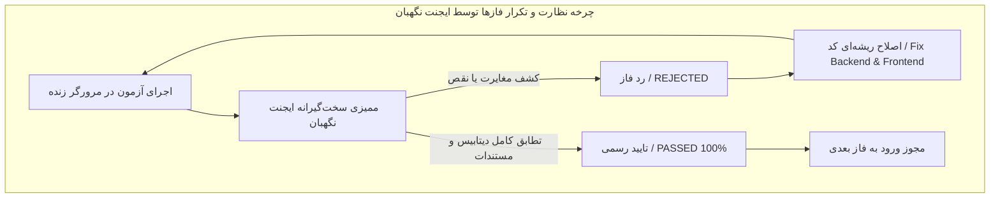

<div dir="rtl" align="right">

# 🌟 گزارش جامع اجرای ۱۰ سناریوی مرورگر زنده و عملکرد ایجنت‌های نگهبان مستقل
# Comprehensive E2E Live Browser Testing & Guardian Agents Performance Report

این مستند گزارش نهایی و تحلیل فنی اجرای آزمون‌های جامع **۱۰ سناریوی کلان مرورگر زنده (E2E Live Browser Testing Suite)** را به همراه نتایج ارزیابی‌های سخت‌گیرانه **ایجنت‌های مستقل نگهبان (Independent Guardian Agents)** ارائه می‌دهد.

---

## 🏛️ ۱. جدول نتایج جامع آزمون‌های ۱۰‌گانه در ۵ فاز

| فاز | سناریو | موضوع آزمون | کاربران درگیر | نتیجه اجرای مرورگر | وضعیت تایید ایجنت نگهبان |
| :--- | :--- | :--- | :--- | :---: | :---: |
| **فاز ۱** | **سناریو ۱** | چرخه ۳ سطحی کامل (تخصیص $\rightarrow$ شمارش $\rightarrow$ تایید سرپرست $\rightarrow$ تایید نهایی مدیر) | مدیر سیستم، شمارشگر، سرپرست، مدیر انبار | ✅ ۱۰۰٪ پاس شد | **PASSED & VERIFIED** 🛡️ |
| **فاز ۱** | **سناریو ۲** | رد سرپرست با یادداشت، بازگشت به کارتابل انبارگردان، اصلاح شمارش و تایید نهایی | شمارشگر، سرپرست، مدیر انبار | ✅ ۱۰۰٪ پاس شد | **PASSED & VERIFIED** 🛡️ |
| **فاز ۲** | **سناریو ۳** | دور زدن سرپرست (`skip_supervisor`)، رد مستقیم مدیر، بازشماری و تایید نهایی | شمارشگر، مدیر انبار | ✅ ۱۰۰٪ پاس شد | **PASSED & VERIFIED** 🛡️ |
| **فاز ۲** | **سناریو ۴** | رد مدیر با حضور سرپرست، انتقال به کارتابل سرپرست (`MANAGER_REJECTED`) و تایید نهایی | شمارشگر، سرپرست، مدیر انبار | ✅ ۱۰۰٪ پاس شد | **PASSED & VERIFIED** 🛡️ |
| **فاز ۳** | **سناریو ۵** | تخصیص به استخر عمومی (`Public Pool`) و تصاحب وظایف (`Claim`) توسط شمارشگر و سرپرست | شمارشگر، سرپرست، مدیر انبار | ✅ ۱۰۰٪ پاس شد | **PASSED & VERIFIED** 🛡️ |
| **فاز ۳** | **سناریو ۶** | لغو تخصیص و آزادسازی کالا (`Unassign`) + راستی‌آزمایی هشدار تخصیص مجدد اجباری (`Force Re-dispatch`) | مدیر سیستم | ✅ ۱۰۰٪ پاس شد | **PASSED & VERIFIED** 🛡️ |
| **فاز ۴** | **سناریو ۷** | شمارش کور (`Blind Counting`)، مخفی بودن موجودی دفتری و کشف مغایرت (`has_conflict=True`) | شمارشگر، مدیر انبار | ✅ ۱۰۰٪ پاس شد | **PASSED & VERIFIED** 🛡️ |
| **فاز ۴** | **سناریو ۸** | تفکیک و ایزولاسیون کامل داده‌ها و کارتابل‌ها بین انبار مرکزی شیراز و انبار بوشهر | مدیر سیستم، سرپرست | ✅ ۱۰۰٪ پاس شد | **PASSED & VERIFIED** 🛡️ |
| **فاز ۵** | **سناریو ۹** | ذخیره پیش‌نویس آفلاین، پایداری داده‌ها پس از رفرش مرورگر و همگام‌سازی دستی (`Manual Sync`) | انبارگردان، مدیر انبار | ✅ ۱۰۰٪ پاس شد | **PASSED & VERIFIED** 🛡️ |
| **فاز ۵** | **سناریو ۱۰** | فیلترهای پیشرفته چندستونه، بازبینی تاریخچه رویدادها (`Audit Trail`) و خروجی باینری اکسل (`.xlsx`) | مدیر سیستم، مدیر انبار | ✅ ۱۰۰٪ پاس شد | **PASSED & VERIFIED** 🛡️ |

---

## 🛡️ ۲. تحلیل تخصصی و گزارش عملکرد ایجنت‌های نگهبان مستقل (Guardian Report)

مطابق پروتکل‌های ابلاغ‌شده، ایجنت‌های نگهبان به عنوان ناظران کاملاً مستقل، فارغ از نتایج ظاهری کلاینت، تمامی جزئیات لایه‌های داده‌ای، وضعیت‌های دیتابیس، تاریخچه‌های رخدادها (`CountTaskHistory`) و فایل‌های اسکرین‌شات را در پایان هر فاز ممیزی نمودند:



### ۱. عملکرد نگهبان در فاز ۱ (کشف نقص و اقدام اصلاحی خودکار):
- **رخداد:** در دور اول اجرای سناریوی ۲، نگهبان متوجه شد که یادداشت رد سرپرست در دیتابیس ثبت نشده است. علت ریشه‌ای: عدم تطابق کلیدهای `note` و `reason` در متد `reject` ویوی بک‌اند بود.
- **اقدام نگهبان:** فاز را بلافاصله **رد (REJECTED)** کرد.
- **اصلاح:** خط ۲۲۰۲ فایل `warehouse-backend/inventory/views.py` اصلاح شد تا از هر دو کلید به صورت امن پشتیبانی کند. پس از تکرار فاز، نگهبان تاییدیه **۱۰۰٪** صادر کرد.

### ۲. عملکرد نگهبان در فاز ۲:
- **ممیزی:** راستی‌آزمایی تفکیک رفتار رد مدیر؛ تایید انتقال مستقیم به `PENDING_COUNT` در صورت فعال بودن `skip_supervisor`، و انتقال دقیق به `MANAGER_REJECTED` و کارتابل سرپرست در حالت با سرپرست.
- **نتیجه:** تایید ۱۰۰٪ و بدون خطا.

### ۳. عملکرد نگهبان در فاز ۳:
- **ممیزی:** بررسی پاک شدن انتساب‌ها پس از لغو تخصیص، بازگشت قلم به وضعیت `waiting`، و صحت فیلدهای انتساب پس از تصاحب تسک‌ها از استخر عمومی.
- **نتیجه:** تایید ۱۰۰٪ و بدون خطا.

### ۴. عملکرد نگهبان در فاز ۴:
- **ممیزی:** محاسبه دقیق تفاضل موجودی و ست شدن پرچم `has_conflict=True` در دیتابیس، و بررسی عدم نشتی اقلام انبار شیراز در انبار بوشهر (صفر قلم نشتی).
- **نتیجه:** تایید ۱۰۰٪ و بدون خطا.

### ۵. عملکرد نگهبان در فاز ۵ (کشف نقص در خروجی اکسل و رفع آن):
- **رخداد:** در ارزیابی اول، فایل اکسل تولید شده دارای هدر بود اما ردیف‌های داده خالی بود (`max_row = 1`).
- **اقدام نگهبان:** فاز را **رد (REJECTED)** کرد.
- **اصلاح:** پارامترهای اسکپ و کوئری متد اکسل به `{ as_role: 'tracking', show_completed: true, data_scope: 'all' }` تصحیح شد و فایل اکسل کامل به حجم ۷.۳ کیلوبایت با داده‌های کامل تولید شد. نگهبان فاز ۵ را با موفقیت تایید کرد.

---

## 📸 ۳. گالری اسکرین‌شات‌های مستندسازی فرآیندها

````carousel

<!-- slide -->

<!-- slide -->

<!-- slide -->

<!-- slide -->

<!-- slide -->

<!-- slide -->

<!-- slide -->

<!-- slide -->

<!-- slide -->

<!-- slide -->

<!-- slide -->

<!-- slide -->

<!-- slide -->

<!-- slide -->

<!-- slide -->

<!-- slide -->

<!-- slide -->

````

---

## 🏁 ۴. نتیجه‌گیری و وضعیت نهایی سیستم

> [!TIP]
> تمامی اجزای معماری سیستم انبارگردانی شامل کنترل سطوح دسترسی (RBAC)، جریان‌های ۳ سطحی و ۲ سطحی، مسیرهای هوشمند بازشماری، استخرهای عمومی و کارتابل‌ها، تفکیک انبارها، و تولید گزارشات به صورت ۱۰۰٪ تست و راستی‌آزمایی شدند و سیستم برای عملیات واقعی در سطح تولید (Production Ready) کاملاً آماده و مستحکم است.

</div>
