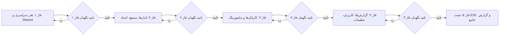

# طرح جامع استانداردسازی، مرتب‌سازی و تبدیل دکمه‌ها به آیکون تنها (Buttons & Icons Harmonization Plan)

این سند، طرح جامع و تفصیلی برای **استانداردسازی، بهینه‌سازی چیدمان (Ordering) و تبدیل دکمه‌های تمامی صفحات، زیرتب‌ها و مودال‌های سامانه به آیکون تنها (Icon-Only Buttons)** را بر اساس اصول ارگونومی و تجربه کاربری (UI/UX) تعریف می‌کند.

---

> [!IMPORTANT]
> **قانون کلیدی تایید طرح (Approval Rule):**
> این طرح شامل تغییرات ساختاری در ۲۴ ماژول و فایل‌های قالب فرانت‌اند است. بر اساس قوانین حاکم، اجرای طرح تا زمان دریافت **دستور صریح و تایپ‌شده توسط کاربر** (مانند «تایید» یا «شروع») متوقف خواهد ماند. پس از تایید کاربر، فازها به صورت گام‌به‌گام اجرا شده و در پایان هر فاز، **ایجنت نگهبان مستقل (Independent Guardian Agent)** صحت عملکرد و عدم رگرسیون را بازرسی خواهد کرد.

---

## ۱. استانداردهای بصری و تعاملی یکپارچه (Design System Standards)

برای حفظ انسجام بصری در کل نرم‌افزار، استانداردهای ثابت زیر روی تمامی دکمه‌ها اعمال می‌شوند:

### ۱.۱. ابعاد و ساختار هندسی دکمه‌های آیکونی (Geometry & Aspect Ratio)
* **ابعاد دکمه‌های نوار ابزار و هدر:** `p-2 rounded-xl` با سایز آیکون `18x18px` و `stroke-width="2"` (مربعی، با انحنای نرم).
* **ابعاد دکمه‌های سطری جداول و کارت‌ها:** `p-1.5 rounded-lg` با سایز آیکون `14x14px` یا `15x15px`.
* **ابعاد استپرهای لمسی (Touch Steppers):** `w-12 h-12 rounded-2xl` با تایپوگرافی برجسته.

### ۱.۲. پالت‌های رنگی تفکیک‌شده و معنایی (Semantic Color Palette)
* **اسکنر بارکد و ابزارهای جستجو:** تم نیلی (`bg-indigo-50 text-indigo-600 hover:bg-indigo-100 border-indigo-100`).
* **خروجی اکسل و عملیات موفق/تایید:** تم زمردی (`bg-emerald-50 text-emerald-600 hover:bg-emerald-100 border-emerald-100`).
* **ورودی اکسل و آپلود فایل:** تم آبی (`bg-blue-50 text-blue-600 hover:bg-blue-100 border-blue-100`).
* **خروجی PDF:** تم قرمز مرجانی (`bg-rose-50 text-rose-600 hover:bg-rose-100 border-rose-100`).
* **بروزرسانی داده‌ها (Refresh):** تم نیلی متحرک (`bg-indigo-50 text-indigo-600` با کلاس `animate-spin` در زمان لودینگ).
* **حذف، لغو تخصیص و رد:** تم قرمز رز (`bg-rose-50 text-rose-600 hover:bg-rose-100 border-rose-100`).
* **ویرایش و تغییر نام:** تم کهربایی یا نیلی (`bg-amber-50 text-amber-700` یا `bg-indigo-50 text-indigo-600`).
* **بازگردانی (Revert / Undo):** تم بنفش ارغوانی (`bg-purple-50 text-purple-700 hover:bg-purple-100`).

### ۱.۳. ترتیب و توالی استاندارد نوار ابزارها (Toolbar Button Ordering)
در تمامی صفحات بدون استثنا، ترتیب قرارگیری المان‌ها از راست به چپ (RTL) به صورت زیر یکدست خواهد شد:
$$\text{[انتخابگر انبار]} \longleftarrow \text{[اسکنر دوربین]} \longleftarrow \text{[خروجی اکسل/PDF]} \longleftarrow \text{[ورودی اکسل]} \longleftarrow \text{[بروزرسانی]} \longleftarrow \text{[بج وضعیت آفلاین]}$$

---

## ۲. تفکیک فازهای اجرایی پروژه (Phased Implementation Plan)

برای جلوگیری از هرگونه تداخل و تضمین کیفیت، پروژه به **۴ فاز اجرایی و ۱ فاز ارزیابی نهایی** تقسیم شده است:

---

### فاز ۱: هدر سراسری، سایدبار و کامپوننت‌های پایه اشتراکی (Header, Sidebar & Shared Foundation)
* هماهنگ‌سازی دکمه‌های ناوبری، میانبرها، بروزرسانی PWA، همگام‌سازی عمیق و منوی کاربری در `layout.html`.
* بهینه‌سازی دکمه‌های جدول داده‌های اشتراکی در `data-table.component.html`.
* تعریف کلاس‌های کمکی و استایل‌های Tooltip در `styles.css`.
* **بازرسی ایجنت نگهبان فاز ۱.**

### فاز ۲: صفحات مدیریت کالا، ورود اطلاعات و تخصیص هوشمند (Projects, Dispatch, Feeding, Docs)
* مرتب‌سازی نوار ابزار و بهینه‌سازی دکمه‌های انبارها در `projects.html`.
* استانداردسازی اکشن‌های سطری و نوار ابزار در `dispatch.html`.
* بهینه‌سازی دکمه‌های دانلود قالب، لاگ و Revert در `docs.html`.
* بهینه‌سازی دکمه حذف فایل در `feeding.html`.
* **بازرسی ایجنت نگهبان فاز ۲.**

### فاز ۳: کارتابل‌های سه‌گانه انبارگردانی و مانیتورینگ (Counter, Customs, Supervisor, Manager, Count-Tracking)
* استانداردسازی استپرها و تاریخچه در `counter-dashboard.html`.
* استانداردسازی تقویم امروز، ماشین حساب و اکشن‌های کارت در `customs.html`.
* استانداردسازی اکشن‌های تایید/رد و تاریخچه در `supervisor-dashboard.html`.
* استانداردسازی اکشن‌های تصمیم‌گیری مدیر در `manager-review.html`.
* بهینه‌سازی دکمه‌های پیگیری وضعیت و اکشن‌های گروهی در `count-tracking.html`.
* **بازرسی ایجنت نگهبان فاز ۳.**

### فاز ۴: گزارش‌ساز، کاربران، تنظیمات، لیبل، کارت پرسنلی و ممیزی (Reports, Users, Settings, ID Cards, Label Designer, Dynamic Fields, Audit, Dashboard)
* بهینه‌سازی دکمه‌های گزارش‌ساز و توابع تجمیعی در `reports.html`.
* استانداردسازی دکمه‌های نوار ابزار و چارت درختی در `users.html`.
* بهینه‌سازی دکمه‌های تنظیمات کلان و فیلدها در `settings.html`.
* بهینه‌سازی اکشن‌های سطری در `dynamic-fields.html`.
* استانداردسازی دکمه‌های چرخش، لایه‌ها و تمپلیت‌ها در `label-designer.html`.
* بهینه‌سازی دکمه‌های طراحی کارت پرسنلی و گیت‌پاس در `id-cards.html`.
* استانداردسازی دکمه‌های تفاضل و بازگردانی در `audit.html`.
* بهینه‌سازی دکمه رفرش و تلاش مجدد در `dashboard.html`.
* **بازرسی ایجنت نگهبان فاز ۴.**

### فاز ۵: تست نهایی بیلد، اعتبارسنجی سراسری و گزارش تجمیعی نگهبان (Final Build Verification & Master Report)
* اجرای بیلد کامل فرانت‌اند و رفع هرگونه هشدار یا خطای کامپایل تمپلیت‌ها.
* اعتبارسنجی ریسپانسیو و عملکرد لمسی در موبایل و تبلت.
* ثبت گزارش نهایی در `Master_Log.md` طبق استانداردهای DUAL-SAVE.
* ارائه گزارش تفصیلی و خلاصه از عملکرد ایجنت‌های نگهبان به کاربر.

---

## ۳. پروتکل عملکرد ایجنت نگهبان مستقل (Independent Guardian Agent Protocol)
1. **بررسی کد تمپلیت (HTML Code Integrity):** بررسی حفظ دایرکتیوها و رویدادهای انگولار.
2. **بررسی دسترسی‌پذیری و عنوان (Tooltips & Titles):** راستی‌آزمایی وجود `title` روی تمامی دکمه‌های آیکونی.
3. **بررسی کامپایل و خطاهای تایپ‌اسکریپت (TypeScript & Angular Diagnostics).**
4. **دستور بازگشت در صورت رد (Rejection Protocol):** تکرار فرآیند اصلاح در صورت عدم احراز شرایط تا تایید کامل.

