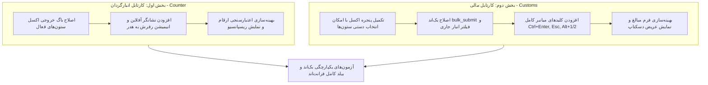

<div dir="rtl" align="right">

# 📋 طرح جامع ارتقا و رفع کلیه ایرادات کارتابل انبارگردان و کارتابل مالی

این طرح فنی به صورت تفکیک‌شده در دو بخش مستقل (**کارتابل انبارگردان** و **کارتابل مالی**) و در فازهای مشخص، به برطرف‌سازی کلیه ایرادات منطقی، باگ‌های همگام‌سازی اکسل، بهینه‌سازی‌های ظاهری و تعاملی (UI/UX) و ارتقای کلیدهای میانبر می‌پردازد.

---

## 🏗️ معماری و دیاگرام جریان داده‌ها و اصلاحات



---

## 📌 بخش اول: طرح ارتقا و رفع ایرادات کارتابل انبارگردان (Counter Dashboard)

### 🎯 اهداف بخش اول:
1. رفع باگ منطقی عدم ارسال ستون‌های فعال (`visible`) در خروجی اکسل.
2. افزودن نشانگر وضعیت صف آفلاین (`<app-offline-pending-badge />`) به هدر اصلی.
3. اضافه کردن انیمیشن چرخش (`animate-spin`) به دکمه رفرش هنگام بارگذاری.
4. اعتبارسنجی دقیق‌تر ارقام اعشاری و بهبود ظاهر دکمه‌های فرم جزئیات.

---

### 📂 فاز ۱.۱: اصلاح باگ منطقی خروجی اکسل ستون‌های فعال (Excel Export Fix)
- **مسئله:** در متد `executeExport()` در [counter-dashboard.ts](file:///e:/warehouse%20project/warehouse-front/src/app/components/counter/counter-dashboard/counter-dashboard.ts#L1541)، هنگام انتخاب گزینه «ستون‌های فعال در این کارتابل» (`exportColumnScope === 'visible'`)، آرایه `payload.columns_list` پر نمی‌شود و فایل با تمام ستون‌های دیتابیس صادر می‌شود.
- **اقدام:** 
  - در [counter-dashboard.ts](file:///e:/warehouse%20project/warehouse-front/src/app/components/counter/counter-dashboard/counter-dashboard.ts)، منطق استخراج ستون‌های قابل مشاهده از `fieldConfigs` اضافه می‌شود:
    ```typescript
    else if (this.exportColumnScope === 'visible') {
      payload.columns_list = this.fieldConfigs.filter(f => f.visible).map(f => f.key);
    }
    ```
  - در [counter-dashboard.html](file:///e:/warehouse%20project/warehouse-front/src/app/components/counter/counter-dashboard/counter-dashboard.html#L857)، گزینه رادیویی سه حالته هماهنگ با کارتابل مالی تعبیه می‌شود (`all_db`، `visible`، `custom`).

---

### 📂 فاز ۱.۲: اصلاحات ظاهری هدر و بازخوردها (Header & Visual Feedback)
- **مسئله:** در هدر [counter-dashboard.html](file:///e:/warehouse%20project/warehouse-front/src/app/components/counter/counter-dashboard/counter-dashboard.html#L20)، نشانگر وضعیت صف آفلاین وجود ندارد و دکمه رفرش فاقد انیمیشن چرخش هنگام `isLoading` است.
- **اقدام:**
  - افزودن `<app-offline-pending-badge />` در کنار دکمه‌های هدر کارتابل انبارگردان.
  - اضافه کردن `[class.animate-spin]="isLoading"` به آیکون SVG در دکمه رفرش هدر.
  - اعتبارسنجی ورود ارقام اعشاری در متد `saveDraft()` و `submitDirectlyToSupervisor()`.

---

### 📂 فاز ۱.۳: ارتقای تعاملات، تایم‌لاین و نمایش ریسپانسیو (UX & Layout)
- **اقدام:**
  - بهینه‌سازی نمایش کارت‌ها و فرم ثبت در مانیتورهای دسکتاپ.
  - هماهنگ‌سازی فونت و نشانگرهای تایم‌لاین بررسی‌ها با استایل مدرن.

---

## 📌 بخش دوم: طرح ارتقا و رفع ایرادات کارتابل مالی (Financial Cartable / Customs)

### 🎯 اهداف بخش دوم:
1. تکمیل رابط کاربری پنجره خروجی اکسل با افزودن گزینه «انتخاب دستی ستون‌ها» (`custom`) و چک‌باکس‌ها.
2. اصلاح متد `bulk_submit` بک‌اند جنگو جهت لحاظ کردن فیلتر انبار جاری (`warehouse_id`) هنگام ارسال همه موارد.
3. اضافه کردن لیسنر سراسری کلیدهای میانبر کیبورد (`@HostListener('window:keydown')`).
4. بهبود تجربه کاربری دسکتاپ و فرم مبالغ و تاریخ شمسی.

---

### 📂 فاز ۲.۱: تکمیل مودال خروجی اکسل (Excel Modal UI Enhancement)
- **مسئله:** در [customs.ts](file:///e:/warehouse%20project/warehouse-front/src/app/components/customs/customs.ts#L1405)، متغیرها و توابع ستون‌های سفارشی وجود دارد، اما در [customs.html](file:///e:/warehouse%20project/warehouse-front/src/app/components/customs/customs.html#L905) چک‌باکس‌ها و گزینه انتخاب دستی ستون‌ها در قالب غایب است.
- **اقدام:**
  - افزودن گزینه سوم رادیویی «انتخاب دستی ستون‌ها» در [customs.html](file:///e:/warehouse%20project/warehouse-front/src/app/components/customs/customs.html).
  - پیاده‌سازی گرید چک‌باکس‌های ستون‌های خروجی (`availableExportColumns`) به همراه قابلیت تیک زدن/برداشتن.

---

### 📂 فاز ۲.۲: اصلاح منطق بک‌اند در ارسال گروهی (Backend Warehouse Filtering)
- **مسئله:** در [views.py](file:///e:/warehouse%20project/warehouse-backend/inventory/views.py#L2537)، متد `bulk_submit` کارتابل مالی در صورت خالی بودن `task_ids`، فیلتر `warehouse_id` را روی کوئری‌ست اعمال نمی‌کند.
- **اقدام:**
  - در [views.py](file:///e:/warehouse%20project/warehouse-backend/inventory/views.py#L2535): دریافت پارامتر `warehouse_id` از `request.data` یا `query_params` و فیلتر کردن تسک‌های انبار مشخص.
  - در [customs.ts](file:///e:/warehouse%20project/warehouse-front/src/app/components/customs/customs.ts#L1217): ارسال `warehouse_id: this.state.appState.activeWarehouseId` در پی‌لود `bulkSubmit`.

---

### 📂 فاز ۲.۳: پیاده‌سازی کلیدهای میانبر جامع (Keyboard Shortcuts & Hotkeys)
- **اقدام:**
  - افزودن `@HostListener('window:keydown', ['$event'])` در [customs.ts](file:///e:/warehouse%20project/warehouse-front/src/app/components/customs/customs.ts):
    - `Escape`: بستن فرم جزئیات، مودال اکسل یا منوی سورت.
    - `Ctrl + Enter`: ذخیره پیش‌نویس در فرم جزئیات، دانلود اکسل در مودال، یا ارسال موارد انتخابی در لیست.
    - `Alt + 1` / `Alt + 2`: سوییچ آنی بین تب «تسک‌های من» و «استخر کالاها».
    - شنود مستقیم بارکدخوان فیزیکی (Hardware Wedge Scanner) با بافرینگ سریع.

---

### 📂 فاز ۲.۴: بهینه‌سازی فرم مبالغ و نمایش ریسپانسیو (Financial Forms & Layout)
- **اقدام:**
  - ارتقای چیدمان دو ستونه فرم در دسکتاپ و خوانایی اینپوت‌های پولی ۳ رقمی.
  - بهبود راهنمای فرمت تاریخ شمسی و دکمه محاسبه خودکار ارزش کل.

---

## 🔍 بخش سوم: برنامه راستی‌آزمایی و آزمون‌ها (Verification Plan)

### ۱. تست‌های خودکار بک‌اند:
```bash
python manage.py test inventory.tests_docs --keepdb
```
- بررسی پاس شدن ۱۰۰٪ تمامی تست‌های اسناد، ارجاع، ارسال گروهی و تاییدات سرپرست/مدیر.

### ۲. تست بیلد فرانت‌اند:
```bash
npm run build
```
- اطمینان از تولید موفق باندل انگولار بدون هیچ‌گونه خطای تایپ‌اسکریپت یا قالب.

### ۳. بررسی دستی عملکردی:
- تست خروجی اکسل در هر ۳ حالت (کل دیتابیس، ستون‌های فعال، انتخاب دستی ستون‌ها) در هر دو کارتابل.
- تست کلیدهای میانبر (`Ctrl+Enter`، `Esc`، `Alt+1`، `Alt+2`) در مرورگر.
- تست واکنش‌گرایی و انیمیشن رفرش و نشانگر آفلاین در هدر.

---

## 📁 فایل‌های مشمول تغییرات

| نام فایل | بخش مربوطه | نوع تغییر |
| :--- | :--- | :---: |
| [counter-dashboard.ts](file:///e:/warehouse%20project/warehouse-front/src/app/components/counter/counter-dashboard/counter-dashboard.ts) | کارتابل انبارگردان | اصلاح اکسل ستون‌های فعال + اعتبارسنجی |
| [counter-dashboard.html](file:///e:/warehouse%20project/warehouse-front/src/app/components/counter/counter-dashboard/counter-dashboard.html) | کارتابل انبارگردان | افزودن نشان آفلاین + انیمیشن رفرش + مودال اکسل |
| [customs.ts](file:///e:/warehouse%20project/warehouse-front/src/app/components/customs/customs.ts) | کارتابل مالی | افزودن کلیدهای میانبر + ارسال انبار به بک‌اند |
| [customs.html](file:///e:/warehouse%20project/warehouse-front/src/app/components/customs/customs.html) | کارتابل مالی | افزودن انتخاب دستی ستون‌ها در اکسل + ریسپانسیو |
| [views.py](file:///e:/warehouse%20project/warehouse-backend/inventory/views.py) | بک‌اند جنگو | فیلتر انبار در `bulk_submit` کارتابل مالی |

</div>
