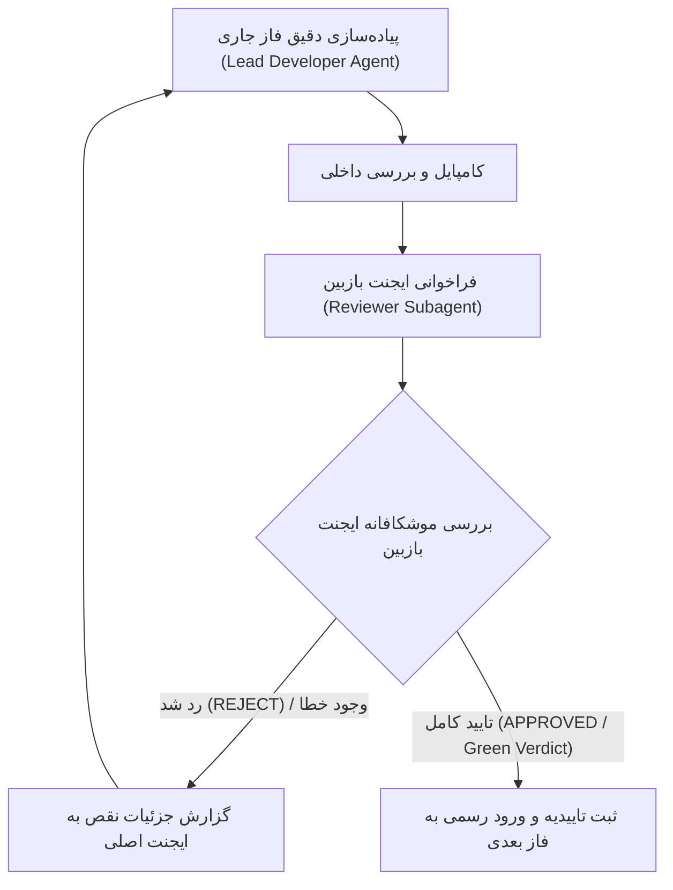

<div dir="rtl" align="right">

# طرح جامع و ارتقایافته معماری یکسان‌سازی کارتابل‌ها و کارت‌ها (V2.0)
### مبتنی بر استانداردهای کارتابل انبارگردان و سازوکار بازبینی دو ایجنته (Multi-Agent Verification Gatekeeper)

این سند، نقشه راه اجرایی و مهندسی‌شده یکسان‌سازی کارتابل‌های عملیاتی سامانه (**انبارگردان، مالی/گمرک، سرپرست، مدیر**) بر اساس واژگان، تب‌ها و فیلترهای استاندارد کارتابل انبارگردان را تبیین می‌نماید.

---

## ۱. جدول تطبیقی اصطلاحات و عناوین تب‌ها (Single Source of Truth)

### ۱.۱. عناوین تب‌های اصلی (Primary Tabs)
* **تب اول:** `تسک‌های من` (`my-tasks`) — وظایف اختصاص‌یافته به کاربر جاری.
* **تب دوم:** `مخزن کالاها / مخزن اسناد` (`pool`) — وظایف آزاد و مشترک در استخر عمومی.
* **سوئیچر حوزه (مخصوص سرپرست و مدیر):** سگمنت دوگانه مدرن `شمارش فیزیکی` | `اسناد مالی و گمرکی`.

### ۱.۲. چیپ‌های وضعیت و فیلترها (Status Chips)

| عنوان فارسی در UI (مبنا: انبارگردان) | کلید وضعیت فنی | معنا در انبارگردان | معنا در مالی/گمرک | معنا در سرپرست | معنا در مدیر |
| :--- | :--- | :--- | :--- | :--- | :--- |
| **در انتظار** | `pending` | کالا شمارش‌نشده | سند ثبت‌نشده | اقلام منتظر اقدام متصدی | اقلام فاقد اقدام اولیه |
| **بررسی مجدد** | `recount` | رد شده / نیاز به بازشماری | رد شده / نیاز به اصلاح سند | اقلام عودت‌داده‌شده به متصدی | اقلام دارای مغایرت تاییدنشده |
| **آماده ارسال / آماده بررسی** | `initial` / `ready` | شمارش ثبت‌شده، آماده ارسال | سند ثبت‌شده، آماده تایید | اقلام در صف تایید سرپرست | اقلام تاییدشده توسط سرپرست |
| **ارسال شده / تایید شده** | `completed` | ارسال‌شده و مختومه | تایید و ثبت نهایی سند | اقلام تاییدشده و خاتمه‌یافته | اقلام نهایی و بدون مغایرت |
| **همه موارد** | `all` | کل اقلام بدون فیلتر | کل اسناد بدون فیلتر | کل اقلام انبار | نمای جامع کل موجودی انبار |

---

## ۲. معماری کارت ماژولار ۴ لایه (Unified 4-Layer Modular Card)

```text
┌──────────────────────────────────────────────────────────────────────────────────────────┐
│ [لایه ۱: سربرگ کارت]  [چک‌باکس انتخاب]  [کد کالا / ردیف RTI]   [بج مرحله]   [چیپ وضعیت]      │
├──────────────────────────────────────────────────────────────────────────────────────────┤
│ [لایه ۲: بدنه اطلاعات کالا]  نام کالا  |  لوکیشن و قفسه فیزیکی  |  بارکد و واحد سنجش        │
├──────────────────────────────────────────────────────────────────────────────────────────┤
│ [لایه ۳: اسلات اختصاصی نقش - Role-Specific Slot]                                        │
│   • انبارگردان: [باکس ثبت تعداد (Blind)] + [کیپد عددی سریع] + [یادداشت] + [فیلدهای فنی]    │
│   • مالی:       [فاکتور + تاریخ + مبالغ ارزی/ریالی + نرخ ارز + آپلود پیوست]              │
│   • سرپرست:     [مقدار شمارش‌شده متصدی] + [دکمه تایید سبز] + [دکمه رد قرمز با ثبت علت]   │
│   • مدیر:       [ماتریس مقایسه ۳ گانه (شمارش/سیستم/سند) + تراز ریالی] + [تایید نهایی مغایرت] │
├──────────────────────────────────────────────────────────────────────────────────────────┤
│ [لایه ۴: فوتر ابزارها]  [تاریخچه گردش کار]  [اسکن بارکد]  [فیلدهای داینامیک]  [وضعیت آفلاین]  │
└──────────────────────────────────────────────────────────────────────────────────────────┘
```

---

## ۳. پروتکل تضمین کیفیت و گیت بازبینی دو ایجنته (Multi-Agent Verification Gatekeeper)



---

## ۴. فازبندی تفصیلی و معیارهای پذیرش (Phased Roadmap)

### 🔹 فاز ۱: پایه‌ریزی ساختار مشترک تب‌ها، فیلترها و پوسته کارت
* **شرح اقدامات:** مدل تایپ‌های مشترک، کامپوننت اشتراکی هدر و فیلترها، کامپوننت پوسته ۴ لایه کارت.
* **فایل‌های اصلی:** `cartable.model.ts`, `CartableHeaderComponent`, `CartableCardBaseComponent`.
* **شرط عبور از گیت ایجنت بازبین (Gatekeeper Check 1):** عدم وجود خطای کامپایل، بدون وابستگی چرخه‌ای، پاس شدن تست بیلد.

### 🔹 فاز ۲: ارتقا و هماهنگ‌سازی کارتابل‌های عملیاتی (انبارگردان و مالی)
* **شرح اقدامات:** اتصال `CounterDashboard` و `Customs` به پوسته جدید و تزریق اسلات‌های اختصاصی.
* **فایل‌های اصلی:** `counter-dashboard.ts/.html`, `customs.ts/.html`.
* **شرط عبور از گیت ایجنت بازبین (Gatekeeper Check 2):** عملکرد صحیح ورود داده، ثبت شمارش، بارکد اسکنرها و حفظ Blind Count.

### 🔹 فاز ۳: ارتقا و هماهنگ‌سازی کارتابل‌های نظارتی (سرپرست و مدیر)
* **شرح اقدامات:** پیاده‌سازی سوئیچر دوگانه حوزه، اسلات تایید/رد سرپرستی و اسلات ماتریس مغایرت مدیریتی.
* **فایل‌های اصلی:** `supervisor-dashboard.ts/.html`, `manager-review.ts/.html`.
* **شرط عبور از گیت ایجنت بازبین (Gatekeeper Check 3):** عملکرد بی‌نقص تاییدها، رد به بازشماری، اکشن‌های گروهی و ماتریس مقایسه‌ای.

### 🔹 فاز ۴: تست جامع یکپارچگی، رویدادهای زنده و اعتبارسنجی نهایی
* **شرح اقدامات:** تست E2E وب‌سوکت، فلش زنده کارت‌ها، عملکرد آفلاین و همگام‌سازی IndexedDB.
* **شرط عبور از گیت ایجنت بازبین (Gatekeeper Check 4 - Final Sign-off):** تایید ۱۰۰٪ پایداری کل چرخه انبارگردانی.

</div>
