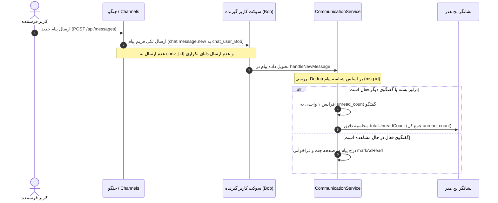

# طرح رفع اختلال شمارش بج خوانده‌نشده و جلوگیری از دریافت فریم‌های تکراری پیام (Chat Badge & Frame Dedup Fixes)

<div dir="rtl" align="right">

این مستند طرح جامع برای رفع مشکل شمارش مضاعف بج خوانده‌نشده (۲ برابر یا ۳ برابر شدن عدد نوتیفیکیشن هدر) و ارسال رویداد `leave_conversation` جهت خروج تمیز از روم‌های وب‌سوکت را تشریح می‌کند.

---

## ۱. تبیین مسئله و تحلیل ریشه‌ای (Root Cause Analysis)

### ۱.۱. باگ شمارش دوبرابری (Double Counting)
1. در بک‌اند (`broadcast.py:42–58`)، به ازای هر پیام جدید ۲ فریم مجزا به کانال شخصی مخاطب (`chat_user_{p_id}`) فرستاده می‌شود:
   - فریم اول: `chat_message_broadcast` (با رویداد `chat.message.new`)
   - فریم دوم: `chat_unread_update` (با رویداد `chat.unread_badge` و مقدار `delta: 1`)
2. در فرانت‌اند (`communication.service.ts`):
   - دریافت فریم اول در `handleNewMessage` مقدار `totalUnreadCount` را ۱ واحد افزایش می‌دهد (خط ۸۱۵).
   - دریافت فریم دوم در هندلر سوکت مقدار `totalUnreadCount` را مجدداً با `payload.data.delta` (+1) افزایش می‌دهد (خط ۳۴۷).
3. **نتیجه:** به ازای هر پیام ورودی، شمارنده بج ۲ واحد بالا می‌رود.

### ۱.۲. تشدید به شمارش سه‌برابری با فریم تکراری (Missing `leave_conversation`)
1. متد `broadcast_message_ws` علاوه بر کانال اختصاصی کاربر، پیام را به روم گفتگو (`conv_{conv_id}`) نیز ارسال می‌کند.
2. با باز کردن هر گفتگو در فرانت‌اند، رویداد `join_conversation` فرستاده می‌شود، اما هنگام بستن دراور، بازگشت به لیست، یا تغییر چت فعال، هیچ‌گاه `leave_conversation` ارسال نمی‌شود.
3. در نتیجه، کاربر در تمام روم‌های قبلی عضو می‌ماند و فریم پیام یک‌بار از روم `conv_{conv_id}` و یک‌بار از `chat_user_{id}` می‌رسد (+2 در `handleNewMessage`) و فریم دلتا نیز می‌رسد (+1) → **مجموعاً ۳ واحد به ازای هر پیام!**

---

## ۲. راهکار پیشنهادی (Proposed Architecture)



---

## ۳. تغییرات پیشنهادی در فایل‌ها (Proposed Changes)

| ردیف | لایه | فایل | نوع تغییر | شرح تغییرات |
| :--- | :--- | :--- | :---: | :--- |
| ۱ | بک‌اند | `communications/broadcast.py` | اصلاح | ارسال پیام فقط به کانال‌های اعضای گفتگو (`chat_user_{p_id}`) و حذف برودکست تکراری به `conv_{id}` و حذف دلتای تکراری |
| ۲ | بک‌اند | `communications/broadcast.py` | اصلاح | تصحیح `broadcast_message_updated_ws` و `broadcast_read_receipt_ws` جهت عدم ارسال تکراری |
| ۳ | فرانت‌اند | `communication.service.ts` | اصلاح | افزودن متد `leaveConversation(convId)` و فراخوانی در زمان سوئیچ یا بستن چت |
| ۴ | فرانت‌اند | `communication.service.ts` | اصلاح | گارد Deduplication در `handleNewMessage` با `Set<string>` برای جلوگیری از پردازش چندباره یک پیام |
| ۵ | فرانت‌اند | `communication.service.ts` | اصلاح | محاسبه همگام `totalUnreadCount` بر مبنای مجموع `unread_count` مکالمات و حذف افزونگی `+1` موازی |
| ۶ | فرانت‌اند | `chat-drawer.component.ts` | اصلاح | خروج تمیز از روم با فراخوانی `leaveConversation` در `backToList()` و `closeDrawer()` |
| ۷ | فرانت‌اند | `communication.service.spec.ts` | تست | به‌روزرسانی و افزودن تست‌های شمارش دقیق بج و ارسال `leave_conversation` |

---

## ۴. برنامه راستی‌آزمایی (Verification Plan)

### ۴.۱. تست‌های خودکار (Automated Tests)
- اجرای تست‌های سرور جنگو:
  ```powershell
  python manage.py test communications.tests
  ```
- اجرای تست‌های کامپوننت فرانت‌اند Angular:
  ```powershell
  npm test -- --include src/app/core/services/communication.service.spec.ts --watch=false
  ```

### ۴.۲. راستی‌آزمایی دستی (Manual Verification)
- ارسال یک پیام در چت دونفره و بررسی شمارنده بج هدر (افزایش دقیقاً ۱ واحد).
- باز و بسته کردن چندین گفتگو و ارسال پیام در آنها برای اطمینان از عدم دریافت فریم مضاعف و باقی نماندن در روم‌ها.

</div>
