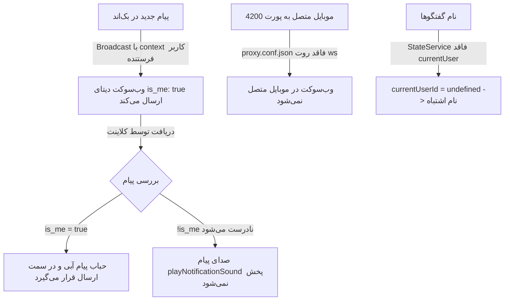

<div dir="rtl" align="right">

# 🛠️ طرح اجرایی رفع خطاهای سیستم مکالمات سازمانی

این سند، طرح مهندسی گام‌به‌گام برای رفع ۳ مشکل گزارش‌شده در سیستم چت و پیام‌رسان سازمانی را ارائه می‌دهد:
1. عدم پخش صدای نوتیفیکیشن پیام‌های دریافتی
2. عدم دریافت پیام‌های زنده در گوشی موبایل بدون خروج و ورود مجدد
3. قرار گرفتن پیام‌های هر دو طرف در یک جهت (سمت ارسال‌کننده / آبی) و نمایش عنوان تکراری «مدیر شرکت» برای تمام گفتگوها

---

## 🔍 تحلیل ریشه‌ای مشکلات و راهکارها



### ۱. مشکل صدای نوتیفیکیشن و هم‌راستایی حباب پیام‌ها
- **ریشه:** در `broadcast.py`، متد سریالایز با استفاده از `request` کاربر فرستنده صدا زده می‌شود؛ بنابراین `is_me` برای همه کاربران `true` می‌شود. در فرانت‌اند نیز `!msg.is_me` برای شرط صدا و چیدمان استایل استفاده شده که به اشتباه `true` تلقی می‌گردد.
- **راهکار:** 
  1. در بک‌اند، برودکست وب‌سوکت بدون کانتکست فرستنده انجام شود یا `is_me` در دیتای عمومی وب‌سوکت حذف/خنثی گردد.
  2. در فرانت‌اند `communication.service.ts`، به هنگام دریافت پیام، مقدار `is_me` بر اساس شناسه واقعی کاربر لاگین‌شده مجدداً محاسبه شود (`msg.is_me = (msg.sender === this.getCurrentUserId())`).

### ۲. مشکل وب‌سوکت در موبایل
- **ریشه:** فایل `proxy.conf.json` روت `"/ws"` را به `http://127.0.0.1:8000` با فلگ `"ws": true` نگاشت نکرده است. همچنین مرورگر موبایل هنگام قفل صفحه اتصال سوکت را قطع می‌کند.
- **راهکار:** 
  1. افزودن بلوک `"/ws"` با `"ws": true` به `proxy.conf.json`.
  2. اضافه کردن لیسنر `visibilitychange` به `CommunicationService` تا هنگام باز شدن قفل صفحه یا بازگشت به تب، وضعیت کانکشن بلافاصله بررسی و رفرش شود.

### ۳. مشکل نمایش نام مخاطب در گفتگوها
- **ریشه:** در `chat-drawer.component.ts`، از `this.state.appState.currentUser?.id` استفاده شده که تعریف نشده است و باعث می‌شود همیشه اولین عضو (مدیر شرکت) به عنوان نام مخاطب انتخاب شود.
- **راهکار:** تزریق `AuthService` و استفاده از `this.auth.user()?.id` برای پیدا کردن دقیق طرف مقابل گفتگو.

---

## 📂 فایل‌های هدف و تغییرات پیشنهادی

### [بک‌اند] Backend (`warehouse-backend`)

#### [MODIFY] `warehouse-backend/communications/broadcast.py`
- حذف ارسال کانتکست `request` دارای کاربر به `MessageSerializer` در توابع `broadcast_message_ws` و `broadcast_message_updated_ws` تا فیلد `is_me` به صورت پیش‌فرض `False` برودکست شود و کلاینت‌ها بر اساس هویت خود تصمیم بگیرند.

---

### [فرانت‌اند] Frontend (`warehouse-front`)

#### [MODIFY] `warehouse-front/proxy.conf.json`
- اضافه کردن روت پروکسی برای سوکت:
```json
"/ws": {
  "target": "http://127.0.0.1:8000",
  "ws": true,
  "changeOrigin": true,
  "secure": false
}
```

#### [MODIFY] `warehouse-front/src/app/core/services/communication.service.ts`
- اضافه کردن متد کمکی برای دریافت شناسه کاربر لاگین‌شده از توکن JWT یا `localStorage`.
- در متدهای `handleNewMessage` و `handleUpdatedMessage`، محاسبه مستقیم `msg.is_me = (msg.sender === currentUserId)`.
- تصحیح شرط اجرای `playNotificationSound()` تا برای پیام‌های دریافتی از دیگران صددرصد صدا پخش شود.
- اضافه کردن شنود رویدادهای `document.addEventListener('visibilitychange')` و `window.addEventListener('online')` برای اتصال مجدد هوشمند در موبایل.

#### [MODIFY] `warehouse-front/src/app/components/communications/chat-drawer/chat-drawer.component.ts`
- تزریق `AuthService` در کامپوننت.
- اصلاح تابع `getConversationTitle(conv)` با استفاده از شناسه کاربر جاری از `auth.user()?.id`.

---

## 🧪 برنامه اعتبارسنجی (Verification Plan)

### ۱. تست‌های خودکار (Automated Tests)
- اجرای تست‌های بک‌اند چت:
  ```powershell
  python manage.py test communications
  ```
- بررسی بیلد فرانت‌اند برای اطمینان از سلامت تایپ‌ها:
  ```powershell
  npx ng build --configuration=development --no-progress
  ```

### ۲. تست‌های رفتاری (Manual / Behavior Tests)
- تست ارسال پیام از کاربر A به کاربر B:
  - پیام در صفحه کاربر A: آبی، سمت ارسال‌کننده، بدون صدا.
  - پیام در صفحه کاربر B: سفید، سمت دریافت‌کننده، پخش واضح صدای نوتیفیکیشن.
- تست لیست گفتگوها: بررسی نمایش صحیح نام همکار مخاطب در لیست گفتگوها به جای «مدیر شرکت».
- تست شبیه‌ساز موبایل / اتصال از شبکه محلی: برقراری موفق وب‌سوکت روی پورت 4200 و دریافت آنی پیام‌ها.

</div>
