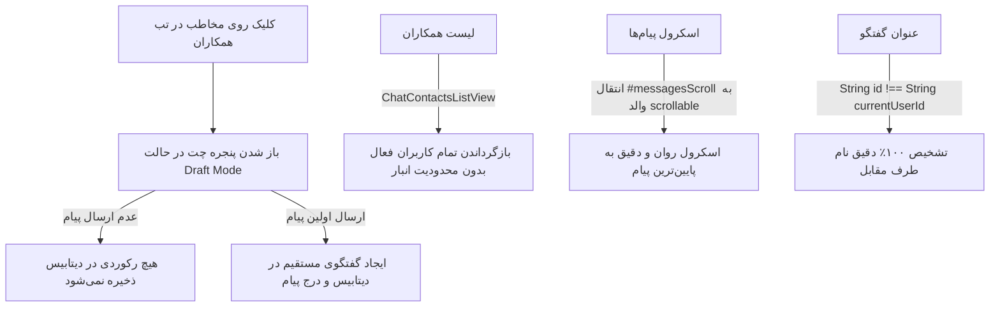

# 🛠️ طرح اجرایی جامع رفع بازخوردهای سیستم مکالمات سازمانی (نسخه ۲)

این سند، طرح مهندسی گام‌به‌گام برای رفع ۴ مورد توافق‌شده در مصاحبه طراحی چت را ارائه می‌دهد:
1. نمایش تمام همکاران در تب «همکاران انبار» روی موبایل و دسکتاپ
2. رفع قطعی باگ نام مخاطب و مقایسه دقیق نوع داده شناسه کاربر
3. اسکرول خودکار و روان به انتهای صفحه هنگام ارسال یا دریافت پیام
4. پیاده‌سازی حالت گفتگوی موقت (Draft Mode) جهت جلوگیری از ایجاد گفتگوهای خالی با کلیک روی مخاطب

---

## 🔍 جزئیات راهکارهای فنی

### ۱. نمایش تمام همکاران در تب همکاران (Contacts List)
- **بک‌اند (`ChatContactsListView`):** بازگرداندن تمام کاربران فعال (`is_active=True`) به جز کاربر درخواست‌دهنده، بدون اعمال فیلتر انبار تا لیست در تمام کلاینت‌ها (موبایل و کامپیوتر) پر باشد.

### ۲. رفع باگ عنوان گفتگوها («مدیر شرکت»)
- **فرانت‌اند (`chat-drawer.component.ts`):** 
  - استفاده از `String(p.id) !== String(currentUserId)` جهت جلوگیری از خطای عدم تطابق نوع داده (String vs Number).
  - در صورت یک‌نفره بودن گفتگو یا عدم یافتن طرف مقابل، استفاده از نام مخاطب تارگت.

### ۳. اسکرول خودکار به آخرین پیام (Auto-Scroll to Bottom)
- **فرانت‌اند (`chat-drawer.component.html` و `.ts`):**
  - انتقال رفرنس `#messagesScroll` به کانتینر والد اسکرول‌پذیر دارای کلاس `overflow-y-auto`.
  - اجرای اسکرول در `AfterViewChecked` و همچنین بلافاصله پس از ارسال/دریافت پیام با `behavior: 'smooth'`.

### ۴. حالت گفتگوی موقت و پاکسازی گفتگوهای خالی (Draft Mode)
- **فرانت‌اند:** متد `startDirectChat` یک آبجکت `Draft Conversation` موقت در حافظه کلاینت می‌سازد (`id: 'draft-temp'`) و تب را به `chat` می‌برد بدون فراخوانی API ساخت گفتگو در دیتابیس.
- هنگامی که کاربر اولین پیام را ارسال می‌کند، متد `sendMessage` ابتدا گفتگوی واقعی را در سرور می‌سازد و سپس پیام را در آن درج می‌کند.
- **بک‌اند (`ConversationViewSet`):** فیلتر کردن گفتگوهای خالی (`messages__isnull=True` برای گفتگوهای مستقیم قدیمی فاقد پیام) در لیست گفتگوها.

---

## 📂 فایل‌های هدف و تغییرات

### [بک‌اند] Backend (`warehouse-backend`)

#### [MODIFY] `warehouse-backend/communications/views.py`
- در `ChatContactsListView`: بازگرداندن تمامی کاربران فعال سیستم.
- در `ConversationViewSet.get_queryset`: حذف یا فیلتر گفتگوهای مستقیم که هیچ پیامی در آن‌ها ارسال نشده است.

---

### [فرانت‌اند] Frontend (`warehouse-front`)

#### [MODIFY] `warehouse-front/src/app/components/communications/chat-drawer/chat-drawer.component.html`
- انتقال رفرنس `#messagesScrollContainer` به المان دارای `overflow-y-auto`.

#### [MODIFY] `warehouse-front/src/app/components/communications/chat-drawer/chat-drawer.component.ts`
- بازنویسی `startDirectChat` برای حالت Draft Mode (عدم ثبت در دیتابیس تا زمان ارسال اولین پیام).
- بازنویسی `sendMessage` برای هندل کردن چت‌های Draft و ارتقای آن به چت ذخیره‌شده واقعی.
- اصلاح تابع `getConversationTitle` با مقایسه رشته‌ای شناسه‌ها (`String(p.id) !== String(currentUserId)`).
- بهبود متد `scrollToBottom` برای اسکرول روان به انتها.

---

## 🧪 برنامه اعتبارسنجی (Verification Plan)

### ۱. تست‌های خودکار
- اجرای تست‌های چت بک‌اند: `python manage.py test communications`
- اجرای تست‌های واحد فرانت‌اند: `npx vitest run src/app/core/services/communication.service.spec.ts`
- بررسی بیلد بدون خطا: `npx ng build --configuration=development --no-progress`

### ۲. تست‌های رفتاری
- بررسی تب همکاران روی شبیه‌ساز موبایل/کامپیوتر و اطمینان از نمایش لیست کامل پرسنل.
- کلیک روی یک مخاطب جدید بدون ارسال پیام و بازگشت به لیست: اطمینان از عدم ایجاد گفتگوی خالی.
- ارسال پیام جدید در چت: حرکت خودکار و روان اسکرول به پایین و رویت آخرین پیام.
- بررسی لیست چت‌ها: اطمینان از نمایش نام واقعی مخاطب به جای «مدیر شرکت».

