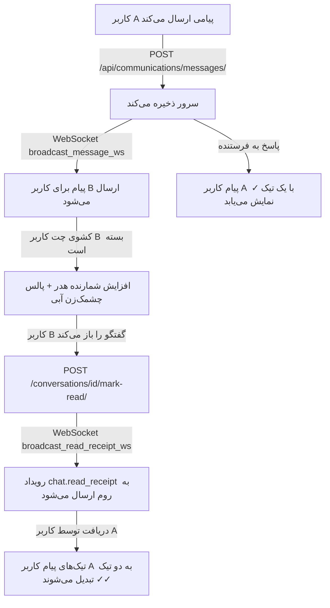

# 🛠️ طرح اجرایی جامع سیستم مکالمات سازمانی (نسخه ۳ - کامل)

این سند، طرح مهندسی نهایی برای پیاده‌سازی و اصلاح ۶ محور کلیدی سیستم چت بر اساس مصاحبه طراحی را ارائه می‌دهد:
1. نمایش کامل کاربران در تب «همکاران انبار» روی موبایل و دسکتاپ
2. رفع قطعی باگ نام مخاطب در گفتگوهای دو‌نفره
3. اسکرول خودکار و روان به انتهای پنجره پیام‌ها
4. پیاده‌سازی حالت گفتگوی موقت (Draft Mode) جهت جلوگیری از ایجاد چت‌های خالی
5. اصلاح بج پیام‌های خوانده‌نشده در هدر (نمایش عدد + پالس چشمک‌زن پیام جدید)
6. پیاده‌سازی سیستم تک‌تیک (`✓` ارسال‌شده) و دو‌تیک (`✓✓` خوانده‌شده زنده با وب‌سوکت)

---

## 🔍 معماری و جریان داده‌ها

---

## 📂 تغییرات فایل‌ها و فازبندی

### [بک‌اند] Backend (`warehouse-backend`)

#### [MODIFY] `warehouse-backend/communications/views.py`
- **`ChatContactsListView`:** بازگرداندن تمام کاربران فعال سیستم (`is_active=True`) بدون اعمال فیلتر سختگیرانه انبار.
- **`ConversationViewSet.mark_as_read`:** پس از علامت‌گذاری خوانده‌شدن، فراخوانی `broadcast_read_receipt_ws(conversation, user)` جهت اطلاع‌رسانی بلادرنگ به فرستنده.
- **`ConversationViewSet.get_queryset`:** فیلتر کردن گفتگوهای مستقیم قدیمی که هیچ پیامی ندارند (`messages__isnull=True`).

#### [MODIFY] `warehouse-backend/communications/broadcast.py`
- افزودن تابع `broadcast_read_receipt_ws(conversation, reader_user)` برای برودکست رویداد `chat.read_receipt` شامل `{ conversation_id, reader_id }` به روم چت.
- اصلاح دیتای ارسالی `chat_unread_update` تا شمارنده مجموع یا رید-آنلی به درستی برودکست شود.

---

### [فرانت‌اند] Frontend (`warehouse-front`)

#### [MODIFY] `warehouse-front/src/app/core/services/communication.service.ts`
- شنود رویداد `chat.read_receipt`: به‌روزرسانی درجا فیلد `read_by_count` پیام‌های ارسالی کاربر در مکالمه فعال.
- اصلاح هندلر `chat.unread_badge` و `handleNewMessage`: عدم مارک-رید خودکار زمانی که کشوی چت بسته است (`!isChatDrawerOpen()`).
- اضافه کردن سیگنال پالس چشمک‌زن پیام جدید (`hasNewIncomingPulse`) که با باز شدن چت ریست می‌شود.

#### [MODIFY] `warehouse-front/src/app/components/communications/chat-drawer/chat-drawer.component.html`
- انتقال رفرنس تمپلیت `#messagesScroll` به المان والد دارای `overflow-y-auto`.
- به‌روزرسانی بخش وضعیت پیام ارسالی:
  - ⏳ ساعت شنی برای `delivery_status === 'pending'`
  - ⚠️ علامت خطا و دکمه تلاش مجدد برای `delivery_status === 'failed'`
  - `✓` تک‌تیک برای پیام ارسال‌شده به سرور ولی خوانده‌نشده (`read_by_count === 0`)
  - `✓✓` دو‌تیک برای پیام دیده و خوانده‌شده توسط مخاطب (`read_by_count > 0`)

#### [MODIFY] `warehouse-front/src/app/components/communications/chat-drawer/chat-drawer.component.ts`
- پیاده‌سازی Draft Mode در `startDirectChat` (باز شدن چت بدون رکورد دیتابیسی تا زمان ارسال اولین پیام).
- ارتقای چت Draft به چت پایدار سروری هنگام `sendMessage`.
- اصلاح تابع `getConversationTitle` با مقایسه رشته‌ای شناسه‌ها (`String(p.id) !== String(currentUserId)`).
- پیاده‌سازی اسکرول نرم `scrollTo({ top: scrollHeight, behavior: 'smooth' })`.

#### [MODIFY] `warehouse-front/src/app/components/layout/layout.html`
- پیاده‌سازی بج تعداد پیام‌های خوانده‌نشده روی آیکون چت هدر با افکت پالس چشمک‌زن هنگام رسیدن پیام جدید.

---

## 🧪 برنامه اعتبارسنجی (Verification Plan)

### ۱. تست‌های خودکار
- اجرای آزمون‌های بک‌اند: `python manage.py test communications`
- اجرای آزمون‌های فرانت‌اند: `npx vitest run src/app/core/services/communication.service.spec.ts`
- راستی‌آزمایی بیلد بدون خطا: `npx ng build --configuration=development --no-progress`

### ۲. تست‌های رفتاری
- **تست تب همکاران:** مشاهده لیست تمام همکاران در موبایل و کامپیوتر.
- **تست چت موقت:** کلیک روی مخاطب بدون ارسال پیام و بازگشت به لیست -> هیچ چت خالی ایجاد نمی‌شود.
- **تست اسکرول روان:** ارسال پیام طولانی و مشاهده اسکرول خودکار نرم به انتهای چت.
- **تست بج هدر:** بستن کشوی چت، ارسال پیام از کلاینت دیگر -> مشاهده عدد خوانده‌نشده و پالس چشمک‌زن در هدر بالای صفحه.
- **تست تک‌تیک و دو‌تیک:** ارسال پیام از کاربر A -> مشاهده تک‌تیک `✓`؛ سپس باز کردن چت توسط کاربر B -> تغییر آنی به دو‌تیک `✓✓` روی صفحه کاربر A.

