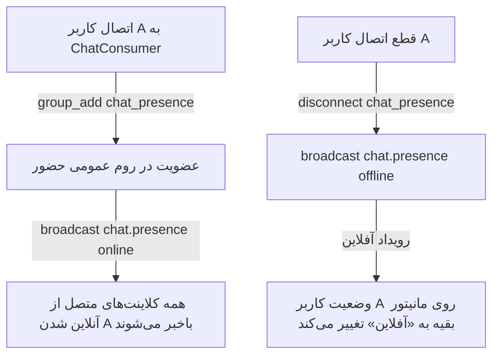

# 🛠️ طرح اجرایی سیستم حضور واقعی (Presence) و رفع نام مخاطب در موبایل (نسخه ۴)

این سند، طرح مهندسی گام‌به‌گام برای پیاده‌سازی سیستم حضور زنده (Real-Time Presence) و رفع قطعی عنوان چت در کلاینت موبایل را ارائه می‌دهد:
1. پیاده‌سازی سیستم آنلاین/آفلاین واقعی کاربران با چنلز وب‌سوکت و حذف برچسب استاتیک فیک
2. رفع قطعی باگ نام مخاطب در موبایل با نادیده گرفتن `conv.title` در چت‌های مستقیم و اصلاح استخراج شناسه از `localStorage`

---

## 🔍 معماری سیستم حضور زنده (Presence Architecture)

---

## 📂 تغییرات فایل‌ها و فازبندی

### [بک‌اند] Backend (`warehouse-backend`)

#### [MODIFY] `warehouse-backend/communications/consumers.py`
- در `ChatConsumer`:
  - هنگام `connect`: اضافه کردن کلاینت به گروه عمومی `chat_presence` و ارسال برودکست رویداد `chat.presence` با `status: 'online'` و `user_id`. همچنین ارسال پیام اولیه حاوی لیست شناسه‌های کاربران آنلاین به کلاینت تازه‌متصل‌شده.
  - هنگام `disconnect`: برودکست رویداد `chat.presence` با `status: 'offline'` و `user_id` به گروه `chat_presence`.
  - متد هندلر `chat_presence_event` برای ارسال رویداد حضور به وب‌سوکت کلاینت.

---

### [فرانت‌اند] Frontend (`warehouse-front`)

#### [MODIFY] `warehouse-front/src/app/core/services/communication.service.ts`
- اضافه کردن سیگنال `onlineUserIds = signal<Set<number>>(new Set())` جهت نگهداری کاربران آنلاین زنده.
- شنود رویدادهای `chat.presence` و `chat.online_users` در سوکت چت.
- تابع `isUserOnline(userId?: number | string): boolean`.
- اصلاح متد `getCurrentUserId()` با تبدیل قطعی شناسه‌های رشته‌ای به عدد (`Number(parsed.id)` و `Number(payload.user_id)`) جهت تضمین صحت شناسه در موبایل.

#### [MODIFY] `warehouse-front/src/app/components/communications/chat-drawer/chat-drawer.component.ts`
- اصلاح تابع `getConversationTitle`: در چت‌های دو‌نفره (`conv_type === 'direct'`) مستقیماً نام طرف مقابل جستجو شود و به `conv.title` سرور اتکا نشود.
- افزودن متد `isOtherUserOnline(): boolean` برای بررسی آنلاین بودن طرف مقابل گفتگوی جاری.

#### [MODIFY] `warehouse-front/src/app/components/communications/chat-drawer/chat-drawer.component.html`
- در هدر چت: جایگزینی متن هاردکد «آنلاین» با وضعیت واقعی:
  - اگر طرف مقابل تایپ می‌کند: «در حال نوشتن...» (سبز)
  - اگر طرف مقابل آنلاین است: نقطه سبز پالس‌دار + «آنلاین»
  - اگر آفلاین است: «آفلاین» (رنگ خنثی)
- در تب همکاران و لیست چت‌ها: نمایش نقطه سبز روی آواتار کاربرانی که هم‌اکنون آنلاین هستند.

---

## 🧪 برنامه اعتبارسنجی (Verification Plan)

### ۱. تست‌های خودکار
- اجرای آزمون‌های بک‌اند: `python manage.py test communications`
- اجرای آزمون‌های فرانت‌اند: `npx vitest run src/app/core/services/communication.service.spec.ts`
- راستی‌آزمایی بیلد نهایی: `npx ng build --configuration=development --no-progress`

### ۲. تست‌های رفتاری
- ورود با یک کاربر و مشاهده وضعیت «آنلاین» آن کاربر در کلاینت دیگر.
- خروج یا بستن مرورگر کاربر اول و مشاهده تغییر آنی وضعیت به «آفلاین» در کلاینت دوم.
- تست روی کلاینت موبایل: مشاهده نام صحیح طرف مقابل به جای «مدیر شرکت».

