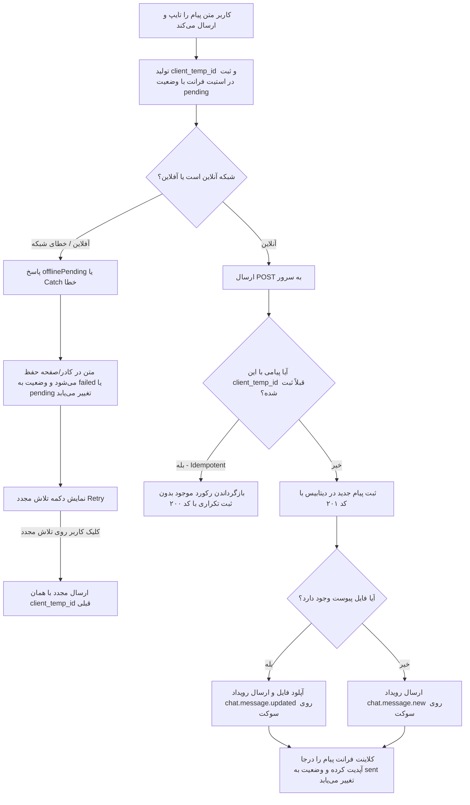

<div dir="rtl" align="right">

# 📦 طرح پیاده‌سازی بسته ۲: یکپارچگی داده، صف آفلاین و پایداری پیام‌ها (Package 2: Data Integrity & Delivery)

> [!NOTE]
> **نسخه:** ۱.۰ — ۲۴ اوت ۲۰۲۶ (۰۲ شهریور ۱۴۰۵)  
> **دامنه اجرایی:** فاز ۴ از سند جامع پایدارسازی ارتباطات  
> **سند بالادستی:** [implementation_plan_communication_hardening.md](implementation_plan_communication_hardening.md)  
> **هدف اصلی:** تضمین قطعی قاعده «داده کاربر هرگز از بین نمی‌رود». پیاده‌سازی Idempotency بر پایه `client_temp_id`، استیت سه‌حالته ارسال (`pending / sent / failed`) در فرانت، پیاده‌سازی Soft Delete در تمامی ViewSetها، سقف ۴۰۰۰ کاراکتری، Throttling و ثبت لاگ ممیزی در `AuditLog`.

---

## ۱. جدول فایل‌های تحت تغییر و ایجاد در بسته ۲

| لایه | مسیر فایل | نوع تغییر | شرح و هدف تغییر |
| :--- | :--- | :---: | :--- |
| **تست بک‌اند** | `warehouse-backend/communications/tests/test_integrity.py` | [NEW] | آزمون‌های جامع یکپارچگی، Idempotency، Soft Delete، Rate Limit، سقف طول و AuditLog (۸ تست) |
| **تست فرانت** | `warehouse-front/src/app/core/services/communication.service.spec.ts` | [MODIFY] | افزودن سناریوهای تست استیت شکست ارسال، تلاش مجدد (Retry)، مدیریت `_offlinePending` و رویداد آپدیت |
| **بک‌اند** | `warehouse-backend/communications/models.py` | [MODIFY] | افزودن قید یکتایی `UniqueConstraint` روی `(conversation, sender, client_temp_id)` در پیام‌ها |
| **بک‌اند** | `warehouse-backend/communications/views.py` | [MODIFY] | بازنویسی `create` با گارد Idempotency، پیاده‌سازی `perform_destroy` با `soft_delete()`، اعمال Scoped Throttling و ثبت `AuditLog` |
| **بک‌اند** | `warehouse-backend/communications/serializers.py` | [MODIFY] | اعمال محدودیت سقف کاراکتر (`max_length=4000`) در `MessageSerializer` و `GenericCommentSerializer` |
| **بک‌اند** | `warehouse-backend/communications/broadcast.py` | [MODIFY] | پیاده‌سازی تابع `broadcast_message_updated_ws` برای ارسال رویداد `chat.message.updated` |
| **بک‌اند** | `warehouse-backend/communications/consumers.py` | [MODIFY] | پشتیبانی از انواع رویدادهای برودکست پیام (`chat.message.new` و `chat.message.updated`) |
| **بک‌اند** | `warehouse-backend/config/settings.py` | [MODIFY] | پیکربندی `DEFAULT_THROTTLE_CLASSES` و نرخ‌های Scoped Throttling برای پیام، کامنت و آپلود |
| **فرانت‌اند** | `warehouse-front/src/app/core/services/communication.service.ts` | [MODIFY] | پیاده‌سازی استیت سه‌حالته (`pending / sent / failed`)، رفع باگ `_offlinePending`، متد `retryMessage` و دریافت رویداد `chat.message.updated` |
| **فرانت‌اند** | `warehouse-front/src/app/components/communications/chat-drawer/chat-drawer.component.html` | [MODIFY] | نمایش وضعیت‌های سه‌گانه پیام (🕒 در انتظار، ⚠️ خطا با دکمه تلاش مجدد، ✓✓ ارسال شده) بدون پاک شدن متن |
| **فرانت‌اند** | `warehouse-front/src/app/components/communications/chat-drawer/chat-drawer.component.ts` | [MODIFY] | افزودن متد `retrySend` برای فراخوانی سرویس با حفظ متن و شناسه موقت |

---

## ۲. جزئیات معماری و اقدامات بسته ۲ (فاز ۴)



### ۱. مکانیزم تضمین یکتایی (Idempotency via `client_temp_id` - ایراد ۱۸)
- **بک‌اند:**
  - در متد `MessageViewSet.create`: قبل از ایجاد رکورد، وجود پیامی با `(conversation_id, sender=request.user, client_temp_id=temp_id)` بررسی می‌شود. در صورت وجود، همان پیام بازگردانده شده و کد `200 OK` داده می‌شود.
  - در `MessageViewSet.perform_create`: در قالب تراکنش اتمیک ذخیره شده و قید یکتایی `UniqueConstraint` در مدل از تکثیر رکوردها در درخواست‌های همزمان محافظت می‌کند.
  - در `GenericCommentViewSet.create`: رفتار مشابه برای کامنت‌ها با کلید `(content_type, object_id, author, client_temp_id)`.
- **فرانت‌اند:**
  - متد `retryMessage` دقیقاً با همان `client_temp_id` اقدام به ارسال مجدد می‌کند تا حتی در صورت ثبت قبلی پیام در سرور و قطع شدن پاسخ در مسیر برگشت، رکوردی تکراری ایجاد نگردد.

### ۲. حذف نرم یکپارچه (Soft Delete - ایراد ۱۶)
- در هر سه ViewSet (`ConversationViewSet`, `MessageViewSet`, `GenericCommentViewSet`):
  - متد `perform_destroy(self, instance)` بازنویسی شده و به‌جای `instance.delete()`، متد `instance.soft_delete()` فراخوانی می‌شود.
  - رکوردها در جدول دیتابیس باقی مانده و تنها `is_deleted=True` می‌گردد.
  - کوئری‌های عمومی به‌دلیل استفاده از `ActiveManager` در `SyncModelMixin`، رکوردهای حذف‌شده را پنهان می‌کنند ولی تاریخچه و ممیزی سیستم دست‌نخورده باقی می‌ماند.

### ۳. سقف مجاز کاراکتر متن (Character Limit - ایراد ۱۴)
- در `MessageSerializer` و `GenericCommentSerializer` طول فیلد `text` به حداکثر ۴۰۰۰ کاراکتر محدود شده و در صورت ارسال بیش از آن، پاسخ `400 Bad Request` اعتبارسنجی بازگردانده می‌شود.

### ۴. محدودسازی نرخ درخواست‌ها (Scoped Rate Limiting / Throttling - ایراد ۱۳)
- در `config/settings.py` کلاس‌های `ScopedRateThrottle` تنظیم شده و Scopes زیر فعال می‌شوند:
  - `chat_message`: سقف ۶۰ پیام در دقیقه برای هر کاربر.
  - `chat_upload`: سقف ۲۰ آپلود پیوست در دقیقه برای هر کاربر.
  - `chat_comments`: سقف ۶۰ کامنت در دقیقه برای هر کاربر.
- در `MessageViewSet`، `GenericCommentViewSet` و اکشن `upload_attachment`، این اسکوپ‌ها متصل می‌شوند.

### ۵. لاگ ممیزی تغییرات حساس (Audit Trail - ایراد ۲۴)
- رویدادهای حذف پیام، ویرایش پیام، حذف گفتگو و حذف کامنت در مدل `accounts.AuditLog` با مشخصات زیر ثبت می‌شوند:
  - `user`: کاربر اقدام‌کننده.
  - `warehouse`: انبار مرتبط (در صورت وجود).
  - `module`: `'system'` یا `'docs'` (مرتبط با ارتباطات).
  - `action`: `'DELETE'` یا `'UPDATE'`.
  - `severity`: `'warning'` (برای حذف) یا `'info'` (برای ویرایش).
  - `target_model`, `target_object_id`, `before_state`, `after_state`.

### ۶. رویداد وب‌سوکت `chat.message.updated` (ایراد ۲۲)
- هنگام الصاق فایل به پیام موجود در `upload_attachment`:
  - تابع `broadcast_message_updated_ws(msg, request)` فراخوانی می‌شود.
  - رویداد وب‌سوکت با شناسه `chat.message.updated` ارسال می‌شود.
  - در فرانت‌اند، کلاینت با دریافت این رویداد، پیوست‌های پیام را بدون ایجاد پیام تکراری یا برهم خوردن ترتیب در استیت ادغام (Merge) می‌کند.

### ۷. استیت سه‌حالته ارسال و عدم فقدان داده در فرانت (ایرادات ۱۹ و ۲۰)
- مدل `ChatMessage` به فیلد `delivery_status: 'pending' | 'sent' | 'failed'` مجهز می‌شود.
- **رفتار در خطای شبکه:** اگر درخواست با خطا مواجه شود، پیام در آرایه `activeMessages$` باقی مانده و `delivery_status = 'failed'` می‌شود. کاربر دکمه «تلاش مجدد» (Retry) و وضعیت خطا را مشاهده می‌کند و متن پیام از کادر پاک نمی‌شود.
- **رفتار در حالت آفلاین (`_offlinePending`):** وضعیت پیام روی `pending` باقی می‌ماند و تیک دوم کاذب (✓✓) نشان داده نمی‌شود. همچنین متد `uploadAttachment` با شناسه نامعتبر فراخوانی نمی‌گردد.

---

## ۳. طرح آزمون‌های خودکار و دروازه راستی‌آزمایی (Verification Plan)

### الف) آزمون‌های جامع بک‌اند (`communications/tests/test_integrity.py`)
```powershell
cd "E:\warehouse project\warehouse-backend"
venv\Scripts\python.exe manage.py test communications.tests.test_integrity -v 2
```
شامل آزمون‌های:
1. `test_duplicate_client_temp_id_returns_same_message`: بررسی عدم تکرار پیام و بازگشت رکورد یکتا (Idempotency).
2. `test_replay_after_offline_queue_does_not_duplicate`: شبیه‌سازی Replay پیام از صف آفلاین.
3. `test_delete_message_is_soft`: راستی‌آزمایی `is_deleted=True` و حضور رکورد در `all_objects`.
4. `test_soft_deleted_message_hidden_from_list`: پنهان بودن پیام حذف‌شده در کوئری لیست پیام‌ها.
5. `test_delete_writes_audit_log`: بررسی ثبت رکورد ممیزی `AuditLog` پس از حذف پیام.
6. `test_text_over_limit_rejected`: بررسی رد پیام‌های با طول بیش از ۴۰۰۰ کاراکتر با خطای ۴۰۰.
7. `test_message_burst_is_throttled`: بررسی عملکرد Throttling و بازگرداندن خطای ۴۲۹ در ارسال رگباری.
8. `test_attachment_emits_updated_event`: بررسی ارسال رویداد وب‌سوکت `chat.message.updated` پس از بارگذاری پیوست.

### ب) آزمون‌های کلاینت فرانت‌اند (`communication.service.spec.ts`)
```powershell
cd "E:\warehouse project\warehouse-front"
npx ng test --include="**/communication.service.spec.ts"
```
شامل آزمون‌های:
1. `keeps text and marks failed on send error`: عدم فقدان متن و علامت‌گذاری پیام به وضعیت `failed`.
2. `retry reuses same client_temp_id`: استفاده مجدد از همان کلید یکتایی در تلاش مجدد.
3. `offline pending response stays pending (no false double-check)`: حفظ وضعیت در انتظار در آفلاین.
4. `does not call uploadAttachment with undefined id`: ممانعت از آپلود فایل در غیاب شناسه سرور.
5. `merges attachment from updated event`: ادغام تمیز پیوست‌ها پس از رویداد وب‌سوکت.

### ج) اجرای رگرسیون کلی آزمون‌های ارتباطات
```powershell
cd "E:\warehouse project\warehouse-backend"
venv\Scripts\python.exe manage.py test communications -v 2
```
تمامی ۳۸ تست قبلی بسته ۱ به‌همراه تست‌های جدید بسته ۲ باید با موفقیت (سبز) به پایان برسند.

</div>
