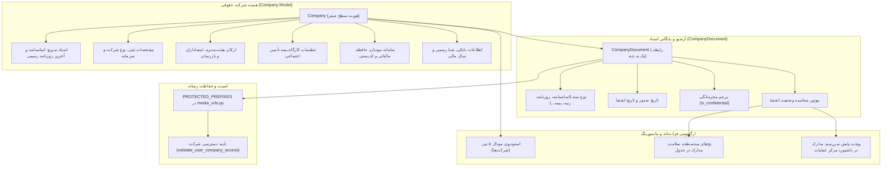
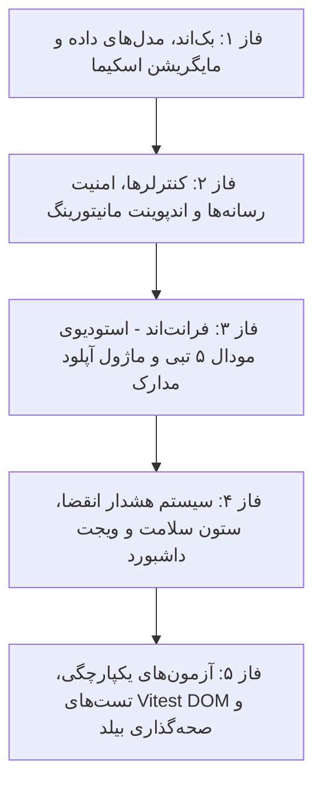

<div dir="rtl" align="right">

# طرح جامع شناسنامه حقوقی، بایگانی مدارک و پروفایل پیشرفته شرکت‌ها
## (Company Legal Profile, Document Archive, Fiscal Settings & Governance Plan)

**نسخه:** ۲.۰ (جامع و ارتقایافته بر اساس تحلیل عمیق پایگاه کد و الزامات قانون تجارت و امور مالیاتی)  
**تاریخ تدوین:** مهرماه ۱۴۰۵ (سپتامبر ۲۰۲۶)  
**مرجع تدوین:** مصوبات فرآیند ارزیابی کارشناسی و مصاحبه تصمیم‌گیری معماری (`/grill-me`)  
**مخاطب:** تیم توسعه، مدیران ارشد سیستم و معماران نرم‌افزار  

---

## ۱. بیانیه مسئله و ضرورت معماری (Executive Problem Statement)

در نسخه پایه، موجودیت شرکت (`Company`) در سیستم صرفاً شامل مشخصات مقدماتی (نام، کد، شناسه ملی، کد اقتصادی و تلفن) بوده است. اما در مقیاس یک هلدینگ اقتصادی چندشرکتی با فعالیت‌های پیمانکاری، لجستیکی و بازرگانی، شرکت‌ها نیازمند یک **«شناسنامه کامل حقوقی، مالی، بیمه‌ای و نظارتی»** هستند. بررسی دقیق ساختار جاری و نیازمندی‌های یکپارچه سامانه چالش‌های زیر را آشکار کرد:

1. **نبود بایگانی ساخت‌یافته اسناد حقوقی و رسمی:** اساسنامه شرکت، آگهی‌های تأسیس، روزنامه‌های رسمی آخرین تغییرات هیئت‌مدیره و صاحبان امضا، کارت بازرگانی، گواهی ارزش افزوده و مجوزهای بهره‌برداری در خارج از نرم‌افزار نگهداری می‌شوند و دسترسی مدیران، انبارداران و حسابداران به آن‌ها نامتمرکز است.
2. **ریسک حقوقی عدم تمدید و انقضای مجوزها:** طبق ماده ۱۰۹ لایحه اصلاحی قانون تجارت ایران، دوره تصدی هیئت‌مدیره حداکثر ۲ سال است؛ همچنین گواهی‌های صلاحیت پیمانکاری، کارت‌های بازرگانی و مجوزها دارای تاریخ انقضا هستند. انقضای بدون هشدار این مدارک منجر به مسدود شدن حساب‌های بانکی، عدم امکان ترخیص کالا از گمرک، جریمه‌های مالیاتی یا رد شدن در مناقصات می‌شود.
3. **ورود دستی و پراکنده اطلاعات کارگاهی بیمه تأمین اجتماعی:** در تولید دیسکت‌های بیمه موضوع استاندارد تأمین اجتماعی (`DSKKAR00.DBF` و `DSKWOR00.DBF`)، فیلدهایی نظیر کد کارگاه ۱۰ رقمی، نام و کد شعبه، ردیف پیمان و مشخصات کارفرما باید به صورت پویا از پروفایل شرکت حقوقی خوانده شوند، نه اینکه به صورت دستی یا هاردکد در سیستم تعریف گردند.
4. **الزامات قانون پایانه‌های فروشگاهی و سامانه مودیان:** شرکت‌ها برای صدور فاکتور الکترونیک و اتصال به کارپوشه سازمان امور مالیاتی نیازمند شناسه یکتای حافظه مالیاتی (۶ کاراکتر)، کلید اختصاصی امضای الکترونیک، کد پستی ۱۰ رقمی اقامتگاه قانونی و کد اقتصادی جدید ۱۶ رقمی هستند.
5. **فقدان اطلاعات خزانه‌داری مرکزی و تسویه پایا:** شماره شبای رسمی و حساب‌های بانکی معتبر هر شرکت باید در پروفایل آن متمرکز باشد تا در کارتابل خزانه‌داری و صدور دستور پرداخت گروهی حقوق و مطالبات تأمین‌کنندگان، حساب مبدأ به درستی مشخص باشد.
6. **امنیت و نشت احتمالی مدارک حقوقی محرمانه:** اسناد شرکت‌ها دارای دو سطح حساسیت هستند (اسناد عمومی نظیر گواهی رتبه در برابر اسناد کاملاً محرمانه نظیر قراردادهای مادر، صورتمجلس‌های سهامداران یا اظهارنامه‌های مالیاتی). سیستم باید اسناد محرمانه را از دید کاربران عادی مخفی و دسترسی دانلود آن‌ها را امن و مقید به احراز هویت کند.

---

## ۲. تصمیمات تثبیت‌شده در مصاحبه کارشناسی (Approved Architectural Decisions)

بر اساس فرآیند تعاملی مصاحبه (`/grill-me`) و انطباق با پایگاه کد جاری، اصول بنیادین زیر به تصویب رسید:

| محور تصمیم‌گیری | تصمیم مصوب نهایی | دلیل مهندسی و تجاری |
| :--- | :--- | :--- |
| **معماری مدارک** | **تلفیق دسترسی سریع روی مدل شرکت + آرشیو نامحدود `CompanyDocument`** | دسترسی یک‌کلیکه به دو سند پرکاربرد (اساسنامه و آخرین روزنامه رسمی) در کنار امکان بایگانی بی‌نهایت سند با تاریخ و متادیتا. |
| **امنیت دسترسی به فایل‌ها** | **افزودن پیشوند مدارک به `PROTECTED_PREFIXES` و دانلود کنترل‌شده** | حفاظت از اسناد شرکتی در برابر دانلود مستقیم بدون توکن و عدم نشت قراردادها و اسناد محرمانه. |
| **ابعاد اطلاعاتی جامع** | **پوشش ۵ بعد: ثبتی، حاکمیتی، بیمه‌ای، مودیان و بانکی** | برآوردن ۱۰۰٪ الزامات خزانه‌داری، دیسکت بیمه، سامانه مودیان و قانون تجارت. |
| **ارگونومی UI/UX** | **استودیوی مودال ۵ تبی در پورتال مدیریت شرکت‌ها (`/app/operations/companies`)** | حفظ یکپارچگی ارگونومیک، بارگذاری سریع و دسته‌بندی منظم بدون پیمایش‌های طولانی عمودی. |
| **موتور پایش انقضا** | **محاسبه هوشمند سه‌سطحه (معتبر / نزدیک انقضا / منقضی) + کارت داشبورد** | بج‌های بصری رنگی در جدول شرکت‌ها و یک ویجت اختصاصی در داشبورد مرکز عملیات (SOC Cockpit) برای نظارت بر کل هلدینگ. |
| **امنیت و محرمانگی** | **پرچم `is_confidential` با دسترسی انحصاری سوپریوزر و مدیر ارشد** | عدم نمایش قراردادهای حساس به کاربران عادی و حسابداران بدون دسترسی. |

---

## ۳. معماری فنی و جزئیات پیاده‌سازی (Technical Architecture)



---

### ۳.۱. لایه پایگاه داده و مدل‌ها (`warehouse-backend/personnel/models.py`)

#### ۱. گسترش فیلدهای مدل `Company`:
فیلدهای ساختاریافته زیر به مدل `Company` اضافه می‌شوند:

```python
# فیلدهای ثبتی و حقوقی تکمیلی
company_type = models.CharField(
    max_length=50,
    choices=[
        ('private_joint_stock', 'سهامی خاص'),
        ('public_joint_stock', 'سهامی عام'),
        ('limited_liability', 'با مسئولیت محدود'),
        ('cooperative', 'تعاونی'),
        ('holding', 'هلدینگ / شرکت مادر'),
        ('other', 'سایر')
    ],
    default='private_joint_stock',
    verbose_name="نوع شرکت"
)
registration_date = models.DateField(null=True, blank=True, verbose_name="تاریخ ثبت")
registered_capital = models.BigIntegerField(null=True, blank=True, verbose_name="سرمایه ثبتی (ریال)")
shares_count = models.BigIntegerField(null=True, blank=True, verbose_name="تعداد سهام")
share_nominal_value = models.BigIntegerField(null=True, blank=True, verbose_name="ارزش اسمی هر سهم (ریال)")
fiscal_year_start_month = models.IntegerField(default=1, verbose_name="ماه شروع سال مالی (۱ تا ۱۲)")

# ارکان حاکمیتی و صاحبان امضا (ماده ۱۰۹ و ۱۱۸ لایحه اصلاحی قانون تجارت)
board_chairman = models.CharField(max_length=150, null=True, blank=True, verbose_name="رئیس هیئت‌مدیره")
board_vice_chairman = models.CharField(max_length=150, null=True, blank=True, verbose_name="نایب‌رئیس هیئت‌مدیره")
main_inspector = models.CharField(max_length=150, null=True, blank=True, verbose_name="بازرس اصلی")
alternate_inspector = models.CharField(max_length=150, null=True, blank=True, verbose_name="بازرس علی‌البدل")
authorized_signers = models.TextField(null=True, blank=True, verbose_name="صاحبان امضای مجاز و حدود اختیارات")
board_term_expiry = models.DateField(null=True, blank=True, verbose_name="تاریخ انقضای دوره تصدی هیئت‌مدیره")

# تنظیمات کارگاهی بیمه تأمین اجتماعی (منطبق بر دیسکت DSKKAR00.DBF)
workshop_code = models.CharField(max_length=20, null=True, blank=True, verbose_name="کد کارگاه تأمین اجتماعی (۱۰ رقم)")
social_security_branch_code = models.CharField(max_length=20, null=True, blank=True, verbose_name="کد شعبه تأمین اجتماعی")
social_security_branch_name = models.CharField(max_length=100, null=True, blank=True, verbose_name="نام شعبه تأمین اجتماعی")
contract_row = models.CharField(max_length=20, null=True, blank=True, verbose_name="ردیف پیمان بیمه")
employer_name = models.CharField(max_length=150, null=True, blank=True, verbose_name="نام کارفرما در لیست بیمه")

# تنظیمات سامانه مودیان مالیاتی و نشانی قانونی
postal_code = models.CharField(max_length=20, null=True, blank=True, verbose_name="کد پستی ۱۰ رقمی اقامتگاه قانونی")
tax_memory_id = models.CharField(max_length=20, null=True, blank=True, verbose_name="شناسه یکتای حافظه مالیاتی (۶ کاراکتر)")
tax_economic_code = models.CharField(max_length=50, null=True, blank=True, verbose_name="کد اقتصادی جدید ۱۶ رقمی")

# اطلاعات خزانه‌داری، بانکی و تسویه پایا
primary_bank_name = models.CharField(max_length=100, null=True, blank=True, verbose_name="نام بانک اصلی")
primary_account_number = models.CharField(max_length=50, null=True, blank=True, verbose_name="شماره حساب رسمی")
primary_iban = models.CharField(max_length=34, null=True, blank=True, verbose_name="شماره شبا رسمی (IR...)")

# دسترسی سریع به دو سند مادر
articles_of_association = models.FileField(upload_to='company_core_docs/', null=True, blank=True, verbose_name="فایل اساسنامه")
latest_gazette = models.FileField(upload_to='company_core_docs/', null=True, blank=True, verbose_name="فایل آخرین روزنامه رسمی")
```

#### ۲. مدل جامع `CompanyDocument`:
```python
class CompanyDocument(models.Model):
    """
    بایگانی و آرشیو مدارک، اسناد، مجوزها و قراردادهای شرکت
    """
    DOCUMENT_TYPES = [
        ('statute', 'اساسنامه شرکت'),
        ('establishment_gazette', 'روزنامه رسمی تأسیس'),
        ('changes_gazette', 'روزنامه رسمی آخرین تغییرات هیئت‌مدیره'),
        ('auditors_gazette', 'روزنامه رسمی تمدید بازرسان'),
        ('capital_gazette', 'روزنامه رسمی تغییرات سرمایه و آدرس'),
        ('vat_certificate', 'گواهی ثبت‌نام ارزش افزوده'),
        ('tax_clearance', 'مفاصاحساب مالیاتی / بیمه‌ای'),
        ('commercial_card', 'کارت بازرگانی'),
        ('contractor_qualification', 'گواهی رتبه‌بندی / صلاحیت پیمانکاری (ساجار)'),
        ('labor_safety_certificate', 'گواهی صلاحیت ایمنی پیمانکاران (اداره کار)'),
        ('operating_license', 'پروانه بهره‌برداری / جواز فعالیت'),
        ('lease_contract', 'سند مالکیت / اجاره‌نامه رسمی'),
        ('master_agreement', 'قرارداد مادر یا تفاهم‌نامه'),
        ('other', 'سایر مدارک و اسناد رسمی')
    ]

    company = models.ForeignKey(Company, on_delete=models.CASCADE, related_name='documents', verbose_name="شرکت متبوع")
    document_type = models.CharField(max_length=50, choices=DOCUMENT_TYPES, default='other', verbose_name="نوع مدرک")
    title = models.CharField(max_length=200, verbose_name="عنوان مدرک")
    file = models.FileField(upload_to='company_documents/', verbose_name="فایل ضمیمه")
    file_size = models.BigIntegerField(default=0, verbose_name="اندازه فایل به بایت")
    issue_date = models.DateField(null=True, blank=True, verbose_name="تاریخ صدور")
    expiry_date = models.DateField(null=True, blank=True, verbose_name="تاریخ انقضا")
    is_confidential = models.BooleanField(default=False, verbose_name="سند محرمانه (صرفاً مدیران ارشد)")
    description = models.TextField(blank=True, null=True, verbose_name="توضیحات و نکات")
    uploaded_by = models.ForeignKey(settings.AUTH_USER_MODEL, on_delete=models.SET_NULL, null=True, blank=True, verbose_name="کاربر بارگذاری‌کننده")
    created_at = models.DateTimeField(auto_now_add=True, verbose_name="تاریخ ثبت")
    updated_at = models.DateTimeField(auto_now=True, verbose_name="تاریخ آخرین ویرایش")

    class Meta:
        verbose_name = "مدرک شرکت"
        verbose_name_plural = "مدارک و اسناد شرکت‌ها"
        ordering = ['-created_at']

    @property
    def expiry_status(self):
        """
        محاسبه وضعیت انقضا:
        permanent: بدون تاریخ انقضا
        expired: منقضی شده
        expiring_soon: کمتر از ۳۰ روز مانده
        valid: معتبر
        """
        if not self.expiry_date:
            return 'permanent'
        from django.utils import timezone
        today = timezone.now().date()
        diff = (self.expiry_date - today).days
        if diff < 0:
            return 'expired'
        elif diff <= 30:
            return 'expiring_soon'
        return 'valid'

    @property
    def days_until_expiry(self):
        if not self.expiry_date:
            return None
        from django.utils import timezone
        return (self.expiry_date - timezone.now().date()).days
```

---

### ۳.۲. امنیت رسانه‌ها و دانلود اسناد محرمانه (`warehouse-backend/common/media_urls.py`)

برای جلوگیری از دسترسی مستقیم بدون احراز هویت به فایل‌های اسناد شرکت:
1. اضافه کردن `company_documents/` و `company_core_docs/` به `PROTECTED_PREFIXES` در [media_urls.py](file:///e:/warehouse%20project/warehouse-backend/common/media_urls.py).
2. پیاده‌سازی متد دانلود محافظت‌شده در ویوی شرکت‌ها:
   - در صورت `is_confidential=True`، بررسی مجوز سوپریوزر یا `company_admin`.
   - بررسی دسترسی کاربر به شرکت از طریق `validate_user_company_access`.

---

### ۳.۳. لایه سریالایزرها و کنترلرها (`warehouse-backend/personnel/`)

1. **`CompanyDocumentSerializer`:**
   - سریالایز تمام فیلدها به‌علاوه پراپرتی‌های پویا: `expiry_status`، `days_until_expiry`، `uploaded_by_name` و `file_url`.
   - اعتبارسنجی حجم و فرمت فایل مجاز (`pdf`, `jpg`, `png`, `zip`, `rar`, `xlsx`, `docx`).
2. **ارتقای `CompanySerializer`:**
   - فیلدهای جدید ثبتی، بیمه‌ای، مودیان و بانکی.
   - اضافه شدن فیلدهای محاسباتی `active_documents_count` و `documents_health_status` (خلاصه وضعیت سلامت اسناد جهت نمایش سریع در جدول).
3. **کنترلر `CompanyDocumentViewSet`:**
   - `get_queryset`: فیلتر بر مبنای `company_id` ارسالی یا هدر `X-Company-Id`، اعمال امنیت BOLA و فیلتر کردن اسناد محرمانه برای کاربران عادی.
   - `perform_create`: انتساب خودکار `uploaded_by = request.user` و ثبت اندازه فایل `file_size`.
4. **اکشن `expiring_documents` در `CompanyViewSet`:**
   - `GET /api/personnel/companies/expiring-documents/`: استعلام اسنادی که ظرف ۳۰ یا ۶۰ روز آینده منقضی می‌شوند جهت خوراک ویجت داشبورد مرکز عملیات.

---

### ۳.۴. لایه فرانت‌اند و ارگونومی UI/UX

#### ۱. استودیوی مودال ۵ تبی در پورتال مدیریت شرکت‌ها (`CompaniesManagementComponent`):
مودال ثبت و ویرایش شرکت به یک استودیوی استاندارد ۵ تبی مدرن با سگمنت‌های شیشه‌ای تبدیل می‌شود:

* **تب ۱: مشخصات هویتی و ثبتی:** نام کامل، کد یکتا، نوع شرکت (سهامی خاص، عام، با مسئولیت محدود، هلدینگ)، شناسه ملی ۱۱ رقمی، شماره ثبت، تاریخ ثبت، سرمایه ثبتی، تعداد سهام، ارزش اسمی، نشانی دفتر مرکزی، کد پستی، تلفن، لوگوی شرکت، سوئیچ فعال بودن شرکت، و چک‌باکس فعال بودن سامانه انبارداری.
* **تب ۲: بایگانی و آرشیو اسناد رسمی:**
  * **بخش دسترسی سریع:** دو کارت اختصاصی جهت آپلود و دانلود فوری اساسنامه (`articles_of_association`) و آخرین آگهی روزنامه رسمی (`latest_gazette`) همراه با نمایش تاریخ آخرین تغییر.
  * **فرم آپلود مدرن سند جدید:** فرم دراپ‌زون با انتخاب نوع سند از دراپ‌داون، عنوان مدرک، انتخاب فایل، تقویم شمسی برای تاریخ صدور و تاریخ انقضا، چک‌باکس «سند محرمانه»، فیلد توضیحات و دکمه بارگذاری سریع.
  * **جدول مدارک بایگانی‌شده:** لیست اسناد با بج نوع سند، عنوان، اندازه فایل، تاریخ صدور و انقضا، بج وضعیت رنگی (سبز، زرد، قرمز، خاکستری)، آیکون محرمانه بودن و اکشن‌های دانلود، پیش‌نمایش و حذف.
* **تب ۳: ارکان حاکمیتی و هیئت‌مدیره:** نام مدیرعامل، رئیس هیئت‌مدیره، نایب‌رئیس هیئت‌مدیره، بازرس اصلی، بازرس علی‌البدل، صاحبان امضای مجاز و حدود اختیارات، و تاریخ انقضای دوره تصدی هیئت‌مدیره (۲ سال).
* **تب ۴: بیمه تأمین اجتماعی و سامانه مودیان:** کد کارگاه ۱۰ رقمی، کد و نام شعبه بیمه، ردیف پیمان، نام کارفرما در لیست بیمه، شناسه یکتای حافظه مالیاتی (۶ کاراکتر)، کد اقتصادی جدید ۱۶ رقمی و کلیدهای ارتباطی مودیان.
* **تب ۵: خزانه‌داری، بانک و سال مالی:** نام بانک اصلی، شماره حساب، شماره شبا رسمی (`IR...`) و ماه شروع سال مالی (۱ تا ۱۲).

#### ۲. ارتقای جدول اصلی شرکت‌ها (`companies.html`):
* افزودن ستون ارگونومیک **«سلامت اسناد و مجوزها»**:
  - نمایش تعداد اسناد فعال و بج بصری وضعیت:
    - 🟢 سبز: کلیه اسناد دارای اعتبار هستند.
    - 🟡 زرد: هشدار سررسید (مثلاً `⚠️ ۱ مدرک در آستانه انقضا`).
    - 🔴 قرمز: اخطار انقضا (مثلاً `⛔ روزنامه رسمی منقضی شده`).

#### ۳. ویجت مانیتورینگ سررسید مدارک در داشبورد مرکز عملیات (`operations-cockpit`):
* کارت آماری و نظارتی هوشمند با عنوان «پایش سررسید مدارک و روزنامه‌های رسمی هلدینگ»:
  - نمایش لیست هشدارهای زنده به همراه نام شرکت، عنوان سند، روزشمار تا انقضا، و دکمه لینک مستقیم به پروفایل شرکت جهت اقدام سریع.

---

## ۴. نقشه راه اجرایی در ۵ فاز گام‌به‌گام (Step-by-Step Roadmap)



---

### 🔹 فاز ۱: بک‌اند، مدل‌های داده و مایگریشن اسکیما (Database & Models)
1. گسترش مدل `Company` در [personnel/models.py](file:///e:/warehouse%20project/warehouse-backend/personnel/models.py) با فیلدهای ثبتی، حاکمیتی، کارگاهی بیمه، سامانه مودیان، اطلاعات بانکی و دو سند مادر.
2. تعریف مدل جامع `CompanyDocument` با انواع دسته‌بندی اسناد، تاریخ‌های صدور/انقضا، پرچم محرمانگی و پراپرتی‌های وضعیت.
3. تولید و اعمال مایگریشن امن پایگاه داده (`makemigrations` و `migrate`).

---

### 🔹 فاز ۲: سریالایزرها، امنیت رسانه‌ها و کنترلرها (API, Security & RBAC)
1. افزودن `company_documents/` و `company_core_docs/` به `PROTECTED_PREFIXES` در [common/media_urls.py](file:///e:/warehouse%20project/warehouse-backend/common/media_urls.py).
2. ساخت `CompanyDocumentSerializer` و به‌روزرسانی `CompanySerializer` در [personnel/serializers.py](file:///e:/warehouse%20project/warehouse-backend/personnel/serializers.py).
3. پیاده‌سازی `CompanyDocumentViewSet` در [personnel/views.py](file:///e:/warehouse%20project/warehouse-backend/personnel/views.py) با متدهای آپلود، حذف و فیلتر اسناد محرمانه (`is_confidential`).
4. پیاده‌سازی اکشن `expiring_documents` در `CompanyViewSet` جهت تجمیع اسناد در آستانه انقضای هلدینگ.
5. ارتقای متد `export_excel` شرکت‌ها جهت خروجی استاندارد ۲ ردیفه شامل فیلدهای جدید کارگاهی، مودیان و بانکی.

---

### 🔹 فاز ۳: استودیوی مودال ۵ تبی و مدیریت اسناد در فرانت‌اند (UI/UX)
1. به‌روزرسانی اینترفیس `Company` و تعریف `CompanyDocument` در [company.model.ts](file:///e:/warehouse%20project/warehouse-front/src/app/core/models/company.model.ts).
2. افزودن متدهای بارگذاری و مدیریت اسناد به `CompanyApiService`.
3. بازطراحی فرم مودال ثبت/ویرایش شرکت در [companies.html](file:///e:/warehouse%20project/warehouse-front/src/app/components/operations/companies/companies.html) و [companies.ts](file:///e:/warehouse%20project/warehouse-front/src/app/components/operations/companies/companies.ts) به صورت استودیوی ارگونومیک ۵ تبی (هویتی، مدارک، هیئت‌مدیره، بیمه/مودیان، بانک).
4. پیاده‌سازی تب آرشیو مدارک با قابلیت آپلود دراپ‌زون، فیلتر دسته‌بندی، نمایش وضعیت انقضا و مدیریت اسناد.

---

### 🔹 فاز ۴: سیستم هشدار انقضا و ویجت داشبورد مرکز عملیات (Smart Alerts)
1. تعبیه ستون وضعیت سلامت اسناد با بج‌های رنگی در جدول شرکت‌ها.
2. افزودن ویجت اختصاصی «پایش سررسید مدارک و مجوزهای هلدینگ» در [operations-cockpit.ts](file:///e:/warehouse%20project/warehouse-front/src/app/components/operations/operations-cockpit/operations-cockpit.ts) و قالب HTML آن.
3. اتصال ویجت به اندپوینت `expiring-documents` با نمایش روزشمار تا انقضا و لینک اقدام سریع.

---

### 🔹 فاز ۵: آزمون‌های یکپارچگی، تست‌های مرورگر و صحه‌گذاری (Testing & Quality Assurance)
1. نگارش آزمون‌های جامع بک‌اند در [personnel/test_company_documents.py](file:///e:/warehouse%20project/warehouse-backend/personnel/test_company_documents.py) (تست آپلود، محاسبات انقضا، فیلتر اسناد محرمانه و امنیت BOLA).
2. نگارش تست‌های سریع DOM نوع ۱ (Vitest) در [companies.dom.spec.ts](file:///e:/warehouse%20project/warehouse-front/src/app/components/operations/companies/companies.dom.spec.ts) برای ارزیابی ۵ تب، فرم آپلود و بج‌های انقضا.
3. راستی‌آزمایی عدم وجود هرگونه خطای تایپ‌اسکریپت (`npx tsc --noEmit`) و تایید بیلد موفق پروژه (`npm run build`).
4. تهیه گزارش نهایی تحویل کار (`walkthrough`) بر اساس پروتکل DUAL-SAVE.

---

## ۵. ماتریس فایل‌های تحت تأثیر (Impacted Files Matrix)

| ردیف | لایه معماری | مسیر فایل | ماهیت تغییرات |
| :---: | :---: | :--- | :--- |
| ۱ | **بک‌اند** | `warehouse-backend/personnel/models.py` | گسترش مدل `Company` و افزودن مدل جامع `CompanyDocument` |
| ۲ | **بک‌اند** | `warehouse-backend/common/media_urls.py` | افزودن پیشوندهای مدارک شرکت به لیست مسیرهای محافظت‌شده |
| ۳ | **بک‌اند** | `warehouse-backend/personnel/serializers.py` | ایجاد `CompanyDocumentSerializer` و فیلدهای جدید `CompanySerializer` |
| ۴ | **بک‌اند** | `warehouse-backend/personnel/views.py` | پیاده‌سازی `CompanyDocumentViewSet` و اکشن `expiring_documents` |
| ۵ | **بک‌اند** | `warehouse-backend/personnel/urls.py` | ثبت روت اختصاصی `company-documents` در روتر جنگو |
| ۶ | **بک‌اند** | `warehouse-backend/personnel/test_company_documents.py` | آزمون‌های جامع یکپارچگی و امنیت مدارک |
| ۷ | **فرانت‌اند** | `warehouse-front/src/app/core/models/company.model.ts` | تعریف اینترفیس `CompanyDocument` و گسترش تایپ‌های `Company` |
| ۸ | **فرانت‌اند** | `warehouse-front/src/app/core/api/company-api.service.ts` | متدهای بارگذاری، واکشی و حذف مدارک شرکتی |
| ۹ | **فرانت‌اند** | `warehouse-front/src/app/components/operations/companies/*` | استودیوی ۵ تبی، تب بایگانی مدارک و ستون سلامت اسناد |
| ۱۰ | **فرانت‌اند** | `warehouse-front/src/app/components/operations/operations-cockpit/*` | ویجت پایش سررسید مدارک و روزنامه‌های رسمی هلدینگ |

</div>
