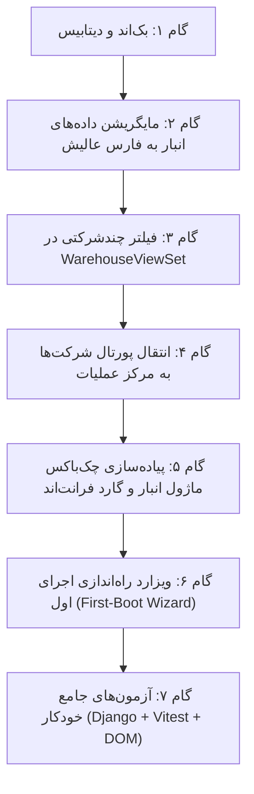

<div dir="rtl" align="right">

# طرح جامع اتصال سامانه انبارداری به سطح شرکت، ماژولار بودن انبار، انتقال مدیریت شرکت‌ها به مرکز عملیات و راهنمای راه‌اندازی اولیه
## (Company-Scoped Warehouses, Modular Inventory, Operations Governance & First-Boot Plan)

**نسخه:** ۱.۰  
**تاریخ تدوین:** مهرماه ۱۴۰۵ (سپتامبر ۲۰۲۶)  
**مرجع تدوین:** مصوبات فرآیند ارزیابی کارشناسی و مصاحبه تصمیم‌گیری معماری (`/grill-me`)  
**مخاطب:** تیم توسعه، مدیران ارشد سیستم و معماران نرم‌افزار  

---

## ۱. بیانیه مسئله و ضرورت معماری (Executive Problem Statement)

در نسخه قبلی، شرکت به عنوان لایه بالادستی مالی و اداری اضافه شد؛ اما سامانه انبارداری فیزیکی بدون ارتباط با شرکت باقی ماند. این وضعیت باعث بروز چالش‌های زیر شد:
1. **سردرگمی کاربری در هدر:** هنگام حضور در سامانه انبارگردانی (`/app/warehouse/*`)، سوئیچر شرکت در هدر بالای صفحه نمایش داده می‌شد اما تغییر آن تاثیری در لیست انبارها و شمارش‌ها نداشت.
2. **عدم تفکیک انبارها بین شرکت‌ها:** هر شرکت در هلدینگ دارای انبارهای فیزیکی و اموال مستقل خود است؛ مثلاً انبارهای دالان و پارسیان متعلق به شرکت «پاینده توان ساینا» و انبارهای دیگر متعلق به «فارس عالیش» هستند. عدم تفکیک انبارها امکان نشت اطلاعات کاردکس و موجودی کالا بین شرکت‌ها را فراهم می‌ساخت.
3. **نبود امکان کنترل ماژولار بودن انبار:** برخی شرکت‌های زیرمجموعه هلدینگ ماهیت خدماتی، مشاوره‌ای یا پیمانکاری دفتری دارند و فاقد هرگونه انبار یا کالای فیزیکی هستند؛ اما در حال حاضر تب انبارداری برای تمام شرکت‌ها به صورت یکسان باز است.
4. **جایگاه نامناسب مدیریت شرکت‌ها:** پورتال تعریف و مدیریت شرکت‌ها در منوی مالی (`/app/finance/companies`) قرار گرفته بود، در حالی که «شرکت» هویتی فراتر از مالی است و چتر حاکمیتی کل سازمان (انبارها، پروژه‌ها و کاربران) به حساب می‌آید.
5. **بلاتکلیفی در اولین اجرای سامانه (Fresh Install):** اگر سیستم به صورت خام و بدون شرکت بالا بیاید، هیچ راهنمایی برای هدایت مدیر جهت تعریف اولین شرکت و راه‌اندازی شاکله سازمان وجود ندارد.

---

## ۲. تصمیمات تثبیت‌شده در مصاحبه کارشناسی (Approved Architectural Decisions)

بر اساس فرآیند توافق‌شده در مصاحبه، اصول زیر به عنوان **قوانین غیرقابل‌تغییر (Invariants)** در این طرح مصوب شدند:

| محور تصمیم‌گیری | تصمیم مصوب نهایی | دلیل مهندسی و کارکردی |
| :--- | :--- | :--- |
| **مالکیت انبارها** | **ایزولاسیون کامل شرکتی (گزینه ب):** هر انبار منحصراً متعلق به یک شرکت خاص است و انبارداری و شمارش هر شرکت ۱۰۰٪ مستقل است. | جلوگیری از تداخل موجودی‌ها، تفکیک مسئولیت انبارداران و محرمانگی کاردکس کالای هر شرکت. |
| **انبارهای موجود در سیستم** | **انتساب قطعی به شرکت «فارس عالیش» (FA):** تمام ۹ انبار فعلی در دیتابیس به شرکت فارس عالیش متصل می‌شوند. | حفظ ۱۰۰٪ تاریخچه شمارش‌ها و اسناد بدون ایجاد هرگونه انبار یتیم (Orphan Records). |
| **ماژولار بودن انبارداری** | **کنترل ویژگی در سطح شرکت (`has_warehouse_module`):** در فرم شرکت یک سوئیچ فعال‌سازی انبارداری قرار می‌گیرد. | اگر شرکتی کالا و انبار ندارد، تب انبارگردانی برای آن شرکت کلاً مخفی می‌شود. |
| **جایگاه مدیریت شرکت‌ها** | **انتقال به «مرکز عملیات» (`/app/operations/companies`):** خروج از منوی مالی و ورود به بخش حاکمیتی سیستم. | شرکت یک هویت سطح صفر سازمانی (Governance) است و باید در کنار مدیریت کاربران و نقش‌ها اداره شود. |
| **اولین اجرای برنامه (First-Boot)** | **ویزارد راه‌اندازی خودکار (Onboarding Wizard):** در صورت نبود هیچ شرکتی، هدایت فوری سوپریوزر به ثبت اولین شرکت. | جلوگیری از سردرگمی مدیر در مواجهه با داشبوردهای خالی و بدون کانتکست. |

---

## ۳. معماری فنی تفصیلی (Detailed Technical Architecture)

### ۳.۱. مدل داده انبار و تفکیک شرکتی (Data Layer)
در اپلیکیشن `warehouses`، مدل `Warehouse` به شناسه شرکت مالک مجهز می‌گردد:

```python
# warehouse-backend/warehouses/models.py

class Warehouse(models.Model):
    # ... سایر فیلدهای موجود حفظ می‌شوند ...
    
    # فاز جدید: اتصال انبار فیزیکی به شرکت حقوقی مالک
    company_id = models.IntegerField(
        null=True,
        blank=True,
        db_index=True,
        verbose_name="شناسه شرکت مالک انبار"
    )
    # جهت سازگاری با نمایش در پنل و سریالایزر
    company_name = models.CharField(
        max_length=200,
        blank=True,
        null=True,
        verbose_name="نام شرکت مالک"
    )
```

> [!NOTE]
> استفاده از `company_id` به صورت فیلد عددی با ایندکس اختصاصی (مشابه معماری تفکیک ماژولی `warehouse_id` در اپ‌های `accounts` و `personnel`)، از ایجاد وابستگی چرخه‌ای بین اپ انبار و پرسنل جلوگیری می‌کند و اصول تفکیک ماژولی سازمان را پاس می‌دارد.

### ۳.۲. افزودن کلید ماژول انبارداری به مدل شرکت
در اپلیکیشن `personnel`، مدل `Company` به فیلد ماژولار بودن انبارداری مجهز می‌گردد:

```python
# warehouse-backend/personnel/models.py

class Company(models.Model):
    # ... فیلدهای کد، نام، شناسه ملی، لوگو و غیره ...
    has_warehouse_module = models.BooleanField(
        default=True,
        verbose_name="دسترسی به سامانه انبارداری و انبارگردانی"
    )
```

### ۳.۳. فیلترینگ کوئری‌ست انبارها و امنیت چندشرکتی در بک‌اند
در فایل `warehouses/views.py`، متد `get_queryset` در `WarehouseViewSet` بر اساس شرکت فعال فیلتر می‌گردد:

```python
# warehouse-backend/warehouses/views.py

class WarehouseViewSet(viewsets.ModelViewSet):
    def get_queryset(self):
        qs = super().get_queryset()
        req = self.request
        
        # استخراج شرکت فعال از هدر X-Company-ID یا کوئری‌پارامتر
        company_id = req.META.get('HTTP_X_COMPANY_ID') or req.query_params.get('company_id')
        
        if company_id and str(company_id).isdigit():
            # فیلتر انبارها منحصراً برای شرکت انتخاب‌شده
            qs = qs.filter(company_id=int(company_id))
        elif not req.user.is_superuser:
            # کاربر عادی بدون شرکت فعال، فقط انبارهای منتسب به شرکت‌های مجاز خود را می‌بیند
            allowed_company_ids = get_user_allowed_companies(req.user)
            qs = qs.filter(company_id__in=allowed_company_ids)
            
        return qs
```

همچنین در متد `perform_create`، هنگام ثبت انبار جدید توسط کاربر، `company_id` به طور خودکار از شرکت فعال انتخابی کاربر مقداردهی می‌شود.

---

### ۳.۴. انتقال پورتال مدیریت شرکت‌ها به مرکز عملیات (`operations`)

1. **انتقال فایل‌ها و روت‌ها:**
   * کامپوننت پورتال شرکت‌ها از مسیر `src/app/components/finance/companies` به مسیر استاندارد حاکمیتی:  
     `src/app/components/operations/companies/` منتقل می‌شود.
   * مسیر اصلی روت به `/app/operations/companies` تغییر می‌کند.
   * روت قدیمی `/app/finance/companies` جهت سازگاری و جلوگیری از شکستن لینک‌های مرورگر با `redirectTo: '/app/operations/companies'` هدایت می‌شود.
2. **سایدبار مرکز عملیات (Operations Navigation):**
   * در سایدبار پرسونای `operations`، آیتم جدید با آیکون و نشان استاندارد اضافه می‌شود:
     ```html
     <a routerLink="/app/operations/companies" routerLinkActive="active" class="nav-item">
       <span class="icon">🏢</span>
       <span>مدیریت شرکت‌ها و هلدینگ</span>
     </a>
     ```
3. **فرم ثبت/ویرایش شرکت:**
   * اضافه شدن چک‌باکس:
     ```html
     <div class="flex items-center gap-2 p-3 bg-slate-50 rounded-xl border border-slate-200">
       <input type="checkbox" id="hasWarehouseModule" [(ngModel)]="companyModal.data.has_warehouse_module" class="w-4 h-4 rounded text-indigo-600">
       <label for="hasWarehouseModule" class="text-xs font-bold text-slate-700 cursor-pointer">
         فعال بودن سامانه انبارداری و کاردکس کالا برای این شرکت
       </label>
     </div>
     ```

---

### ۳.۵. پویایی منوی انتخاب سامانه و مخفی‌سازی ماژول انبارداری (Dynamic App Switcher)

در کامپوننت سوئیچر سامانه‌ها (`AppRoleSwitcherComponent` و `UserMenuComponent`):
1. سرویس `ActiveCompanyService` متد یا سیگنالی به نام `isWarehouseEnabledForActiveCompany(): boolean` ارائه می‌دهد.
2. اگر شرکت فعال دارای `has_warehouse_module === false` باشد:
   * تب **📦 انبارگردانی** از لیست سامانه‌های فعال محو می‌شود.
   * اگر کاربر سعی کند آدرس `/app/warehouse` را مستقیماً در مرورگر تایپ کند، گارد امنیتی `WarehouseModuleGuard` مانع شده و او را با نمایش هشدار «سامانه انبارداری برای این شرکت فعال نیست» به داشبورد مالی یا مرکز عملیات هدایت می‌کند.

---

### ۳.۶. ویزارد راه‌اندازی در اجرای اول برنامه (First-Boot Setup Wizard)

1. **تشخیص خودکار حالت اجرای خام:**
   * هنگامی که کاربر وارد سیستم می‌شود، سرویس شرکت‌ها بررسی می‌کند آیا لیست شرکت‌ها تهی است (`companies.length === 0`).
2. **تجربه کاربری ویزارد:**
   * اگر کاربر `is_superuser` باشد، یک مودال تمام‌صفحه ارگونومیک (Setup Wizard) با عنوان:  
     **«راه‌اندازی ساختار سازمانی هلدینگ — تعریف اولین شرکت حقوقی»** نمایش داده می‌شود.
   * سیستم تا قبل از ثبت اولین شرکت، سایر فرم‌های مالی و پروژه‌ها را مسدود و تمرکز کاربر را روی معرفی هویت شرکت اول (مثلاً نام شرکت، شناسه ملی، کد اختصاصی و فعال بودن انبارداری) قرار می‌دهد.
   * با ذخیره شرکت اول، شرکت فوراً به عنوان شرکت فعال سیستم برگزیده شده و فرآیند کاری سامانه با روال استاندارد فعال می‌گردد.

---

## ۴. نقشه راه اجرایی گام‌به‌گام (Step-by-Step Implementation Roadmap)



---

### 🔹 فاز ۱: بک‌اند و پایگاه داده (Backend & Schema Migration)
1. **ویرایش مدل `Warehouse`:** افزودن فیلدهای `company_id` و `company_name`.
2. **ویرایش مدل `Company`:** افزودن فیلد `has_warehouse_module = models.BooleanField(default=True)`.
3. **تولید مایگریشن اسکیما:** اجرای `makemigrations` برای هر دو اپ `warehouses` و `personnel`.
4. **مایگریشن داده‌ها (Data Migration):** نگاشت تمام ۹ انبار فعلی سیستم به شرکت `فارس عالیش` (شناسه شرکت: `2`).
5. **اعمال فیلتر چندشرکتی در `WarehouseViewSet`:**
   * ایزوله کردن متدهای لیست، جزئیات و جستجوی انبارها بر اساس `HTTP_X_COMPANY_ID`.
   * تزریق خودکار شرکت در زمان ثبت انبار جدید.
6. **سریالایزر شرکت و انبار:**
   * افزودن فیلد `has_warehouse_module` به `CompanySerializer`.
   * افزودن `company_id` و `company_name` به `WarehouseSerializer`.

---

### 🔹 فاز ۲: انتقال مدیریت شرکت‌ها به مرکز عملیات (Operations Portal Refactoring)
1. **انتقال پوشه کامپوننت:**
   * جابه‌جایی فایل‌های کامپوننت از `finance/companies` به `operations/companies`.
2. **پیکربندی روتینگ (`app.routes.ts`):**
   * ثبت روت `/app/operations/companies` ذیل چتر پرسونای `operations`.
   * ثبت `redirectTo` برای روت قبلی `/app/finance/companies`.
3. **افزودن منو به سایدبار مرکز عملیات:**
   * درج لینک دسترسی به شرکت‌ها در سایدبار مرکز عملیات منحصراً برای کاربران دارای دسترسی مدیریتی.
4. **تکمیل فرم ثبت شرکت:**
   * اضافه کردن فیلد سوئیچ «فعال بودن سامانه انبارداری» در مودال ثبت و ویرایش شرکت.

---

### 🔹 فاز ۳: ماژولار بودن انبارداری و تفکیک منوی بالا (Dynamic Modular Guard)
1. **به‌روزرسانی `ActiveCompanyService`:**
   * اضافه کردن گتر واکنشی `hasWarehouseModule$` برای شرکت جاری.
2. **پالایش سوئیچر سامانه‌ها (`AppRoleSwitcher`):**
   * اضافه کردن شرط `*ngIf="activeCompanyService.hasWarehouseModule()"` روی گزینه «انبارگردانی».
3. **گارد ناوبری فرانت‌اند (`warehouse-module.guard.ts`):**
   * محافظت از روت‌های `/app/warehouse/*`؛ در صورت غیرفعال بودن انبار برای شرکت فعال، مانع ناوبری شده و کاربر را به مسیر مجاز هدایت کند.
4. **انعکاس شرکت در انبارداری:**
   * در منوی کشویی انتخاب انبار بالای سامانه انبارداری، فقط انبارهای مربوط به شرکت جاری بارگذاری شوند.

---

### 🔹 فاز ۴: ویزارد راه‌اندازی بار اول (First-Boot Onboarding Experience)
1. **پیاده‌سازی کامپوننت مودال ویزارد:**
   * طراحی کامپوننت `FirstBootWizardComponent` با طراحی شکیل، مدرن و هدایت‌کننده.
2. **بررسی استیت در لایه‌بندی اصلی (`layout.ts`):**
   * اگر کاربر واردشده سوپریوزر باشد و هیچ شرکتی در سیستم ثبت نشده باشد، ویزارد باز شود.
3. **فرم ایجاد درجا:**
   * اجازه ثبت سریع شرکت پایه با فعال‌سازی ماژول انبار و پروژه‌های اولیه در همان گام اول.

---

### 🔹 فاز ۵: آزمون‌های جامع صحه‌گذاری و تضمین کیفیت (Verification & Testing)
1. **آزمون‌های یکپارچگی بک‌اند جنگو:**
   * تست ایزولاسیون انبارها: اثبات اینکه کاربر شرکت PTS انبارهای شرکت FA را نمی‌بیند.
   * تست ثبت انبار جدید با الصاق خودکار شرکت فعال.
   * تست فیلد `has_warehouse_module` و بلاک شدن درخواست انبارداری در صورت `False` بودن.
2. **آزمون‌های سریع مرورگر (Type 1 Vitest + JSDOM):**
   * آزمون عدم رندر تب انبار در سوئیچر برای شرکتی که ماژول انبار ندارد.
   * آزمون عملکرد پورتال شرکت‌ها در مسیر جدید مرکز عملیات (`/app/operations/companies`).
   * آزمون ویزارد بار اول (نمایش در صورت نبود شرکت و مخفی شدن پس از ثبت).
3. **بررسی کامپایل تایپ‌اسکریپت (`tsc --noEmit`):**
   * تضمین صفر بودن خطاهای نوع و ایمپورت در کل پروژه فرانت‌اند.

---

## ۵. خلاصه فایل‌های تحت تاثیر و تغییرات مورد نیاز

| ردیف | مسیر فایل (File Path) | لایه | شرح نقش و تغییرات |
| :---: | :--- | :---: | :--- |
| ۱ | `warehouse-backend/warehouses/models.py` | بک‌اند | افزودن فیلدهای `company_id` و `company_name` به مدل `Warehouse` |
| ۲ | `warehouse-backend/personnel/models.py` | بک‌اند | افزودن فیلد `has_warehouse_module` به مدل `Company` |
| ۳ | `warehouse-backend/warehouses/views.py` | بک‌اند | فیلتر کوئری‌ست انبارها بر مبنای `HTTP_X_COMPANY_ID` و انتساب خودکار شرکت در `perform_create` |
| ۴ | `warehouse-backend/warehouses/serializers.py` | بک‌اند | ارائه فیلدهای شرکت در خروجی انبارها |
| ۵ | `warehouse-backend/personnel/serializers.py` | بک‌اند | ارائه فیلد `has_warehouse_module` در سریالایزر شرکت |
| ۶ | `warehouse-front/src/app/routes.ts` | فرانت‌اند | انتقال روت به `/app/operations/companies` و تنظیم ریدایرکت روت قبلی |
| ۷ | `warehouse-front/src/app/components/operations/companies/*` | فرانت‌اند | استقرار کامپوننت پورتال شرکت‌ها در مرکز عملیات و افزودن فیلد ماژول انبار |
| ۸ | `warehouse-front/src/app/shared/components/app-role-switcher/*` | فرانت‌اند | مخفی‌سازی تب انبارگردانی در صورت `has_warehouse_module === false` |
| ۹ | `warehouse-front/src/app/core/services/active-company.service.ts` | فرانت‌اند | ارائه استیت و هلپر اعتبارسنجی ماژول انبارداری شرکت فعال |
| ۱۰ | `warehouse-front/src/app/components/layout/layout.*` | فرانت‌اند | یکپارچه‌سازی سایدبار مرکز عملیات و هندل کردن ویزارد راه‌اندازی اولیه |

---

## ۶. نتیجه‌گیری و وضعیت آماده‌سازی

این طرح جامع، پاسخگوی دقیق تمام نیازهای مطرح‌شده در مکالمات قبلی است:
* ابهام و بی‌اثر بودن منوی بالای انبارداری را به طور ریشه‌ای حل می‌کند.
* به هر شرکت اجازه می‌دهد انبارهای ایزوله خود را داشته باشد.
* شرکت‌های غیرانبارداری را از مشاهده گزینه‌های نامربوط رها می‌سازد.
* مدیریت شرکت‌ها را در جایگاه اصولی و حاکمیتی خود در «مرکز عملیات» مستقر می‌سازد.
* اولین ورود به نرم‌افزار را از حالت سردرگمی به یک فرآیند راهنمایی‌شده و استاندارد تبدیل می‌کند.

</div>
