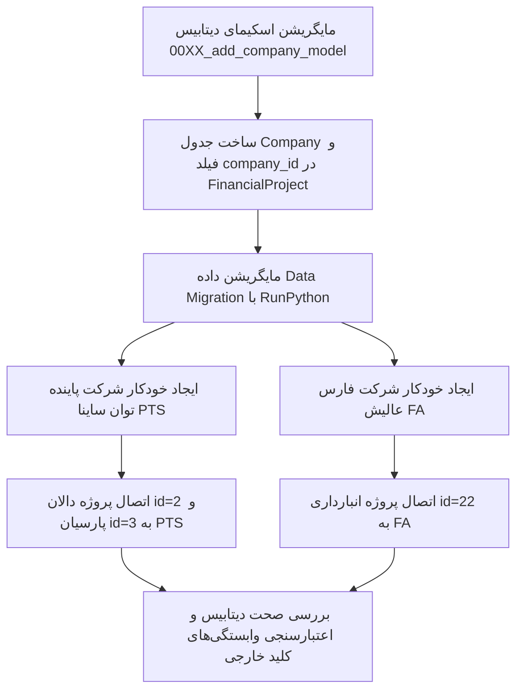

<div dir="rtl" align="right">

# طرح جامع و تفصیلی استقرار معماری چندشرکتی (Multi-Tenant Company Architecture)

این طرح سند مرجع مهندسی نرم‌افزار جهت افزودن لایه بنیادین **«شرکت» (Company)** در رأس هرم سازمانی سیستم، تفکیک کامل داده‌ها، حفظ ۱۰۰٪ رکوردهای عملیاتی فعلی و فراهم‌سازی تجربه کاربری مدرن در ورود و تعویض شرکت کاری است.

---

## ۱. جمع‌بندی تصمیمات حاصل از تحلیل و مصاحبه تخصصی (Interview Synthesis)

بر اساس بررسی‌های ساختاری کدبیس و پاسخ‌های حاصل از مصاحبه تحلیلی (`/grill-me`)، ارکان راهبردی این معماری به شرح زیر تثبیت گردید:

1. **جریان تجربه کاربری ورود و استقرار فضای کاری (Login & Workspace UX):**
   * **ورود تک‌شرکتی:** اگر کاربر فقط عضو یک شرکت باشد، سیستم بلافاصله و بدون توقف، همان شرکت را به‌عنوان فضای کاری فعال (`Active Company Context`) انتخاب کرده و وارد سامانه می‌شود.
   * **ورود چندشرکتی یا مدیر ارشد:** اگر کاربر عضو چند شرکت بوده یا مدیر ارشد (Superuser) باشد، هنگام ورود یک مودال شکیل تحت عنوان **«انتخاب شرکت کاری»** نمایش داده می‌شود تا کاربر پیش از ورود به داشبورد، فضای کاری خود را مشخص کند.
   * **تعویض سریع در هدر (Header Switcher):** در نوار بالایی سیستم، نام و لوگوی شرکت فعال نمایش داده شده و کاربر با یک کلیک می‌تواند بین شرکت‌های مجاز خود سوئیچ کند.
   * **ثبات عملیاتی (Zero Disruption):** پس از انتخاب شرکت، تمام صفحات، جداول، پروژه‌ها، بخش‌ها و محاسبات دقیقاً مشابه وضعیت جاری سیستم و بدون پیچیدگی اضافی عمل خواهند کرد.

2. **سلسله‌مراتب داده و تفکیک سازمانی (3-Tier Organizational Hierarchy):**
   ```
   [سطح ۱: شرکت (Company)] ← هویت حقوقی، ترازنامه مالی، شناسه ملی، قوانین پایه شرکتی
       │
       ├── [سطح ۲: پروژه (FinancialProject)] ← مرکز هزینه، کارگاه بیمه تامین اجتماعی، حوزه مالیاتی
       │       │
       │       ├── [سطح ۳: بخش (ProjectSection)] ← مرکز هزینه داخلی (اداری، فنی، انبار، ماشین‌آلات)
       │       └── پرسنل و خودروها (ارث‌بری خودکار شرکت از پروژه متبوع)
   ```

3. **حفظ ۱۰۰٪ داده‌های فعلی و مایگریشن امن (Zero-Risk Data Migration):**
   * دیتابیس فعلی دارای ۳ پروژه است:
     * شناسه ۲: پروژه **دالان** (`code: 1`)
     * شناسه ۳: پروژه **پارسیان** (`code: 2`)
     * شناسه ۲۲: پروژه **انبارداری** (`code: 3`)
   * با اجرای مایگریشن خودکار، دو شرکت ایجاد شده و بدون تغییر شناسه (`ID`) یا دستکاری رکوردهای وابسته، پروژه‌ها به شرکت‌های مربوطه متصل می‌گردند:
     * شرکت **«پاینده توان ساینا»** ← پروژه‌های دالان و پارسیان
     * شرکت **«فارس عالیش»** ← پروژه انبارداری

4. **ارث‌بری هوشمند قوانین و تنظیمات (Settings Inheritance):**
   * قوانین پایه، جداول گروه‌های شغلی و بخشنامه‌ها در سطح شرکت تعریف می‌شوند.
   * هر پروژه نیز می‌تواند در صورت لزوم قوانین مستقل خود را داشته باشد (اولویت با پروژه است؛ در صورت عدم تنظیم، از شرکت ارث‌بری می‌کند).

5. **استقلال دیسکت‌های قانونی (Tax & Insurance Independence):**
   * دیسکت‌های تأمین اجتماعی (`DSKWOR00.DBF`, `DSKKAR00.DBF`) و فایل‌های مالیات حقوق بر اساس **پروژه** تولید می‌شوند و پرسنل تمام بخش‌های آن پروژه در یک دیسکت تجمیع خواهند شد (کاملاً منطبق بر معماری فعلی سیستم در `test_project_exports.py`).

---

## ۲. طراحی مدل داده و ساختار دیتابیس (Database Schema Architecture)

### ۲.۱. مدل جدید `Company` در ماژول `personnel/models.py`
این مدل به عنوان موجودیت حقوقی مستقل با مشخصات کامل ثبتی و بازرگانی ایران تعریف می‌شود:

```python
class Company(models.Model):
    """
    موجودیت حقوقی شرکت (هلدینگ و شرکت‌های زیرمجموعه)
    """
    code = models.CharField(max_length=50, unique=True, verbose_name="کد یکتای شرکت")
    name = models.CharField(max_length=200, verbose_name="نام کامل شرکت")
    national_id = models.CharField(max_length=20, blank=True, null=True, verbose_name="شناسه ملی ۱۱ رقمی")
    economic_code = models.CharField(max_length=50, blank=True, null=True, verbose_name="کد اقتصادی")
    registration_number = models.CharField(max_length=50, blank=True, null=True, verbose_name="شماره ثبت")
    phone = models.CharField(max_length=50, blank=True, null=True, verbose_name="شماره تلفن")
    address = models.TextField(blank=True, null=True, verbose_name="نشانی دفتر مرکزی")
    ceo_name = models.CharField(max_length=150, blank=True, null=True, verbose_name="نام مدیرعامل")
    logo = models.ImageField(upload_to='company_logos/', blank=True, null=True, verbose_name="لوگوی شرکت")
    is_active = models.BooleanField(default=True, verbose_name="وضعیت فعال")
    created_at = models.DateTimeField(auto_now_add=True, verbose_name="تاریخ ایجاد")
    updated_at = models.DateTimeField(auto_now=True, verbose_name="تاریخ آخرین ویرایش")

    class Meta:
        verbose_name = "شرکت"
        verbose_name_plural = "شرکت‌ها"
        ordering = ['code']

    def __str__(self):
        return f"{self.name} ({self.code})"
```

### ۲.۲. به‌روزرسانی مدل `FinancialProject`
اضافه شدن کلید خارجی نال‌پذیر (`null=True, blank=True`) برای حفظ یکپارچگی داده‌های تاریخی:

```python
class FinancialProject(models.Model):
    company = models.ForeignKey(
        'Company',
        on_delete=models.PROTECT,
        related_name='projects',
        null=True,
        blank=True,
        verbose_name="شرکت متبوع"
    )
    # سایر فیلدهای موجود (code, name, description, is_active, ...) کاملاً بدون تغییر باقی می‌مانند
```

### ۲.۳. مدل کنترل دسترسی سازمانی `UserCompanyAccess`
مدیریت دسترسی چندبه‌چند کاربران به شرکت‌ها با پشتیبانی از سیستم ترکیبی هوشمند:

```python
class UserCompanyAccess(models.Model):
    """
    تخصیص صریح یا ضمنی دسترسی کاربر به یک یا چند شرکت
    """
    user = models.ForeignKey(settings.AUTH_USER_MODEL, on_delete=models.CASCADE, related_name='company_accesses')
    company = models.ForeignKey(Company, on_delete=models.CASCADE, related_name='user_accesses')
    is_default = models.BooleanField(default=False, verbose_name="شرکت پیش‌فرض کاربر")
    created_at = models.DateTimeField(auto_now_add=True)

    class Meta:
        unique_together = ('user', 'company')
        verbose_name = "دسترسی کاربر به شرکت"
        verbose_name_plural = "دسترسی‌های کاربران به شرکت‌ها"
```

> [!NOTE]
> **منطق ترکیبی هوشمند (Hybrid Access):** اگر کاربری عضو بخشی از یک پروژه باشد (از طریق `UserSectionAssignment`)، متد اعتبارسنجی سیستم به‌طور خودکار شرکت آن پروژه را جزو شرکت‌های مجاز کاربر به حساب می‌آورد. همچنین مدیر می‌تواند در پنل کاربران، دسترسی مستقیم به شرکت‌ها را بدون نیاز به انتساب تک‌تک پروژه‌ها اعطا نماید.

### ۲.۴. به‌روزرسانی مدل تنظیمات سالانه `PayrollYearlySettings`
اضافه شدن ارتباط با شرکت جهت پشتیبانی از ارث‌بری قوانین:

```python
class PayrollYearlySettings(models.Model):
    company = models.ForeignKey(
        'Company',
        on_delete=models.CASCADE,
        related_name='yearly_settings',
        null=True,
        blank=True,
        verbose_name="شرکت"
    )
    # project و سایر فیلدها حفظ می‌شوند
```

---

## ۳. سناریوی اجرای مایگریشن امن داده‌ها (Zero Downtime Data Migration)

برای تضمین عدم ریزش حتی یک رکورد، مایگریشن در ۲ مرحله متوالی و محافظت‌شده اجرا می‌شود:



کد منطق مایگریشن خودکار (`RunPython`):
```python
def forward_migrate_companies(apps, schema_editor):
    Company = apps.get_model('personnel', 'Company')
    FinancialProject = apps.get_model('personnel', 'FinancialProject')

    # ۱. ایجاد شرکت‌های پایه
    pts_company, _ = Company.objects.get_or_create(
        code='PTS',
        defaults={
            'name': 'پاینده توان ساینا',
            'is_active': True
        }
    )
    fa_company, _ = Company.objects.get_or_create(
        code='FA',
        defaults={
            'name': 'فارس عالیش',
            'is_active': True
        }
    )

    # ۲. انتساب پروژه‌های دالان و پارسیان به پاینده توان ساینا
    FinancialProject.objects.filter(id__in=[2, 3]).update(company=pts_company)

    # ۳. انتساب پروژه انبارداری به فارس عالیش
    FinancialProject.objects.filter(id=22).update(company=fa_company)
```

---

## ۴. لایه وب‌سرویس و API بک‌اند (REST API Endpoints)

| مسیر وب‌سرویس (Endpoint) | متد | شرح عملکرد و امنیت |
| :--- | :--- | :--- |
| `/api/personnel/companies/` | `GET`, `POST` | لیست شرکت‌ها (فیلترشده بر اساس شرکت‌های مجاز کاربر) و ثبت شرکت جدید توسط مدیر ارشد |
| `/api/personnel/companies/{id}/` | `GET`, `PUT`, `DELETE` | جزئیات، ویرایش مشخصات حقوقی و آپلود لوگوی شرکت |
| `/api/personnel/companies/user-available/` | `GET` | لیست شرکت‌های در دسترس کاربر جاری برای نمایش در مودال ورود و دراپ‌داون هدر |
| `/api/personnel/financial-projects/` | `GET`, `POST` | فیلتر خودکار بر مبنای پارامتر `company_id` ارسالی از کلاینت فرانت‌اند |
| `/api/personnel/companies/{id}/settings/` | `GET`, `POST` | دریافت و ویرایش تنظیمات پایه سالانه اختصاصی آن شرکت |

> [!IMPORTANT]
> **میدل‌ور تفکیک داده (Multi-Tenant Scoping Middleware / Filter Backend):**
> یک فیلتر بک‌اند سراسری به تمام کوئری‌های پروژه‌ها و پرسنل اضافه می‌شود که در صورت ارسال هدر `X-Company-ID` از کلاینت، دسترسی کاربر را تأیید کرده و تنها اطلاعات متعلق به آن شرکت را بازمی‌گرداند.

---

## ۵. معماری فرانت‌اند و تجربه کاربری (Angular Frontend Architecture)

### ۵.۱. سرویس مدیریت کانتکست شرکت فعال (`ActiveCompanyService`)
یک سرویس مستقل و واکنشی (`Reactive BehaviorSubject`) جهت نگهداری و مخابره وضعیت شرکت انتخاب‌شده:
* ذخیره شناسه شرکت فعال در `localStorage` و `sessionStorage` برای پایداری پس از رفرش صفحه.
* تزریق هدر `X-Company-ID` در کلیه درخواست‌های HTTP از طریق `AuthInterceptor`.
* بازنشر سیگنال تعویض شرکت به سایر سرویس‌ها (پروژه‌ها، پرسنل، گزارش‌ها) جهت رفرش درجا بدون نیاز به بارگذاری مجدد کامل صفحه (`Full Reload`).

### ۵.۲. مودال ورود سازمانی: انتخاب شرکت کاری (`CompanySelectionModal`)
* بررسی شرکت‌های در دسترس پس از لاگین موفقیت‌آمیز.
* در صورت وجود بیش از یک شرکت، مودال با طراحی متمرکز و مدرن باز می‌شود: کارت‌های شیشه‌ای شامل نام و لوگوی هر شرکت با کلیک آسان جهت ورود.
* در صورت تک‌شرکتی بودن، انتخاب بدون توقف به‌صورت خودکار صورت می‌گیرد.

### ۵.۳. کامپوننت تعویض سریع در هدر (`HeaderCompanySwitcher`)
* استقرار در هدر اصلی سیستم در کنار مشخصات کاربری.
* نمایش نام شرکت جاری همراه با بج شکیل و آیکون سوئیچر.
* امکان انتخاب سریع شرکت و سوئیچ آنی داده‌ها.

### ۵.۴. صفحه مستقل مدیریت شرکت‌ها (`/app/finance/companies`)
صفحه جدید «مدیریت شرکت‌ها» ذیل منوی تنظیمات پایه، منطبق با استاندارد یکپارچه کامند سنتر (`AGENTS.md`):
* **هدر استیکی بلور (`sticky top-0 z-30 bg-slate-50/95 backdrop-blur-md`)** همراه با عنوان ماژولار و بج شمارنده شرکت‌ها.
* **دکمه‌های ۳ گانه استاندارد آیکونی:**
  * اکسل خروجی (سبز زمردی)
  * اکسل ورودی (نیلی)
  * رفرش زنده (خاکستری سنگی)
* **دکمه ثبت شرکت جدید:** با استایل نیلی پررنگ و پاپ‌آپ مودال استاندارد.
* **جدول کارتی مدرن:** با قابلیت جستجوی زنده درجا (کد، نام، شناسه ملی، نام مدیرعامل).
* **فرم مودال ثبت و ویرایش:** اعتبارسنجی ۱۱ رقمی شناسه ملی، کد اقتصادی، شماره ثبت و فیلد آپلود لوگو.

---

## ۶. تفکیک وظایف و فازبندی اجرا (Phase Decomposition)

### شرح فازها:

#### فاز ۱: زیرساخت بک‌اند و پایگاه داده (Backend Core & Migration)
* تعریف کلاس `Company` و `UserCompanyAccess` در [models.py](file:///e:/warehouse%20project/warehouse-backend/personnel/models.py).
* افزودن کلید خارجی `company` به `FinancialProject` با `null=True`.
* اعمال مایگریشن اسکیما (`makemigrations`).
* اجرای مایگریشن داده اختصاصی برای ساخت دو شرکت «پاینده توان ساینا» و «فارس عالیش» و تخصیص ۳ پروژه به آن‌ها بدون دستکاری داده‌های قبلی.

#### فاز ۲: لایه وب‌سرویس و منطق دسترسی (REST APIs & RBAC)
* ایجاد [CompanySerializer](file:///e:/warehouse%20project/warehouse-backend/personnel/serializers.py) و متدهای اعتبارسنجی شناسه ملی.
* ایجاد `CompanyViewSet` با متدهای استاندارد CRUD و متد سفارشی `user_available`.
* افزودن فیلتر `company_id` در `FinancialProjectViewSet` و اعمال دسترسی بر مبنای شرکت فعال.

#### فاز ۳: سرویس کانتکست و تعویض شرکت در فرانت‌اند (Active Company Context)
* ساخت `ActiveCompanyService` در فرانت‌اند (`src/app/core/services/active-company.service.ts`).
* تزریق هدر شرکت فعال در تمام ریکوئست‌های بک‌اند.
* پیاده‌سازی کامپوننت `CompanySelectionModal` برای نمایش به کاربران چندشرکتی پس از احراز هویت.
* طراحی کامپوننت `HeaderCompanySwitcher` در نوار بالای سایت.

#### فاز ۴: صفحه اختصاصی مدیریت شرکت‌ها و تطبیق فرم‌ها (Company Hub & Form Scoping)
* ساخت کامپوننت مستقل `CompaniesManagementComponent` در مسیر `src/app/components/finance/companies/`.
* افزودن مسیر `/app/finance/companies` در [accounting.routes.ts](file:///e:/warehouse%20project/warehouse-front/src/app/modules/accounting/accounting.routes.ts) و افزودن منو در سایدبار ذیل تنظیمات پایه.
* پیاده‌سازی جدول اطلاعات حقوقی شرکت‌ها، سرچ زنده و مودال ثبت/ویرایش با آپلود لوگو.
* فیلتر شدن هوشمند پروژه‌های قابل انتخاب در فرم‌های ثبت پرسنل و ناوگان بر اساس شرکت فعال هدر.

#### فاز ۵: آزمون‌های جامع و صحه‌گذاری (Testing & Quality Assurance)
* اجرای تست‌های بک‌اند جهت اطمینان از خروجی دیسکت‌های بیمه شیراز، تهران و پروژه‌ها بدون اختلال.
* اجرای تست‌های واحد کامپوننت فرانت‌اند بر پایه Vitest و jsdom (تست نوع ۱ طبق قوانین سیستم).
* اعتبارسنجی عدم وجود هرگونه خطای کامپایل تایپ‌اسکریپت (`npx tsc --noEmit`).

---

## ۷. برنامه اعتبارسنجی و تست‌ها (Verification Plan)

### ۷.۱. تست‌های خودکار بک‌اند (Automated Django Tests)
1. **تست سلامت مایگریشن داده:** بررسی اینکه پس از مایگریشن، پروژه‌های دالان و پارسیان متعلق به شرکت PTS و انبارداری متعلق به FA هستند.
2. **تست عایق‌سازی دسترسی (RBAC Isolation):** کاربری که فقط دسترسی به شرکت فارس عالیش دارد، نباید بتواند لیست پروژه‌ها یا پرسنل پاینده توان ساینا را دریافت کند.
3. **تست عدم شکست خروجی دیسکت‌های بیمه:** اجرای مجدد آزمون‌های [test_project_exports.py](file:///e:/warehouse%20project/warehouse-backend/personnel/test_project_exports.py) برای اطمینان از اینکه دیسکت‌های بیمه پروژه شیراز و پروژه تهران دقیقاً با همان کدهای کارگاه و پرسنل مربوطه بدون تغییر تولید می‌شوند.

### ۷.۲. تست‌های واحد فرانت‌اند (Type 1 DOM/Component Tests)
1. **تست لاگین تک‌شرکتی و چندشرکتی:** تأیید اینکه برای کاربر با ۱ شرکت، کانتکست بلافاصله پر شده و مودال باز نمی‌شود؛ و برای کاربر چندشرکتی مودال باز شده و با کلیک روی کارت شرکت، کانتکست ست می‌شود.
2. **تست تعویض شرکت در هدر:** بررسی اینکه تغییر شرکت در هدر، مقادیر جدید را به سابسکریپشن‌های فعال ارسال می‌کند.
3. **تست فرم ثبت شرکت:** تست اعتبارسنجی فیلدهای اجباری، شناسه ملی نامعتبر و بسته شدن مودال پس از موفقیت.

</div>
