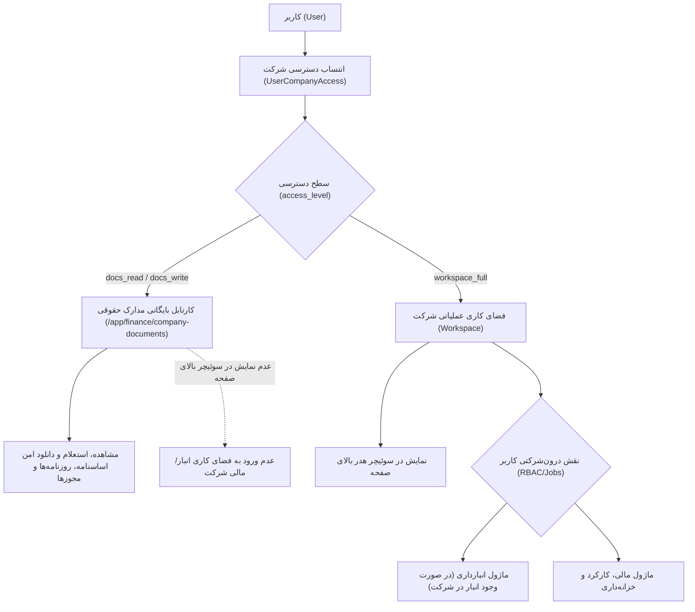

# طرح جامع بازمهندسی معماری دسترسی چندشرکتی، انزوای ماژولار و کارتابل بایگانی مدارک حقوقی

---

## ۱. تبیین مسئله، تحلیل ریشه‌ای و نیازمندی‌ها (Goal Description)

### ریشه تعارض رفتاری در سناریوی «نسرین بیرمی»:
در وضعیت فعلی مخزن، ۳ نقص ساختاری همزمان باعث بروز مشکل مشاهده‌شده توسط کاربر شده است:
1. **سطح دسترسی خام و تک‌بُعدی (`Role-less Tenant Membership`):**  
   مدل `UserCompanyAccess` صرفاً دو فیلد کلید خارجی `(user, company)` دارد. وقتی کاربری به یک شرکت اضافه می‌شود، سیستم این انتساب را به عنوان «عضویت کامل در فضای کاری کلان» (`Full Workspace Tenant`) تفسیر می‌کند. هیچ تفکیکی وجود ندارد که آیا این کاربر قرار است **فقط مدارک قانونی و اساسنامه شرکت را ببیند** یا اینکه در عملیات روزمره (انبارداری، مالی، کارکرد) آن شرکت فعال است.
2. **سوئیچر هدر به عنوان دروازه ورود به عملیات:**  
   سوئیچر بالای صفحه هر شرکتی را که کاربر به آن انتساب یافته باشد، لیست می‌کند. کاربری مانند نسرین بیرمی که عضو خزانه‌داری ستاد است، وقتی شرکت «پاینده توان ساینا» را انتخاب می‌کند، ناخواسته وارد کانتکست عملیاتی آن شرکت می‌شود.
3. **نشت داده‌های انبارداری (Multi-Tenant Warehouse Leak):**  
   شرکت «پاینده توان ساینا» در دیتابیس **هیچ انباری ندارد** (`Warehouse.objects.filter(company_id=1).count() == 0`). اما متد `ItemViewSet.dashboard_stats` در بک‌اند، آیتم‌ها را بر اساس شرکت فیلتر نکرده و با اجرای `Item.objects.all()`، آمار ۱,۰۳۹ قلم کالای شمارش‌شده شرکت «فارس آلیش» را در داشبورد پاینده توان ساینا نشان می‌دهد!
4. **سقوط ریدایرکت پیش‌فرض (Fallback Route Flaw):**  
   کاربری که هیچ نقشی در انبار ندارد، هنگام مواجهه با حالت‌های بلاتکلیف به روت پیش‌فرض `/app/warehouse/dashboard` سقوط می‌کند.

---

## ۲. ارکان بنیادین معماری جدید (Architecture Blueprint)

---

## ۳. تغییرات پیشنهادی به تفکیک فایل‌ها و کامپوننت‌ها (Proposed Changes)

### 🔹 بخش اول: لایه داده و پایگاه داده بک‌اند (Django Models & Migrations)

#### [MODIFY] `warehouse-backend/personnel/models.py`
* گسترش مدل `UserCompanyAccess` با افزودن فیلدهای:
  - `access_level`: گزینه‌های `docs_read` (فقط مشاهده مدارک رسمی)، `docs_write` (مشاهده و بارگذاری/تمدید مدارک)، `workspace_full` (عضویت کامل در فضای کاری عملیات).
  - `role_in_company`: عنوان سمت یا مسئولیت فرد در آن شرکت (اختیاری جهت شفافیت چارت).

* تولید و اعمال مایگریشن جدید (`makemigrations personnel` و `migrate`).

---

### 🔹 بخش دوم: سرویس‌های بک‌اند و رفع نشت داده‌ها (API & Backend Security)

#### [MODIFY] `warehouse-backend/personnel/views.py`
1. ارتقای تابع `get_user_allowed_companies(user, purpose='workspace')`:
   - در حالت `purpose='workspace'` (جهت سوئیچر بالای صفحه): فقط شرکت‌هایی بازگردانده شوند که کاربر در آن‌ها `access_level == 'workspace_full'` دارد (یا سوپریوزر است).
   - در حالت `purpose='documents'` (جهت کارتابل بایگانی مدارک): تمام شرکت‌های منتسب به کاربر بازگردانده می‌شوند.
2. اصلاح اکشن `CompanyViewSet.user_available`:
   - اختصاصی‌سازی این اندپوینت برای سوئیچر هدر به گونه‌ای که تنها شرکت‌های با سطح `workspace_full` ارسال شوند.

#### [MODIFY] `warehouse-backend/inventory/views.py`
* اصلاح متد `dashboard_stats`:
  - استخراج شناسه شرکت فعال از هدر `X-Company-ID` یا کوئری‌پارامتر `company_id`.
  - اضافه کردن شرط قطعی `items = items.filter(warehouse__company_id=active_company_id)`.
  - اگر شرکت انبار فعالی نداشته باشد، تمام ارقام آماری `۰` بازگردانده می‌شوند و هیچ داده‌ای از سایر شرکت‌ها نشت نمی‌کند.

---

### 🔹 بخش سوم: فرانت‌اند و کارتابل مستقل اسناد (Frontend & UI/UX)

#### [NEW] `warehouse-front/src/app/components/finance/company-documents-archive/`
ایجاد کامپوننت مستقل **«بایگانی مدارک حقوقی شرکت‌ها»**:
- هدر چسبان استاندارد (Sticky Command Center)
- کارت‌های خلاصه شرکت‌های مجاز کاربر (همراه با وضعیت سلامت مدارک، شناسه ملی و شماره ثبت).
- جدول مدارک و اسناد رسمی شرکت انتخاب‌شده با بج‌های انقضا، دکمه‌های پیش‌نمایش درجا (`In-Place Preview`) و دانلود امن.
- فرم بارگذاری سریع مدرک جدید برای دارندگان سطح `docs_write`.

#### [MODIFY] `warehouse-front/src/app/modules/accounting/nav-items.ts` & `layout.ts`
* اضافه کردن منوی جدید `📑 بایگانی مدارک شرکت‌ها`.

#### [MODIFY] `warehouse-front/src/app/core/services/active-company.service.ts` & `user-menu.component.ts`
* فیلتر شدن شرکت‌های در دسترس در سوئیچر هدر به نحوی که کاربرانی با دسترسی صرفاً مدارک، نام شرکت را در سوئیچر کلان نبینند.

#### [MODIFY] `warehouse-front/src/app/core/auth/auth.guard.ts` & `app.routes.ts`
* جلوگیری از سقوط کاربران فاقد نقش انبارداری به `/app/warehouse/dashboard`.

#### [MODIFY] `warehouse-front/src/app/components/operations/companies/companies.html` & `companies.ts`
* در استودیوی مودال شرکت (تب دسترسی کاربران)، افزودن کمبوباکس انتخاب سطح دسترسی (`فقط مشاهده مدارک` / `مشاهده و بارگذاری` / `عضویت کامل در فضای کاری`).

---

## ۴. برنامه آزمون‌ها و صحه‌گذاری (Verification Plan)

### آزمون‌های خودکار (Automated Tests)
1. **آزمون‌های بک‌اند:**
   - تست تفکیک سطوح `docs_read` و `workspace_full`.
   - تست ایزولاسیون انبارداری در `dashboard_stats` و اثبات عدم نشت ۱,۰۳۹ قلم به پاینده توان ساینا.
   - اجرای `python manage.py test personnel.test_company_documents`.
2. **آزمون‌های فرانت‌اند:**
   - تست‌های DOM ویتست در `companies.dom.spec.ts`.
   - اجرای `npx vitest run`.
3. **بررسی تایپ و ساخت:**
   - اجرای `npx tsc --noEmit` و `npm run build`.

