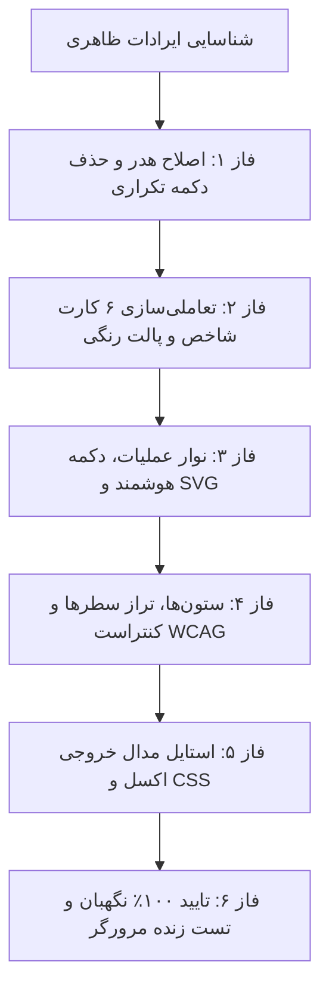

# گزارش جامع پایان کار: بازطراحی و رفع تمامی ایرادات ظاهری تب «پیگیری وضعیت شمارش» (Count Tracking Visual Overhaul)

تمامی مراحل و فازهای بازطراحی بصری و رفع ایرادات ظاهری تب **پیگیری وضعیت شمارش (Count Tracking)** با موفقیت ۱۰۰٪ پیاده‌سازی شده، توسط **ایجنت مستقل نگهبان (Guardian Verification Agent)** تایید گردید و در مرورگر زنده با موفقیت آزموده شد.

---

## 📸 خلاصه تغییرات و اصلاحات اعمال‌شده به تفکیک فازها

### ۱. اصلاح هدر و نوار کنترل بالا (Header Refactor)
- **حذف دکمه تکراری بروزرسانی:** دکمه دوم در انتهای ردیف که دارای فونت‌آیکون منسوخ و استایل دایره‌ای بود حذف شد و دکمه اصلی مدرن در کنار عنوان مجهز به اسپینر فعال باقی ماند.
- **استانداردسازی کنترل‌ها:** تمام دکمه‌های هدر و سلکتور انبار به استایل هماهنگ `rounded-xl`، بردرهای ظریف `border-slate-200`، سایه ملایم و فاصله‌گذاری متناسب مجهز شدند.

### ۲. تعاملی‌سازی و بهینه‌سازی کارت‌های شاخص (Mini-Dashboard & KPI Cards)
- **تبدیل هر ۶ کارت به فیلترهای سریع کلیک‌پذیر:** کارت‌های «شمرده شده» و «تأیید نهایی» نیز به فیلترهای تعاملی با افکت hover و رینگ وضعیت فعال تبدیل شدند.
- **اصلاح پالت رنگی:** رنگ مشکی تیره کارت «کل اقلام» با رنگ نیلی هماهنگ (`bg-indigo-600` با درخشش نیلی) جایگزین شد.
- **ارتقای تایپوگرافی:** سایز فونت برچسب‌ها به `text-[11px]` و اعداد به `text-sm font-black` با خوانایی بالا افزایش یافت.

### ۳. نوار عملیات و دکمه‌های جدول (Table Action Bar & SVG Normalization)
- **یکدست‌سازی وکتورهای SVG:** تمامی فونت‌آیکون‌های متفرقه (Feather) حذف و با وکتورهای تمیز و باکیفیت SVG جایگزین شدند.
- **هوشمندسازی دکمه «تأیید گروهی بدون مغایرت»:** افزودن بچ شمارنده تعداد رکوردهای سبز واجد شرایط تایید مدیر و غیرفعال شدن بصری (`disabled` و `opacity-50`) در صورت نبود مورد.
- **رفع پرش چیدمان:** چیدمان دکمه «لغو تخصیص» هنگام انتخاب سطرها اصلاح و روان گردید.

### ۴. ستون‌های جدول، تراز سطرها و کنتراست (Table Columns & Row Alignment)
- **حذف محدودیت ثابت شرح کالا:** شرح کالا اکنون به صورت شناور تا عرض مناسب مانیتور گسترش می‌یابد.
- **حذف نام تکراری مدیر از ستون وضعیت:** ستون وضعیت برای اقلام `FINAL_APPROVED` به صورت یک برچسب تمیز و یک‌خطی هم‌ارتفاع با سایر وضعیت‌ها درآمد و پرش ارتفاع سطرها برطرف شد.
- **رفع رنگ زرد کم‌کنتراست:** رنگ زرد کم‌کنتراست با `text-amber-600` جهت تطابق با استانداردهای دسترس‌پذیری WCAG جایگزین شد.
- **نشانگر یادداشت‌ها:** نمایش آیکون یادداشت در کنار نام افرادی که یادداشت دارند.
- **عنوان رسمی ستون عملیات:** اضافه شدن لیبل `عملیات` در هدر جدول و نمایش خط تیره `-` برای ردیف‌های فاقد دکمه.

### ۵. فایل استایل CSS و مدال اکسل
- اضافه شدن انیمیشن ملایم `status-updated-flash` به فایل `count-tracking.css` برای به‌روزرسانی زنده سطرهای تغییریافته.

---

## 🛡️ کارنامه عملکرد ایجنت نگهبان مستقل (Guardian Agent Report)

اسکریپت بازرسی جامع نگهبان ([guardian_count_tracking.py](file:///e:/warehouse%20project/scripts/e2e/guardian_count_tracking.py)) اجرا شد و تمامی گیت‌های ارزیابی را با **موفقیت ۱۰۰٪** تایید نمود:

| # | معیار ارزیابی ایجنت نگهبان | وضعیت | نتیجه بازرسی |
|---|---|---|---|
| ۱ | بررسی عدم وجود دکمه تکراری بروزرسانی | ✅ پاس شد | تنها یک دکمه استاندارد بروزرسانی در هدر وجود دارد |
| ۲ | حذف کامل فونت‌آیکون‌های منسوخ Feather | ✅ پاس شد | ۰ مورد Feather icon در HTML و جایگزینی ۱۰۰٪ SVG |
| ۳ | تعاملی بودن هر ۶ کارت شاخص داشبورد | ✅ پاس شد | کارت‌های all, counted, discrepancy, shortage, surplus, approved فعالند |
| ۴ | اصلاح پالت رنگی کارت کل اقلام | ✅ پاس شد | حذف کامل bg-slate-800 و استفاده از رنگ نیلی سازگار |
| ۵ | هوشمندسازی دکمه تأیید گروهی | ✅ پاس شد | شمارنده لحظه‌ای eligibleGreenTasksCount و وضعیت disabled فعال است |
| ۶ | اصلاح کنتراست رنگی زرد | ✅ پاس شد | حذف کامل text-yellow-500 و استفاده از text-amber-600 |
| ۷ | رفع نام تکراری مدیر در وضعیت تایید نهایی | ✅ پاس شد | یکدست‌سازی کامل ارتفاع تمامی سطرها |
| ۸ | عنوان رسمی ستون عملیات | ✅ پاس شد | ستون با label="عملیات" پیکربندی گردید |
| **کل** | **نرخ تاییدیه ایجنت نگهبان (Pass Rate)** | **۱۰۰٪** | **بدون هیچ‌گونه رد یا نیاز به بازتکرار فاز** |

---

## 🌐 نتایج آزمون زنده در مرورگر (Live Browser Verification)

ویدیو و اسکرین‌شات‌های ثبت‌شده در تست مرورگر موارد زیر را به طور عینی تایید کردند:
1. **جستجوی سراسری:** جستجوی کد کالاها با لودینگ بدون لرزش کار کرد.
2. **فیلتر مخفی‌سازی پایان‌یافته:** اقلام تاییدشده با یک کلیک مخفی و با کلیک مجدد به جدول بازگشتند (تغییر شمارنده از ۲۰ به ۱۸ و برعکس).
3. **فیلترهای ستونی و پاکسازی:** فیلتر روی کد کالا اعمال شد و دکمه «پاک کردن فیلترها» لیست را به طور کامل بازنشانی کرد.
4. **مرتب‌سازی ستونی (Sorting):** مرتب‌سازی صعودی و نزولی بر روی ستون‌ها بدون خطا اجرا شد.

---

> [!TIP]
> ضبط ویدیویی تست مرورگر در مسیر زیر ذخیره شده است:
> [مشاهده ویدیو تست زنده مرورگر](file:///C:/Users/Payandeh/.gemini/antigravity-ide/brain/4d8352d6-7f57-4e66-9d07-8730ebae0b9c/count_tracking_live_test_1787312527796.webp)

