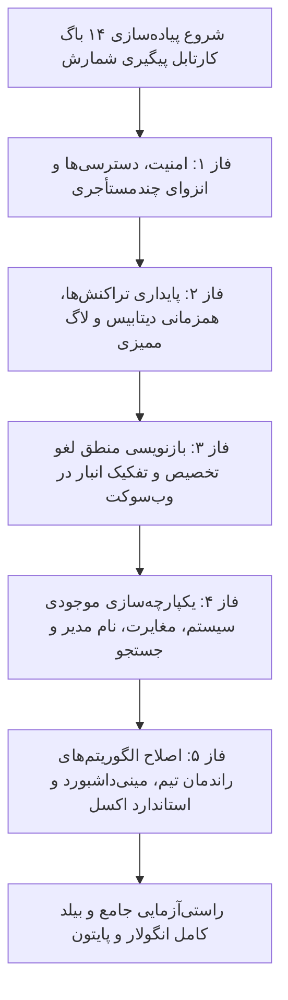

# طرح جامع و فازبندی‌شده رفع ۱۴ مورد باگ در کارتابل «پیگیری وضعیت شمارش» (`Count Tracking Comprehensive Remediation`)

<div dir="rtl" align="right">

این سند فنی نقشه راه، جزئیات معماری، فازبندی اجرایی و چک‌لیست دقیق برای رفع کامل **۱۴ مورد باگ و نقص تاییدشده** در کارتابل «پیگیری وضعیت شمارش» (`Count Tracking`) را در لایه‌های بک‌اند جنگو، فرانت‌اند انگولار، امنیت و کنترل دسترسی (RBAC)، کنترل همزمانی دیتابیس، وب‌سوکت و داشبورد محاسبات راندمان تیم ارائه می‌دهد.

---

## 📋 اهداف کلیدی طرح

1. **امنیت و تفکیک دسترسی‌ها:** افزودن مسیر به `auth.guard.ts`، فیلتر انزوای چندمستأجری در `as_role=tracking` و اعمال گارد پرمیشن روی دکمه‌های عملیاتی.
2. **پایداری تراکنش‌ها و همزمانی دیتابیس:** اتمیک کردن تایید و رد مدیر با `select_for_update()` و ثبت لاگ ممیزی در `AuditLog`.
3. **اصلاح منطق لغو تخصیص و بهینه‌سازی وب‌سوکت:** هماهنگ‌سازی کلاینت و سرور در لغو تخصیص، استفاده از حذف نرم (`soft_delete`) و ارسال شناسه انبار در پیام‌های وب‌سوکت.
4. **یکپارچه‌سازی محاسبات موجودی، مغایرت و جستجو:** تجمیع منبع موجودی (`bal4miv` vs `inventory`)، تصحیح شناسایی نام مدیر (`getManagerName`)، نرمال‌سازی الفبای فارسی و افزایش سقف لود داده‌ها.
5. **ارتقای داشبورد راندمان و گزارش اکسل:** تصحیح فرمول سرعت شمارش، جداسازی استخر عمومی از جدول انبارگردان‌ها و ارتقای خروجی اکسل به استاندارد ۲ سطری با تاریخ ثانیه‌دار.

---

## 🧱 ماتریس فازبندی ۵ مرحله‌ای پیاده‌سازی



---

## 📂 شرح تفصیلی تغییرات به تفکیک ۵ فاز

---

### فاز ۱: امنیت، دسترسی‌ها و انزوای چندمستأجری (Security, RBAC & Multi-Warehouse Isolation)
* **پوشش باگ‌ها:** باگ ۵ (غیبت مسیر در گارد)، باگ ۶ (انزوای چندانباره در بک‌اند)، باگ ۴ (عدم گارد پرمیشن روی دکمه‌ها)
* **تغییرات فایل‌ها:**
  1. **[`auth.guard.ts`](file:///e:/warehouse%20project/warehouse-front/src/app/core/auth/auth.guard.ts):**
     - افزودن `'count-tracking': ['view_sys_manager_review', 'view_wh_stocktaking', 'can_act_as_manager']` به دیکشنری `ROUTE_PERMISSIONS`.
  2. **[`views.py`](file:///e:/warehouse%20project/warehouse-backend/inventory/views.py) (`CountTaskViewSet.get_queryset`):**
     - در شاخه `as_role == 'tracking'`، بررسی انبارهای مجاز کاربر (`allowed_warehouses`) در صورتی که کاربر سوپریوزر نباشد، تا داده‌های سایر انبارها در صورت ارسال نشدن `warehouse_id` نشت نکند.
  3. **[`count-tracking.html`](file:///e:/warehouse%20project/warehouse-front/src/app/components/count-tracking/count-tracking.html):**
     - اعمال `*ngIf="authStore.hasPermission('perm_inventory_finalize') || authStore.hasPermission('can_act_as_manager') || authStore.hasPermission('view_sys_manager_review')"` بر روی دکمه‌های عملیات گروهی `bulkApproveGreenTasks` و `cancelAllocation`.

---

### فاز ۲: پایداری تراکنش‌ها، همزمانی دیتابیس و لاگ ممیزی (Backend Concurrency, Atomicity & Audit Trail)
* **پوشش باگ‌ها:** باگ ۷ (فقدان قفل سطری در تایید/رد مدیر)، باگ ۱۰ (عدم ثبت لاگ در AuditLog)
* **تغییرات فایل‌ها:**
  1. **[`views.py`](file:///e:/warehouse%20project/warehouse-backend/inventory/views.py) (`bulk_manager_approve`):**
     - اضافه کردن `.select_for_update()` روی کوئری واکشی تسک‌ها در داخل `transaction.atomic()`.
     - اتصال لاگ ممیزی سیستم `log_audit_event(module='manager', action='APPROVE', ...)` به ازای هر تسک تایید نهایی شده.
  2. **[`views.py`](file:///e:/warehouse%20project/warehouse-backend/inventory/views.py) (`bulk_manager_reject`):**
     - قرار دادن کل عملیات در `with transaction.atomic():` همراه با `tasks = CountTask.objects.select_for_update().filter(...)`.
     - فراخوانی `log_audit_event(module='manager', action='REJECT', ...)` جهت ثبت رسمی رد مدیر در جدول لاگ‌های امنیتی.

---

### فاز ۳: بازنویسی منطق لغو تخصیص و تفکیک انبار در وب‌سوکت (Cancellation Logic & WebSocket Optimization)
* **پوشش باگ‌ها:** باگ ۱ (تعارض رفتار لغو تخصیص)، باگ ۱۱ (برودکست عمومی وب‌سوکت بدون انبار)
* **تغییرات فایل‌ها:**
  1. **[`views.py`](file:///e:/warehouse%20project/warehouse-backend/inventory/views.py) (`bulk_cancel`):**
     - تبدیل حذف سخت به حذف نرم `soft_delete_queryset(eligible_tasks)` تا سینک آفلاین حفظ شود.
     - ارسال صریح `warehouse_id` در سیگنال `broadcast_count_task_update(warehouse_id=wh_id)`.
     - ثبت رویداد `log_audit_event` با اکشن `'CANCEL_ALLOCATION'`.
  2. **[`count-tracking.ts`](file:///e:/warehouse%20project/warehouse-front/src/app/components/count-tracking/count-tracking.ts):**
     - اصلاح متد `cancelAllocation` و `cancelSingleAllocation`: به جای تغییر وضعیت به `PENDING_COUNT`، شناسه تسک‌های لغوشده از آرایه جاری `this.tasks` حذف شوند (`this.tasks = this.tasks.filter(t => !eligibleIds.includes(t.id))`) و پیام موفقیت‌آمیز صریح نمایش داده شود.
     - در سابسکرایب وب‌سوکت `wsSub`: اضافه کردن شرط گارد `if (data.warehouse_id && String(data.warehouse_id) !== String(activeWhId)) return;` تا ترافیک شبکه و رفرش‌های ناخواسته حذف شوند.

---

### فاز ۴: یکپارچه‌سازی موجودی سیستم، مغایرت، نام مدیر و جستجو (System Balance, Discrepancy & Manager Identity)
* **پوشش باگ‌ها:** باگ ۲ (تضاد `bal4miv` و `inventory`)، باگ ۳ (باگ نام مدیر در `getManagerName`)، باگ ۱۲ (نرمال‌سازی حروف فارسی)، باگ ۹ (سقف واکشی داده‌ها)
* **تغییرات فایل‌ها:**
  1. **[`count-tracking.ts`](file:///e:/warehouse%20project/warehouse-front/src/app/components/count-tracking/count-tracking.ts):**
     - پیاده‌سازی متد واحد `getSystemBalance(item: any): number | null` و اعمال یکنواخت آن در `preprocessTask`، `getBalanceColorClass` و دراور.
     - بازنویسی متد `getManagerName`: حذف شرط `action_type === 'MANAGER_REVIEW'` و فقط بررسی `FINAL_APPROVED`, `MANAGER_REJECTED` و فیلد مستقیم `assigned_manager_name`.
     - پیاده‌سازی متد `normalizeText(str: string): string` برای تبدیل حروف عربی «ي»، «ك» و «آ» به معادل استاندارد و اعمال در `applyFilters`.
     - اصلاح `page_size: 5000` و ارتقای مدیریت دیتای حجیم.
  2. **[`count-tracking.html`](file:///e:/warehouse%20project/warehouse-front/src/app/components/count-tracking/count-tracking.html):**
     - یکپارچه‌سازی نمایش موجودی سیستم در Drawer با متد استاندارد.

---

### فاز ۵: اصلاح الگوریتم‌های راندمان تیم، مینی‌داشبورد و استاندارد اکسل (Team Performance Metrics & Excel Standard)
* **پوشش باگ‌ها:** باگ ۱۳ (فرمول اشتباه سرعت شمارش)، باگ ۱۴ (حذف استخر عمومی از لیست انبارگردان‌ها)، باگ ۸ (استاندارد ۲ سطری اکسل)
* **تغییرات فایل‌ها:**
  1. **[`count-tracking.ts`](file:///e:/warehouse%20project/warehouse-front/src/app/components/count-tracking/count-tracking.ts) (`calculateTeamPerformance`):**
     - حذف `t.created_at` از آرایه زمان‌های شمارش (`timestamps`) و محاسبه سرعت واقعی بر اساس تسک‌های تکمیل‌شده در نشست‌های فعال.
     - فیلتر کردن رکوردهای بدون انبارگردان (`name === 'استخر عمومی (تخصیص‌نیافته)'`) از جدول تفصیلی انبارگردان‌ها و نمایش مجزای آن در تب خلاصه (Overview).
  2. **[`views.py`](file:///e:/warehouse%20project/warehouse-backend/inventory/views.py) (`export_excel`):**
     - پیاده‌سازی ساختار هدر ۲ سطری (سطر ۱: عناوین فارسی، سطر ۲: کلیدهای دیتابیس).
     - تنظیم `freeze_panes = 'A3'`.
     - ارتقای فرمت تاریخ شمسی به همراه ثانیه: `%Y/%m/%d %H:%M:%S`.

---

## 🧪 برنامه راستی‌آزمایی و آزمون‌های اعتبارسنجی (Verification Plan)

### ۱. تست‌های خودکار بک‌اند جنگو
```powershell
cd "e:\warehouse project\warehouse-backend"
python manage.py test inventory.tests
```

### ۲. تست بیلد و کامپایل فرانت‌اند انگولار
```powershell
cd "e:\warehouse project\warehouse-front"
npx ng build --configuration=development
```

### ۳. سناریوهای آزمون تعاملی مرورگر
1. ورود با کاربر غیرمدیر و بررسی مسدود شدن ورود مستقیم به مسیر `/count-tracking` توسط گارد.
2. انتخاب چند کالا در وضعیت در انتظار و اجرای «لغو تخصیص» -> بررسی حذف روان از جدول و عدم ایجاد رکورد ناقص.
3. تایید گروهی اقلام سبز بدون مغایرت و بررسی ثبت لاگ‌های ممیزی در `AuditLog`.
4. بررسی عدم نمایش نام سرپرست به عنوان مدیر در اقلام دارای وضعیت «در کارتابل مدیر».
5. باز کردن مودال راندمان تیم و بررسی اعداد منطقی سرعت شمارش و عدم وجود استخر عمومی در جدول افراد.
6. دانلود خروجی اکسل و بررسی ساختار ۲ سطری، انجماد سطر ۳ و درج ثانیه در تاریخ‌ها.

</div>
