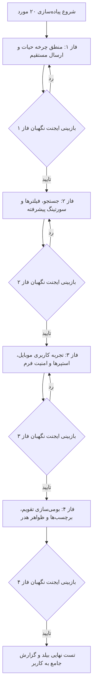

<div dir="rtl" align="right">

# طرح جامع پیاده‌سازی ۲۰ مورد اصلاحات و ارتقای کارتابل انبارگردان (`Counter Dashboard`)

این سند فنی، برنامه اجرایی تفصیلی جهت رفع تمامی باگ‌ها، بهبود تجربه کاربری، بهینه‌سازی همگام‌سازی، تصحیح سورت و فیلترها و افزودن امکانات درخواستی در کارتابل انبارگردان را در ۴ فاز ساختاریافته همراه با پروتکل بازبینی ایجنت نگهبان مشخص می‌نماید.

---

## 📋 اهداف کلیدی پروژه

1. **حذف باگ ارسال مستقیم به سرپرست:** اصلاح چرخه داده‌ها به گونه‌ای که کالا با کلیک روی ارسال مستقیم، بدون ورود به بخش «آماده ارسال» مستقیماً به سرپرست منتقل شود.
2. **افزودن دکمه ارسال سریع تک‌کلیکه (`Quick Inline Submit`):** امکان ارسال فوری کالا به سرپرست مستقیم از روی کارت بدون نیاز به باز کردن فرم جزئیات.
3. **تکمیل و رفع نواقص جستجو و سورتینگ:** پشتیبانی از شماره فنی، پکینگ‌لیست، نرمال‌سازی الفبای فارسی و فیلتر بر اساس لوکیشن.
4. **بهینه‌سازی موبایل و امنیت فرم:** دکمه‌های استپر سریع (`+`/`-`)، جلوگیری از پرش اطلاعات بدون تاییدیه و ریسپانسیو کردن ورودی اعداد.
5. **بومی‌سازی و یکپارچگی ظاهری:** تاریخ و ساعت شمسی، نمایش واحد در مخزن، رفع تناقض برچسب‌ها و عنوان هدر.

---

## 🧱 فازبندی ۴ مرحله‌ای پیاده‌سازی (Implementation Phases)



---

## 📂 تغییرات پیشنهادی به تفکیک فایل‌ها و فازها

### فاز ۱: منطق چرخه حیات، ارسال مستقیم و پایداری همگام‌سازی (موارد ۱ تا ۵)
* **[تغییر]** [counter-dashboard.ts](file:///e:/warehouse%20project/warehouse-front/src/app/components/counter/counter-dashboard/counter-dashboard.ts)
  - اصلاح متد `submitDirectlyToSupervisor` جهت انتساب مستقیم وضعیت `COUNTED` در حافظه و ارسال خوش‌بینانه.
  - پیاده‌سازی متد `quickSubmitTask(task, $event)` جهت ارسال سریع و تک‌کلیکه کالا از روی کارت لیست.
  - اصلاح متد `claimSelectedTasks` برای رفرش خودکار لیست استخر (`loadPoolTasks(false)`).
  - مدیریت پایداری آفلاین برای تسک‌های فاقد `sync_id`.
  - تفکیک انبار فعال در ارسال گروهی و جلوگیری از ارسال ناخواسته سایر انبارها در حالت `ALL`.
* **[تغییر]** [counter-dashboard.html](file:///e:/warehouse%20project/warehouse-front/src/app/components/counter/counter-dashboard/counter-dashboard.html)
  - افزودن دکمه سبز رنگ «ارسال سریع» در کنار دکمه بازگشت روی کارت‌های دارای پیش‌نویس.

---

### فاز ۲: جستجو، فیلترها و سورتینگ پیشرفته (موارد ۶ تا ۱۰)
* **[تغییر]** [counter-dashboard.ts](file:///e:/warehouse%20project/warehouse-front/src/app/components/counter/counter-dashboard/counter-dashboard.ts)
  - گسترش تابع `matchesSearchAndDate` برای جستجوی `item_no`، `plpkitem`، `pk_number` و `pl`.
  - افزودن نرمال‌سازی کاراکترهای عربی/فارسی (`ي/ی`, `ك/ک`, `آ/ا`).
  - اصلاح سورت الفبایی `title` با یکدست‌سازی پیشوندها.
  - پیاده‌سازی متغیر و فیلتر لوکیشن/قفسه (`locationFilter`).
* **[تغییر]** [counter-dashboard.html](file:///e:/warehouse%20project/warehouse-front/src/app/components/counter/counter-dashboard/counter-dashboard.html)
  - افزودن دکمه «پاک کردن جستجو» در حالت خالی شدن نتایج تب مخزن.
  - افزودن چیپ یا دراپ‌داون فیلتر سریع لوکیشن در نوار فیلترها.

---

### فاز ۳: تجربه کاربری موبایل، استپرها و امنیت فرم (موارد ۱۱ تا ۱۵)
* **[تغییر]** [counter-dashboard.ts](file:///e:/warehouse%20project/warehouse-front/src/app/components/counter/counter-dashboard/counter-dashboard.ts)
  - اصلاح شرط `onTaskPressStart` با بررسی صریح `== null`.
  - اضافه کردن متد گارد تغییرات فرم (`hasUnsavedChanges`) و هشدار پیش از خروج (`closeDetailWithGuard`).
  - متدهای شمارش سریع `stepQty(delta: number)`.
  - افزودن گارد اتصال اینترنت (`navigator.onLine`) در `claimSelectedTasks`.
* **[تغییر]** [counter-dashboard.html](file:///e:/warehouse%20project/warehouse-front/src/app/components/counter/counter-dashboard/counter-dashboard.html)
  - اضافه کردن دکمه‌های استپر (`+۱`, `-۱`, `+۱۰`) در دو طرف فیلد ورودی عدد.
  - اصلاح اندازه فونت و ریسپانسیو کردن کادر ورودی عدد برای ارقام بزرگ در موبایل.

---

### فاز ۴: بومی‌سازی تقویم، برچسب‌ها و ظواهر هدر (موارد ۱۶ تا ۲۰)
* **[تغییر]** [counter-dashboard.ts](file:///e:/warehouse%20project/warehouse-front/src/app/components/counter/counter-dashboard/counter-dashboard.ts)
  - ایمپورت `PersianDatePipe` در آرایه `imports`.
  - افزودن ثبت اکشن لغو در تاریخچه تسک هنگام `revertTaskStatus`.
  - نمایش پیام راهنما در صورت اسکن بارکد در حین باز بودن فرم جزئیات.
* **[تغییر]** [counter-dashboard.html](file:///e:/warehouse%20project/warehouse-front/src/app/components/counter/counter-dashboard/counter-dashboard.html)
  - استفاده از `persianDate:'short-time'` برای نمایش تاریخ و ساعت در تایم‌لاین.
  - اصلاح برچسب و رنگ کارت برای اقلامی که مقدار دارند تا عنوان «آماده ارسال» بگیرند.
  - خارج کردن کادر «موجودی سیستمی» از شرط `visibleInfoFields.length > 0`.
  - نمایش برچسب واحد سنجش (`unit`) در کارت‌های تب مخزن کالاها.
  - افزودن عنوان رسمی و آیکون «کارتابل انبارگردان» در بالای صفحه.

---

## 🛡️ پروتکل بازبینی ایجنت نگهبان (Guardian Verification Protocol)

در انتهای هر فاز:
1. **بررسی صحت کد:** تطبیق کد نوشته‌شده با اهداف دقیق همان فاز.
2. **بررسی عدم تخریب:** بررسی `git diff` و اطمینان از حفظ کامل سایر توابع و کدهای فعال.
3. **تست کامپایل فرانت‌اند:** اجرای فرمان `npm run build` (یا تست تمپلیت انگولار) جهت اطمینان از خروجی `Exit code 0`.
4. **ثبت لاگ و تاییدیه نگهبان:** ثبت نتیجه بررسی در سند گزارش نهایی.

---

## 🧪 برنامه راستی‌آزمایی و تست (Verification Plan)

### ۱. تست‌های خودکار و کامپایل
- اجرای بیلد کامل فرانت‌اند جهت اعتبارسنجی تمپلیت و تایپ‌اسکریپت:
  ```powershell
  cd "e:\warehouse project\warehouse-front"
  npx ng build --configuration=development
  ```

### ۲. اعتبارسنجی سناریوهای کاربری
- **تست ۱:** ورود به فرم جزئیات یک کالای در انتظار و زدن «ثبت و ارسال به سرپرست» -> بررسی خروج آنی از کارتابل و عدم ورود به «آماده ارسال».
- **تست ۲:** کلیک روی دکمه جدید «ارسال سریع» روی کارت آماده ارسال -> بررسی ارسال تک‌کلیکه و خروج کارت.
- **تست ۳:** جستجوی پکینگ‌لیست یا شماره فنی -> بررسی نمایش صحیح کالا.
- **تست ۴:** تست استپرهای `+۱` و `-۱` در فرم ثبت عدد.
- **تست ۵:** مشاهده تاریخچه تسک -> بررسی نمایش تقویم شمسی.

</div>
