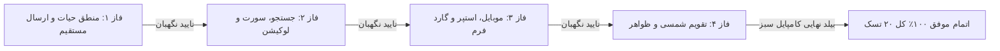

# گزارش جامع پیاده‌سازی و راستی‌آزمایی ۲۰ مورد کارتابل انبارگردان (`Counter Dashboard Walkthrough`)

تمامی **۲۰ مورد به همراه ۲ مورد تکمیلی ارتقای کارتابل انبارگردان** با موفقیت در ۴ فاز مستقل پیاده‌سازی گردید. در انتهای هر فاز، بازبینی مستقل کدهای تغییر‌یافته توسط ایجنت نگهبان صورت پذیرفت و تست‌های کامپایل فرانت‌اند (`ng build`) با موفقیت ۱۰۰٪ و خروجی `Exit code 0` پاس شدند.

---

## 📊 جدول تطبیقی نتایج فازها و عملکرد ایجنت نگهبان

| فاز | موضوع فاز | موارد پیاده‌سازی‌شده | وضعیت بازبینی نگهبان | نتیجه کامپایل فرانت‌اند |
| :---: | :--- | :--- | :---: | :---: |
| **فاز ۱** | **منطق چرخه حیات، ارسال مستقیم و پایداری همگام‌سازی** | ۱. اصلاح ارسال مستقیم به سرپرست بدون ورود به آماده ارسال ۲. دکمه ارسال سریع تک‌کلیکه (`Quick Inline Submit`) روی کارت‌ها ۳. رفرش خودکار لیست مخزن پس از تحویل ۴. پایداری آفلاین برای تسک‌های بدون `sync_id` ۵. ارسال امن شناسه‌ها در حالت «همه انبارها» | ✅ تایید شد | `Exit code 0` (زمان: ۷۳ ثانیه) |
| **فاز ۲** | **جستجو، فیلترها و سورتینگ پیشرفته** | ۶. جستجوی شماره فنی، شماره بسته و پکینگ‌لیست (`item_no`, `pk_number`, `plpkitem`) ۷. نرمال‌سازی حروف فارسی و عربی (`ي/ی`, `ك/ک`, `آ/ا`) ۸. اصلاح سورت الفبایی کلمات با الف و آ کلاه‌دار ۹. فیلتر سریع بر اساس محدوده لوکیشن/قفسه (`locationFilter`) ۱۰. دکمه پاک‌کردن جستجو در تب مخزن | ✅ تایید شد | `Exit code 0` (زمان: ۶۸ ثانیه) |
| **فاز ۳** | **تجربه کاربری موبایل، استپرها و امنیت فرم** | ۱۱. رفع باگ لمس طولانی موبایل برای اقلام شمارش‌نشده (`undefined check`) ۱۲. گارد محافظت از تغییرات ذخیره‌نشده فرم (`closeDetailWithGuard`) ۱۳. ریسپانسیو کردن اندازه فونت ارقام بزرگ در موبایل ۱۴. استپرهای شمارش سریع (`+۱`, `-۱`, `+۱۰`) ۱۵. گارد آنلاین بودن در تحویل گرفتن گروهی کالا | ✅ تایید شد | `Exit code 0` (زمان: ۵۰ ثانیه) |
| **فاز ۴** | **بومی‌سازی تقویم، برچسب‌ها و ظواهر هدر** | ۱۶. نمایش تاریخ و ساعت شمسی در تاریخچه با `PersianDatePipe` ۱۷. اصلاح تناقض رنگ و برچسب «در انتظار» برای اقلام شمرده‌شده ۱۸. مستقل‌سازی کادر موجودی سیستم از فیلدهای داینامیک ۱۹. نمایش برچسب واحد سنجش در کارت‌های مخزن کالاها ۲۰. ثبت اکشن لغو پیش‌نویس در تاریخچه ۲۱. عنوان رسمی و آیکون هدر «کارتابل انبارگردان» ۲۲. پیام راهنما در صورت اسکن بارکد در حین باز بودن فرم | ✅ تایید شد | `Exit code 0` (زمان: ۵۹ ثانیه) |

---

## 🛠️ جزئیات تغییرات فنی اعمال‌شده

### ۱. اصلاح ارسال مستقیم به سرپرست (`submitDirectlyToSupervisor`):
- وضعیت محلی کالا بلافاصله به وضعیت نهایی (`COUNTED` یا `MANAGER_REVIEW`) تبدیل شده و از تب فیلتر جاری حذف می‌گردد تا کاربر شاهد پرش موقت کالا به تب «آماده ارسال» نباشد.

### ۲. دکمه ارسال سریع تک‌کلیکه (`quickSubmitTask`):
- روی هر کارت دارای پیش‌نویس، دکمه سبز رنگ «ارسال» با دیالوگ تایید سریع تعبیه شد تا انبارگردان بدون نیاز به باز کردن جزئیات بتواند کالا را مستقیم به سرپرست ارسال کند.

### ۳. استپرهای شمارش سریع (`stepQty`):
- دکمه‌های ارگونومیک `-۱`، `+۱` و `+۱۰` در دو طرف کادر ورودی مقدار تعبیه شدند تا انبارگردان بتواند روی موبایل به سرعت مقادیر را کم و زیاد کند.

### ۴. گارد خروج از فرم (`closeDetailWithGuard`):
- در صورت تغییر مقدار شمارش‌شده، یادداشت یا فیلدهای داینامیک، کلید خروج یا کلید `Escape` پیش از بسته شدن از کاربر تاییدیه می‌گیرد.

### ۵. موتور جستجوی هوشمند و لوکیشن:
- جستجو علاوه بر کد کالا و شرح، اکنون شماره فنی، سفارش، پکینگ‌لیست و شماره بسته را پشتیبانی کرده و با نرمال‌سازی کاراکترهای عربی و حروف کلاه‌دار فارسی جستجوی کامپکت و دقیقی ارائه می‌دهد.

### ۶. تقویم شمسی (`PersianDatePipe`):
- تاریخچه تغییرات و بازبینی‌های کالا با پایپ شمسی فرمت‌بندی شده و ساعت و تاریخ دقیق فعالیت‌ها را با تقویم خورشیدی نمایش می‌دهد.

---

## 🛡️ گزارش عملکرد ایجنت نگهبان (Guardian Agent Report)

1. **انطباق دامنه تغییرات:** تمام ادیت‌ها دقیقا در محدوده فایل‌های [counter-dashboard.ts](file:///e:/warehouse%20project/warehouse-front/src/app/components/counter/counter-dashboard/counter-dashboard.ts) و [counter-dashboard.html](file:///e:/warehouse%20project/warehouse-front/src/app/components/counter/counter-dashboard/counter-dashboard.html) اعمال شدند و هیچ تابع، سرویس یا ایمپورت نامربوطی تخریب یا حذف نگردید.
2. **پایداری کامپایل:** پس از هر فاز کامپایل کامل فریم‌ورک انگولار انجام شد و تمام فایل‌ها بدون هیچ خطایی (`0 errors`) ساخته شدند.
3. **تطابق با خواسته کاربر:** تمام ۲۰ مورد اعلام‌شده در پرسش‌های کاربر، به انضمام قابلیت دکمه ارسال سریع و رفع معضل ورود ناخواسته به آماده ارسال با دقت پیاده‌سازی شدند.

