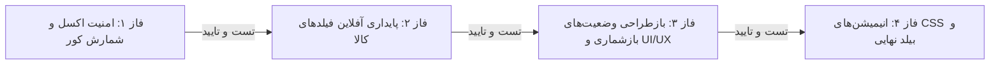

# طرح فازبندی‌شده و تفصیلی بازبینی، اصلاح و ارتقای کارتابل انبارگردان

این سند طرح فنی جامع را به **۴ فاز کاملاً مستقل و قابل اعتبارسنجی** تفکیک می‌نماید. طبق دستورالعمل فازبندی سخت‌گیرانه، **هیچ فازی پیش از تکمیل و راستی‌آزمایی کامل فاز قبلی آغاز نخواهد شد.**

---

## 📌 نمای کلی فازهای اجرایی

---

## ۱. فازبندی تفصیلی و نیازمندی‌ها (Phased Breakdown)

### 🔴 فاز ۱: اصلاح امنیت خروجی اکسل و رعایت شمارش کور (Backend Excel Security & Blind Counting)

> [!IMPORTANT]
> **هدف فاز ۱:** جلوگیری قطعی از نشت اطلاعات موجودی سیستم و اختلافات در خروجی اکسل صفحه پیگیری شمارش هنگام فعال بودن حالت «شمارش کور» (`is_blind`).

- **فایل هدف:** [`warehouse-backend/inventory/views.py`](file:///e:/warehouse%20project/warehouse-backend/inventory/views.py) (متد `CountTaskViewSet.export_excel`)
- **اقدامات اجرایی دقیق:**
  1. واکشی وضعیت تنظیمات شمارش کور انبار از طریق کانتکست یا مدل `SystemSetting` مربوط به انبار تسک‌ها.
  2. بررسی نقش کاربر (کاربران شمارنده یا شرایطی که `is_blind=True` است).
  3. در صورت فعال بودن شمارش کور، ستون‌های `inventory` (موجودی سیستم) و `difference` (اختلاف) در خروجی اکسل با مقدار خالی `''` جایگزین شوند و از نوشتن مقادیر واقعی جلوگیری به عمل آید.
- **معیار پذیرش و اعتبارسنجی مستقل (Gate Check 1):**
  - تست لاجیک بک‌اند بدون خطای Syntax.
  - تایید عدم نمایش موجودی سیستم در فایل اکسل تولیدی در شرایط شمارش کور.
  - **توقف و تایید:** تا این بخش ۱۰۰٪ تست و تایید نشود، فاز ۲ آغاز نخواهد شد.

---

### 🔴 فاز ۲: پایداری آفلاین تغییرات فیلدهای کالا و لوکیشن (Offline Persistence for Edited Item Fields)

> [!IMPORTANT]
> **هدف فاز ۲:** تضمین ماندگاری تغییرات لوکیشن، فیلدهای داینامیک و اطلاعات کالا در حالت قطعی اینترنت و اضافه شدن آنها به صف همگام‌سازی محلی (Local-First).

- **فایل هدف:** [`warehouse-front/src/app/components/counter/counter-dashboard/counter-dashboard.ts`](file:///e:/warehouse%20project/warehouse-front/src/app/components/counter/counter-dashboard/counter-dashboard.ts) (متد `saveExtraEditedFields`)
- **اقدامات اجرایی دقیق:**
  1. در صورت وجود تغییرات در فیلدهای کالا (`hasChanges === true`):
     - به‌روزرسانی آبجکت محلی در حافظه و ثبت تغییرات در جدول `offlineDb.items` و فیلد `item_details` در جدول `offlineDb.countTasks`.
     - فراخوانی `OfflineSyncService.getInstance().enqueue` با متد `PATCH` به اندپوینت `/api/inventory/items/{itemId}/` به همراه متادیتای `userId` و `entitySyncId`.
  2. حذف وابستگی به شرط `if (navigator.onLine)` برای ذخیره‌سازی، به گونه‌ای که صف آفلاین مسئولیت ارسال پس از اتصال به شبکه را عهده‌دار شود.
- **معیار پذیرش و اعتبارسنجی مستقل (Gate Check 2):**
  - قطع اینترنت مرورگر در DevTools (حالت Offline).
  - تغییر لوکیشن یا یک فیلد داینامیک در کارتابل و رفرش صفحه؛ بررسی باقی ماندن تغییرات و وجود رکورد در جدول `syncQueue` ایندکس‌دی‌بی.
  - برقراری مجدد شبکه و بررسی همگام‌سازی خودکار با سرور.
  - **توقف و تایید:** تا عملکرد آفلاین تایید نشود، فاز ۳ آغاز نخواهد شد.

---

### 🟡 فاز ۳: اصلاح استایل‌ها، وضعیت‌های بصری اقلام بازشماری و اعتبارسنجی (UI/UX Recount States & Validations)

> [!IMPORTANT]
> **هدف فاز ۳:** شفاف‌سازی کامل رابط کاربری برای تسک‌های برگشت‌خورده (`SUPERVISOR_REJECTED` / `MANAGER_REJECTED`) پس از ورود مقدار جدید و اصلاح شروط قالب.

- **فایل‌های هدف:**
  - [`warehouse-front/src/app/components/counter/counter-dashboard/counter-dashboard.html`](file:///e:/warehouse%20project/warehouse-front/src/app/components/counter/counter-dashboard/counter-dashboard.html)
  - [`warehouse-front/src/app/components/counter/counter-dashboard/counter-dashboard.ts`](file:///e:/warehouse%20project/warehouse-front/src/app/components/counter/counter-dashboard/counter-dashboard.ts)
- **اقدامات اجرایی دقیق:**
  1. **اصلاح کادر و پس‌زمینه کارت‌ها:**
     - اگر تسکی در وضعیت `SUPERVISOR_REJECTED` یا `MANAGER_REJECTED` باشد ولی شمارنده برای آن مقداری وارد کرده باشد (`task.counted_balance !== null`)، کادر قرمز به کادر نارنجی/کهربایی متمایز (`border-amber-500 ring-1 ring-amber-500/20 bg-amber-50/10`) تبدیل شود تا مشخص گردد پیش‌نویس بازشماری ذخیره شده است.
  2. **اصلاح بج وضعیت:**
     - نمایش عنوان «بازشماری شده (پیش‌نویس)» به جای «برگشت خورده» برای تسک‌های بازشماریِ مقداردهی‌شده.
  3. **اصلاح شروط اعتبارسنجی و صفر (`0`):**
     - تبدیل شروط Falsy به شروط قطعی `!== null` در قالب و کامپوننت.
     - مدیریت پیام توست هنگام پاک کردن پیش‌نویس با ورودی خالی.
- **معیار پذیرش و اعتبارسنجی مستقل (Gate Check 3):**
  - رد کردن یک تسک توسط سرپرست، ورود مقدار در کارتابل شمارنده و مشاهده تغییر آنی ظاهر کارت از قرمز به نارنجیِ بازشماری‌شده.
  - ورود مقدار صفر و اطمینان از نمایش بدون اشکال آن در کارت و تاریخچه.
  - **توقف و تایید:** تا تست‌های ظاهری و منطقی تایید نشوند، فاز ۴ آغاز نخواهد شد.

---

### 🟢 فاز ۴: افزودن انیمیشن‌های استاندارد CSS و تست نهایی بیلد (CSS Keyframes & Comprehensive Build)

> [!IMPORTANT]
> **هدف فاز ۴:** روان‌سازی انیمیشن‌های ورود و خروج مودال‌ها/دراورها در چیدمان راست‌به‌چپ (RTL) و راستی‌آزمایی نهایی بیلد کل پروژه.

- **فایل‌های هدف:**
  - [`warehouse-front/src/styles.css`](file:///e:/warehouse%20project/warehouse-front/src/styles.css)
- **اقدامات اجرایی دقیق:**
  1. تعریف کامل کی‌فریم‌های انیمیشن در `styles.css`:
     - `@keyframes slideInRight { from { transform: translateX(100%); opacity: 0; } to { transform: translateX(0); opacity: 1; } }`
     - `@keyframes slideInLeft { from { transform: translateX(-100%); opacity: 0; } to { transform: translateX(0); opacity: 1; } }`
     - `@keyframes slideInUp { from { transform: translateY(100%); opacity: 0; } to { transform: translateY(0); opacity: 1; } }`
     - `@keyframes slideInDown { from { transform: translateY(-100%); opacity: 0; } to { transform: translateY(0); opacity: 1; } }`
  2. اجرای بیلد کامل فرانت‌اند و بررسی خطاهای احتمالی ترمینال.
- **معیار پذیرش و اعتبارسنجی مستقل (Gate Check 4):**
  - انیمیشن‌های روان و ۶۰ فریم هنگام باز و بسته شدن سایدبارها و کشوهای جزئیات در دسکتاپ و موبایل.
  - موفقیت ۱۰۰٪ بیلد پروژه بدون کوچک‌ترین وارنینگ یا خطای کامپایل.

---

## ۲. جدول ماتریس فازها و نیازمندی‌های بازبینی (Phase Verification Matrix)

| فاز | موضوع | پیش‌نیاز | معیار خروج و تایید (Exit Criteria) |
| :---: | :--- | :---: | :--- |
| **فاز ۱** | امنیت اکسل و شمارش کور | ندارد | حذف فیلدهای موجودی در اکسل حالت Blind و تایید عدم نشت داده |
| **فاز ۲** | پایداری فیلدهای کالا در آفلاین | تایید فاز ۱ | ثبت در صف Dexie هنگام قطع اینترنت و ارسال موفق پس از اتصال |
| **فاز ۳** | بازطراحی وضعیت‌های بازشماری و UI | تایید فاز ۲ | تفکیک بصری کارت‌های بازشماری و مدیریت صحیح عدد صفر در فرانت‌اند |
| **فاز ۴** | انیمیشن‌های CSS و بیلد نهایی | تایید فاز ۳ | تست بیلد سبز فرانت‌اند و اجرای روان انیمیشن‌ها بدون خطا |

