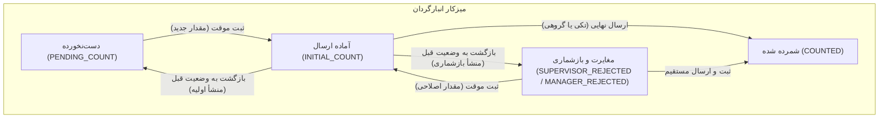

<div dir="rtl" align="right">

# 📋 طرح جامع تفکیک تب «مغایرت و بازشماری» و چرخه هوشمند بازگرداندن کالا به وضعیت پیشین

---

## 🎯 ۱. شرح مسئله، اهداف و معماری چرخه وضعیت‌ها

### 🔴 ریشه‌یابی وضع موجود (Root Cause Analysis):
1. **ناپدید شدن تب بازشماری:** هنگام رد کالا توسط سرپرست (`SUPERVISOR_REJECTED`) یا مدیر (`MANAGER_REJECTED`)، مقدار شمارش قبلی در دیتابیس باقی می‌ماند. به دلیل وجود شرط وابستگی به مقدار شمارش (`hasCountedVal`)، کالا بلافاصله به عنوان «آماده ارسال» شناخته شده و تب بازشماری حذف می‌گردید.
2. **عدم امکان بازگشت از آماده ارسال (Lack of Undo / Revert):** اگر انبارگردان مقداری را برای یک کالا به اشتباه به صورت پیش‌نویس موقت (`INITIAL_COUNT`) ثبت کند، راهکاری برای لغو پیش‌نویس و بازگرداندن آن به وضعیت قبلی (دست‌نخورده یا بازشماری) نداشت.

---

### 🔄 ماتریس انتقال وضعیت و منطق چرخه بازگشت (State Machine Matrix):

| وضعیت جاری | اقدام کاربر | وضعیت مقصد | تب مقصد | رفتار فیلد مقدار شمارش |
| :--- | :--- | :--- | :--- | :--- |
| **`SUPERVISOR_REJECTED`** / **`MANAGER_REJECTED`** | ورود مقدار جدید + «ثبت موقت» | **`INITIAL_COUNT`** | آماده ارسال | مقدار جدید ثبت می‌شود |
| **`PENDING_COUNT`** | ورود مقدار شمارش + «ثبت موقت» | **`INITIAL_COUNT`** | آماده ارسال | مقدار وارد شده ثبت می‌شود |
| **`INITIAL_COUNT`** (با منشأ بازشماری) | کلیک روی «بازگشت به وضعیت قبل» | **`SUPERVISOR_REJECTED`** یا **`MANAGER_REJECTED`** | **مغایرت و بازشماری** | مقدار شمارش پاک (null) می‌شود |
| **`INITIAL_COUNT`** (با منشأ شمارش اولیه) | کلیک روی «بازگشت به وضعیت قبل» | **`PENDING_COUNT`** | **دست‌نخورده** | مقدار شمارش پاک (null) می‌شود |
| **`INITIAL_COUNT`** | ارسال به سرپرست (تکی یا گروهی) | **`COUNTED`** | **شمرده شده** | مقدار نهایی ارسال می‌شود |



---

## 🛑 قوانین اجرایی و فازبندی سخت‌گیرانه (Phased Execution Constraints)

> [!IMPORTANT]
> **قانون توقف و راستی‌آزمایی فازها:**
> پیاده‌سازی این تغییرات در **۴ فاز مستقل و ترتیبی** انجام خواهد شد. **تا زمانی که هر فاز به طور کامل پیاده‌سازی، تست و راستی‌آزمایی نشده باشد، ورود به فاز بعدی اکیداً ممنوع است.**

---

## 📌 فازبندی تفصیلی پروژه (Detailed Phases)

### 🔹 فاز ۱: اصلاح منطق فیلترها و دسته‌بندی اقلام (Logic & Tab Filtering)
**هدف:** تثبیت تب «مغایرت و بازشماری» و تفکیک دقیق وضعیت‌ها در محاسبات فرانت‌اند.
1. اصلاح توابع تشخیصی در `applyFilters` در فایل [`counter-dashboard.ts`](file:///E:/warehouse%20project/warehouse-front/src/app/components/counter/counter-dashboard/counter-dashboard.ts):
   - **`isRecount`**: اقلامی که وضعیت آنها دقیقاً `SUPERVISOR_REJECTED` یا `MANAGER_REJECTED` است، بدون توجه به خالی یا پر بودن مقدار شمارش، منحصراً متعلق به تب «مغایرت و بازشماری» هستند.
   - **`isInitial`**: اقلامی که وضعیت آنها `INITIAL_COUNT` است منحصراً متعلق به تب «آماده ارسال» هستند.
   - **`isPending`**: اقلامی که وضعیت آنها `PENDING_COUNT` است متعلق به تب «دست‌نخورده» هستند.
2. به‌روزرسانی زنده شمارنده‌های وضعیت (`statusCounts`) بر اساس همین تفکیک.
3. **راستی‌آزمایی فاز ۱:** تایید حضور پایدار اقلام ردشده در تب بازشماری و عدم تداخل آن با تب آماده ارسال.

---

### 🔹 فاز ۲: پیاده‌سازی موتور بازگرداندن هوشمند به وضعیت قبل (Revert Engine)
**هدف:** افزودن قابلیت لغو پیش‌نویس و برگشت هوشمند کالا به وضعیت و تب متناظر.
1. پیاده‌سازی متد `revertTaskStatus(task: CountTask)` در [`counter-dashboard.ts`](file:///E:/warehouse%20project/warehouse-front/src/app/components/counter/counter-dashboard/counter-dashboard.ts):
   - تشخیص منشأ کالا (اگر یادداشت سرپرست/مدیر دارد یا قبلاً وضعیت رد داشته، به `SUPERVISOR_REJECTED` برگردد؛ در غیر این صورت به `PENDING_COUNT`).
   - تنظیم مقدار `counted_balance = null`.
   - ذخیره در IndexedDB محلی در حالت Local-First و ارسال PATCH به سرور در حالت آنلاین.
   - فراخوانی `applyFilters()` و نمایش Toast اعلان موفقیت.
2. اصلاح متد `saveDraft` در صورت خالی کردن مقدار (Empty Input Handling) برای بازگشت به وضعیت اصلی رد شده به جای PENDING_COUNT.
3. **راستی‌آزمایی فاز ۲:** فراخوانی و تست متد با داده‌های مختلف و اطمینان از خروج کالا از `INITIAL_COUNT` و پاک شدن شمارش.

---

### 🔹 فاز ۳: ارتقای رابط کاربری و المان‌های تعاملی (UI & Interaction Layer)
**هدف:** فراهم کردن دسترسی بصری و ارگونومیک به قابلیت بازگشت و ارتقای استایل‌ها در تمپلیت.
1. **ارتقای چیپ‌های بالای صفحه:**
   - تغییر عنوان چیپ فیلتر به **«مغایرت و بازشماری»** با استایل رنگ هشدار رز (`bg-rose-500`) و شمارنده زنده.
2. **ارتقای کارت کالا در لیست:**
   - نمایش نشان‌های شفاف: **«برگشت خورده (سرپرست) — مغایرت»** و **«برگشت خورده (مدیر) — مغایرت»**.
   - اعمال کادر قرمز هشدار (`border-rose-500 ring-rose-500/20 bg-rose-50/10`) برای اقلام ردشده تا زمان ثبت مقدار اصلاحی.
   - افزودن **دکمه سریع بازگشت (Undo Icon Button)** روی کارت کالا در تب «آماده ارسال» جهت خروج سریع با یک کلیک.
3. **ارتقای فرم جزئیات کالا (Detail Modal):**
   - افزودن دکمه **«بازگشت به وضعیت قبل»** با آیکون Revert در کنار دکمه‌های «ثبت موقت» و «ثبت و ارسال مستقیم».
4. **راستی‌آزمایی فاز ۳:** بررسی ریسپانسیو بودن، ظاهر دکمه‌ها و عدم تداخل کلیک در کارت‌ها (Stop Propagation).

---

### 🔹 فاز ۴: بیلد نهایی، تست فرآیندی و راستی‌آزمایی جامع (Build & E2E Verification)
**هدف:** اطمینان از عملکرد ۱۰۰٪ بدون خطا در محیط عملیاتی و حالت‌های آفلاین/آنلاین.
1. اجرای کامپایل کامل پروژه با `npm run build`.
2. تست سناریوهای ۴ گانه:
   - سناریو ۱: رد کالا توسط سرپرست ⬅️ نمایش فوری در تب «مغایرت و بازشماری».
   - سناریو ۲: ورود مقدار جدید در بازشماری + ثبت موقت ⬅️ انتقال به تب «آماده ارسال».
   - سناریو ۳: زدن دکمه بازگشت برای کالای بازشماری‌شده ⬅️ بازگشت به تب «مغایرت و بازشماری» و پاک شدن عدد.
   - سناریو ۴: زدن دکمه بازگشت برای کالای شمارش اولیه ⬅️ بازگشت به تب «دست‌نخورده».
3. ثبت گزارش جامع در مستندات پروژه (Walkthrough & Master Log).

---

## 📁 فایل‌های مشمول تغییر

| نام فایل | مسیر فایل | نوع تغییر | شرح تغییرات |
| :--- | :--- | :---: | :--- |
| **`counter-dashboard.ts`** | [`warehouse-front/.../counter-dashboard.ts`](file:///E:/warehouse%20project/warehouse-front/src/app/components/counter/counter-dashboard/counter-dashboard.ts) | اصلاح | اصلاح منطق `applyFilters`، افزودن متد `revertTaskStatus` و اصلاح `saveDraft` |
| **`counter-dashboard.html`** | [`warehouse-front/.../counter-dashboard.html`](file:///E:/warehouse%20project/warehouse-front/src/app/components/counter/counter-dashboard/counter-dashboard.html) | اصلاح | چیپ مغایرت، دکمه Revert روی کارت، دکمه Revert در فرم جزئیات و استایل‌ها |

---

## 🧪 برنامه راستی‌آزمایی (Verification Plan)

### ۱. تست خودکار بیلد فرانت‌اند
```powershell
npm run build
```

### ۲. تست دستی سناریوهای چهارگانه در مرورگر
- ورود به کارتابل انبارگردان و جابجایی بین تب‌ها.
- انجام تست شمارش، بازشماری و لغو با بازگشت به وضعیت پیشین.

</div>
