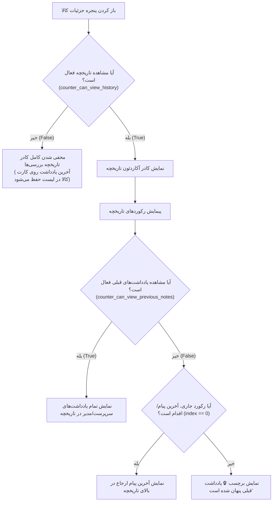

# گزارش پیاده‌سازی: تنظیمات کنترل دسترسی انبارگردان به تاریخچه و یادداشت‌های قبلی کالا (Counter History & Notes Visibility Settings)

تمامی اهداف و نیازمندی‌های تعیین‌شده برای مدیریت سطح دسترسی انبارگردان به تاریخچه کالا و یادداشت‌های ارجاع با موفقیت کامل پیاده‌سازی و بدون هیچ خطایی بیلد شدند.

---

## ۱. جدول خلاصه تغییرات فایل‌ها (Files Modified)

| نام فایل | لایه معماری | شرح تغییرات اعمال‌شده |
| :--- | :---: | :--- |
| [warehouses/services.py](file:///e:/warehouse%20project/warehouse-backend/warehouses/services.py) | بک‌اند (Django) | اضافه شدن کلیدهای `counter_can_view_history` و `counter_can_view_previous_notes` با مقدار پیش‌فرض `True` به `DEFAULT_SETTINGS`. |
| [settings.html](file:///e:/warehouse%20project/warehouse-front/src/app/components/settings/settings.html) | فرانت‌اند (تنظیمات کلان) | ایجاد دو تاگل سوئیچ مدرن در تب «قوانین عملیاتی» برای تنظیم مشاهده تاریخچه و مشاهده یادداشت‌های قبلی. |
| [wh-settings.html](file:///e:/warehouse%20project/warehouse-front/src/app/components/wh-settings/wh-settings.html) | فرانت‌اند (تنظیمات انبار) | ایجاد دو تاگل سوئیچ همراه با نشانگر وضعیت اورراید اختصاصی (`is_override`) در تب قوانین عملیاتی هر انبار. |
| [wh-settings.ts](file:///e:/warehouse%20project/warehouse-front/src/app/components/wh-settings/wh-settings.ts) | فرانت‌اند (تنظیمات انبار) | افزودن کلیدهای جدید به `opKeys` برای تشخیص تغییرات اورراید و بازنشانی اختصاصی. |
| [counter-dashboard.ts](file:///e:/warehouse%20project/warehouse-front/src/app/components/counter/counter-dashboard/counter-dashboard.ts) | فرانت‌اند (انبارگردان) | تعریف متغیرهای وضعیتی، استخراج تنظیمات در `fetchFieldSettings` و متد کمکی `canViewRecordNote`. |
| [counter-dashboard.html](file:///e:/warehouse%20project/warehouse-front/src/app/components/counter/counter-dashboard/counter-dashboard.html) | فرانت‌اند (انبارگردان) | شرطی‌سازی نمایش کادر تاریخچه با `counterCanViewHistory` و مخفی‌سازی یادداشت‌های قدیمی با `canViewRecordNote(i)`. |

---

## ۲. سناریوهای رفتاری و منطق پیاده‌سازی‌شده (Behavior & Logic)

---

## ۳. نتایج راستی‌آزمایی و بیلد (Verification Results)

* **بررسی بک‌اند (`manage.py check`):** با موفقیت و خروجی `System check identified no issues (0 silenced)` اجرا شد.
* **بیلد پروداکشن فرانت‌اند (`npm run build`):** با موفقیت کامل و خروجی `Exit Code: 0` کامپایل شد و بسته‌های نهایی در پوشه `dist` تولید شدند.

