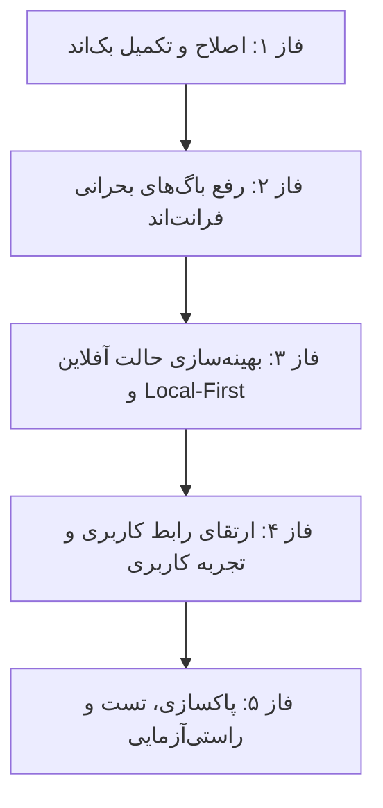

# طرح جامع اصلاح، رفع باگ‌ها و بهینه‌سازی صفحه کارتابل مالی و مدارک (Customs Cartable)

این طرح جامع به منظور برطرف کردن تمامی ایرادات شناسایی‌شده در صفحه کارتابل مالی (`Customs`) در هر دو لایه فرانت‌اند و بک‌اند، بهینه‌سازی همگام‌سازی محلی (Local-First)، ارتقای تجربه کاربری (UI/UX) و ایمن‌سازی فرآیندهای مالی تدوین شده است.

---

## ۱. تایید کاربر مورد نیاز است (User Review Required)

> [!IMPORTANT]
> **تفکیک عملیات ارسال تکی و گروهی:** در این طرح، دکمه «ارسال به سرپرست» در فرم جزئیات، ابتدا پیش‌نویس کالای فعلی را ذخیره کرده و **فقط همان کالای فعال** را به سرپرست ارسال می‌کند (نه تمام اقلام کارتابل).
> همچنین عرض کانتینر صفحه در دسکتاپ از `max-w-2xl` (۶۷۲px) به `max-w-4xl` ارتقا می‌یابد تا از فضای نمایشگر استفاده بهینه شود.

---

## ۲. نمای کلی فازهای اجرایی (Execution Phases)

---

## ۳. تغییرات پیشنهادی به تفکیک فایل‌ها (Proposed Changes)

### الف) لایه بک‌اند (Backend)

#### [MODIFY] [views.py](file:///e:/warehouse%20project/warehouse-backend/inventory/views.py)
* پیاده‌سازی اکشن `@action(detail=False, methods=['get'], url_path='get_export_columns')` در کلاس `DocTaskViewSet` جهت بازگرداندن لیست ستون‌های مجاز خروجی اکسل کارتابل مالی.
* پیاده‌سازی اکشن `@action(detail=False, methods=['post'], url_path='export_excel')` در کلاس `DocTaskViewSet` جهت تولید و دانلود فایل اکسل تسک‌های مالی شامل تبدیل تاریخ‌ها به شمسی، برچسب‌های فارسی وضعیت‌ها، پشتیبانی از فیلتر انبار و لیست شناسه‌های انتخابی (`selected_ids`).

---

### ب) لایه سرویس‌ها و مدل‌های فرانت‌اند (Core & Services)

#### [MODIFY] [doc-task-store.ts](file:///e:/warehouse%20project/warehouse-front/src/app/core/services/doc-task-store.ts)
* اصلاح شرط منطقی متد `getMyTasks` جهت بازگرداندن دقیق تسک‌های کارشناس جاری.
* پشتیبانی از ذخیره‌سازی آفلاین فیلدهای پویای کالا در صورت ایجاد تغییرات در فرم مالی.

---

### ج) لایه کامپوننت کارتابل مالی (Customs Component)

#### [MODIFY] [customs.ts](file:///e:/warehouse%20project/warehouse-front/src/app/components/customs/customs.ts)
1. **جداسازی ارسال تکی کالا (`submitCurrentTask`):** افزودن متد اختصاصی برای ارسال کالای فعال در فرم جزئیات پس از ذخیره خودکار پیش‌نویس.
2. **بهینه‌سازی جستجو:** کاهش `debounceTime` از ۲۰۰۰ms به ۳۰۰ms و اعمال فیلتر جستجو بر روی هر دو تب `my-tasks` و `poolTasks`.
3. **همگام‌سازی وضعیت URL:** ذخیره و بازیابی `taskId` در پارامترهای آدرس مرورگر (`?taskId=...`) جهت ماندگاری وضعیت فرم پس از Refresh.
4. **حفاظت از تغییرات ذخیره‌نشده:** بررسی تغییرات فرم هنگام کلیک روی دکمه بازگشت و نمایش پیام تایید در صورت وجود تغییرات ذخیره‌نشده.
5. **مدیریت انتخاب‌ها:** ریست کردن لیست انتخاب‌ها هنگام تغییر فیلترهای وضعیت به منظور جلوگیری از ناهماهنگی شمارنده دکمه ارسال.
6. **پاکسازی کدهای مرده:** حذف متغیرهای بدون استفاده `f_added_rti_no` تا `f_signature` و حذف تاخیرهای مصنوعی `setTimeout(600)`.
7. **پشتیبانی از انتخاب همه:** متدهای `toggleSelectAll()` و `isAllSelected()`.

#### [MODIFY] [customs.html](file:///e:/warehouse%20project/warehouse-front/src/app/components/customs/customs.html)
1. **افزودن کادر جستجوی زیبا و پیشرفته:** نوار جستجو با دکمه پاک کردن، آیکون و شمارنده نتایج.
2. **جعبه پیام وضعیت و دلیل رد (Rejection Alert Box):** نمایش بنر هشدار با متن یادداشت سرپرست (`supervisor_note`) یا یادداشت مدیر (`manager_note`) در فرم جزئیات کالاهای رد شده.
3. **افزودن تاریخچه اقدامات (History Timeline):** نمایش تاریخچه بررسی‌ها و تغییرات سند در پایین فرم جزئیات.
4. **دکمه انتخاب همه (Select All Checkbox):** در هدر لیست کارهای من و استخر کالاها.
5. **ارتقای پهنای صفحه و ریسپانسیو:** تغییر کانتینر به `max-w-4xl` و بهبود فاصله‌ها و دکمه‌های فرم در موبایل و دسکتاپ.
6. **اصلاح دکمه‌های اکشن فرم تکی:** تغییر دکمه پایین فرم جزئیات به «ارسال این کالا به سرپرست» متصل به `submitCurrentTask()`.

---

## ۴. برنامه راستی‌آزمایی و تست (Verification Plan)

### الف) تست‌های عملکردی (Functional Testing)
| مرحله | سناریوی تست | نتیجه مورد انتظار |
| :---: | :--- | :--- |
| **۱** | باز کردن فرم یک کالا، وارد کردن اطلاعات و کلیک روی «ارسال به سرپرست» | فقط همان کالا ارسال شود و تغییرات آن ذخیره گردد (سایر کالاها دست‌نخورده بمانند). |
| **۲** | تایپ در کادر جستجو با کدهای یکتا یا شرح کالا | فیلتر آنی و روان لیست کارهای من و استخر در ۳۰۰ میلی‌ثانیه. |
| **۳** | باز کردن کالایی با وضعیت «رد سرپرست» یا «رد مدیر» | نمایش واضح متن یادداشت سرپرست/مدیر در بالای فرم جزئیات. |
| **۴** | کلیک روی دکمه خروجی اکسل و دانلود فایل | دانلود موفق فایل `.xlsx` با ستون‌های سفارشی و تاریخ‌های شمسی. |
| **۵** | انتخاب همه با چک‌باکس هدر و ارسال گروهی | انتخاب تمام ردیف‌های فیلترشده و ارسال دسته‌جمعی بدون باگ. |
| **۶** | باز کردن کالا و فشردن کلید Refresh (F5) | باقی ماندن در فرم همان کالا با همان شناسه در URL. |

### ب) تست بیلد و یکپارچگی (Build & Lint)
* اجرای `npx ng build` برای تضمین عدم وجود هرگونه خطای تایپ‌اسکریپت و قالب.
* اجرای `python manage.py check` در بک‌اند برای اعتبارسنجی اندپوینت‌ها.

---

> [!IMPORTANT]
> **منتظر دستور شما:** طبق قوانین پروژه، هیچ کدی تغییر نخواهد کرد تا زمانی که شما دستور صریح (مانند «تایید» یا «شروع») را ارسال فرمایید.

