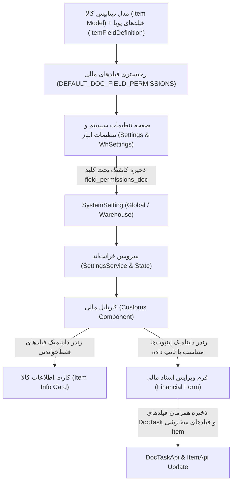

# طرح جامع سفارشی‌سازی فیلدهای کارتابل مالی در تنظیمات سیستم

این طرح فنی، معماری و پیاده‌سازی کامل امکان **مدیریت داینامیک فیلدهای قابل نمایش و ویرایش برای کارشناس مالی / اسناد** در صفحه تنظیمات سیستم را شرح می‌دهد؛ دقیقاً مشابه آنچه برای کارتابل انبارگردان پیاده‌سازی شده بود، به طوری که تمام فیلدهای جدول کالا (`Item`) به همراه فیلدهای پویای انبار پشتیبانی شوند، عناوین نمایشی سفارشی‌سازی گردند، و مقادیر و رفتار پیش‌فرض فعلی کارتابل مالی بدون هیچ تغییری حفظ شوند.

---

## 🎯 اهداف اصلی طرح (Core Objectives)

1. **پوشش ۱۰۰٪ فیلدهای جدول کالا و فیلدهای پویا:** امکان انتخاب هر کدام از ستون‌های مدل `Item` (شناسه‌ها، مشخصات، موجودی، انبارداری، بازرگانی، اسناد و مالی) و فیلدهای متغیر/پویای انبار (`ItemFieldDefinition`) برای کارتابل مالی.
2. **حفظ قطعی رفتار و پیش‌فرض‌های فعلی سیستم (100% Backward Compatible):** سیستم در حالت صفر (بدون دستکاری کاربر) دقیقاً همان فیلدهای فعلی کارتابل مالی را با همان حالت‌های فقط‌خواندنی یا قابل ویرایش نمایش می‌دهد.
3. **نام‌گذاری منعطف (Dynamic & Custom Display Labels):**
   - نام ستون در دیتابیس به صورت پیش‌فرض درج می‌شود (`Default Label`).
   - کاربر می‌تواند نام نمایشی فیلدها را در تنظیمات به دلخواه تغییر دهد (`Custom Label`).
   - دکمه بازنشانی سریع (`↺`) برای بازگشت به نام اصلی ستون تعبیه شده است.
4. **کنترل دو سطحی دسترسی:**
   - **قابل نمایش (Visible):** آیا فیلد در کارت مشخصات کالا یا فرم مالی نمایش داده شود؟
   - **قابل ویرایش (Editable):** آیا کارشناس مالی اجازه ورود و تغییر مقدار این فیلد را در فرم دارد؟
5. **پشتیبانی دو لایه (تنظیمات کلان و اختصاصی انبار):**
   - تعریف تنظیمات پیش‌فرض سراسری در `Settings`.
   - امکان اورراید کردن تنظیمات برای هر انبار خاص در `WhSettings`.

---

## 🏗 معماری فنی و جریان داده‌ها (Technical Architecture)

---

## 📑 رجیستری فیلدهای پیش‌فرض کارتابل مالی (`DEFAULT_DOC_FIELD_PERMISSIONS`)

| ردیف | نام فیلد | عنوان پیش‌فرض | دسته‌بندی | نوع داده | وضعیت پیش‌فرض نمایش | وضعیت پیش‌فرض ویرایش |
| :---: | :--- | :--- | :---: | :---: | :---: | :---: |
| ۱ | `fa_unic_code` | کد یکتا (FA-UNIC) | شناسه‌ها و کدها | متنی | ✅ بله | ❌ فقط خواندنی |
| ۲ | `description` | شرح کالا | مشخصات کالا | چندخطی | ✅ بله | ❌ فقط خواندنی |
| ۳ | `po` | سفارش خرید (PO) | بازرگانی و خرید | متنی | ✅ بله | ❌ فقط خواندنی |
| ۴ | `unit` | واحد سنجش | مشخصات کالا | متنی | ✅ بله | ❌ فقط خواندنی |
| ۵ | `new_location` | لوکیشن انبار | مکان و انبارداری | متنی | ✅ بله | ❌ فقط خواندنی |
| ۶ | `added_rti_no` | شماره RTI اضافه‌شده | اسناد و مالی | متنی | ✅ بله | ✅ قابل ویرایش |
| ۷ | `inv_rti_number` | شماره RTI فاکتور | اسناد و مالی | متنی | ✅ بله | ✅ قابل ویرایش |
| ۸ | `invoice_type` | نوع فاکتور | اسناد و مالی | متنی / انتخابی | ✅ بله | ✅ قابل ویرایش |
| ۹ | `invoice_date` | تاریخ فاکتور | اسناد و مالی | تاریخ | ✅ بله | ✅ قابل ویرایش |
| ۱۰ | `invoice_page` | صفحه فاکتور | اسناد و مالی | عددی | ✅ بله | ✅ قابل ویرایش |
| ۱۱ | `page_row` | ردیف صفحه | اسناد و مالی | عددی | ✅ بله | ✅ قابل ویرایش |
| ۱۲ | `doc_supplier` | تأمین‌کننده فاکتور | اسناد و مالی | متنی | ✅ بله | ✅ قابل ویرایش |
| ۱۳ | `total_value` | ارزش کل | اسناد و مالی | عددی | ✅ بله | ✅ قابل ویرایش |
| ۱۴ | `price_amount` | قیمت واحد (UnitPrice) | اسناد و مالی | عددی | ✅ بله | ✅ قابل ویرایش |
| ۱۵ | `similar_unit_price` | قیمت کالای مشابه | اسناد و مالی | عددی | ✅ بله | ✅ قابل ویرایش |
| ۱۶ | `currency` | ارز | اسناد و مالی | متنی / انتخابی | ✅ بله | ✅ قابل ویرایش |
| ۱۷ | `folder_address` | مسیر پوشه اسناد | اسناد و مالی | متنی | ✅ بله | ✅ قابل ویرایش |
| ۱۸ | `stamp` | وضعیت مهر اسناد | اسناد و مالی | بله/خیر | ✅ بله | ✅ قابل ویرایش |
| ۱۹ | `signature` | وضعیت امضای اسناد | اسناد و مالی | بله/خیر | ✅ بله | ✅ قابل ویرایش |
| ۲۰ | `worker_note` | یادداشت کارشناس مالی | اسناد و مالی | چندخطی | ✅ بله | ✅ قابل ویرایش |
| ۲۱+ | سایر فیلدهای کالا و فیلدهای پویا | عنوان ستون اصلی | دسته‌های مربوطه | متناسب با فیلد | ❌ خیر | ❌ فقط خواندنی |

---

## 🛠 فایل‌ها و لایه‌های تحت تغییر (Proposed Changes)

### ۱. لایه مدل‌ها و تعاریف فیلد (Frontend Core Models)
#### [MODIFY] [`field-config.model.ts`](file:///e:/warehouse%20project/warehouse-front/src/app/core/models/field-config.model.ts)
- افزودن `DEFAULT_DOC_FIELD_PERMISSIONS` با تنظیمات پیش‌فرض کارتابل مالی.
- افزودن فیلد `worker_note` به تعاریف فیلدهای مالی.
- به‌روزرسانی متد `mergeFieldPermissions` با قابلیت پذیرش `defaultPermissions` سفارشی.

### ۲. لایه بک‌اند (Backend Settings)
#### [MODIFY] [`services.py`](file:///e:/warehouse%20project/warehouse-backend/warehouses/services.py)
- افزودن کلید پیش‌فرض `'field_permissions_doc': {}` در دیکشنری `DEFAULT_SETTINGS`.

### ۳. لایه تنظیمات کلان و اختصاصی انبار (Settings & WhSettings)
#### [MODIFY] [`settings.ts`](file:///e:/warehouse%20project/warehouse-front/src/app/components/settings/settings.ts) و [`settings.html`](file:///e:/warehouse%20project/warehouse-front/src/app/components/settings/settings.html)
- افزودن تب `'doc_fields'` (فیلدهای کارتابل مالی) در لیست تب‌ها.
- پیاده‌سازی متغیرها و متدهای مدیریت فیلدهای مالی (`docFieldConfigs`, جستجو، فیلتر دسته، دکمه ریست و ذخیره کلان).
- طراحی جدول مدرن فیلدهای مالی در `settings.html`.

#### [MODIFY] [`wh-settings.ts`](file:///e:/warehouse%20project/warehouse-front/src/app/components/wh-settings/wh-settings.ts) و [`wh-settings.html`](file:///e:/warehouse%20project/warehouse-front/src/app/components/wh-settings/wh-settings.html)
- افزودن تب `'doc_fields'` و پشتیبانی از اورراید تنظیمات فیلدهای مالی در سطح انبار خاص.

### ۴. لایه رابط کاربری کارتابل مالی (Customs Component)
#### [MODIFY] [`customs.ts`](file:///e:/warehouse%20project/warehouse-front/src/app/components/customs/customs.ts)
- تزریق `SettingsService` و `DynamicFieldApiService` و `ItemApiService`.
- واکشی و ادغام کانفیگ دسترسی فیلدهای مالی (`field_permissions_doc`) با اولویت انبار و فال‌بک کلان.
- استخراج فیلدهای اطلاعاتی فقط‌خواندنی (`visibleInfoFields`) و فیلدهای ورودی فرم (`editableFormFields`).
- مدیریت مقادیر ورودی در آبجکت `editableValues` هنگام باز کردن جزئیات تسک.
- ذخیره همزمان فیلدهای مستقیم `DocTask` و فیلدهای تغییریافته کالا (`Item`) یا فیلدهای پویا در متد `saveDraft`.

#### [MODIFY] [`customs.html`](file:///e:/warehouse%20project/warehouse-front/src/app/components/customs/customs.html)
- جایگزینی بخش هاردکد کارت کالا با رندرینگ داینامیک `visibleInfoFields`.
- جایگزینی فیلدهای هاردکد فرم با رندرینگ داینامیک `editableFormFields` (شامل ورودی‌های عددی، متنی، تاریخ، چک‌باکس، چندخطی، منوهای کشویی نوع فاکتور و ارز، و فیلدهای پویای انبار).

---

## 🔍 برنامه تست و اعتبارسنجی (Verification Plan)

### ۱. تست پیش‌فرض (Zero-Config Regression Test)
- باز کردن کارتابل مالی بدون ایجاد هیچ تغییری در تنظیمات.
- **نتیجه مورد انتظار:** تمام فیلدهای همیشگی (شناسه، شرح، لوکیشن، PO، فیلدهای RTI، مبالغ، ارز، فاکتور، مهر، امضا، یادداشت) دقیقاً مانند قبل بدون هیچ خطایی نمایش داده می‌شوند.

### ۲. تست تغییر عناوین نمایشی (Custom Labels Test)
- ورود به تنظیمات، رفتن به تب فیلدهای کارتابل مالی، تغییر عنوان «شماره RTI فاکتور» به «کد رهگیری فاکتور» و ذخیره.
- باز کردن کارتابل مالی.
- **نتیجه مورد انتظار:** اینپوت مربوطه با عنوان جدید «کد رهگیری فاکتور» نمایش داده شود و دکمه ریست در تنظیمات نام را به عنوان پیش‌فرض بازگرداند.

### ۳. تست فعال‌سازی و ویرایش فیلدهای اضافی کالا در کارتابل مالی
- فعال کردن فیلد «سازنده (Vendor)» و «پکینگ لیست (PL)» در حالت ویرایش در تنظیمات انبار.
- باز کردن تسک مالی در کارتابل.
- **نتیجه مورد انتظار:** اینپوت‌های سازنده و پکینگ‌لیست در فرم مالی ظاهر شده و پس از ذخیره، مقادیر در جدول کالای مربوطه ثبت گردند.

### ۴. تست بیلد و بررسی خطاهای سیستم
- اجرای `npx ng build` برای تایید عدم وجود هرگونه خطای تایپ یا قالب در انگولار.
- اجرای `python manage.py check` برای تایید صحت بک‌اند.

