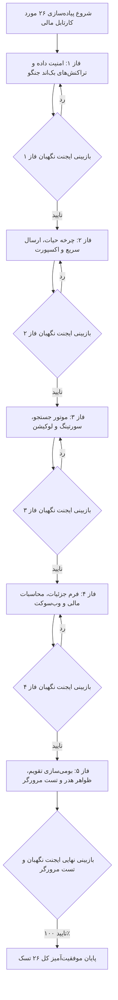

<div dir="rtl" align="right">

# طرح تفصیلی و جامع پیاده‌سازی ۲۶ مورد کارتابل مالی و مدارک (`Customs & Financial Cartable`)

این سند فنی، نقشه راه و جزئیات اجرایی پیاده‌سازی کامل ۲۶ مورد ایرادات، آسیب‌پذیری‌های دیتابیس و بک‌اند، بهینه‌سازی همگام‌سازی آفلاین، تصحیح فیلترها و سورتینگ، اصلاح فرمول‌های مالی و ارتقای رابط کاربری کارتابل مالی را در ۵ فاز مستقل همراه با پروتکل بازبینی ایجنت نگهبان و تست‌های نهایی مرورگر تدوین می‌نماید.

---

## 📋 اهداف کلیدی پروژه

1. **اصلاح پایداری و امنیت بک‌اند جنگو:** افزودن تراکنش اتمیک `select_for_update` و به‌روزرسانی صریح فیلد `updated_at` در `bulk_update` اسناد مالی.
2. **پشتیبانی کامل فیلترها در خروجی اکسل:** ارسال فیلترهای جستجو، وضعیت و تاریخ به بک‌اند و دانلود دقیق ردیف‌های منطبق با نمایش صفحه.
3. **ارتقای کارایی و سرعت کارشناس مالی:** افزودن دکمه «ارسال سریع تک‌کلیکه» روی کارت‌های دارای پیش‌نویس بدون نیاز به باز کردن مودال.
4. **تکمیل موتور جستجو و سورتینگ:** جستجوی شماره فنی کالا (`item_no`)، نرمال‌سازی الفبای فارسی (`آ/ا`) و فیلتر لوکیشن/قفسه.
5. **تصحیح فرمول‌ها و فرم جزئیات:** پشتیبانی از فیلد `balance` در محاسبه ارزش کل، تاریخ شمسی فاکتور، تبدیل `saveExtraEditedFields` به عملیات `async` مطمئن.
6. **بومی‌سازی و یکپارچگی ظاهری:** تقویم شمسی در تاریخچه (`PersianDatePipe`)، عنوان رسمی هدر کارتابل مالی و نمایش واحد کالا در مخزن.

---

## 🧱 فازبندی ۵ مرحله‌ای پیاده‌سازی (5 Implementation Phases)



---

## 📂 تغییرات تفصیلی به تفکیک فازها و فایل‌ها

### فاز ۱: امنیت داده، تراکنش‌ها و فیلترهای بک‌اند جنگو
* **[تغییر]** [views.py](file:///e:/warehouse%20project/warehouse-backend/inventory/views.py)
  - **خط ۲۹۲۷ (`bulk_submit`):** انتساب `updated_at = timezone.now()` روی اشیاء و افزودن `'updated_at'` به آرایه فیلدهای `DocTask.objects.bulk_update(tasks_list, ['status', 'modified_by', 'updated_at'])`.
  - **خطوط ۲۷۶۱ و ۲۸۵۳ (`claim_tasks` و `bulk_submit`):** قرار دادن عملیات در `with transaction.atomic():` و اضافه کردن `select_for_update()` جهت جلوگیری از Race Condition.
  - **خطوط ۲۶۸۱ تا ۲۷۱۰ (`get_queryset`):** دریافت و اعمال فیلترهای جستجوی متنی `q` (روی کد، شرح، PO، پکینگ، RTI، شماره فنی)، وضعیت `status` و تاریخ `date`.

---

### فاز ۲: چرخه حیات، ارسال سریع، پایداری همگام‌سازی و خروجی اکسل
* **[تغییر]** [customs.ts](file:///e:/warehouse%20project/warehouse-front/src/app/components/customs/customs.ts)
  - پیاده‌سازی متد `quickSubmitTask(task: DocTask, event: Event)` جهت ارسال فوری و تک‌کلیکه کالا از روی کارت.
  - اصلاح متد `claimSelectedTasks` جهت رفرش خودکار مخزن اسناد (`this.loadPoolTasks(false)` یا تنظیم فلگ).
  - ارسال پارامترهای فعال `q`، `status`، `date` و `warehouse_id` در متد `executeExport`.
  - اصلاح وضعیت اقلام برگشتیِ ویرایش‌شده (نمایش در شمارنده و فیلتر آماده ارسال با بج تفکیک‌شده).
  - ریست کردن پرچم‌های لود دیتای تب‌ها (`tasksLoaded = false`, `poolTasksLoaded = false`) در متد `onWarehouseChanged`.
  - ارسال صریح `warehouse_id` در متد `submitCurrentTask`.
* **[تغییر]** [customs.html](file:///e:/warehouse%20project/warehouse-front/src/app/components/customs/customs.html)
  - افزودن دکمه سبز رنگ «ارسال سریع» در کنار دکمه بازگشت روی کارت‌های دارای پیش‌نویس.
* **[تغییر]** [doc-task-store.ts](file:///e:/warehouse%20project/warehouse-front/src/app/core/services/doc-task-store.ts)
  - مدیریت امن تسک‌های فاقد `sync_id` در `saveDraft` و `submitTasks` با تولید شناسه موقت یا جستجوی مبتنی بر `id`.

---

### فاز ۳: موتور جستجو، سورتینگ الفبایی و فیلتر سریع لوکیشن
* **[تغییر]** [customs.ts](file:///e:/warehouse%20project/warehouse-front/src/app/components/customs/customs.ts)
  - اضافه کردن فیلد شماره فنی کالا (`item_no`) به شرط `matchesSearch` و روال اسکنر `onBarcodeScanned`.
  - نرمال‌سازی الف و آ کلاه‌دار (`replace(/[آأإ]/g, 'ا')`) در متد `normalizeText`.
  - اصلاح سورت الفبایی شرح کالا با `localeCompare(..., 'fa', { sensitivity: 'base' })`.
  - پیاده‌سازی متغیر و دراپ‌داون/چیپ فیلتر سریع قفسه و لوکیشن (`locationFilter`).
* **[تغییر]** [customs.html](file:///e:/warehouse%20project/warehouse-front/src/app/components/customs/customs.html)
  - افزودن کنترل فیلتر سریع لوکیشن در نوار ابزار.
  - افزودن پیام راهنما و دکمه «پاک کردن جستجو» در حالت خالی شدن نتایج تب مخزن اسناد.
* **[تغییر]** [customs-scanner-parser.ts](file:///e:/warehouse%20project/warehouse-front/src/app/components/customs/customs-scanner-parser.ts)
  - افزودن مترادف‌های شماره فنی (`item_no`, `itemno`, شماره فنی, پارت نامبر) در متد `mapHeaderToKey`.

---

### فاز ۴: فرم جزئیات، محاسبات مالی و تعاملات وب‌سوکت
* **[تغییر]** [customs.ts](file:///e:/warehouse%20project/warehouse-front/src/app/components/customs/customs.ts)
  - تصحیح فرمول `calculateTotalValue` با اضافه کردن فیلد اصلی `item.balance`.
  - تبدیل متد `saveExtraEditedFields` به یک متد `async` و استفاده از `await firstValueFrom(...)` با مدیریت خطای پایدار.
  - تبدیل تاریخ میلادی فاکتور (`invoice_date`) به شمسی (`YYYY/MM/DD`) در زمان باز شدن فرم در `openDetail`.
  - محدودسازی انتخاب لمس طولانی و چک‌باکس‌ها به اقلام قابل ارسال (`isTaskSelectable`).
  - افزودن گارد بررسی آنلاین بودن (`navigator.onLine`) قبل از `claimTasks` در حالت سروری.
  - اصلاح اسکن دسته‌ای در حالت لوکال‌فرست جهت استفاده از `this.store.claimTasks`.
  - مدیریت دریافت وب‌سوکت `doc_task_update` برای فرم باز جاری و نمایش هشدار یا رفرش این‌پلیس.

---

### فاز ۵: بومی‌سازی تقویم، ظواهر هدر و راستی‌آزمایی با مرورگر
* **[تغییر]** [customs.ts](file:///e:/warehouse%20project/warehouse-front/src/app/components/customs/customs.ts)
  - ایمپورت `PersianDatePipe` در آرایه `imports`.
  - نمایش پیام راهنما در صورت اسکن بارکد در حین باز بودن فرم جزئیات کالا.
* **[تغییر]** [customs.html](file:///e:/warehouse%20project/warehouse-front/src/app/components/customs/customs.html)
  - استفاده از `h.created_at | persianDate:'short-time'` در تایم‌لاین تاریخچه به جای پایپ میلادی.
  - خارج کردن کادر اطلاعات پایه کالا از شرط `visibleInfoFields.length > 0`.
  - نمایش برچسب واحد سنجش کالا (`unit`) در کارت‌های تب مخزن اسناد.
  - اضافه کردن عنوان شاخص «کارتابل مالی و مدارک» همراه با آیکون اختصاصی در هدر بالای صفحه.
* **[تست مرورگر]** اجرای سناریوهای تستی کامل با ساب‌ایجنت مرورگر جهت تایید عملکرد ۲۶ مورد.

---

## 🛡️ پروتکل بازبینی ایجنت نگهبان (Guardian Verification Protocol)

در انتهای هر فاز:
1. **بررسی صحت کد:** تطبیق کد نوشته‌شده با اهداف دقیق همان فاز.
2. **بررسی عدم تخریب:** بررسی `git diff` و اطمینان از حفظ کامل سایر توابع و کدهای فعال.
3. **تست کامپایل فرانت‌اند:** اجرای فرمان `npx ng build` جهت اطمینان از خروجی `Exit code 0`.
4. **ثبت لاگ و تاییدیه نگهبان:** ثبت نتیجه بررسی در سند گزارش نهایی.

---

## 🧪 برنامه راستی‌آزمایی و تست (Verification Plan)

### ۱. تست‌های خودکار و کامپایل
```powershell
cd "e:\warehouse project\warehouse-front"
npx ng build --configuration=development
```

### ۲. تست تعاملی مرورگر (Browser Subagent Validation)
- تست ۱: ورود به صفحه کارتابل مالی (`/customs`) و بررسی وجود عنوان هدر و تب‌ها.
- تست ۲: باز کردن فرم یک کالا، وارد کردن فیلد مالی، بازگشت به لیست و کلیک روی دکمه جدید «ارسال سریع».
- تست ۳: جستجوی شماره فنی، کلمات با الف کلاه‌دار و فیلتر لوکیشن.
- تست ۴: بررسی فرمت تاریخ شمسی در تایم‌لاین تاریخچه.
- تست ۵: بررسی عملکرد خروجی اکسل همراه با فیلترهای فعال.

</div>
