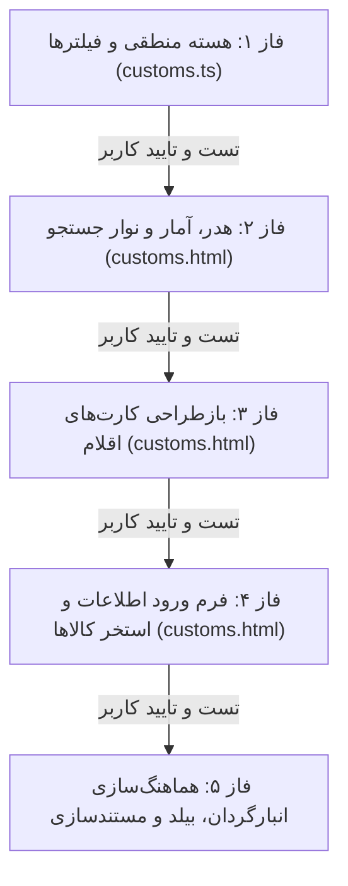

# طرح تفصیلی و فازبندی‌شده بازطراحی کارتابل مالی (`Customs`)

> [!IMPORTANT]
> **قانون الزام بررسی مرحله‌به‌مرحله:**
> این پروژه به **۵ فاز کاملاً مستقل و تفصیلی** تقسیم شده است. طبق دستور صریح کاربر، **ورود به هر فاز جدید تنها و تنها پس از پیاده‌سازی کامل فاز جاری، راستی‌آزمایی دقیق و دریافت تایید کاربر انجام خواهد شد.**

---

## ۱. مشخصات و ماتریس فازهای اجرایی

---

## ۲. جزئیات تفصیلی فازها

### 🔹 فاز ۱: ارتقای هسته منطقی، فیلترهای چیپی هوشمند، آمار زنده و URL State
- **فایل هدف:** [`customs.ts`](file:///e:/warehouse%20project/warehouse-front/src/app/components/customs/customs.ts)
- **شرح جزئیات فنی:**
  1. **تعریف متغیرهای آمار زنده عملکرد ۳ گانه:**
     - `totalTasksCount`: تعداد کل تسک‌های واگذارشده به کاربر.
     - `completedTasksCount`: تعداد تسک‌های ارسال‌شده / تاییدشده.
     - `remainingTasksCount`: تعداد تسک‌های باقیمانده (در انتظار ثبت + بررسی مجدد + آماده ارسال).
  2. **تعریف شمارنده‌ها و وضعیت‌های چیپ `statusCounts`:**
     - `untouched`: وضعیت `PENDING_DOC` فاقد اطلاعات مالی (`در انتظار ثبت`).
     - `rejected`: وضعیت‌های `DOC_SUPERVISOR_REJECTED` و `DOC_MANAGER_REJECTED` (`بررسی مجدد`).
     - `ready`: وضعیت `PENDING_DOC` دارای اطلاعات پرشده پیش‌نویس (`آماده ارسال`).
     - `completed`: وضعیت‌های `DOC_PROCESSED`, `DOC_MANAGER_REVIEW`, `DOC_FINAL_APPROVED` (`ارسال شده`).
     - `all`: کل تسک‌ها (`همه موارد`).
  3. **پیاده‌سازی متد فیلترینگ چندبعدی `applyFilters()`:**
     - اعمال فیلتر بر اساس چیپ‌های وضعیت ۵ گانه.
     - اعمال فیلتر زمانی (`dateFilter` شامل `all`, `today`, `yesterday`, `week`) با بررسی تاریخ آخرین ویرایش یا ایجاد.
     - اعمال مرتب‌سازی چندگانه (`sortBy` شامل آخرین تغییر، کد یکتا، نام کالا، شماره PO، شماره RTI/فاکتور).
     - نرمال‌سازی و جستجوی متنی پیشرفته در تمام فیلدهای اصلی و مالی با پشتیبانی از ارقام و کاراکترهای فارسی/عربی/انگلیسی.
  4. **همگام‌سازی دوطرفه با آدرس مرورگر (URL State Sync):**
     - ذخیره و بازیابی پارامترهای `q`, `status`, `date`, `sort`, `tab` در URL جهت حفظ وضعیت هنگام رفرش صفحه.
  5. **توسعه متدهای کمکی:**
     - `hasDocData(task)` برای تشخیص سریع اقلام آماده ارسال.
     - `getRejectionNote(task)` و `getRejectionTitle(task)` برای استخراج دقیق علت رد.
- **نقطه بررسی و تایید فاز ۱:** کامپایل موفقیت‌آمیز بدون خطای تایپ‌اسکریپت و اعتبارسنجی منطق داده‌ها.

---

### 🔹 فاز ۲: طراحی هدر، ۳ کارت آمار عملکرد، نوار Omni-Search و ردیف چیپ‌های هوشمند
- **فایل هدف:** [`customs.html`](file:///e:/warehouse%20project/warehouse-front/src/app/components/customs/customs.html)
- **شرح جزئیات فنی:**
  1. **نوسازی هدر اصلی صفحه:**
     - هدر مرتب شامل انتخاب‌گر انبار (در صورت فعال بودن)، دکمه خروجی اکسل (سبز زمردی `emerald-50`)، و دکمه بروزرسانی بنفش/ایندیگو با انیمیشن اسپینر در حالت بارگذاری.
  2. **طراحی ۳ کارت شاخص بزرگ عملکرد (Performance Metrics) بالای تب تسک‌های من:**
     - **کل تسک‌ها:** پس‌زمینه سفید، کادر خاکستری، عدد مشکی درشت.
     - **ارسال شده:** پس‌زمینه سبز روشن (`emerald-50`)، حاشیه سبز، عدد سبز درشت.
     - **باقیمانده:** پس‌زمینه کهربایی روشن (`amber-50`)، حاشیه کهربایی، عدد کهربایی درشت.
  3. **نوار شیشه‌ای چسبان (Sticky Glassmorphism Bar):**
     - **نوار اقدام متنی شناور تیره (Contextual Action Bar):** هنگام انتخاب حداقل یک کالا (`selectedTasks.size > 0`) ظاهر می‌شود؛ دارای دکمه لغو انتخاب، شمارنده زنده با بج پالس‌دار، دکمه انتخاب همه، و دکمه اقدام «ارسال انتخابی‌ها به سرپرست».
     - **نوار جستجوی Omni-Search:** فیلد ورودی جستجوی سفید با گوشه‌های گرد ۲xl، دکمه اختصاصی اسکن بارکد دوربین در گوشه، آیکون ذره‌بین و دکمه ضربدر پاک‌سازی سریع.
     - **ردیف چیپ‌های وضعیت هوشمند با نمایش شرطی:**
       - `در انتظار ثبت` (مشکی فعال، همیشه نمایان).
       - `بررسی مجدد` (قرمز، **شرطی:** فقط در صورت `count > 0` یا فعال بودن فیلتر).
       - `آماده ارسال` (آبی، **شرطی:** فقط در صورت `count > 0` یا فعال بودن فیلتر).
       - `ارسال شده` (سبز، همیشه نمایان).
       - `همه موارد` (طوسی، همیشه نمایان).
     - **ردیف فیلترهای زمانی و دراپ‌داون مرتب‌سازی:**
       - چیپ‌های «کل زمان‌ها»، «امروز»، «دیروز»، «این هفته».
       - منوی مرتب‌سازی کشویی شکیل با آیکون مرتب‌سازی.
- **نقطه بررسی و تایید فاز ۲:** بررسی چیدمان ظاهری هدر، کارت‌های آمار، نوار جستجو و چیپ‌های شرطی در مرورگر و تایید کاربر.

---

### 🔹 فاز ۳: بازطراحی کارت‌های لیست اقلام در تب «تسک‌های من»
- **فایل هدف:** [`customs.html`](file:///e:/warehouse%20project/warehouse-front/src/app/components/customs/customs.html)
- **شرح جزئیات فنی:**
  1. **ساختار کارت‌های مدرن تک‌ستونه (مشابه تصویر کارتابل انبارگردان):**
     - کادر سفید تمیز با حاشیه خاکستری ملایم و سایه ظریف.
     - چک‌باکس انتخاب در گوشه راست برای ارسال گروهی.
     - عنوان درشت و پررنگ کالا (`description`) در بالا.
     - کد یکتای کالا به صورت فونت مونو (`fa_unic_code`) زیر عنوان.
     - نمایش نام انبار و موقعیت (لوکیشن) با آیکون پین لوکیشن.
     - بج وضعیت شکیل در گوشه بالا-چپ با رنگ متناسب با وضعیت سند.
  2. **نمایش فیلدهای کلیدی مالی پرشده:**
     - بج‌های کوچک و منظم برای نمایش مقادیر پرشده نظیر `PO`, `RTI` و `تأمین‌کننده`.
  3. **بنر هشدار قرمز در صورت رد توسط سرپرست یا مدیر:**
     - نمایش کادر قرمز رنگ با آیکون هشدار و متن کامل دلیل رد (`supervisor_note` یا `manager_note`) تا کارشناس مالی علت رد را بلافاصله مشاهده کند.
  4. **رفتار کلیک:** کلیک روی هر بخش از کارت، فرم اختصاصی ورود اطلاعات کالا را باز می‌کند.
- **نقطه بررسی و تایید فاز ۳:** بررسی کارت‌های اقلام، فونت‌ها، فاصله‌ها و وضوح بنر دلیل رد و تایید کاربر.

---

### 🔹 فاز ۴: بهینه‌سازی فرم اختصاصی ورود اطلاعات کالا و تب «استخر کالاها»
- **فایل هدف:** [`customs.html`](file:///e:/warehouse%20project/warehouse-front/src/app/components/customs/customs.html)
- **شرح جزئیات فنی:**
  1. **فرم ویرایش اطلاعات کالا (`selectedTask`):**
     - هدر چسبان در بالا با دکمه بازگشت مدرن، کد کالا، نام کالا و بج وضعیت.
     - بنر راهنمای اصلاح در بالای فرم در صورت رد قبلی با راهنمای رفع ایراد.
     - فیلدهای مرتب و دسته‌بندی‌شده (فیلدهای ثابت و پویا بر اساس دسترسی‌ها).
     - نوار چسبان دکمه‌های اقدام شناور در پایین (Sticky Bottom Bar) شامل دکمه‌های «ذخیره پیش‌نویس» و «ارسال به سرپرست».
  2. **تب استخر کالاها (`pool`):**
     - ارتقای کارت‌های استخر با ساختار مدرن هماهنگ.
     - نوار شناور تیره برای انتخاب چندتایی و به‌عهده گرفتن دسته‌جمعی اقلام استخر.
- **نقطه بررسی و تایید فاز ۴:** تست فرم ورود اطلاعات، ثبت داده، بازگشت، عملیات استخر کالاها و تایید کاربر.

---

### 🔹 فاز ۵: هماهنگ‌سازی کارتابل انبارگردان (`Counter`)، تست جامع و مستندسازی
- **فایل‌های هدف:**
  - [`counter-dashboard.html`](file:///e:/warehouse%20project/warehouse-front/src/app/components/counter/counter-dashboard/counter-dashboard.html)
  - [`counter-dashboard.ts`](file:///e:/warehouse%20project/warehouse-front/src/app/components/counter/counter-dashboard/counter-dashboard.ts)
  - [`walkthrough_customs_redesign.md`](file:///e:/warehouse%20project/Documents/Customs_Redesign_Counter_Alignment/walkthrough_customs_redesign.md)
  - [`Master_Log.md`](file:///e:/warehouse%20project/Documents/Master_Log.md)
- **شرح جزئیات فنی:**
  1. **هماهنگ‌سازی متقابل کارتابل انبارگردان:**
     - بررسی عناوین چیپ‌ها در کارتابل انبارگردان (تغییر عنوان چیپ از `دست‌نخورده` به `در انتظار شمارش` جهت تطابق واژگانی کامل).
  2. **تست‌های نهایی و کامپایل پروژه:**
     - بررسی بدون خطای ترمینال و تست ساخت بیلد بدون باگ.
  3. **مستندسازی دوگانه (DUAL-SAVE):**
     - تکمیل گزارش تغییرات در پوشه Documents و به‌روزرسانی Master Log.
- **نقطه بررسی و تایید فاز ۵:** تحویل کامل و نهایی پروژه.

---

## ۳. جدول خلاصه فازها و خروجی‌های تحویلی

| شماره فاز | نام فاز | خروجی کلیدی | شرط ورود به فاز بعدی |
| :---: | :--- | :--- | :--- |
| **فاز ۱** | هسته منطقی و مدیریت وضعیت (`customs.ts`) | فیلترها، آمار زنده و URL State | کامپایل بدون خطا + تایید کاربر |
| **فاز ۲** | هدر، کارت‌های آمار و نوار ابزار جستجو (`customs.html`) | UI هدر، کارت‌های ۳ گانه، جستجو و چیپ‌ها | تست ظاهری + تایید کاربر |
| **فاز ۳** | بازطراحی کارت‌های اقلام (`customs.html`) | کارت‌های تک‌ستونه مدرن و بنر رد | تست کارت‌ها + تایید کاربر |
| **فاز ۴** | فرم ورود اطلاعات و استخر کالاها (`customs.html`) | فرم کامل با اکشن‌های پایین و استخر | تست تعاملی + تایید کاربر |
| **فاز ۵** | هماهنگ‌سازی انبارگردان و مستندسازی | تطابق دو کارتابل، بیلد و مستندات | تایید نهایی کاربر |

